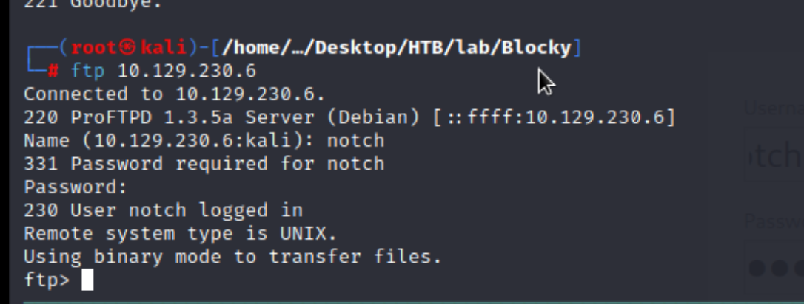

## Reconnaissance

### nmap 

> Top 10000 Ports


> ALL Ports


### Vulnerable Possibility 

1. OpenSSH 7.2p2s


2. Apache 2.4.18


### FTP 

```
ftp 10.129.230.6
```



> The FTP Software is ProFTPD 1.3.5a 


### WebService

> Enumerate web service 


> Looks like a blog post site


> There is a login function.
> And I confirm it's a wordpress blog.


> Interacting with burp


> I can leave comment 


> With this post request, I also find some other exploit code.
> But after testing it will failed.

- [Joomla! Plugin JD-WordPress 2.0-1.0 RC2 - 'wp-comments-post.php' Remote File Inclusion](https://www.exploit-db.com/exploits/28295)


> Using WPScan to enumerate more information

```
wpscan -e vp,vt --url http://blocky.htb -o wpscan.out
```


> Following the result to confirm different pages.
>  readme.html


> wp-content/uploads directory


> Find some images


### Gobuster brute-force the paths


> Checking them one by one

- wp-login.php

> Try the following credentials ---> Failed

```
admin / admin 
```


- plugins directory 


- phpmyadmin 
> Try the following credential --> Failed

```
root / toor
root / root
```


### Summarize 

> So far, I have the following informations

1. 3 different services with serveral  possible exploit code
2. phpmyadmin page --> it might have mysql DB with some credentials
3. WordPress login page
4. Plugins directory with 2 suspicious jar file --> Decompiler it.
## Exploit 

> I start from that 2 jar files, download them and decompiler.
> I found some credential for DB in BlockyCore.jar

```
java -jar jd-gui 
```

> DB credentials

```
root / 8YsqfCTnvxAUeduzjNSXe22
```


> Login to phpmyadmin 


> Find another credential, but the password is a value with encryption

```
Notch / notch@blockcraftfake.com![[Image/[IMG]Blocky/27.png]] / $P$BiVoTj899ItS1EZnMhqeqVbrZI4Oq0/
```

> After checking, I think that is a wordpress hash value.
> Someone ask this question with a similar encrypted value/


> I tried to crack it by Hashcat, but failed 

```
hashcat -m 400 wordpressCred /usr/share/wordlists/rockyou.txt
```


> So, I only have the following information 

```
1. root / 8YsqfCTnvxAUeduzjNSXe22
2. Notch / notch@blockcraftfake.com / $P$BiVoTj899ItS1EZnMhqeqVbrZI4Oq0/
```

> With past experience, I decide to make some combination to tried to login to 

1. WordPress 
2. FTP 
3. SSH 

> Combination as follow

```
1. root / 8YsqfCTnvxAUeduzjNSXe22
2. notch / 8YsqfCTnvxAUeduzjNSXe22
3. notch@blockcraftfake.com / 8YsqfCTnvxAUeduzjNSXe22
```

> And I login to FTP and SSH successfully

- FTP login


- SSH login


> Then I got user flag 


## Privilege Escalation 

> After login by ssh
> I tried to check sudo permission, it will ask password(and I have password for notch)
> Then .... it's easy to escalate to sudo, or I can say it didn't do any restriction for sudo.

```
sudo -l
```


> So I escalate to root by this command 

```
sudo su
```


> I got root flag.


## Reference 

- [Java Decompiler](https://java-decompiler.github.io/)
- [(GITHUB)JD-GUI 1.6.6](https://github.com/java-decompiler/jd-gui/releases)
- [How to decode encrypted wordpress admin password? [closed]](https://stackoverflow.com/questions/31343155/how-to-decode-encrypted-wordpress-admin-password)
- [Kali WPScan的使用（WordPress扫描工具](https://blog.51cto.com/u_15346415/3692446)
###### tags: `HackTheBox` 