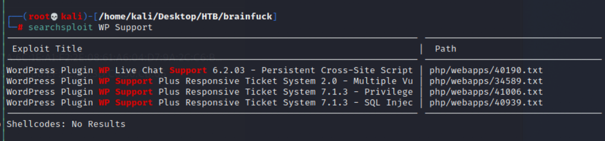
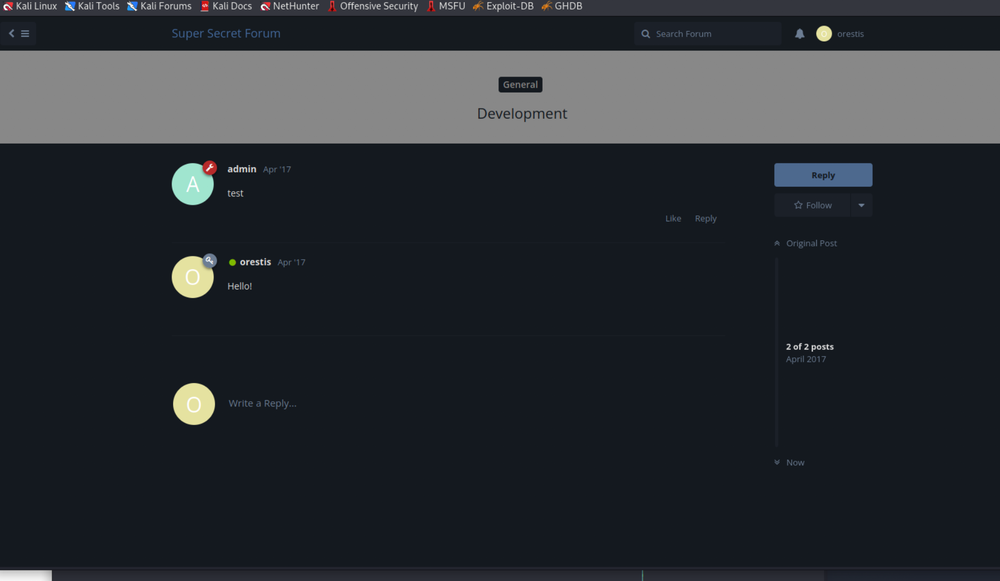
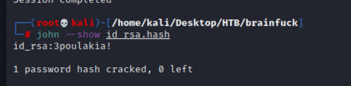
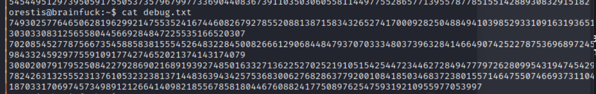
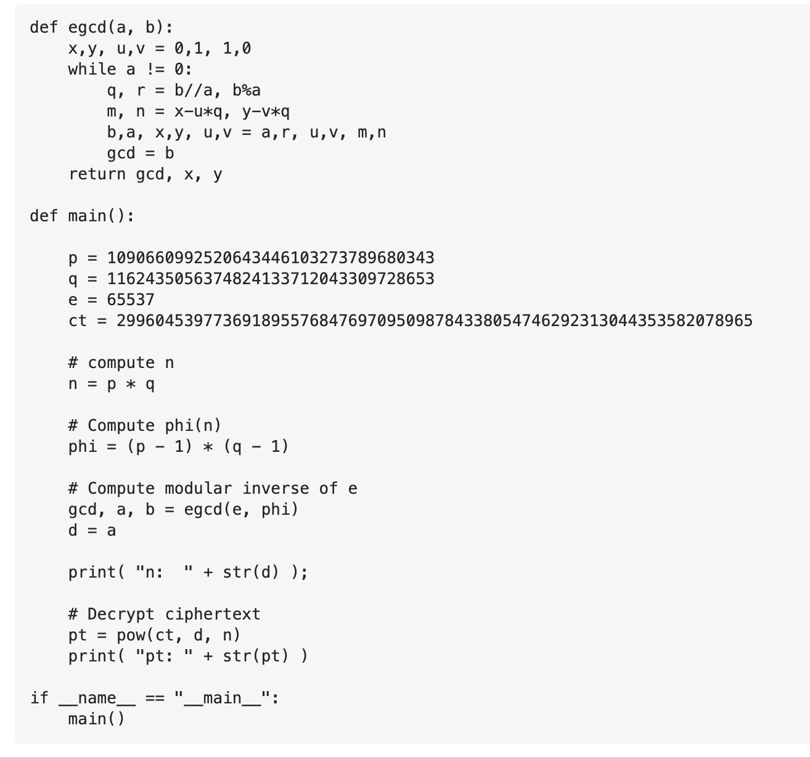
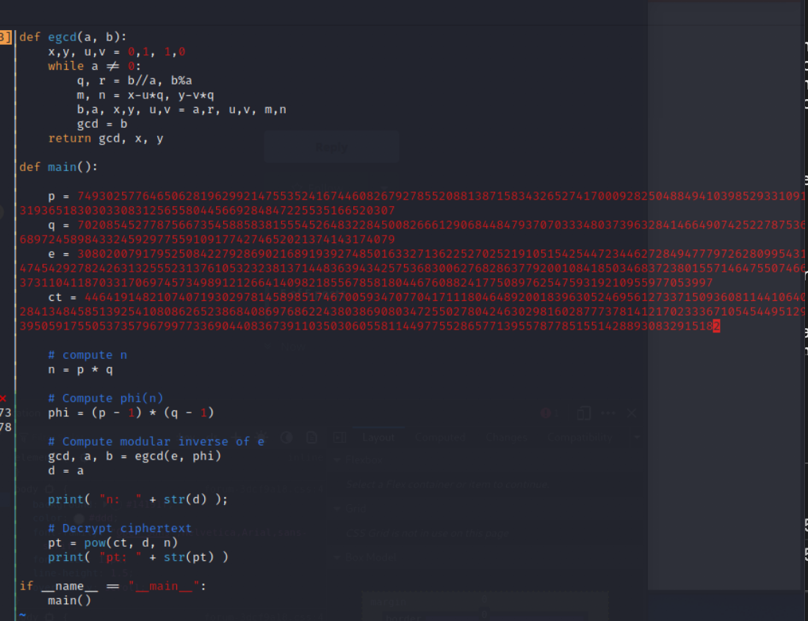

## Reconnianssance

### nmap 


> Result 
1. Port 22 --> SSH OpenSSH 7.2p2 Ubuntu4ubuntu2.1
2. Port 25 --> smtp
3. Port 110 --> pop3 Dovecot pop3d
4. Port 143 --> imap Dovecot imapd
5. Port 443 --> https nginx 1.10.0
### WebSite

> Set up DNS

```
vim /etc/hosts
> 10.129.228.97   brainfuck.htb
```


> According to the subtitle, this is a WordPress Site.
> Check /license.txt or /readme.html


> This is WordPress Version 4.7


> login page 
```
/wp-login.php
```


> Possible mail server username: orestis

![[machine/brainfuck/IMG/74.png]]
### Certificate Information

 > According to nmap result, the website deploy on port 443
 > That is a HTTPS protocol (SSL or TLS)
 > Checking the certificate


### WPScan

> Check vulnerabilies by WPScan

```
wpscan -e vp vt --url https://brainfuck.htb --disable-tls-checks -api-token <token>
```


> Here are 73 vulnerabilites 
1. Host Header Injection in Password reset
2. Insufficient Redirect Validation
3. Post Meta Data Values Improper Handling in XML-RPC
4. XMLRPC-Post Meta Data Lack of Capability Checks


> Other 69 vulnerabilites
5. Filesystem Credentials Dialog CSRf
6. Large File Upload Error XSS
7. Customizer XSS & CSRF
8. Potential SQL Injection


> other 64 vulnerabilities 
9. Authenticated SQL injection
10. Open Redirect 
11. Path Traversal in Unzipping
12. Path Traversal in Customizer 
13. XSS in oEmbed


> other 60 vulnerabilies
14. Path Traversal in Customizer 
15. XSS in oEmbed
16. Authenticated XSS in Visual Editor 
17. ```$wpdb->prepare()``` Weakness
18. Authenticated JS file Upload


> other 55 vulnerabilies
19. RSS and Atom Feed Escaping 
20. HTML Language Attribute Escsaping
21. 'newbloguser' Key Weak Hasing
22. Media Element XSS
23. Application DoS(unpatched)


> other 50 vulnerabilies
24. Remove localhost Default
25. Use Safe Redirect for login
26. Escap Version in Generator Tag
27. Authenticated Arbitrary File Deletion
28. Authenticated File Delete


> other 45 vulnerabilies
29. Authenticated Post Type Bypass
30. PHP Objection Injection via Meta Data 
31. Authenticated XSS
32. XSS that could affect plugins
33. User Activation Screen Search Engine Indexing


> other 40 vulnerabilies
34. Authenticated Code Execution
35. Comment XSS
36. XSS in URL Sanitisation
37. Stored XSS in Customizer


> other 36 vulnerabilies
38. Unauthenticated View Private/Draft Posts
39. Stored XSS in Style Tags
40. JSON Request Cache Poisoning
41. Server-Side Request Forgery(SSRF) in URL Validation


> other 32 vulnerabilies
42. Admin Referrer Validation
43. Authenticated Improper Access Controls in REST API
44. Authenticated Stored XSS via Crafted Links
45. Authenticated Stored XSS via Block Editor Content
46. wp_kses-bad_protocol() Colon Bypass


> other 27 vulnerabilies
47. Passwrod Reset Tokens Failed to Be Properly Invalidated
48. Unauthenticated Users View Private Posts
49. Authenticated XSS in Customizer 
50. XSS in wp-object-cache


> other 23 vulnerabilies
51. Authenticated XSS in File Uploads
52. Authenticated Password Protected Pages Exposure
53. Object Injection in PHPMailer
54. Plugin Confusion


> other 19 vulnerabilies
55. XSS via Post Slugs
56. SQL Injection via WP_Meta_Query
57. Super Admin Object Injection in Multisites
58. Prototype Pollution in jQuery
59. Reflected XSS.....


> and so on ...
> Theme identified: proficient


> Plugin Identifier: wp-support-okus-responsive-ticket-system
> Vulnerability: total 6
1. Authenticated SQL Injection (version < 8.0.0)
2. Remote code Execution (version < 8.0.8)
3. Multiple Authenticated SQL Injection (version < 9.0.3)


 > Vulnerability:

4. Stored XSS (version < 9.1.2)
5. Privilege Escalation (version < 8.0.8)
6. Remote Code Execution (version < 8.0.8)


> Enumerate wordpress information 

```
wpscan --enumerate --url https://brainfuck.htb --disable-tls-checks
```


> User Identified: 2 users
1. admin
2. administrator


> Site information -> certificate content


> Find 2 DNS domain 
1. www.brainfuck.htb
2. sup3rs3cr3t.brainfuck.htb


> Search exploit by plugin

```
searchsploit Wp Support
```

> Find  4 exploit code 
1. WP Live Chat support 6.2.03- Persistent XSS (not this one)
2. WP Support Plus Responsive Ticket System 2.0 - Multiple Vulnerabilies
3. WP Support Plus Responsive Ticket System 7.1.3 - Privilege Escalation
4. WP Support Plus Responsive Ticket System 7.1.3 - SQL Injection


## Exploit 

> Using Privilege Escalation one.
> The 41006 text file in [github](https://github.com/chacka0101/exploits/blob/master/41006.txt) 


> Copy the PoC part


> Execute it in browser  


> The wordpress blog home page will become login by admin


> Click 'Support Plus', it will move into Dashboard page


> Username / Password: orestis / kHGuERB29DNiNE 


> The email client software: evolution, it will failed in my VM, and I still in troubleshooting.
> So I tried other method which was introduced by [HackTrick](https://book.hacktricks.xyz/network-services-pentesting/pentesting-pop)

#### Method 1: nc connect to POP3 protocol

> Using nc 

```
nc -nv 10.129.228.97 110
```


> Check mail list by LIST


#### Method 2: telnet connect to POP3 protocol

> Using telnet 

```
telnet 10.129.228.97 110
```

> Check mail list by LIST


> Check mail content


> Get Credential: orestis / kIEnnfEKJ#9UmdO


> Using the credential to login to supersecret site
> Super Secret Page (sup3rs3cr3t.brainfuck.htb)


> Login with credential from mail



> Here are the conetnt 


> First, check SSH Access conversation
> I think the user orestis lose his ssh password and ask admin to provide or recover it.


> Second, check the other conversation.
> All of them seems a encypted strings.
> But I can guess some word from the format.
> For Example:

1. mnvze://, the origin word might https://


2. I also can guess a sentense from other plain text words.
> Qbqquzs - Pnhekxs dpi fca fhg zfmgzt
> Pieagnm - Jkoijeg nbw zwx mle grwsnn
> Wejmvse - Fbtkqal zqb rso rnl cwlhsf
> All of them are corresponding to 
> Orestis - Hacking for fun and exploit 


> Now, identified the encryption algorithm first.
> According to my own experience, the cipher definitely is a alphabet substition. 
> But what kind of substition algorithm, all I know about that is: 
1.  ROT13 - it's not possible, since it is very easy and the cipher text should be same every time.
2.  Caesar Cipher - It also is kind of monoalphabet substition, so I also can skip it.
3.  Vigenère Cipher - This is a polyalphabet, and I think this is most possibility one
4.  Engima Cipher - I don't have experience about this one, so let me try it at last.
> And I also do some research about this kind of Cipher algorithm. [Substition Cipher list](http://practicalcryptography.com/ciphers/substitution-category/)

### Vigenère Cipher (extra task)

> This is kind of know-plaintext attack

- [(Wiki in mandarin) What's Vigenère Cipher](https://zh.m.wikipedia.org/zh-tw/%E7%BB%B4%E5%90%89%E5%B0%BC%E4%BA%9A%E5%AF%86%E7%A0%81)
- [(Wiki) What's Vigenère Cipher](https://en.wikipedia.org/wiki/Vigen%C3%A8re_cipher)
> **Extra Task: Using python to create a tools can encrypt and decrypt Vigenère Cipher**

### Decrypt Cipher

> Now, we know the 'https' and 'Orestis - Hacking for fun and exploit' are 2 plaintext.
> Start from https. 
> since I don't know the normal method to decrypt it so far, so I used bruteforce to try every combination of cipher key.
> And as follow, I know the 'https' will be encrypt to 'mnzve' by cipher key 'fuckm'
> So, 'fuckm' must part of cipher key


> Let's try the other one, the other is a whole sentence.
> I think it has highly possibility to get complete cipher key
> Like following screenshot, the cipherkey is : ckmybrainfuckmybrainfuckmybrainfuck
> So, I think the correct cipher key is 'mybrainfuck'


> Let's try to decrypt all conversation.


> And I can get the ssh login private key URL. 
```
Ybgbq wpl gw lto udgnju fcpp, C jybc zfu zrryolqp zfuz xjs rkeqxfrl ojwceec J uovg
mnvze://zsrivszwm.rfz/8cr5ai10r915218697i1w658enqc0cs8/ozrxnkc/ub_sja
```
to 

```
There you go you stupid fuck, I hope you remember your key password because I dont
https://brainfuck.htb/8ba5aa10e915218697d1c658cdee0bb8/orestis/id_rsa
```


```
Si rbazmvm, Q'yq vtefc gfrkr nn ;)

Qbqquzs - Pnhekxs dpi fca fhf zdmgzt
```
to 
```
No problem, I'll brute force it ;)

Orestis - Hacking for fun and profit
```

- [Good cipher tools](https://rumkin.com/tools/cipher/)
- [Find cipher key](https://rumkin.com/tools/cipher/one-time-pad/)

### Login by SSH 

> Download id_rsa file
> Using private key to login SSH, it needs passphrase


> Using john and ripper to crack passphrase
> First, I need to convert id_rsa file format to john format
> Converter Tools: 

```
ssh2john
```

> Download and Install 

```
wget https://raw.githubusercontent.com/magnumripper/JohnTheRipper/bleeding-jumbo/run/ssh2john.py
```

> Execute 

```
python3 ssh2john.py id_rsa > id_rsa.hash
```


> Crack passphrase

```
john -w=/usr/share/wordlists/rockyou.txt id_rsa.hash
```

> Get passphrase: 3poulakia!


> show passphrase: 3poulakia 

``` 
john --show id_rsa.hash
```



> Using this id_rsa and passphrase to login

```
ssh orestis@10.129.228.97 -i id_rsa
```


> Check user and get user flag

``` 
id 
cat user.txt
```


> Get user flag: 

```
2c11cfbc5b959f73ac15a3310bd097c9
```


## Post Exploitation

> Check user directory 
> Here are 3 interesting files
1. debug.txt
2. encrypt.sage
3. output.txt


> debug text file content



> output file content


> encrypt file content

```
nbits = 1024
password = open("/root/root.txt").read().strip()
enc_pass = open("output.txt","w")
debug = open("debug.txt", "w")
m = Integer(int(password.encode('hex'), 16))

p = random_prime(2^floor(nbits/2)-1, lbound-2^floor(nbits/2-1), proof=False)
q = random_prime(2^floor(nbits/2)-1, lbound-2^floor(nbits/2-1), proof=False)
n = p*q
phi = (p-1)*(q-1)
e = ZZ.random_element(phi)
while gcd(e, phi) != 1:
    e = ZZ.random.element(phi)
    
c = pow(m, e, n)
enc_pass.write('Encrypted Password:' +str(c)+'\n')
debug.write(str(p)+'\n')
debug.write(str(q)+'\n')
debug.write(str(e)+'\n')
```


> According to encrypt code, It definitely is a RSA encryption.
> I think I'm not too familiar about how to write a decrypte code.
> But I know the following condition: 
1. The plaintext is root flag.
2. The encrypted text store in output text.
3. The debug text format contain p, q and e
4. p, q is random prime
5. e is a random encrypt exponent

> So, I research how to decrypt rsa with given p,q and e
- [RSA given q, p and e? [closed]](https://crypto.stackexchange.com/questions/19444/rsa-given-q-p-and-e)

```
def egcd(a, b):
    x,y, u,v = 0,1, 1,0
    while a != 0:
        q, r = b//a, b%a
        m, n = x-u*q, y-v*q
        b,a, x,y, u,v = a,r, u,v, m,n
        gcd = b
    return gcd, x, y

def main():

    p = 1090660992520643446103273789680343
    q = 1162435056374824133712043309728653
    e = 65537
    ct = 299604539773691895576847697095098784338054746292313044353582078965

    # compute n
    n = p * q

    # Compute phi(n)
    phi = (p - 1) * (q - 1)

    # Compute modular inverse of e
    gcd, a, b = egcd(e, phi)
    d = a

    print( "n:  " + str(d) );

    # Decrypt ciphertext
    pt = pow(ct, d, n)
    print( "pt: " + str(pt) )

if __name__ == "__main__":
    main()
```





> Using above code to decrypt. 
> Get plaintext:

```
24604052029401386049980296953784287079059245867880966944246662849341507003750
```


> The plaintext was converted by hex 
> Using python2 

```
pt = 24604052029401386049980296953784287079059245867880966944246662849341507003750
a = hex(pt)
b = a[2:-1]
c = str(b)
d = c.decode('hex')
```


> Get root flag: 

``` 
6efc1a5dbb8904751ce6566a305bb8ef
```


## Reference 

### Writeup

- [(Writeup)HackTheBox - Brainfuck](https://www.youtube.com/watch?v=o5x1yg3JnYI&t=870s)
### HackTrick

- [(HackTrick)WordPress](https://book.hacktricks.xyz/network-services-pentesting/pentesting-web/wordpress)
- [(HackTrick)POP3](https://book.hacktricks.xyz/network-services-pentesting/pentesting-pop)
- [(HackTrick)IMAP](https://book.hacktricks.xyz/network-services-pentesting/pentesting-imap)
### WordPress

- [WP Support Plus Responsive Ticket System 7.1.3 Privilege Escalation](https://github.com/chacka0101/exploits/blob/master/41006.txt)


- [Vulnerabilites list - WP Support Plus Responsive Ticket System](https://wpscan.com/plugin/wp-support-plus-responsive-ticket-system)
- [wpscan SSL Connect Error](https://github.com/wpscanteam/wpscan/issues/1380)


- [Use WPScan to scan WordPress for vulnerabilities on Kali](https://linuxconfig.org/use-wpscan-to-scan-wordpress-for-vulnerabilities-on-kali)
### SSH Password Crack

- [How to Crack SSH Private Key Passwords with John the Ripper](https://null-byte.wonderhowto.com/how-to/crack-ssh-private-key-passwords-with-john-ripper-0302810/)
- [(Github)ssh2john](https://raw.githubusercontent.com/openwall/john/bleeding-jumbo/run/ssh2john.py)
- [Substition Cipher list](http://practicalcryptography.com/ciphers/substitution-category/)
### Vigenère Cipher (extra task)

- [(Wiki in mandarin) What's Vigenère Cipher](https://zh.m.wikipedia.org/zh-tw/%E7%BB%B4%E5%90%89%E5%B0%BC%E4%BA%9A%E5%AF%86%E7%A0%81)
- [(Wiki) What's Vigenère Cipher](https://en.wikipedia.org/wiki/Vigen%C3%A8re_cipher)
- [Decrypt Vigenère Cipher -1 ](https://en.wikipedia.org/wiki/V](https://cryptii.com/pipes/vigenere-cipher)
- [Decrypt Vigenère Cipher -2 ](https://www.cs.du.edu/~snarayan/crypt/vigenere.html)
### RSA 

- [RSA given q, p and e? [closed]](https://crypto.stackexchange.com/questions/19444/rsa-given-q-p-and-e)
### mail client

- [How To Install evolution on Kali Linux](https://installati.one/install-evolution-kalilinux/)
### others

- [Uninstalling Packages With Apt Package Manager](https://www.linuxfordevices.com/tutorials/ubuntu/uninstalling-packages-with-apt)


###### tags: `HackTheBox` `Crypto` `linux`