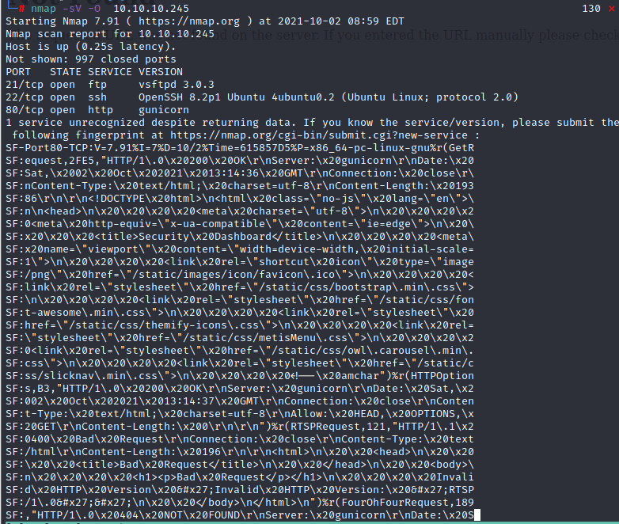

## Information 

 - IP : 10.10.10.245
- Prepare : lab openvpn
## Recon 

```
# nmap -sS -O 10.10.10.245
```



- Three service be scanned 
    1. FTP (port 21) - vsftpd 3.0.3
    2. SSH (port 22) - OpenSSH 8.2p1 Ubuntu
    3. HTTP (port 80) gunicorn
        - The web service seem like a Security monitor dashboad 


### Information Gathering - Web Service 

```
# gobuster dir -u 10.10.10.245 -w /usr/share/wordlists/dirb/common.txt
```


- The result shows that, there are 3 path in here
    1. ```/data``` --> Secure Snapshot --> packet flow record 
    2. ```/ip``` --> ip config --> show the ip address of this server 
    3. ```/netstat``` --> Network status --> show the network status of this server 

- We try to browse every page and something intresting
- The ```/data``` file will concatenate a number, and it provide a download function to download the file and make us can analysis it.


- I think it is the index of the packet flow file and let's try to download this file, it's a pcap file, so use```wireshark``` to analysis it .

```
# wireshark 17.pcap
```


- Observe the packet flow in the pcap file, The address is my ip address, it seems be generated by our action when we connect to this **dashboard page**,  but I'm not very sure about that

- For another things, we can try to modify the number in url, and we can get different page with different packet number.
- So, I think we can try to access the page from 0 to 17(because the first time I saw is 17, so at first I think there may only 17 pcap file.)

## Foothold

- With the idea, we find the first pcap file (```0.pcap```)


- Using Wireshark to analysis it.


- I think there are more than 40 data flow.
- The point we found 
    1. The ip address in here seems internal ip
    2. The packet  flow include HTTP, TCP, FTP ...
    
- Then, the problem for now is we want to login SSH or FTP.
- the only thing we know is the username which is nathan 


- So, with this goal and the information, we start to observe the FTP flow, and try to find the login information 
- Then we find the login account pair 
```nathan / Buck3tH4TF0RM3!```


### FTP Connection 

- We can login to FTP 


- Using get command to download the flag file ```user.txt```

```
# get user.txt
```


### SSH connection 

- Using the same credential to login by ssh


- Get user flag : 

```
a8115f13e9d4dd923eb2f6f55823c37d
```

## Privilege Escalation 

```
# getcap -r /usr 2>/dev/null
```


- Then, we can know that the python3.8 has the capabilities setuid.
- This is what we want to exploit.
- Find the payload in GFTOBBins.

- [GFTOBins python](https://gtfobins.github.io/)

```
# python3.8 -c 'import os; os.setuid(0); os.system("/bin/bash")'
```


- Get root flag : 
```
16d300bf184019c1a97111658b99920b
```
## Reference

- [wireshark Filter](https://ithelp.ithome.com.tw/articles/10196378)
- [GFTOBins python](https://gtfobins.github.io/)
- [getcap command](https://segmentfault.com/a/1190000020911983)
- [Linux Capabilities](https://cloud.tencent.com/developer/article/1539041)
- [My note for Capabilities](https://hackmd.io/qbXnTxlhSXO5BhAjX31X1A)

### Additional Research 

- [lxd Escalation](https://www.gushiciku.cn/pl/plbW/zh-tw)
- [SUID Escalation_1](https://cloud.tencent.com/developer/article/1674144?from=article.detail.1539041)
- [SUID Escalation_2](https://cloud.tencent.com/developer/article/1717979?from=article.detail.1539041)


###### tags: `HackTheBox` `linux`
