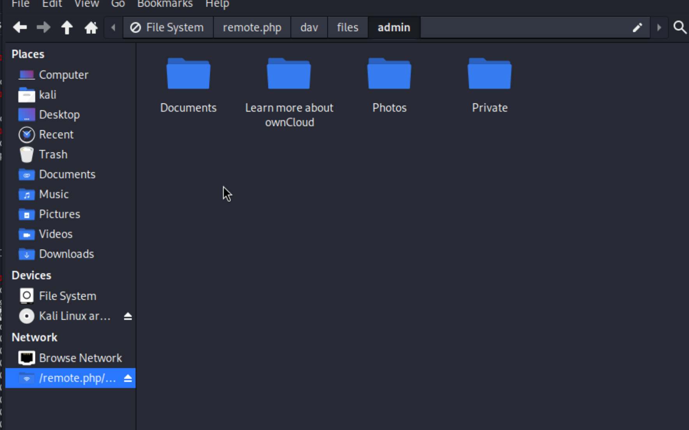

## Reconnaissance

### nmap 


### Web Service 

> ownCloud login page on port 8080


> Default credential attmpt--> failed 

1. owncloud / owncloud
2. admin / admin 
3. admin / owncloud
4. root / owncloud
5. root / root


### Gobuster result 


> Check some path 
> There are no any path useful 


> Try sql injection on login page -- not works 


> Reset password also not work, since I cant receive the reset password mail 

## Exploit 

> Find exploit code 
> Here are 2 CVEs

1. CVE-2023-49103

> OwnCloud/graphapi, exposing sensitive information to unauthorized users. This vulnerability demands urgent attention, emphasizing the need for prompt mitigation measures across OwnCloud installations. This exploration aims to provide valuable insights into the nature of the vulnerability, its potential impact, and the critical importance of prompt mitigation through patching and proactive security measures.

2. CVE-2023-49105

> An issue was discovered in ownCloud owncloud/core before 10.13.1. An attacker can access, modify, or delete any file without authentication if the username of a victim is known, and the victim has no signing-key configured. This occurs because pre-signed URLs can be accepted even when no signing-key is configured for the owner of the files. The earliest affected version is 10.6.0.

>For my goal, I choose CVE-2023-49105 for my first attempt.
>I use the following exploit code 

- [(GITHUB)ownCloud exploits for CVE-2023-49105](https://github.com/ambionics/owncloud-exploits)

> Install the necessary library

- [(GITHUB)Necessary Lib for exploit code - ten](https://github.com/cfreal/ten)

> Here is exploit step

```
python pwncloud-webdav.py http://cloudy.htb:8080/ admin
```


> Access this path in my file manager

```
dav://anonymous@localhost:8800/remote.php/dav/files/admin
```



> Get flag


## Reference 


- [(YouTube)CVE-2023-49105 ownCloud Core 10.6.0 10.13.0 WebDAV Api - Unauthenticated Privilege Escalation](https://www.youtube.com/watch?v=u5QU2Hdr8N0)
- [(GITHUB)ownCloud exploits for CVE-2023-49105](https://github.com/ambionics/owncloud-exploits)
- [OWNCLOUD: DETAILS ABOUT CVE-2023-49103 AND CVE-2023-49105](https://www.ambionics.io/blog/owncloud-cve-2023-49103-cve-2023-49105)
- [(GITHUB)Necessary Lib for exploit code - ten](https://github.com/cfreal/ten)
- [Necessary Lib for exploit code - ten](https://cfreal.github.io/ten/site/index.html)
- [Login Information and Custom Paths](https://doc.owncloud.com/server/next/admin_manual/appliance/configuration/login_information.html)
- [(GITHUB)CVE-2023-49103](https://github.com/creacitysec/CVE-2023-49103/tree/main)
- [OwnCloud : CVE-2023–49103 Vulnerability Analysis and Exploitation](https://medium.com/@Cyfirma_/owncloud-cve-2023-49103-vulnerability-analysis-and-exploitation-7aacaa12b93c)
- [(GITHUB)CVE-2023-49105.py](https://raw.githubusercontent.com/blockisec/PoCs/main/CVE-2023-49105.py)
- [(Write up)Cloudy](https://medium.com/@abigailainyang/cloudy-hackthebox-machine-e5691d1754a2)


###### tags: `HackTheBox`