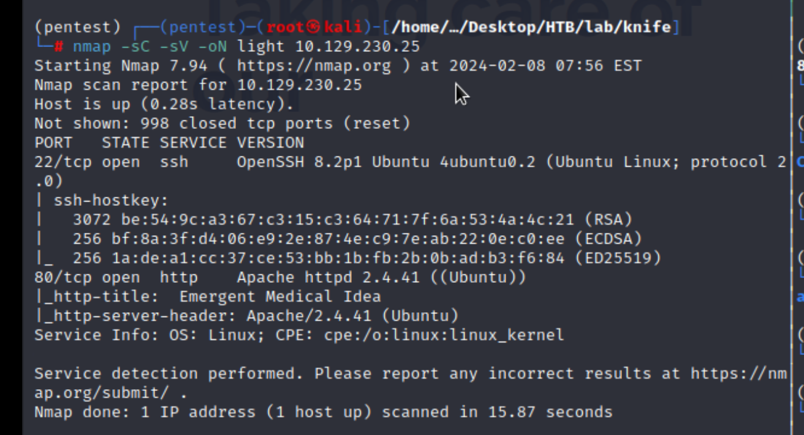
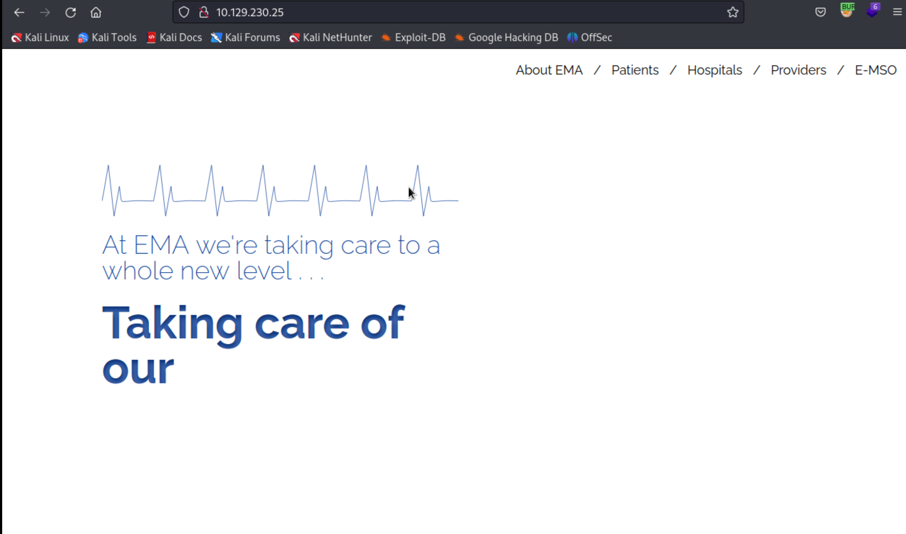
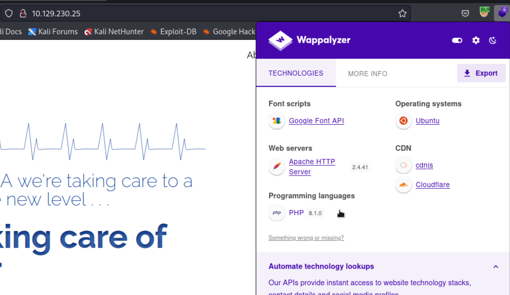

## Reconnaissance

### nmap 



### Web Server 



> Check web version 



> Gobuster to brute force the directory 


> Check the request and response 
> Got more detail version for PHP 

```
php 8.1.0-dev
```


> Search Exploit code 

```
searchsploit php | grep 8.1.0-dev
```


> Just in Case, I search another exploit code from github

- [(GITHUB)hp-8.1.0-dev-backdoor-rce](https://github.com/flast101/php-8.1.0-dev-backdoor-rce)


## Exploit 

> Use the exploit code 
> I get the low-lever permission in target

```
python 49933.py
```


> Get user flag


## Privilege Escalation 

> Check current user 


> Check sudo permission 

```
sudo -l
```


> Check current ip address


> Since the current shell is not quite convenience
> Try to get another shell back to my host
> but failed


> I tried to follow GTFobins to get root privilege by /usr/bin/knife
> but still failed


> So I change to another exploit code from github 


> Get another shell on port 1338


> Check current user - root 


> Get root flag


## Reference 

- [(GTFOBins)Knife](https://gtfobins.github.io/gtfobins/knife/)
- [PHP 8.1.0-dev Backdoor Remote Code Execution (RCE)](https://vk9-sec.com/php-8-1-0-dev-backdoor-remote-code-execution-rce/)
- [(ExploitDB)php-8.1.0-dev](https://www.exploit-db.com/exploits/49933)
- [php-8.1.0-dev-backdoor-rce](https://flast101.github.io/php-8.1.0-dev-backdoor-rce/)
- [(GITHUB)hp-8.1.0-dev-backdoor-rce](https://github.com/flast101/php-8.1.0-dev-backdoor-rce)

###### tags: `HackTheBox`