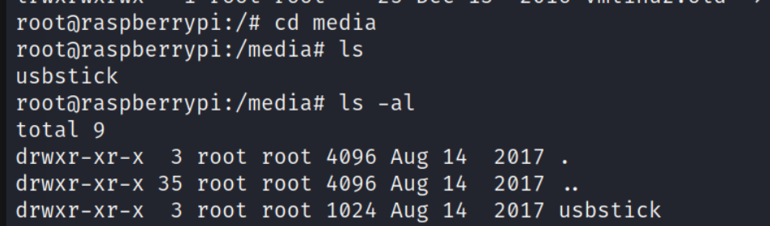

## Reconnaissance

### nmap 

> Light Scan 
```
nmap -sC -sV -oN mirai_light 10.129.229.23
```


> Heavy Scan 

```
nmap -p- -T4 -sV -oN mirai_heavy 10.129.229.23
```


### Gobuster
```
gobuster dir -u http://10.129.229.23 -w /usr/share/wordlists/dirb/common.txt -o mirai.out
```


### Web Service 

> Home Page is a blank page 
> Then. I followed the gobuster result to access /admin 

> Access Login function
> But I don't have credential to login 

> Access Plex Media Server httpd 
> I still don't have credential for this site. 


> Try to login by admin, but failed 

> But here is a Sign Up function.
> I register several times, it has a limitation for the length, and character for password


> After success to register, I login to Plex Pass.


> But I do a little enumerate on this site, nothing special.


### Research dnsmasq 

> Exploit code I found as follow
- [Dnsmasq < 2.78 - Heap Overflow](https://www.exploit-db.com/exploits/42942)
- [Dnsmasq < 2.78 - Information Leak](https://www.exploit-db.com/exploits/42944)
```
searchsplit dnsmasq
```

> Try the payload which can leak information > failed

### Research Platium UPnP

> The target version is 1.0.5.13
- [Platinum SDK Library - POST UPnP 'sscanf' Buffer Overflow (PoC)](https://www.exploit-db.com/exploits/15346)
> The description for this c code show the version is 0.6.0
> I think that is not appropriate one for my target.


> The searchsploit result show only 2
> And they aren't the target payload.
```
searchsploit "Platinum UPnP"
```


### Research lighttpd

> The target version is 1.4.35
> Search exploit 
```
searchsploit lighttpd
```


> Try the payload from exploitDB
> But it still failed.
- [Lighttpd 1.4.x - mod_userdir Information Disclosure](https://www.exploit-db.com/exploits/31396)

```
searchsploit lighttpd
```


### Research Pi-Hole 

> Searching exploit code 
> I focus on the 2 exploit code which might work for the version under 4.4

1. Authenticated Remote Code Execution (48442.py)
2. Authenticated Remote Code Execution / Privileges Escalation (48443.py)
```
searchsploit pi-hole
```

> Searching from internet, I find the same paylaod 
- [Pi-hole < 4.4 - Authenticated Remote Code Execution](https://www.exploit-db.com/exploits/48442)

> And there is a article explain about this vulnerability
- [CVE-2020-11108: How I Stumbled into a Pi-hole RCE+LPE](https://frichetten.com/blog/cve-2020-11108-pihole-rce/)

> I also tried to exploit by this 2 exploit codes
> After research about how to use it, 
> I gathering the necessary information from /admin page 

1. Cookie value 
2. Host address 
3. Lhost 
4. Lport

> Execute it, but both of them are failed
> The error message all talked about 'Address already in use' 
> and point to the following code 

```
sock.bind(LOCAL_IP, int(80)))
```


> There is the source code snippet.
> But I haven't take too much time to research about this vulnerability
> So I don't have specific answer to describe about this error.
> I guess that might caused by the local Port 80 was used.


#### Raspberry Pi

> With the above failed trying.
> I thing the most possible initial access can be found from Pi-Hole
> So, I check the official site
- [(Official Site)Pi Hole](https://pi-hole.net/)
- [(Official Site)Pi Hole Documents](https://docs.pi-hole.net/main/prerequisites/#supported-operating-systems)

> Um... I think the Pi Hole is created which want to use some lightweight device.
> And it was targeted on Raspberry Pi.
> So, this challenge might also runs on Raspberry Pi.


## Exploit 

> Let's start to research about  Raspberry Pi
> 1st, since I know there is a SSH service run on port 22 
> So, I search the default ssh credential for raspberry PI

```
pi / raspberry
```


> Then I used this credential to do the SSH login.
> Got it. I get into target machine.
> I check current user first.
```
id 
whoami
```

> Check network 


> Check user flag


## Privilege Escalation 

> Now, I have normal user permission
> I confirm the sudo permission list

```
sudo -l
```

> I think it can easily to get root permission with the following command 
```
sudo su
```


> Check root flag, but ...


> I think I need to find out the USB driver directory
> In linux, it usually locate in /mnt, /media 
```
ls -al /
```

> So, I will check /media first 
> Find a directory - usbstick

> Keep dig into the directory

1. damnit.txt
2. lost+found 


> I check the directory first, but it was empty 


> So I check the text file, it show the following message. 
> Even the files are deleted in USB.
> So, I need to find a way to get it back.


> there is some command can show the mount device information
```
df -h
```


> With above information, I know the file /media/usbstick was mounted by /dev/sdb
> So, I think I should check /dev/sdb.
> And the delete action in linux, I do some research for this.
> They all talked about some same keyword.

1. inode: An inode holds metadata about a file. It includes the file's size, where to find the blocks that contain the file's contents, the file mode, and so on. Every file has a reference inode. 
2. i_nlink
3. i_count
> The same sentence keep mentioned in most of article in Mandarin

```
Linux是通过link的数量来控制文件删除的，只有当一个文件不存在任何link的时候，这个文件才会被删除。一般来说，每个文件都有2个link计数器:i_count 和 i_nlink。
```
> Here are some step of deletions

- [Data Deletion in Linux File Systems](https://www.linkedin.com/pulse/data-deletion-linux-file-systems-sanju-debnath)

- [Where Do Files Go When the rm Command Is Issued?](https://www.baeldung.com/linux/rm-where-do-files-go)


> So, I think the delete operation in linux just unlink and remove the link from data to file.
> The actual data still has possibility to find in linux system.
> Then, I think the file which located in /dev/sdb was deleted but the data might still in the same location 
> So, I check the /dev/sdb with strings command to list the readable string.

```
strings /dev/sdb
```
> Get root flag


## Reference 
### Write up 

- [HTB: Mirai](https://0xdf.gitlab.io/2022/05/18/htb-mirai.html)
- [Hack The Box — Mirai Walkthrough/Writeup OSCP](https://medium.com/@fularam.prajapati/hack-the-box-mirai-walkthrough-writeup-oscp-ca574732f0bf)

### About Mirai

- [什麼是 Mirai 機器人網路？](https://www.cloudflare.com/zh-tw/learning/ddos/glossary/mirai-botnet/)
- [Mirai (惡意軟體)](https://zh.wikipedia.org/zh-tw/Mirai_(%E6%81%B6%E6%84%8F%E8%BD%AF%E4%BB%B6))
### DNS

- [53 - Pentesting DNS](https://book.hacktricks.xyz/network-services-pentesting/pentesting-dns)
#### dnsmasq
- [Dnsmasq < 2.78 - Heap Overflow](https://www.exploit-db.com/exploits/42942)
- [Dnsmasq < 2.78 - Information Leak](https://www.exploit-db.com/exploits/42944)
- [(GUTHUB)dnsmasq](https://github.com/Slovejoy/dnsmasq-pre2.76)
### Platinum UPnP
- [Platinum SDK Library - POST UPnP 'sscanf' Buffer Overflow (PoC)](https://www.exploit-db.com/exploits/15346)
### Lighttpd
- [Lighttpd 1.4.x - mod_userdir Information Disclosure](https://www.exploit-db.com/exploits/31396)
### Pi Hole
- [Pi-hole < 4.4 - Authenticated Remote Code Execution](https://www.exploit-db.com/exploits/48442)
- [CVE-2020-11108: How I Stumbled into a Pi-hole RCE+LPE](https://frichetten.com/blog/cve-2020-11108-pihole-rce/)
- [(Official Site)Pi Hole](https://pi-hole.net/)
- [(Official Site)Pi Hole Documents](https://docs.pi-hole.net/main/prerequisites/#supported-operating-systems)

### Linux command 

- [How to List USB Devices in Linux](https://linuxopsys.com/topics/list-usb-devices-in-linux)


- [Data Deletion in Linux File Systems](https://www.linkedin.com/pulse/data-deletion-linux-file-systems-sanju-debnath)
- [Where Do Files Go When the rm Command Is Issued?](https://www.baeldung.com/linux/rm-where-do-files-go)
- [细说Linux中文件删除](https://segmentfault.com/a/1190000022397716)
- [linux文件删除原理](https://melonshell.github.io/2021/03/05/base1/)
- [linux下文件刪除的原理](http://www.unixlinux.online/unixlinux/linuxjc/gylinux/201703/72975.html)
- [How to Delete Files and Directories in Linux?](https://www.geeksforgeeks.org/how-to-delete-files-and-directories-in-linux/)
- [What happens when you delete a file in Linux?](https://www.redhat.com/sysadmin/linux-delete-file-rm)


###### tags: `HackTheBox` `Mirai` `Raspberry Pi` `Linux Delete file operation`